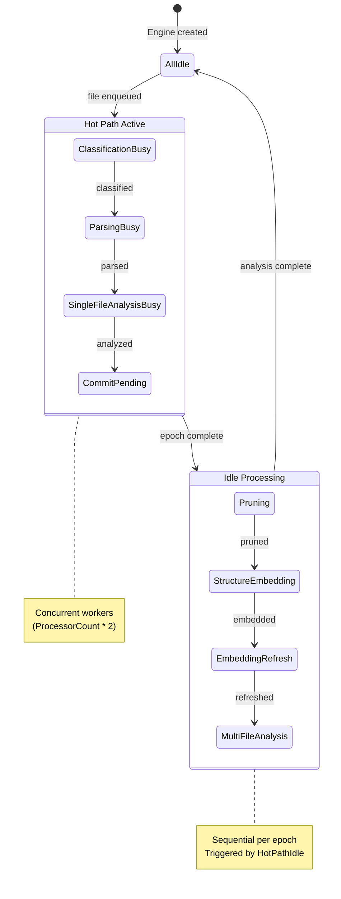
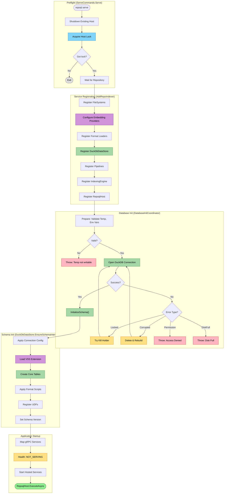
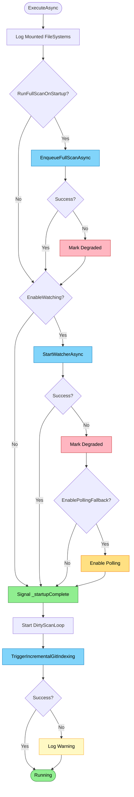
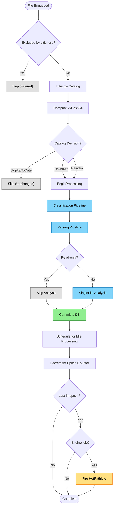
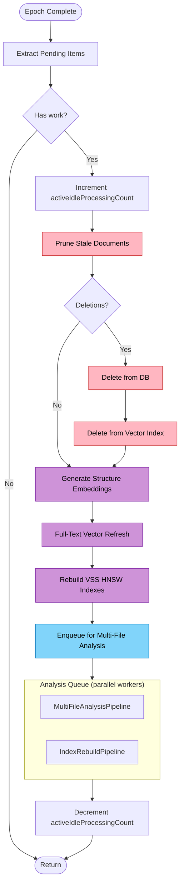
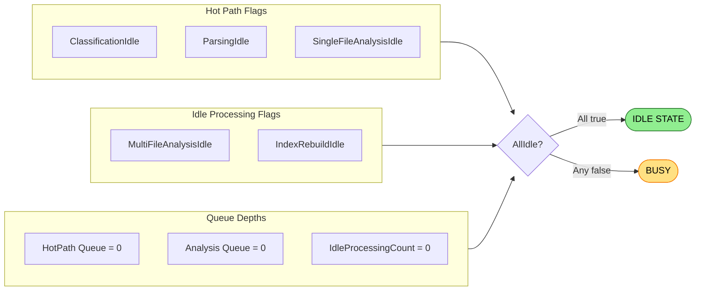
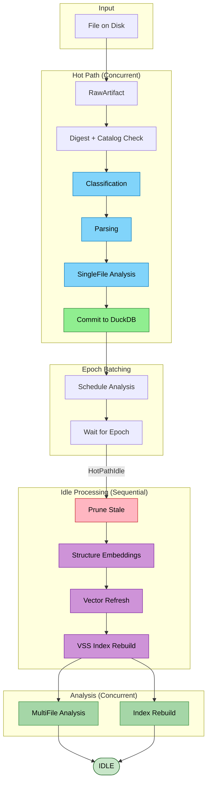
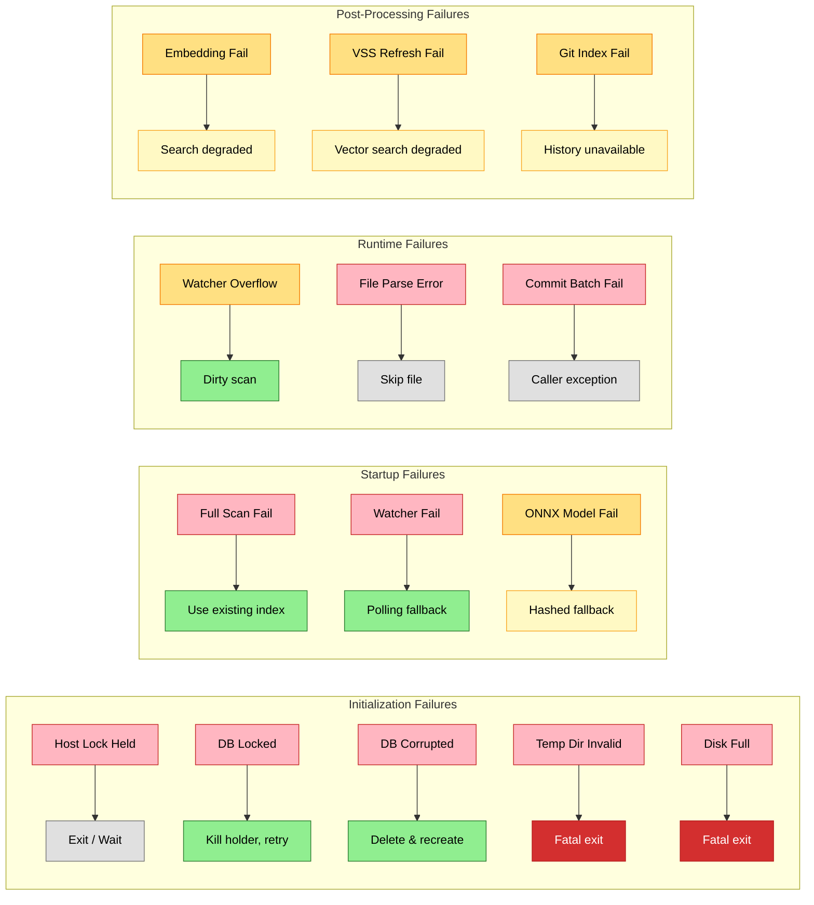

# RepoQL: Startup to Idle Flow

This document maps every step from RepoQL startup to reaching idle state. Understanding this flow is critical for reliability work.

## Overview: IndexingState Lifecycle


*States: Gray = idle, Active = processing. Transitions show pipeline progression.*

---

## Phase 0: Initialization (Before RepoqlHost)

The host must complete significant initialization before `RepoqlHost.ExecuteAsync` runs.


*Colors: Blue = actions, Green = database ops, Purple = embeddings, Red = fatal errors, Yellow = recoverable*

### 0.1 Preflight (`ServeCommands.Serve`)
```
Location: ServeCommands.cs:40-68
```
1. **Shutdown existing host** - prevent write-write conflicts
2. **Acquire host lock** - file lock at `.repoql/host.lock`
3. **Wait for repository** - ensure filesystem is available

### 0.2 Service Registration (`AddRepoIndexer`)
```
Location: RepoIndexerServiceCollectionExtensions.cs:65-646
```

| Registration | Purpose |
|--------------|---------|
| `PhysicalFileSystem` | Primary repo filesystem |
| `DocumentationFileSystem` | Embedded `help://` scheme |
| `CompositeFileSystem` | Multi-mount aggregation |
| `IEmbeddingProvider` | OpenRouter cloud or local ONNX |
| `FormatDescriptor`s | Loaders for Markdown, C#, TypeScript, etc. |
| `DuckDbDataStore` | Core database with UDFs |
| `ClassificationPipeline` | File → MediaType |
| `ParsingPipeline` | File → Records |
| `SingleFileAnalysisPipeline` | Records → Annotations |
| `IndexingEngine` | Pipeline orchestrator |
| `RepoqlHost` | Background service |

### 0.3 Database Initialization (`DatabaseInitCoordinator`)
```
Location: DatabaseInitCoordinator.cs:50-143
```

| Error Type | Recovery |
|------------|----------|
| **Locked** | Try terminate holder process, retry |
| **Corrupted** | Delete `.duckdb` + `.wal`, recreate |
| **SchemaMismatch** | Delete and recreate |
| **Permission** | Fatal - throw |
| **DiskFull** | Fatal - throw |

### 0.4 Schema Initialization (`DuckDbDataStore.EnsureSchemaInternal`)
```
Location: DuckDbDataStore.cs:950-1060
```

1. **Connection config**: memory limit, threads, temp directory
2. **Load VSS extension**: vector similarity search
3. **Create core tables**:
   - `artifact` - file metadata, headline, structure
   - `node` - entities (documents, symbols, headings)
   - `edge` - relationships (contains, references, calls)
   - `span` - locations in files
   - `annotation` - lint, metrics, facts
   - `metadata` - schema version, assembly info
   - `embedding` - vector embeddings
4. **Apply format scripts**: format-specific views/macros
5. **Register UDFs**: `search()`, `snippet()`, `embed_text()`, etc.

### 0.5 Application Startup
```
Location: ServeCommands.cs:173-223
```
1. Build WebApplication
2. Map gRPC services (`RepoQlServiceImpl`, `HealthServiceImpl`)
3. Set health status to `NOT_SERVING`
4. Start hosted services:
   - `MountRestorationService` - restore persisted mounts
   - `CSharpWorkspaceHost` - Roslyn workspace
   - `McpHostedService` - MCP client connections
   - `RepoqlHost` - main indexing host
5. Wait for initial indexing → set health to `SERVING`

---

## Phase 1: Startup (`RepoqlHost.ExecuteAsync`)


*Colors: Blue = actions, Green = success, Red = degraded, Yellow = fallback/warning*

### 1.1 Mount Logging
```
Location: RepoqlHost.cs:88-95
```
- Iterates through all mounts in `CompositeFileSystem`
- Logs each mount's ID, scheme, and `includeInEnum` flag
- **Purpose**: Diagnostic visibility into which file systems are active

### 1.2 Full Scan (if `RunFullScanOnStartup = true`)
```
Location: RepoqlHost.cs:97-109 → EnqueueFullScanAsync()
```
1. Enumerate all files via `_fileSystem.EnumerateAsync()`
2. For each file:
   - Resolve to a mount via `_fileSystem.TryResolve(uri, out store)`
   - Skip non-existent files
   - Create `RawArtifact(file, store)`
   - Enqueue with `DefaultIndexItemOptions`
3. **On failure**: Log warning, mark degraded, continue with existing index

### 1.3 Watcher Initialization (if `EnableWatching = true`)
```
Location: RepoqlHost.cs:111-124 → StartWatcherAsync()
```
1. Create bounded channel for watcher events (capacity: 10,000 by default)
2. Start pump task: `PumpWatcherQueueAsync()`
3. Create composite watcher: `_fileSystem.WatchAll()`
4. Subscribe with `WatcherObserver`
5. Start watcher: `_watcher.StartAsync()`
6. **On failure**:
   - Log warning
   - Mark degraded
   - `EnablePollingFallback()` if configured

### 1.4 Startup Complete Signal
```
Location: RepoqlHost.cs:126
```
- `_startupComplete.TrySetResult()` signals that initial startup is done
- Callers can await `WaitForStartupAsync()` to know when setup is complete

### 1.5 Dirty Scan Loop Start
```
Location: RepoqlHost.cs:128
```
- Background task: `DirtyScanLoopAsync()`
- Handles:
  - Polling fallback (when watcher failed)
  - Dirty scans after watcher overflow
  - Periodic timer (every 1 second)

### 1.6 Git History Indexing
```
Location: RepoqlHost.cs:130-145 → IndexingCoordinator.TriggerIncrementalGitIndexingAsync()
```
1. Wait for pipeline to become idle: `WaitForIdleAsync()`
2. Find repo root: `RepoLocator.FindRepoRoot()`
3. Index git history: `_gitIndexer.IndexIncrementalAsync()`
4. **On failure**: Log warning, continue (git history is optional)

---

## Phase 2: Hot Path (`IndexingEngine.IndexItemAsync`)

### Entry Point
```
Location: IndexingEngine.cs:208-212 → EnqueueItemAsync()
```
1. Create `IndexItem(artifact, options)`
2. Assign epoch via `_epochTracker`
3. Add to `IndexerQueue` (bounded channel)
4. Increment epoch counter

### 2.1 Filter Check
```
Location: IndexingEngine.cs:458-468
```
- If `OnlyIfNotExcluded` flag set, check `Filter.IncludeFile(uri)`
- Skip files matching gitignore patterns
- Record as `Filtered` result

### 2.2-2.4 Hot Path Decision Flow


*Colors: Blue = pipeline stages, Green = commit, Yellow = event trigger, Gray = skipped*

### Catalog Check Details
```
Location: IndexingEngine.cs:470-492
```
- `DocumentCatalog.EnsureInitializedAsync()` - hydrate catalog from DB on first call
- `DocumentCatalog.Evaluate(uri, digestHex)` compares digests
- `BeginProcessing()` prevents duplicate work if same file enqueued twice

### Pipeline Execution
```
Location: IndexingEngine.cs:952-1003 → ApplyIndexerPipeline()
```

#### Stage 1: Classification
```
Location: IndexingEngine.cs:959-970
ClassificationPipeline.ProcessItemAsync()
```
- **Input**: `IDiscoveredArtifact` (raw file info)
- **Output**: `SemanticMediaType` (e.g., `text/plain;kind=code.csharp`)
- **Processors**: Format classifiers (extension → media type mapping)
- **Updates**: `IndexItem.MediaType`

#### Stage 2: Parsing
```
Location: IndexingEngine.cs:972-983
ParsingPipeline.ProcessItemAsync()
```
- **Input**: `IClassifiedArtifact` (file + media type)
- **Output**: `Records` (nodes, edges, spans, annotations)
- **Processors**: Format parsers (C#, Markdown, JSON, etc.)
- **Updates**: `IndexItem.Records`

#### Stage 3: Single-File Analysis
```
Location: IndexingEngine.cs:991-1000
SingleFileAnalysisPipeline.ProcessItemAsync()
```
- **Input**: `IParsedArtifact` (file + records)
- **Output**: Additional annotations
- **Processors**: Analyzers (linting, metrics, etc.)
- **Updates**: `IndexItem.AnnotationsList`
- **Skip**: Read-only items (line 985-989)

### 2.5 Commit
```
Location: IndexingEngine.cs:508-511 → IndexingCommitter.CommitAsync()
```
1. Validate item has Records, DigestHex, MediaType, document node
2. Create `ParsedArtifact` from Records
3. Queue in batch (up to 64 items or 100ms timer)
4. `FlushPendingItems()`:
   - `_db.IndexArtifactBatch(items)` - write to DuckDB
   - `_catalog.ApplyUpsert(entry)` - update catalog
   - Complete waiting callers

### 2.6 Schedule Analysis
```
Location: IndexingEngine.cs:521 → ScheduleAnalysis()
```
1. Add to `_pendingStructureEmbeddings[epoch]` (all items)
2. Add to `_pendingAnalysis[epoch]` (non-read-only items only)
3. If epoch already released, re-enqueue for idle processing

### 2.7 Epoch Completion Check
```
Location: IndexingEngine.cs:561-563
```
- `_epochTracker.Decrement(epoch)` returns true when last item in epoch completes
- If epoch became idle AND engine state is `AllIdle`:
  - Fire `HotPathIdle` event

---

## Phase 3: Idle Processing

### Trigger: HotPathIdle Event
```
Location: IndexingEngine.cs:643-652 → OnHotPathIdle()
```
1. Complete epoch activity span
2. Record metrics
3. `EnqueueIdleEpoch(epoch)` - write to `_analysisEpochChannel`
4. Begin new epoch for subsequent work

### Processing Loop
```
Location: IndexingEngine.cs:711-757 → ProcessIdleEpochsAsync()
```
- Background task reading from `_analysisEpochChannel`
- For each epoch with pending work: `ReleaseAnalysisAsync(epoch)`

### 3.1 ReleaseAnalysisAsync - Idle Processing Flow
```
Location: IndexingEngine.cs:759-920
```


*Colors: Red = pruning, Purple = embedding generation, Blue = analysis*

#### Phase Details

| Phase | Location | Purpose |
|-------|----------|---------|
| Extract | :766-783 | Get pending items from epoch queues |
| Prune | :799-821 | Delete stale documents from DB and vectors |
| Structure Embed | :825-834 | Fast embeddings (URI + headline + structure) |
| Vector Refresh | :841-860 | Full-text embeddings with chunking |
| VSS Refresh | :863-872 | Rebuild in-memory HNSW indexes |
| Enqueue Analysis | :875-887 | Queue for cross-file analysis |

### 3.2 Analysis Queue Processing
```
Location: IndexingEngine.cs:1005-1026 → AnalyzeItemAsync()
```
- Runs in parallel:
  - `_multiFileStage.RunAsync()` - cross-file analysis (e.g., type resolution)
  - `_indexRebuildStage.RunAsync()` - index updates (e.g., FTS rebuild)

---

## Phase 4: Idle State

### State Flag Composition


*Green = idle state reached, Yellow = still busy*

### Wait APIs
```
Location: IndexingCoordinator.cs:186-337
```

| API | Waits For | Timeout |
|-----|-----------|---------|
| `WaitForPipelineAsync(stages)` | Specific stages idle + queue empty | 1 minute |
| `WaitForIdleAsync()` | All stages: Discovery, Parsing, Analysis, Writer | 1 minute |

### Queue Depth Calculation per Stage
```
Location: IndexingCoordinator.cs:278-298
```

| Stage | Queue Depth Includes |
|-------|---------------------|
| Discovery | HotPath + MountIndexing |
| Parsing | HotPath + MountIndexing + PendingIdleProcessing |
| Analysis | HotPath + Analysis + MountIndexing + PendingIdleProcessing |
| Writer | HotPath + Analysis + MountIndexing + PendingIdleProcessing |

---

## Data Flow Summary


*Colors: Blue = hot path stages, Green = commit/analysis, Red = pruning, Purple = embeddings*

---

## Key Components

### Initialization Components

| Component | Purpose | Location |
|-----------|---------|----------|
| `ServeCommands` | CLI entry, preflight, app builder | `Commands/ServeCommands.cs` |
| `DatabaseInitCoordinator` | DB open, validation, recovery | `Host/DatabaseInitCoordinator.cs` |
| `DuckDbDataStore` | Schema init, UDF registration | `Data.DuckDB/DuckDbDataStore.cs` |
| `AddRepoIndexer` | DI registration for all services | `Core/RepoIndexerServiceCollectionExtensions.cs` |
| `HostLock` | File-based host lock | `Host/HostLock.cs` |

### Indexing Components

| Component | Purpose | Location |
|-----------|---------|----------|
| `RepoqlHost` | Background service orchestrating startup | `Hosting/RepoqlHost.cs` |
| `IndexingEngine` | Core pipeline orchestrator | `Indexing/IndexingEngine.cs` |
| `IndexingCoordinator` | High-level facade, status APIs | `Hosting/IndexingCoordinator.cs` |
| `ClassificationPipeline` | File → MediaType | `Pipelines/Classification/` |
| `ParsingPipeline` | File → Records | `Pipelines/Parsing/` |
| `SingleFileAnalysisPipeline` | Records → Annotations | `Pipelines/Analysis/` |
| `IndexingCommitter` | Batch writes to DuckDB | `Commit/IndexingCommitter.cs` |
| `DocumentCatalog` | Digest-based change detection | `State/DocumentCatalog.cs` |
| `EmbeddingCoordinator` | Embedding generation/refresh | `PostProcessing/EmbeddingCoordinator.cs` |
| `ArtifactPruner` | Stale document detection | `PostProcessing/StorageBackedArtifactPruner.cs` |
| `WorkQueue<T>` | Bounded channel with workers | (utility) |
| `EpochTracker` | Batch coordination | `IndexingEngine.cs` (inner class) |

---

## Failure Modes & Recovery


*Colors: Red = error, Orange = warning, Green = recovery action, Gray = skipped, Light yellow = degraded, Dark red = fatal*

### Initialization Failures

| Failure Point | Current Behavior | Recovery |
|---------------|------------------|----------|
| Host lock held | Wait up to 45s | Exit if not acquired |
| DB locked by RepoQL process | Try terminate, retry | Fatal if can't kill |
| DB corrupted/schema mismatch | Delete `.duckdb` + `.wal` | Recreate from scratch |
| Temp directory invalid | Throw immediately | Fatal - must fix env |
| Disk full | Throw immediately | Fatal - free space |
| ONNX model load fails | Log warning | Use hashed fallback |
| MCP config fails | Log warning | MCP tools disabled |

### Runtime Failures

| Failure Point | Current Behavior | Recovery |
|---------------|------------------|----------|
| Full scan fails | Log warning, mark degraded | Existing index used |
| Watcher fails to start | Log warning, mark degraded | Polling fallback |
| Watcher overflow | Mark dirty flag | DirtyScanLoopAsync rescans |
| Git indexing fails | Log warning | Git history unavailable |
| Individual file parse error | Log error, skip file | File not indexed |
| Commit batch fails | All items in batch fail | Caller sees exception |
| Embedding generation fails | Log warning | Semantic search degraded |
| VSS index refresh fails | Log warning | Vector search degraded |

### Critical Pipeline Failure Modes

These failure modes can cause the pipeline to stall indefinitely. See [indexing-failure-modes.md](indexing-failure-modes.md) for detailed analysis.

| ID | Failure Mode | Severity | Detection |
|----|--------------|----------|-----------|
| FM-001 | Stuck item blocks pipeline (no per-item timeout) | Critical | Very Hard |
| FM-002 | Operations without timeouts (I/O, Roslyn, DB) | Critical | Hard |
| FM-003 | Epoch counter imbalance | High | Very Hard |
| FM-004 | WaitForIdleAsync blocks forever | Critical | Hard |
| FM-005 | Orphaned epoch items (race condition) | Critical | Medium |
| FM-006 | Worker attrition (no restart on exception) | Critical | Hard |
| FM-007 | ProcessIdleEpochsAsync silent death | Critical | Very Hard |
| FM-008 | Empty epoch skips pruning during reindex | High | Medium |
| FM-009 | Embedding provider failure causes item loss | High | Medium |
| FM-010 | Embedding starvation under continuous changes | High | Medium |

---

## Epoch Model

Epochs provide batch coordination:

1. **Creation**: `BeginNewEpoch()` starts a new epoch
2. **Assignment**: Each enqueued item gets current epoch number
3. **Tracking**: `EpochTracker` maintains pending count per epoch
4. **Completion**: When last item in epoch finishes and engine is idle → `HotPathIdle` fires
5. **Idle Processing**: Batch operations run for completed epoch
6. **New Epoch**: After `HotPathIdle`, new epoch begins for subsequent work

This ensures idle processing runs on complete batches, not individual files.

---

## Threading Model

| Component | Threading | Safety Mechanism |
|-----------|-----------|------------------|
| Hot path workers | Concurrent (ProcessorCount * 2) | Per-item isolation |
| Database writes | Serialized | `FlushLock` in IndexingCommitter |
| Analysis workers | Concurrent (ProcessorCount) | Per-item isolation |
| Idle processing | Single-threaded channel reader | Sequential epochs |
| Watcher pump | Single reader | Bounded channel |
| Dirty scan | Single task | Periodic timer |

**Critical Invariant**: Database writes are ALWAYS serialized through `IndexingCommitter.FlushLock` to prevent DuckDB corruption.
