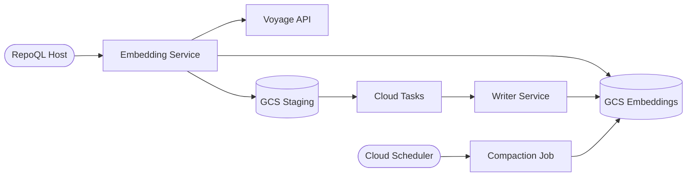

# Cloud Embedding Cache Flows

The cloud embedding cache avoids redundant Voyage API calls across customers who share common code. RepoQL hosts send a `source` field (canonical repo origin) with each request — the only host-side change. All cache logic lives in the embedding service.

Three flows, one data lifecycle:

```
embedding-request.md    → hot path: lookup + compute + stage
cache-merge.md          → background: staging → permanent shard
compaction.md           → periodic: consolidate parts, evict stale entries
```



## Key Properties

- **Cache is acceleration, not correctness** — GCS down means full Voyage computation, not failure
- **Content-addressed** — SHA256(content), shared across all customers with the same code
- **Model-scoped** — shards partitioned by model, upgrade = natural miss on new shard
- **Privileged writer service** — only the writer writes to the embeddings bucket. Multiple writer instances may append parts concurrently; compaction consolidates
- **6-month TTL** — storage hygiene via eviction during compaction, not correctness
- **IAM separation** — workers write staging only, never embeddings directly

## Related

- `docs/north-star/embedding-cache.md` — what great looks like
- `docs/flows/future/embedding-cache.md` — local cache flow (separate system)
