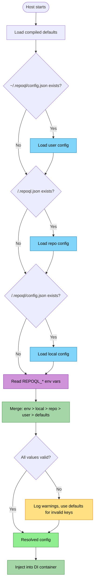
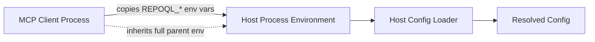
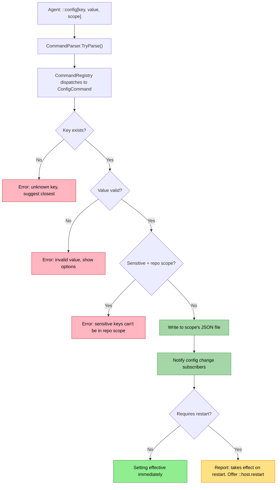

# Configuration Flow

Configuration determines how RepoQL behaves — memory limits, embedding mode, LLM providers, indexing options. This flow maps how settings move from their sources (files, env vars, defaults) through the two-process architecture to the components that consume them.

---

## Actors

| Actor | Role |
|-------|------|
| **User** | Sets env vars, edits config files, runs `::config` commands |
| **MCP client** | Stdio process — reads config, propagates env to host, forwards `::config` to host |
| **Host** | gRPC server — loads config at startup, serves config queries, applies mutations |
| **Config loader** | Discovers and merges config files + env vars into a resolved config |
| **Component** | Any service that consumes config (DuckDB, embeddings, idle shutdown, etc.) |

---

## Flow 1: Config Loading at Startup

**Trigger:** Host process starts (via `serve` command or auto-launched by client).


*Blue = file sources, Purple = env vars, Green = merge/inject, Yellow = validation warnings*

### Stages

#### 1. Compiled defaults
**Actor:** Config loader
**Action:** Every setting has a default value defined in code. This is the base layer — RepoQL works with zero configuration.
**Output:** Complete settings map with all keys populated.

#### 2. User config (`~/.repoql/config.json`)
**Actor:** Config loader
**Action:** If the file exists, parse it and overlay onto defaults. This is the user's personal preferences across all repos.
**Output:** Defaults with user overrides applied.
**Failure:** Malformed JSON — log a warning with file path and parse error, skip the file entirely. No partial loads.

#### 3. Repo config (`<repo>/.repoql.json`)
**Actor:** Config loader
**Action:** If the file exists, parse it and overlay. This is the team's shared config, version-controlled alongside code.
**Output:** Previous layer with repo overrides applied.
**Failure:** Same as user config — log warning, skip file.

#### 4. Local config (`<repo>/.repoql/config.json`)
**Actor:** Config loader
**Action:** If the file exists, parse it and overlay. This is the individual's settings for this specific repo — never committed.
**Output:** Previous layer with local overrides applied.
**Failure:** Same as above.

#### 5. Environment variables
**Actor:** Config loader
**Action:** Scan for `REPOQL_*` env vars. Map each to a setting name via the naming convention (`REPOQL_DUCKDB_MEMORY_LIMIT` maps to `duckdb.memory_limit`). Overlay onto the merged file config.
**Output:** Final resolved config — env vars win over everything.
**Failure:** Invalid value for a known key — log warning, keep the file-based or default value.

#### 6. Merge and inject
**Actor:** Config loader
**Action:** The fully resolved config is registered in the DI container. Components receive typed options objects via constructor injection.
**Output:** Services can request config via `IOptions<T>` or a central `RepoQlConfig` type.

### Precedence (last wins)

```
defaults  <  user (~/.repoql/config.json)  <  repo (.repoql.json)  <  local (.repoql/config.json)  <  env vars
```

---

## Flow 2: Config Propagation Across Processes

**Trigger:** MCP client needs a host and auto-launches one.



#### Stages

#### 1. Client launches host
**Actor:** MCP client (`RepoQlClient.LaunchHost()`)
**Action:** Starts a new OS process for the host. Explicitly copies every `REPOQL_*` env var from the client's environment into the child process's `ProcessStartInfo.Environment`. Non-`REPOQL_*` vars are inherited implicitly (since `UseShellExecute = false` without clearing env).
**Output:** Host process starts with the same `REPOQL_*` env vars the client had.

#### 2. Host loads config independently
**Actor:** Host config loader
**Action:** Runs the full Flow 1 loading sequence — defaults, user file, repo file, local file, env vars. The host does not receive config from the client via gRPC. It reads the same files and env vars independently.
**Output:** Resolved config for the host process.

**Key insight:** The client and host both read the same config files and env vars. They converge on the same resolved config because they share the same repo root and environment. The client doesn't need to serialize config — the sources of truth (files + env) are shared.

---

## Flow 3: Config Mutation via `::config`

**Trigger:** Agent types `::config[key, value]` or `::config[key, value, scope]` in the query tool.



#### Stages

#### 1. Parse
**Actor:** Command parser
**Action:** `::config[key, value, scope]` is parsed. Scope defaults to `local` if omitted.
**Output:** `ParsedCommand` with parameters.

#### 2. Validate
**Actor:** ConfigCommand
**Action:** Check key exists in the setting registry, value is valid for its type, and sensitive keys aren't written to repo scope.
**Output:** Validated mutation or a rejection with an actionable error.
**Failure:** Unknown key — suggest closest match via Levenshtein distance. Invalid value — show valid options. Sensitive key at repo scope — refuse and suggest local/user/env.

#### 3. Write
**Actor:** ConfigCommand
**Action:** Read the target scope's JSON file, merge the new value, write atomically (write to temp, rename).
**Output:** Updated JSON file on disk.
**Failure:** File locked or permissions — report which file and what went wrong.

#### 4. Notify
**Actor:** Config change system
**Action:** Signal subscribers that a key changed. Components that support live reload pick up the new value.
**Output:** Components see the updated config.

#### 5. Restart-required settings
**Actor:** ConfigCommand
**Action:** Some settings (DuckDB memory, thread count, ONNX provider) are consumed at process startup and can't change live. The command reports this and offers `::host.restart`.
**Output:** Agent knows the change is persisted but not yet effective.

### Mutation Variants

| Command | Action |
|---------|--------|
| `::config` | List all settings with values and provenance |
| `::config[key]` | Show one setting's value, source, default, env var name, valid options |
| `::config[key, value]` | Set at local scope |
| `::config[key, value, scope]` | Set at specified scope (`local`, `repo`, `user`) |
| `::config[-key]` | Reset at local scope (remove override) |
| `::config[-key, scope]` | Reset at specified scope |

---

## Flow 4: Config Read via `::config`

**Trigger:** Agent types `::config` or `::config[key]`.

#### List all settings
**Actor:** ConfigCommand
**Action:** Iterate the setting registry. For each key, show: name, resolved value, source scope, and description. Sensitive values are masked.
**Output:** Formatted table.

#### Read one setting
**Actor:** ConfigCommand
**Action:** Look up the key. Show: resolved value, which scope it came from, the default value, the corresponding env var name, and valid options/type.
**Output:** Detailed view of one setting.

---

## Flow 5: Contextual Config Surfacing

**Trigger:** A tool response encounters a situation where configuration is relevant.

#### Stages

#### 1. Detect opportunity
**Actor:** Tool handler (explore, query, read)
**Action:** When a capability is limited by config — embeddings disabled, LLM not configured, memory constrained — the tool recognizes this.
**Output:** Internal signal that config is relevant to the response.

#### 2. Surface suggestion
**Actor:** Tool handler
**Action:** Append a contextual hint to the response: what setting controls this, its current value, and the command to change it.
**Output:** Agent sees `Embeddings disabled. ::config[embedding.mode] = none. To enable: ::config[embedding.mode, full]`

---

## Config File Locations

| Scope | Path | Committed | Purpose |
|-------|------|-----------|---------|
| User | `~/.repoql/config.json` | No | Personal defaults across all repos |
| Repo | `<repo>/.repoql.json` | Yes | Team shared settings |
| Local | `<repo>/.repoql/config.json` | No (gitignored with `.repoql/`) | This workspace only |

---

## Setting Lifecycle Categories

Not all settings can change at runtime. This affects how mutation works.

| Category | Behavior | Examples |
|----------|----------|---------|
| **Requires restart** (`RequiresRestart = true`) | Captured at startup. `::config` persists the change and warns. | `duckdb.*`, `embedding.mode`, `ort.*`, `llm.api_key` |
| **Live** | Read from `RepoQlConfig` on each use. Effective immediately. | `dotnet.analysis` |

Most settings require restart. This is the default assumption.

---

## Failure Modes

| Failure | Detection | Recovery |
|---------|-----------|----------|
| Malformed JSON in any config file | JSON parse exception at load time | Log warning with file path and error detail. Skip the file, use remaining layers. |
| Unknown key in config file | Key not in setting registry | Log warning. Ignore the key — don't fail the whole file. |
| Invalid value in config file | Type/range validation fails | Log warning. Use default for that key. |
| File permissions prevent write | OS exception on `::config` write | Report which file, what permission is needed. |
| Sensitive key written to repo scope | Pre-write validation | Reject before writing. Suggest local/user/env. |
| Config file locked during write | OS file lock | Retry once, then report. |
| Env var and file conflict | By design — env always wins | `::config` output shows provenance so agent sees the override. |

---

## Cross-Cutting Concerns

### Env Var Naming Convention

```
Setting: duckdb.memory_limit  →  Env: REPOQL_DUCKDB_MEMORY_LIMIT
Setting: embedding.mode       →  Env: REPOQL_EMBEDDING_MODE
Setting: ort.provider         →  Env: REPOQL_ORT_PROVIDER

Rule: REPOQL_ + setting name with . replaced by _ + UPPER_CASE
```

### Sensitive Settings

Settings marked as sensitive (API keys, tokens) are:
- Masked in `::config` output (`sk-12...7f`)
- Blocked from repo scope writes
- Never logged in full
- Recommended via env var in error messages

### Discoverability via `help://`

The setting registry is the source of truth. Each setting has: key, type, default, description, sensitive flag, restart-required flag. This registry feeds both `::config` output and `help://configuration` documentation — they can never drift.

---

*Config flows from four sources through one merge into one resolved state. Components consume it. Commands mutate it. The agent sees provenance at every step.*
