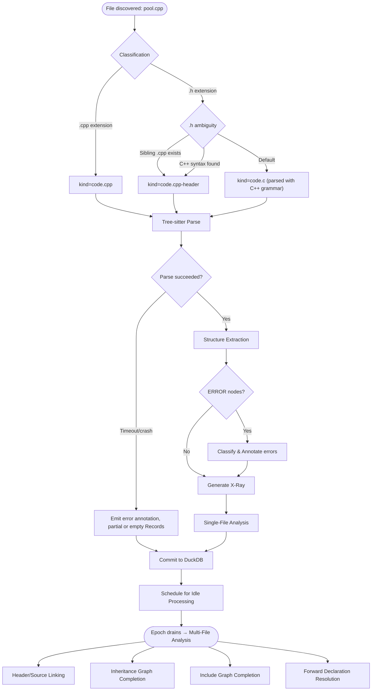

# C/C++ Indexing Flow

How C and C++ source files flow through the indexing pipeline from discovery to queryable graph — with specific attention to where the preprocessor boundary creates unique decision points.

## Why This Matters

| Without C/C++ parsing | With C/C++ parsing |
|-----------------------|--------------------|
| Agent sees `.cpp` files as opaque text | Agent sees classes, functions, namespaces, templates |
| No structural search across C/C++ code | "What inherits from Transport?" answered from the graph |
| No include graph awareness | Agent traces header dependencies without reading files |
| Macros silently corrupt understanding | Macro interference explicitly marked — honest gaps |

## Trigger

File watcher or startup scan discovers a file with a C/C++ extension (`.c`, `.h`, `.cpp`, `.hpp`, `.cc`, `.cxx`, `.hh`, `.hxx`, `.ipp`, `.tpp`, `.inl`).

## Stages

### 1. Classification

**Actor**: CppClassifier (new processor)
**Action**: Matches provisional media type from file extension, refines with `kind` parameter
**Output**: `SemanticMediaType` distinguishing C vs C++, header vs source

Classification must resolve two axes: **language** (C or C++) and **role** (header or source).

| Extension | Language | Role | Media Type |
|-----------|----------|------|------------|
| `.c` | C | Source | `text/plain;kind=code.c` (existing) |
| `.h` | Ambiguous | Header | `text/plain;kind=code.c` (existing) → refined to `code.cpp-header` if C++ detected |
| `.cpp`, `.cc`, `.cxx` | C++ | Source | `text/plain;kind=code.cpp` (existing) |
| `.hpp`, `.hh`, `.hxx` | C++ | Header | `text/plain;kind=code.cpp-header` (existing) |
| `.ipp`, `.tpp`, `.inl` | C++ | Inline/Template impl | `text/plain;kind=code.cpp-inline` (new) |

**The `.h` ambiguity:** `.h` files arrive with provisional type `code.c`. The classifier promotes them to `code.cpp-header` when C++ indicators are found:
1. **Sibling detection:** If a `.cpp`/`.cc`/`.cxx` file with the same stem exists nearby → promote to C++ header
2. **Content sniffing:** Scan first ~100 lines or 4 KB (whichever comes first) for C++ indicators (`class`, `namespace`, `template`, `using namespace`, `#include <iostream>`)
3. **Default:** Keep as `code.c` — but parse with tree-sitter-cpp anyway (C++ grammar extends C, so C files parse correctly with the C++ grammar). If idle-processing multi-file analysis later discovers the file should be reclassified, it can be requeued.

**Failure**: Unknown extension → passes to next classifier. Content sniffing I/O error → fall back to extension-only classification.

### 2. Parsing

**Actor**: CppParser (new processor, backed by tree-sitter)
**Action**: Parse source text into concrete syntax tree, extract structure into Records
**Output**: `Records` with nodes, edges, spans, and annotations

This is the largest and most complex stage. It splits into sub-phases:

#### 2.1 Tree-sitter Parse

**Actor**: CppTreeSitterClient (analogous to `RubyTreeSitterClient`)
**Action**: Feed source text to tree-sitter-c or tree-sitter-cpp grammar
**Output**: Concrete syntax tree (CST)
**Failure**: Parse timeout (configurable, e.g. 5s) → emit annotation, return partial results. Parser crash → catch, log, return empty Records.

Grammar selection: all C/C++ files are parsed with tree-sitter-cpp (which extends tree-sitter-c and handles C correctly). A separate tree-sitter-c grammar is not needed.

#### 2.2 Structure Extraction

**Actor**: CppMaterializer
**Action**: Walk the CST, extract structural nodes
**Output**: Nodes, spans, and edges representing the file's structure

Extraction targets by node type:

Node kinds follow the `{language}.{role}` convention used by all other format loaders. Language is derived via `split_part(kind, '.', 1)` in shared views.

| CST Node | Graph Node Kind | Properties `kind` | Edges | Notes |
|----------|----------------|-------------------|-------|-------|
| `function_definition` (free) | `cpp.function` | `function` | HAS_PART from document | Parameters, return type, qualifiers in properties |
| `function_definition` (method) | `cpp.member` | `method` | HAS_PART from class | Access, virtual, const, noexcept in properties |
| `class_specifier` | `cpp.type` | `class` | HAS_PART from document | Base classes in `extends` property; cross-file REFERS_TO edges for bases |
| `struct_specifier` | `cpp.type` | `struct` | HAS_PART from document | Fields as child `cpp.member` nodes |
| `union_specifier` | `cpp.type` | `union` | HAS_PART from document | |
| `enum_specifier` | `cpp.type` | `enum` | HAS_PART from document | Enumerators as child nodes; `is_scoped` in properties |
| `namespace_definition` | `cpp.namespace` | `namespace` | HAS_PART from document | Nested namespace support |
| `template_declaration` | Wraps inner declaration | — | Template params in `template_params` property | |
| `preproc_include` | `cpp.include` | `include` | REFERS_TO target (if resolvable) | `style` (`<>` vs `""`) in properties |
| `preproc_def` | `cpp.macro` | `macro` | HAS_PART from document | Parameters, replacement text |
| `preproc_ifdef` / `preproc_if` | (annotation) | — | — | Conditional block boundaries |
| `access_specifier` | (state change) | — | — | Tracks current `accessibility` for subsequent members |
| `friend_declaration` | (edge) | — | REFERS_TO with `relationship=friend` | Cross-type access |
| `using_declaration` | `cpp.using` | `using` | REFERS_TO target | |
| `concept_definition` | `cpp.type` | `concept` | HAS_PART from document | C++20 |
| `module_declaration` | `cpp.module` | `module` | HAS_PART from document | C++20 |

This means C++ types appear in the shared `Types` view (`WHERE kind LIKE '%.type'`) and C++ functions appear in the shared `Functions` view (after adding `'cpp.member'` and `'cpp.function'` to the kind filter).

**Visibility tracking:** Access specifiers (`public:`, `private:`, `protected:`) are state changes, not nodes. The materializer tracks current visibility and applies it to subsequent member nodes as a property.

#### 2.3 ERROR Node Detection and Macro Annotation

**Actor**: CppMaterializer (same pass)
**Action**: Detect `ERROR` and `MISSING` nodes in the CST, classify likely cause
**Output**: Annotations on affected spans

When the CST contains ERROR nodes, the materializer must classify the probable cause:

| Pattern | Classification | Annotation |
|---------|---------------|------------|
| ERROR node immediately after identifier that looks like a macro (ALL_CAPS, known framework pattern) | `macro_interference` | "Macro invocation may hide structure: `Q_OBJECT`" |
| ERROR node at class/struct member position | `macro_interference` (likely) | "Parse error in class body — possible macro member injection" |
| MISSING node for `#endif` near `extern "C"` | `preprocessor_boundary` | "Unbalanced preprocessor directive in extern C block" |
| ERROR node in template context | `template_complexity` | "Parse error in template context" |
| Other ERROR nodes | `syntax_error` | "Parse error at line N" |
| Other MISSING nodes (semicolons, braces, etc.) | `syntax_error` | "Missing expected token at line N" |

**Key invariant:** ERROR nodes in the CST do NOT prevent extraction of structure from the rest of the file. Tree-sitter's error recovery means valid code before and after an error region still produces correct nodes.

#### 2.4 X-Ray Generation

**Actor**: CppMaterializer
**Action**: Generate headline, summary, and structure for the artifact
**Output**: Artifact metadata for explore/search

**Headline format:**
```
connection_pool.h | code.cpp-header | 180 ln, ~1.0k tok | ns:net | class ConnectionPool | connect, execute, disconnect
```

**Structure format:**
```
+ class ConnectionPool
  + explicit ConnectionPool(Config config)
  + Connection connect(const std::string& endpoint)
  + void disconnect(Connection& conn)
  + size_t active_count() const noexcept
  - std::vector<Connection> pool_
  - Config config_
```

Structure uses `+`/`-`/`#` for public/private/protected, matching the convention in other format north-stars.

**Macro warning in headline:**
```
widget.h | code.cpp-header | 140 ln, ~0.8k tok | ns:ui | class Widget : public QObject | ⚠ Q_OBJECT (hidden members)
```

### 3. Single-File Analysis

**Actor**: CppAnalyzer (new processor)
**Action**: Analyze parsed Records for single-file diagnostics
**Output**: Additional annotations

| Analysis | What it checks |
|----------|---------------|
| Include graph edges | Create REFERS_TO edges from `#include` nodes to target URIs (where resolvable within the indexed codebase) |
| Documentation comments | Extract `/** */` and `///` comments preceding declarations, attach as properties |
| Attribute extraction | Extract `[[nodiscard]]`, `[[deprecated]]`, etc. as node properties |
| Test framework detection | Recognize `TEST`, `TEST_F`, `TEST_CASE` macro patterns and annotate as test nodes despite macro wrappers |

**Failure**: Any individual analysis step failing produces a warning annotation but does not prevent other analyses from running.

### 4. Commit

**Actor**: IndexingCommitter (existing)
**Action**: Write Records to DuckDB via single-writer
**Output**: File queryable in the graph

Standard commit flow — no C/C++ specific behavior. The single-writer guarantee in `DuckDbDataStore` handles everything.

### 5. Idle Processing — Multi-File Analysis

**Actor**: CppMultiFileAnalyzer (new processor, runs during idle processing)
**Action**: Cross-file analysis after hot path drains
**Output**: Additional edges and annotations

| Analysis | What it produces |
|----------|-----------------|
| Header/source linking | REFERS_TO edges (with `relationship=defines`) between header declarations and source-file definitions, matched by qualified name + arity |
| Include graph completion | Transitive include chain edges (REFERS_TO from source to transitively-included headers) |
| Inheritance graph completion | EXTENDS edges between derived classes and base class definition nodes across files (with `access` and `is_virtual` properties) |
| Forward declaration resolution | REFERS_TO edges between forward declarations and their full definitions |

**Note:** Namespace unification requires no new edges — namespaces are stored as properties on nodes. A SQL view unifies namespace members across files.

This stage is where the header/source split gets resolved. During hot-path parsing, each file is processed independently. During idle processing, cross-file relationships are computed.

## Termination

Flow completes when:
- Hot path: Records committed to DuckDB for the individual file
- Idle processing: Cross-file edges and annotations computed for the epoch batch

## Flow Diagram



## Error Handling

| Error | Behaviour |
|-------|-----------|
| Tree-sitter parse timeout (>5s) | Emit annotation "parse timed out", return partial Records from what was parsed |
| Tree-sitter crash/segfault | Catch, log, return empty Records with error annotation |
| Macro-induced ERROR nodes | Annotate affected spans, continue extracting from rest of file |
| I/O error reading file | PipelineResult.Error, file skipped |
| Unknown C/C++ extension variant | Falls through to next classifier |
| Content sniffing fails for `.h` | Keep as `code.c`, parse with C++ grammar anyway |
| Grammar native library fails to load | All C/C++ files return empty Records; diagnostic annotation emitted once at startup |
| Multi-file analysis: referenced header not indexed | Log, skip that edge — will be resolved on next idle cycle if header appears |

## Timing Expectations (Estimates)

*These are extrapolated from tree-sitter benchmarks on other languages of similar grammar complexity. No C++-specific benchmarks exist yet — see validation experiment #2 in the research document.*

| Phase | Expected Duration |
|-------|-------------------|
| Classification | <1ms (extension lookup + optional content sniff ~5ms) |
| Tree-sitter parse | <100ms for typical files; large macro-heavy headers may reach 500ms+ |
| Structure extraction | ~10-50ms (single CST walk) |
| ERROR node classification | Negligible (part of extraction walk) |
| X-ray generation | ~5ms |
| Single-file analysis | ~10-50ms |
| Multi-file analysis (per epoch) | Depends on file count; O(n) for header/source matching |

## Verification

| Environment | How |
|-------------|-----|
| **Local** | Index a known C/C++ project. Query `SELECT * FROM Functions WHERE lang = 'cpp'`. Verify classes, functions, includes appear. Check annotations for macro interference on Qt/Windows SDK files. |
| **Automated tests** | Unit tests per sub-phase: parse known `.cpp` snippet → assert nodes/edges/spans. Integration test: feed a file through full pipeline → verify Records structure. Macro impact test: parse Qt header → verify ERROR annotations but not cascade. |
| **Production** | `repoql.indexing.parsing.duration` histogram tagged with `mime_type=text/plain;kind=code.cpp`. Alert on sustained parse timeout rate. `::diagnostics` command shows C/C++ parse error rate vs other formats. |

## Related

- `docs/north-star/formats/cpp.md` — What great C/C++ support looks like
- `docs/research/cpp-parsing-options.md` — Parser evaluation and trade-offs
- `docs/flows/current/indexing/classification.md` — Classification pipeline architecture
- `docs/flows/current/indexing/parsing.md` — Parsing pipeline architecture
- `src/Indexing/RepoQL.Indexing/PROCESSOR_GUIDE.md` — How to build processors
- `src/Formats/RepoQL.Formats.Ruby/TreeSitter/RubyTreeSitterClient.cs` — Existing tree-sitter integration pattern
