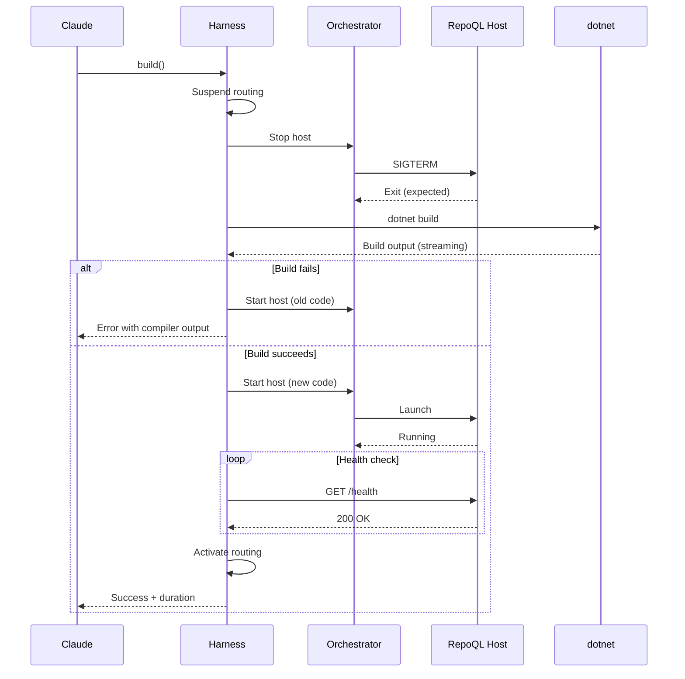
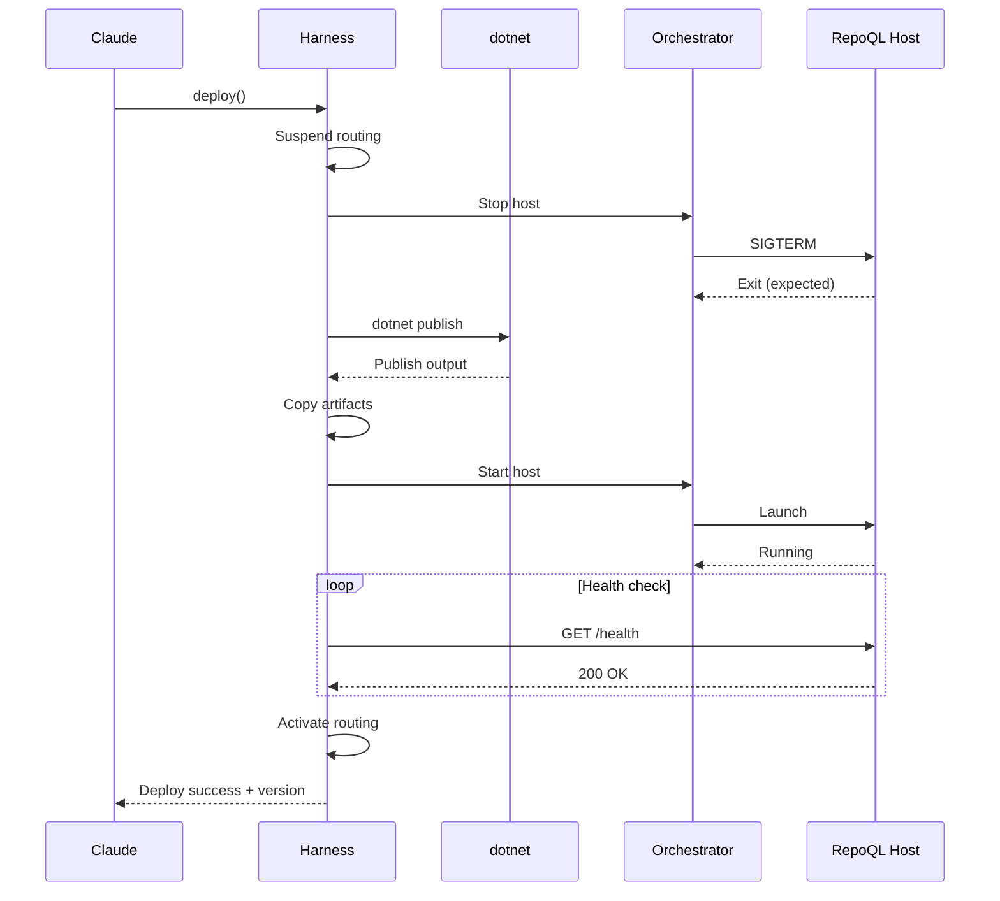

# Build-Deploy-Activate Flow

What happens when an agent wants to use updated RepoQL code—from build through activation.

## Why This Matters

The iteration loop is the core development experience. Every friction point here multiplies across dozens of cycles per session.

| Without harness | With harness |
|-----------------|--------------|
| Build manually, hope it worked | Build output in conversation |
| Run deploy.ps1, wait | Deploy is a tool call |
| Ask human to /mcp reconnect | Connection stays live |
| Wonder if new version is active | Explicit version confirmation |

## Two Operations

| Operation | When to use | What it does | Speed |
|-----------|-------------|--------------|-------|
| **build()** | Server-side changes (indexing, queries) | Build + restart (atomic) | ~15 seconds |
| **deploy()** | Client/tool changes, full deploy | Publish + replace (atomic) | ~30 seconds |

Most iteration uses **build()**. Use **deploy()** when:
- MCP tool definitions changed
- Need fresh deployment (debugging state issues)
- Preparing for handoff to another session

## Trigger

Agent calls one of:
- `harness.build()` — compile AND restart as single atomic operation
- `harness.deploy()` — publish AND replace as single atomic operation (what `deploy.ps1` does today)
- `harness.restart()` — just restart, no build (edge cases only)

---

## Flow A: Build (atomic stop → build → start)

### Stages

#### A1. Build Request
**Actor**: Agent
**Action**: Calls `harness.build()`
**Output**: Harness acknowledges, begins atomic stop → build → start
**Failure**: Harness unavailable → MCP connection error

```json
{
  "tool": "harness.build",
  "parameters": {
    "project": "RepoQL.ConsoleApp",
    "configuration": "Debug"
  }
}
```

#### A2. Routing Suspension
**Actor**: Harness
**Action**: Marks host as "building", stops routing tool calls
**Output**: Subsequent tool calls fail fast with context
**Failure**: None - internal state change

```json
{
  "error": "host_building",
  "message": "RepoQL is rebuilding. Retry in ~15 seconds.",
  "retry_after_ms": 15000
}
```

#### A3. Host Shutdown
**Actor**: Harness → Orchestrator
**Action**: Stops current host via Aspire
**Output**: Host process terminates (expected exit)
**Failure**: Host won't stop → force kill after 10s

Must stop first - **file locks prevent building while running** (especially on Windows).

#### A4. Build Execution
**Actor**: Harness
**Action**: Runs `dotnet build`, captures stdout/stderr
**Output**: Build result with output, warnings, errors
**Failure**: Compile errors → return errors, attempt to restart old version

Build output streams so agent sees progress. Host is stopped during this phase.

#### A5. Host Startup
**Actor**: Harness → Orchestrator
**Action**: Starts host via Aspire
**Output**: New host process running with rebuilt code
**Failure**: Host won't start → return error with logs

#### A6. Health Verification
**Actor**: Harness
**Action**: Polls host health endpoint
**Output**: Host confirmed healthy
**Failure**: Health check timeout → return error

#### A7. Routing Activation
**Actor**: Harness
**Action**: Resumes routing, returns complete result
**Output**: Agent's subsequent calls reach host with new code
**Failure**: None

### Flow A Diagram



### Flow A Timing

| Phase | Expected Duration |
|-------|-------------------|
| Shutdown | 1-2 seconds |
| Build (incremental) | 5-15 seconds |
| Startup | 2-3 seconds |
| Health verification | 1-2 seconds |
| **Total (atomic)** | **~10-22 seconds** |

---

## Flow B: Deploy (atomic publish + replace)

### Stages

#### B1. Deploy Request
**Actor**: Agent
**Action**: Calls `harness.deploy()`
**Output**: Harness acknowledges, begins full deployment
**Failure**: Harness unavailable → MCP connection error

```json
{
  "tool": "harness.deploy",
  "parameters": {
    "configuration": "Debug",
    "force": false
  }
}
```

#### B2. Routing Suspension
**Actor**: Harness
**Action**: Marks host as "deploying", stops routing tool calls
**Output**: Subsequent tool calls fail fast with context
**Failure**: None - internal state change

```json
{
  "error": "host_deploying",
  "message": "RepoQL is being deployed. Retry in ~30 seconds.",
  "retry_after_ms": 30000
}
```

#### B3. Host Shutdown
**Actor**: Harness → Orchestrator
**Action**: Stops current host via Aspire
**Output**: Host process terminates (expected exit)
**Failure**: Host won't stop → force kill after 10s

This is a **managed shutdown** - the harness initiated it.

#### B4. Publish Execution
**Actor**: Harness
**Action**: Runs `dotnet publish`, captures output
**Output**: Published artifacts in output directory
**Failure**: Publish fails → return errors, restart old version

```bash
dotnet publish src/RepoQL.ConsoleApp -c Debug -o ./publish
```

#### B5. Artifact Replacement
**Actor**: Harness
**Action**: Copies published artifacts to deployment location
**Output**: New binaries in place
**Failure**: File locks, permissions → return error

Deployment location: where Aspire expects to find RepoQL binaries.

#### B6. Host Startup
**Actor**: Harness → Orchestrator
**Action**: Starts host via Aspire
**Output**: Host process running
**Failure**: Process exits immediately → capture logs, return error

#### B7. Health Verification
**Actor**: Harness
**Action**: Polls host health endpoint until ready
**Output**: Host confirmed healthy with version info
**Failure**: Timeout → return error with diagnostics

#### B8. Routing Activation
**Actor**: Harness
**Action**: Resumes routing, returns success
**Output**: Agent's subsequent calls reach new version
**Failure**: None

### Flow B Diagram



### Flow B Timing

| Phase | Expected Duration |
|-------|-------------------|
| Shutdown | 1-2 seconds |
| Publish | 15-30 seconds |
| Artifact copy | < 1 second |
| Startup + health | 3-5 seconds |
| **Total (atomic)** | **~25-40 seconds** |

---

## Termination

Both flows complete when:
- Operation succeeded (build, publish, restart)
- Host is healthy and responding
- Harness is routing to the (new) host
- Agent receives confirmation

Success responses:

**build()** (atomic build + restart):
```json
{
  "success": true,
  "build_duration_ms": 8500,
  "restart_duration_ms": 4200,
  "total_duration_ms": 12700,
  "warnings": 2,
  "output": "Build succeeded.\n    2 Warning(s)\n    0 Error(s)"
}
```

**deploy()** (atomic publish + replace):
```json
{
  "success": true,
  "version": "1.2.3+abc1234",
  "publish_duration_ms": 18000,
  "total_duration_ms": 25000,
  "warnings": 2
}
```

**restart()** (just restart, no build):
```json
{
  "success": true,
  "duration_ms": 4200
}
```

---

## Error Handling

| Error | Flow | Behaviour |
|-------|------|-----------|
| Build fails | A | Return compiler errors, restart old version |
| Publish fails | B | Return errors, restart old version |
| Host won't stop | A, B | Force kill after 10s, continue |
| Artifacts locked | B | Return error, restart old version |
| Host won't start | A, B | Return error with startup logs (no old version to restart) |
| Health timeout | A, B | Return error with last response |

**Key behavior:** If build, publish, or artifact copy fails, the harness restarts the old version so the agent isn't left without a working host. The error response includes compiler/error output for diagnosis.

---

## Choosing Between Operations

| Scenario | Operation | Why |
|----------|-----------|-----|
| Changed query logic | `build()` | Fast, no artifact copy needed |
| Changed indexing code | `build()` | Fast iteration |
| Changed MCP tool handlers | `deploy()` | Tool definitions need publish |
| Changed MCP tool schemas | `deploy()` | Schema changes need publish |
| Debugging state issues | `deploy()` | Fresh deployment clears state |
| Another session will use it | `deploy()` | Full deployment for handoff |
| Just want to restart | `restart()` | Fastest, same code |

---

## Verification

| Environment | How |
|-------------|-----|
| **Local** | Call each operation, verify expected behavior |
| **Automated tests** | Mock orchestrator, verify state transitions |
| **Production** | N/A - dev harness is not for production |

## Related

- Unexpected Exit flow (what happens on crash)
- Tool Call Routing flow (how calls fail during operations)
- North star: `docs/north-star/dev-harness.md`
