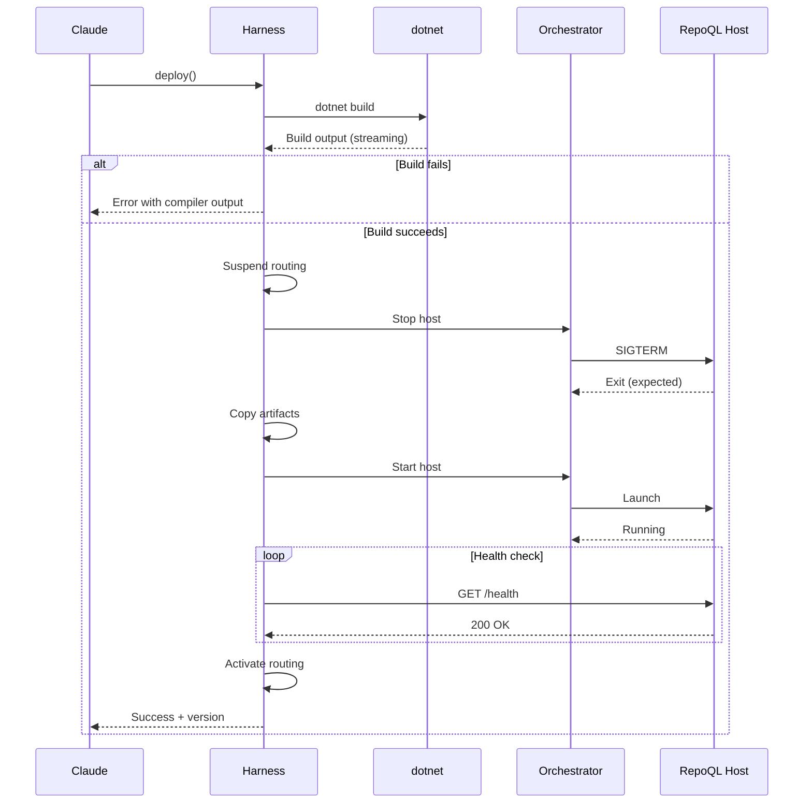

# Build-Deploy-Activate Flow

What happens when an agent wants to use updated RepoQL code—from build through activation.

## Why This Matters

The iteration loop is the core development experience. Every friction point here multiplies across dozens of cycles per session.

| Without harness | With harness |
|-----------------|--------------|
| Build manually, hope it worked | Build output in conversation |
| Run deploy.ps1, wait | Deploy is a tool call |
| Ask human to /mcp reconnect | Connection stays live |
| Wonder if new version is active | Explicit version confirmation |

## Trigger

Agent calls `harness.build()` or `harness.deploy()` tool.

- `build()` - compile only, don't deploy
- `deploy()` - build and activate (most common)

## Stages

### 1. Build Request
**Actor**: Agent (Claude)
**Action**: Calls `harness.deploy()` with optional parameters
**Output**: Harness acknowledges, begins build
**Failure**: Harness unavailable → agent sees MCP connection error

```json
{
  "tool": "harness.deploy",
  "parameters": {
    "project": "RepoQL.ConsoleApp",
    "configuration": "Debug"
  }
}
```

### 2. Build Execution
**Actor**: Harness
**Action**: Runs `dotnet build`, captures stdout/stderr
**Output**: Build result with output, warnings, errors
**Failure**: Compile errors → return errors, stop flow (no deploy)

The harness streams build output so the agent sees progress. Build warnings are captured but don't stop the flow.

### 3. Routing Suspension
**Actor**: Harness
**Action**: Marks host as "deploying", stops routing new tool calls
**Output**: Subsequent tool calls fail fast with context
**Failure**: None - internal state change

Tool calls received during deploy return immediately:
```json
{
  "error": "host_deploying",
  "message": "RepoQL is restarting. Retry in ~10 seconds.",
  "retry_after_ms": 10000
}
```

### 4. Host Shutdown
**Actor**: Harness → Orchestrator
**Action**: Harness instructs Aspire to stop the current host
**Output**: Host process terminates (expected exit)
**Failure**: Host doesn't stop within timeout → force kill, log warning

This is a **managed shutdown** - the harness initiated it, so it's not a bug.

### 5. Artifact Deployment
**Actor**: Harness
**Action**: Copies build output to deployment location
**Output**: New binaries in place
**Failure**: File locks, permissions → return error with specifics

### 6. Host Startup
**Actor**: Harness → Orchestrator
**Action**: Harness instructs Aspire to start the host
**Output**: Host process running, listening for connections
**Failure**: Process exits immediately → capture logs, return error

### 7. Health Verification
**Actor**: Harness
**Action**: Polls host health endpoint until ready or timeout
**Output**: Host confirmed healthy with version info
**Failure**: Health check fails after timeout → return error with diagnostics

```
GET /health → 200 OK
{
  "status": "healthy",
  "version": "1.2.3+abc1234",
  "started_at": "2026-02-02T12:00:00Z"
}
```

### 8. Routing Activation
**Actor**: Harness
**Action**: Updates routing to new host, resumes accepting tool calls
**Output**: Agent's subsequent tool calls reach new version
**Failure**: None - internal state change

## Termination

Flow completes when:
- Build succeeded
- New host is healthy and responding
- Harness is routing to new version
- Agent receives confirmation with version info

Success response:
```json
{
  "status": "deployed",
  "version": "1.2.3+abc1234",
  "build_duration_ms": 8500,
  "total_duration_ms": 12000,
  "warnings": 2
}
```

## Flow Diagram



## Error Handling

| Error | Behaviour |
|-------|-----------|
| Build fails | Return compiler errors, don't deploy |
| Host won't stop | Force kill after 10s, continue deploy |
| Artifacts locked | Return error, suggest closing other processes |
| Host won't start | Return error with startup logs |
| Health timeout | Return error with last health response |

## Timing

| Phase | Expected Duration |
|-------|-------------------|
| Build (incremental) | 5-15 seconds |
| Build (clean) | 30-60 seconds |
| Shutdown | < 2 seconds |
| Artifact copy | < 1 second |
| Startup + health | 3-5 seconds |
| **Total (incremental)** | **~15 seconds** |

## Verification

| Environment | How |
|-------------|-----|
| **Local** | Call `deploy()`, verify version changes in response |
| **Automated tests** | Mock orchestrator, verify state transitions |
| **Production** | N/A - dev harness is not for production |

## Related

- Host Crash Recovery flow (what happens on unexpected exit)
- Tool Call Routing flow (how calls reach the host)
- North star: `docs/north-star/dev-harness.md`
