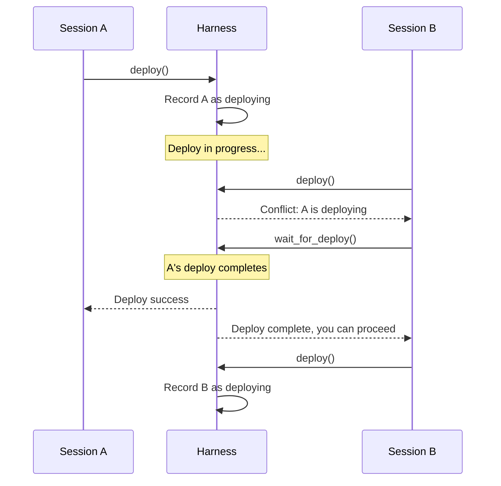

# Multi-Session Coordination Flow

How the harness handles multiple Claude sessions connecting simultaneously.

## Why This Matters

Development often involves multiple sessions - one investigating a bug while another tests a fix. Without coordination, sessions can conflict (simultaneous deploys) or be confused (which version am I using?).

| Without coordination | With coordination |
|---------------------|-------------------|
| Deploys overwrite each other | One at a time, others notified |
| "Is this the version I deployed?" | Each session knows what it deployed |
| Silent conflicts | Explicit warnings |
| Confusion after crash | Crash attributed to session |

## Architecture

**One harness, multiple sessions.** The harness runs as a persistent background process. Claude sessions connect to it via MCP.

```
┌─────────────┐     ┌─────────────┐
│  Claude A   │     │  Claude B   │
└──────┬──────┘     └──────┬──────┘
       │                   │
       │   MCP             │   MCP
       │                   │
       └───────┬───────────┘
               │
        ┌──────┴──────┐
        │   Harness   │  (singleton)
        └──────┬──────┘
               │
        ┌──────┴──────┐
        │ Orchestrator │
        └──────┬──────┘
               │
        ┌──────┴──────┐
        │    Host     │
        └─────────────┘
```

## Session Identity

Each MCP connection gets a session ID:

```json
{
  "session_id": "sess_abc123",
  "connected_at": "2026-02-02T12:00:00Z",
  "client_info": {
    "name": "Claude Code",
    "version": "1.0.0"
  }
}
```

The harness tracks:
- Connected sessions
- Which session initiated current deploy
- Which session's request caused crash (if any)

## Trigger

Any state-changing operation when multiple sessions are connected:
- Deploy request from Session B while Session A is deploying
- Restart request while deploy in progress
- Session disconnect during operation

## Stages (Deploy Conflict)

### 1. Deploy Request
**Actor**: Session B
**Action**: Calls `harness.deploy()`
**Output**: Request enters harness
**Failure**: MCP connection error

### 2. Conflict Detection
**Actor**: Harness
**Action**: Checks if deploy already in progress
**Output**: Conflict detected or proceed
**Failure**: None - state check

```
Deploy in progress?
├── No  → Proceed with deploy
└── Yes → Return conflict info
```

### 3a. No Conflict - Proceed
**Actor**: Harness
**Action**: Records Session B as deploying session, starts deploy
**Output**: Normal deploy flow begins
**Failure**: See Build-Deploy-Activate flow

### 3b. Conflict - Notify
**Actor**: Harness
**Action**: Returns conflict information to Session B
**Output**: Session B informed of conflict
**Failure**: None - informational response

```json
{
  "error": "deploy_in_progress",
  "message": "Another session is deploying. Wait or proceed with caution.",
  "conflict": {
    "session_id": "sess_xyz789",
    "started_at": "2026-02-02T12:00:00Z",
    "elapsed_seconds": 15
  },
  "options": {
    "wait": "harness.wait_for_deploy()",
    "force": "harness.deploy({ force: true })",
    "status": "harness.status()"
  }
}
```

### 4. Session B Decides
**Actor**: Session B
**Action**: Chooses to wait, force, or do something else
**Output**: Follow-up action
**Failure**: None - agent decision

Options:
| Option | Behavior |
|--------|----------|
| `wait_for_deploy()` | Block until current deploy completes |
| `deploy({ force: true })` | Queue deploy after current one |
| `status()` | Check progress without waiting |
| Do nothing | Work on something else |

## Stages (Session Disconnect)

### 1. Disconnect Detection
**Actor**: Harness
**Action**: Detects MCP connection closed
**Output**: Session marked disconnected
**Failure**: None - detection is automatic

### 2. In-Flight Operation Check
**Actor**: Harness
**Action**: Checks if disconnected session had operations in progress
**Output**: Decision on what to do
**Failure**: None - state check

```
Session had in-flight operation?
├── Deploy in progress → Complete it (don't abort)
├── Tool call pending  → Let it finish
└── Nothing in progress → Clean disconnect
```

### 3. Session Cleanup
**Actor**: Harness
**Action**: Removes session from active list
**Output**: Session no longer tracked
**Failure**: None - cleanup is local

Deploys are NOT aborted on disconnect. The operation completes, and results are available when a session reconnects or queries status.

## Stages (Crash Attribution)

### 1. Crash Occurs
**Actor**: Host
**Action**: Exits unexpectedly
**Output**: Crash detected (see Unexpected Exit flow)
**Failure**: None - this is the failure

### 2. Attribution
**Actor**: Harness
**Action**: Identifies which session's operation was in progress
**Output**: Crash attributed to session
**Failure**: May be ambiguous if multiple in-flight

```json
{
  "event": "unexpected_exit",
  "crash_id": "crash_abc123",
  "attributed_to": {
    "session_id": "sess_xyz789",
    "operation": "query",
    "request_id": "req_def456"
  }
}
```

### 3. Notification
**Actor**: Harness
**Action**: Notifies all connected sessions
**Output**: All sessions see crash report
**Failure**: Disconnected sessions don't get notification

All sessions are notified, but the crash report identifies which session's operation likely caused it.

## Flow Diagram



## Session State Visibility

Any session can query current state:

```json
{
  "tool": "harness.status"
}
```

Response:
```json
{
  "host": {
    "state": "deploying",
    "version": "1.2.3+abc1234"
  },
  "sessions": {
    "total": 2,
    "this_session": "sess_abc123",
    "deploying_session": "sess_xyz789"
  },
  "current_operation": {
    "type": "deploy",
    "session_id": "sess_xyz789",
    "started_at": "2026-02-02T12:00:00Z",
    "elapsed_seconds": 15
  }
}
```

## Concurrency Rules

| Operation | Concurrent? | Behavior |
|-----------|-------------|----------|
| Tool calls (read, query, etc.) | Yes | All sessions can call simultaneously |
| Deploy | No | One at a time, others notified |
| Restart | No | One at a time |
| Logs/traces query | Yes | All sessions can query |
| Status query | Yes | All sessions can query |

## Force Deploy

When Session B uses `force: true`:

```json
{
  "tool": "harness.deploy",
  "parameters": { "force": true }
}
```

Behavior:
1. Session B's deploy is queued
2. When Session A's deploy completes, Session B's starts automatically
3. Session B gets notification when its deploy starts and completes

This is NOT "interrupt Session A" - it's "deploy after Session A."

## Error Handling

| Situation | Behavior |
|-----------|----------|
| Session A disconnects mid-deploy | Deploy completes, result available via status |
| Both sessions disconnect | Deploy completes, no one to notify |
| Harness restarts | All sessions must reconnect |
| Force deploy while crashed | Queue clears on crash, deploy starts fresh |

## Timing

| Check | Expected Duration |
|-------|-------------------|
| Conflict detection | < 1ms |
| Session registration | < 1ms |
| Notification broadcast | < 10ms |

## Verification

| Environment | How |
|-------------|-----|
| **Local** | Connect two Claude instances, verify conflict detection |
| **Automated tests** | Mock multiple session connections |
| **Production** | N/A |

## Related

- Build-Deploy-Activate flow (deploy mechanics)
- Unexpected Exit flow (crash attribution)
- Tool Call Routing flow (concurrent tool calls)
