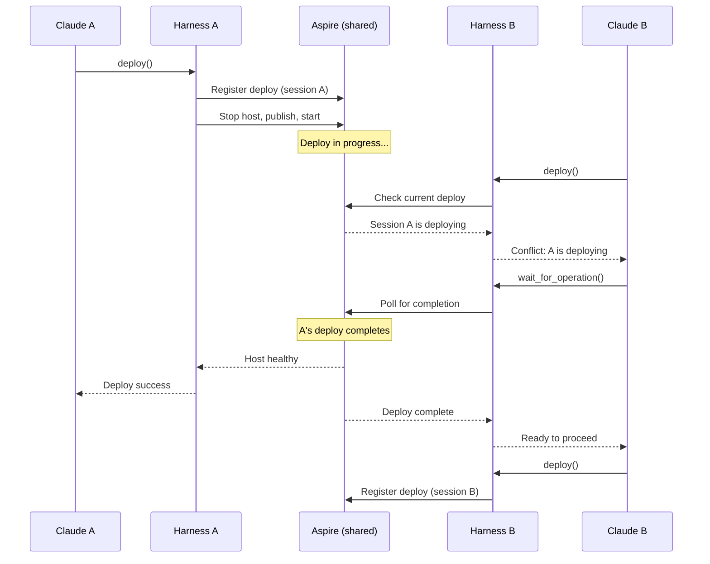

# Multi-Session Coordination Flow

How the harness handles multiple Claude sessions connecting simultaneously.

## Why This Matters

Development often involves multiple sessions - one investigating a bug while another tests a fix. Without coordination, sessions can conflict (simultaneous deploys) or be confused (which version am I using?).

| Without coordination | With coordination |
|---------------------|-------------------|
| Deploys overwrite each other | One at a time, others notified |
| "Is this the version I deployed?" | Each session knows what it deployed |
| Silent conflicts | Explicit warnings |
| Confusion after crash | Crash attributed to session |

## Architecture

**Per-session harness, shared orchestrator.** Each Claude session launches its own harness (standard stdio MCP). All harnesses talk to the same Aspire orchestrator, which manages the single RepoQL host.

```
┌─────────────┐           ┌─────────────┐
│  Claude A   │           │  Claude B   │
└──────┬──────┘           └──────┬──────┘
       │                         │
       │ stdio MCP               │ stdio MCP
       │                         │
┌──────┴──────┐           ┌──────┴──────┐
│  Harness A  │           │  Harness B  │  (per-session)
└──────┬──────┘           └──────┬──────┘
       │                         │
       └───────────┬─────────────┘
                   │
            ┌──────┴──────┐
            │ Orchestrator │  (shared - Aspire)
            └──────┬──────┘
                   │
            ┌──────┴──────┐
            │    Host     │  (single instance)
            └─────────────┘
```

**Why this works:**
- Harness launched like any MCP server (stdio) - no special discovery
- Harness crashes? Claude Code restarts it (normal MCP behavior)
- Deploy RepoQL without stopping harness - harness stays up, host restarts underneath
- Coordination via Aspire - all harnesses see same state

## Session Identity

Each harness instance generates a session ID on startup:

```json
{
  "session_id": "sess_abc123",
  "started_at": "2026-02-02T12:00:00Z",
  "pid": 12345
}
```

Coordination happens via Aspire:
- Harness queries Aspire for current state (who's deploying, host status)
- Harness registers its operations with Aspire (or shared state file)
- Conflict detection based on shared state, not direct harness-to-harness communication

## Trigger

Any state-changing operation when multiple sessions are connected:
- Deploy request from Session B while Session A is deploying
- Restart request while deploy in progress
- Session disconnect during operation

## Stages (Build/Deploy Conflict)

### 1. Operation Request
**Actor**: Session B
**Action**: Calls `harness.build()` or `harness.deploy()`
**Output**: Request enters harness
**Failure**: MCP connection error

### 2. Conflict Detection
**Actor**: Harness
**Action**: Checks if build or deploy already in progress (queries Aspire)
**Output**: Conflict detected or proceed
**Failure**: None - state check

```
Operation in progress?
├── No  → Proceed with build/deploy
└── Yes → Return conflict info
```

Build and deploy conflict with each other - you can't build while deploying or deploy while building.

### 3a. No Conflict - Proceed
**Actor**: Harness
**Action**: Registers operation with Aspire, starts build/deploy
**Output**: Normal build/deploy flow begins
**Failure**: See Build-Deploy-Activate flow

### 3b. Conflict - Notify
**Actor**: Harness
**Action**: Returns conflict information to Session B
**Output**: Session B informed of conflict
**Failure**: None - informational response

```json
{
  "error": "build_in_progress",
  "message": "Another session is building. Wait or queue after.",
  "conflict": {
    "operation": "build",
    "session_id": "sess_xyz789",
    "started_at": "2026-02-02T12:00:00Z",
    "elapsed_seconds": 15
  },
  "options": {
    "wait": "harness.wait_for_operation()",
    "force": "harness.build({ force: true })",
    "status": "harness.status()"
  }
}
```

### 4. Session B Decides
**Actor**: Session B
**Action**: Chooses to wait, force, or do something else
**Output**: Follow-up action
**Failure**: None - agent decision

Options:
| Option | Behavior |
|--------|----------|
| `wait_for_operation()` | Block until current operation completes |
| `build({ force: true })` / `deploy({ force: true })` | Queue after current operation |
| `status()` | Check progress without waiting |
| Do nothing | Work on something else |

## Session Lifecycle (Per-Session Harness)

With per-session harness architecture, there is no "disconnect detection" - when Claude disconnects, Claude Code terminates the harness process (standard stdio MCP behavior).

**What happens to in-flight operations:**

| Scenario | Behavior |
|----------|----------|
| Claude disconnects during deploy | Harness dies, but Aspire continues the host restart. Next session sees host in whatever state it reached. |
| Claude disconnects during build | Harness dies, dotnet build may complete or be orphaned. Host state depends on timing. |
| Claude disconnects during tool call | Tool call may complete on host, but response is lost. |

**Key insight:** The harness is ephemeral. Aspire and the host are the durable state. A new session's harness queries Aspire to understand current state.

## Stages (Crash Attribution)

### 1. Crash Occurs
**Actor**: Host
**Action**: Exits unexpectedly
**Output**: Crash detected (see Unexpected Exit flow)
**Failure**: None - this is the failure

### 2. Attribution
**Actor**: Harness
**Action**: Identifies which session's operation was in progress
**Output**: Crash attributed to session
**Failure**: May be ambiguous if multiple in-flight

```json
{
  "event": "unexpected_exit",
  "crash_id": "crash_abc123",
  "attributed_to": {
    "session_id": "sess_xyz789",
    "operation": "query",
    "request_id": "req_def456"
  }
}
```

### 3. Notification
**Actor**: Harness
**Action**: Notifies all connected sessions
**Output**: All sessions see crash report
**Failure**: Disconnected sessions don't get notification

All sessions are notified, but the crash report identifies which session's operation likely caused it.

## Flow Diagram



## Session State Visibility

Any session can query current state:

```json
{
  "tool": "harness.status"
}
```

Response:
```json
{
  "host": {
    "state": "building",
    "version": "1.2.3+abc1234"
  },
  "sessions": {
    "total": 2,
    "this_session": "sess_abc123",
    "operating_session": "sess_xyz789"
  },
  "current_operation": {
    "type": "build",
    "session_id": "sess_xyz789",
    "started_at": "2026-02-02T12:00:00Z",
    "elapsed_seconds": 15
  }
}
```

## Concurrency Rules

| Operation | Concurrent? | Behavior |
|-----------|-------------|----------|
| Tool calls (read, query, etc.) | Yes | All sessions can call simultaneously |
| Build | No | One at a time, others notified |
| Deploy | No | One at a time, others notified |
| Restart | No | One at a time |
| Logs/traces query | Yes | All sessions can query |
| Status query | Yes | All sessions can query |

## Force Operation

When Session B uses `force: true`:

```json
{
  "tool": "harness.build",
  "parameters": { "force": true }
}
```

Behavior:
1. Session B's operation is queued
2. When Session A's operation completes, Session B's starts automatically
3. Session B's harness polls Aspire and returns when its operation completes

This is NOT "interrupt Session A" - it's "run after Session A."

## Error Handling

| Situation | Behavior |
|-----------|----------|
| Session A disconnects mid-build/deploy | Aspire continues operation. New session queries Aspire for current state. |
| Both sessions disconnect mid-operation | Operation may complete or be orphaned. New session queries Aspire. |
| Force build/deploy while crashed | No queue - operation starts immediately on crashed host |
| Build requested while deploy in progress | Conflict error, same as deploy-during-deploy |

## Timing

| Check | Expected Duration |
|-------|-------------------|
| Conflict detection | < 1ms |
| Session registration | < 1ms |
| Notification broadcast | < 10ms |

## Verification

| Environment | How |
|-------------|-----|
| **Local** | Connect two Claude instances, verify conflict detection |
| **Automated tests** | Mock multiple session connections |
| **Production** | N/A |

## Related

- Build-Deploy-Activate flow (deploy mechanics)
- Unexpected Exit flow (crash attribution)
- Tool Call Routing flow (concurrent tool calls)
