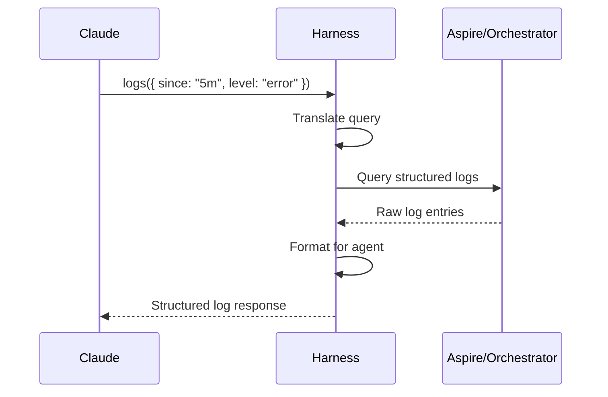

# Telemetry Query Flow

How agents access logs, traces, and diagnostics through the harness without leaving the conversation.

## Why This Matters

Debugging requires visibility. Today that means opening a browser to Aspire dashboard, losing conversation context. The harness brings telemetry into the conversation.

| Without harness | With harness |
|-----------------|--------------|
| Open browser to Aspire | Query in conversation |
| Manually correlate request to trace | Request ID links automatically |
| Dashboard unavailable if orchestrator restarted | Telemetry survives restarts |
| Copy-paste from browser | Structured data for analysis |

## Trigger

Agent calls a telemetry tool:
- `harness.logs()` - structured log query
- `harness.traces()` - distributed trace query
- `harness.metrics()` - current metric values

## Data Sources

```
Harness
  │
  ├── Orchestrator (Aspire)
  │     ├── Structured logs (all resources)
  │     ├── Distributed traces
  │     └── Metrics
  │
  └── Harness internal
        ├── Crash reports
        ├── Deploy history
        └── Request correlation
```

The harness aggregates telemetry from Aspire and its own records.

## Stages (Log Query)

### 1. Query Request
**Actor**: Agent
**Action**: Calls `harness.logs()` with filters
**Output**: Query enters harness
**Failure**: MCP connection error

```json
{
  "tool": "harness.logs",
  "parameters": {
    "since": "5m",
    "level": "error",
    "contains": "DuckDB",
    "resource": "repoql-host",
    "limit": 50
  }
}
```

### 2. Query Translation
**Actor**: Harness
**Action**: Translates agent query to Aspire API
**Output**: Aspire-compatible query
**Failure**: Invalid query parameters → return validation error

Filter options:
| Parameter | Meaning | Examples |
|-----------|---------|----------|
| `since` | Time window | `5m`, `1h`, `2026-02-02T12:00:00Z` |
| `until` | End time | Same as `since` |
| `level` | Minimum severity | `debug`, `info`, `warn`, `error` |
| `contains` | Text search | `"DuckDB"`, `"timeout"` |
| `resource` | Source filter | `repoql-host`, `orchestrator` |
| `request_id` | Correlation | `req_abc123` |
| `limit` | Max results | Default 100, max 1000 |

### 3. Aspire Query
**Actor**: Harness → Aspire
**Action**: Queries Aspire's structured log store
**Output**: Raw log entries
**Failure**: Aspire unavailable → return cached data or error

### 4. Response Formatting
**Actor**: Harness
**Action**: Formats logs for agent consumption
**Output**: Structured log response
**Failure**: None - formatting is local

```json
{
  "logs": [
    {
      "timestamp": "2026-02-02T12:00:01.234Z",
      "level": "error",
      "message": "DuckDB query failed: syntax error",
      "resource": "repoql-host",
      "request_id": "req_abc123",
      "attributes": {
        "sql": "SELECT * FORM nodes",
        "error_code": "SYNTAX_ERROR"
      }
    }
  ],
  "count": 1,
  "truncated": false,
  "query": {
    "since": "2026-02-02T11:55:00Z",
    "level": "error",
    "contains": "DuckDB"
  }
}
```

## Stages (Trace Query)

### 1. Trace Request
**Actor**: Agent
**Action**: Calls `harness.traces()` with identifier
**Output**: Query enters harness
**Failure**: MCP connection error

```json
{
  "tool": "harness.traces",
  "parameters": {
    "request_id": "req_abc123"
  }
}
```

Or query recent traces:
```json
{
  "tool": "harness.traces",
  "parameters": {
    "since": "5m",
    "has_error": true,
    "limit": 10
  }
}
```

### 2. Trace Retrieval
**Actor**: Harness → Aspire
**Action**: Fetches trace spans from Aspire
**Output**: Complete trace tree
**Failure**: Trace not found → return not found error

### 3. Trace Formatting
**Actor**: Harness
**Action**: Formats trace for agent consumption
**Output**: Hierarchical span structure
**Failure**: None - formatting is local

```json
{
  "trace_id": "trace_xyz789",
  "request_id": "req_abc123",
  "duration_ms": 245,
  "has_error": true,

  "spans": [
    {
      "name": "query",
      "duration_ms": 245,
      "status": "error",
      "children": [
        {
          "name": "parse_sql",
          "duration_ms": 2,
          "status": "ok"
        },
        {
          "name": "execute_duckdb",
          "duration_ms": 240,
          "status": "error",
          "error": "SYNTAX_ERROR: near 'FORM'"
        }
      ]
    }
  ]
}
```

## Stages (Crash Context)

### 1. Crash Query
**Actor**: Agent
**Action**: Calls `harness.logs()` with crash_id
**Output**: Logs around crash time
**Failure**: Crash ID not found

```json
{
  "tool": "harness.logs",
  "parameters": {
    "crash_id": "crash_abc123"
  }
}
```

### 2. Context Assembly
**Actor**: Harness
**Action**: Retrieves logs from crash time window
**Output**: Logs before and after crash
**Failure**: Logs may have rotated → return partial

The harness automatically:
- Fetches logs from 30 seconds before crash
- Includes the crash report
- Correlates with last in-flight request

## Flow Diagram



## Common Query Patterns

| Goal | Query |
|------|-------|
| Recent errors | `logs({ since: "10m", level: "error" })` |
| What just happened | `logs({ since: "1m" })` |
| Debug specific request | `logs({ request_id: "req_abc123" })` |
| Trace slow query | `traces({ request_id: "req_abc123" })` |
| Find failed traces | `traces({ since: "5m", has_error: true })` |
| Crash investigation | `logs({ crash_id: "crash_abc123" })` |
| Search for pattern | `logs({ since: "1h", contains: "timeout" })` |

## Correlation

The harness maintains correlation between:

```
Tool call (req_abc123)
    ↓
Trace (trace_xyz789)
    ↓
Log entries (tagged with req_abc123)
    ↓
Crash report (if crashed during request)
```

This enables: "Show me everything about that request that failed."

## Availability

| Harness state | Telemetry available? |
|---------------|---------------------|
| Host ready | Yes - live data |
| Host building | Yes - historical data |
| Host deploying | Yes - historical data |
| Host crashed | Yes - includes crash context |
| Host starting | Yes - historical data |
| Aspire down | Partial - harness cache only |

Telemetry is available even when the host isn't. This is critical for debugging crashes.

## Error Handling

| Error | Behaviour |
|-------|-----------|
| Aspire unavailable | Return cached data with staleness warning |
| Query too broad | Return error suggesting narrower filters |
| No results | Return empty with query echo |
| Trace not found | Return not found with suggestions |

## Timing

| Query type | Expected Duration |
|------------|-------------------|
| Recent logs (100 entries) | < 200ms |
| Filtered logs | < 500ms |
| Single trace | < 100ms |
| Trace search | < 500ms |

## Verification

| Environment | How |
|-------------|-----|
| **Local** | Generate logs, query through harness, verify filtering |
| **Automated tests** | Mock Aspire, verify query translation |
| **Production** | N/A |

## Related

- Tool Call Routing flow (adds request_id for correlation)
- Unexpected Exit flow (crash_id links to logs)
- North star: "query logs in conversation"
