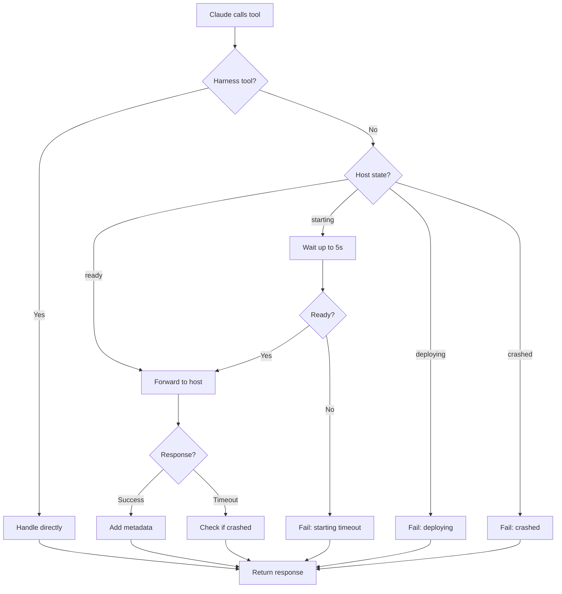
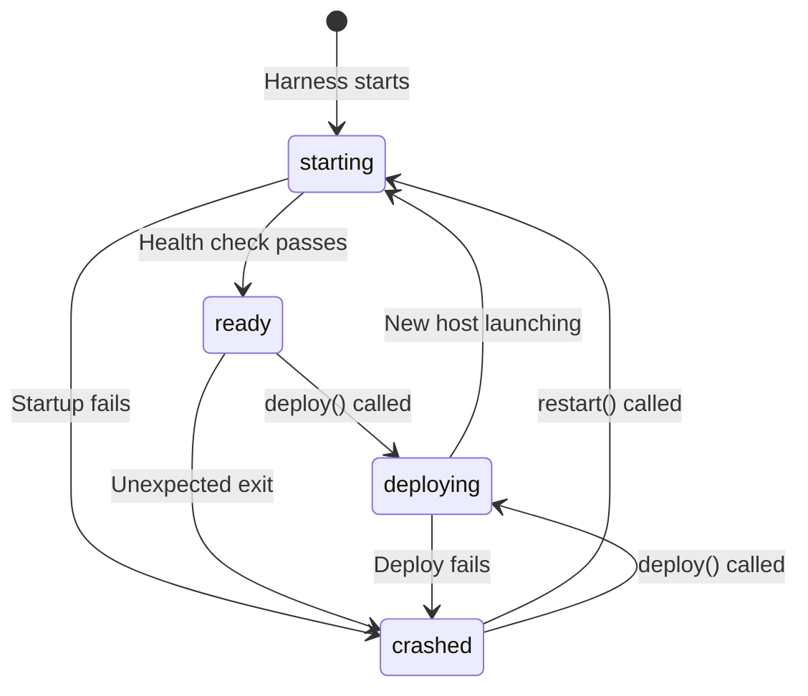

# Tool Call Routing Flow

How the harness routes tool calls to RepoQL and handles its own management tools.

## Why This Matters

The harness is the stable connection point. Claude connects once and stays connected regardless of what happens to RepoQL. The routing logic determines what the agent experiences during normal operation, deploys, and crashes.

| Direct connection | Through harness |
|-------------------|-----------------|
| Connection breaks on restart | Connection stays live |
| Agent sees MCP errors | Agent sees actionable context |
| No visibility into state | Host state always known |
| Manual reconnection | Automatic continuity |

## Trigger

Claude makes any MCP tool call through the harness connection.

## Tool Classification

The harness handles two categories:

| Category | Examples | Handler |
|----------|----------|---------|
| **Harness tools** | `build`, `deploy`, `restart`, `logs`, `status` | Harness directly |
| **RepoQL tools** | `read`, `query`, `explore`, `import` | Forwarded to host |

The harness exposes both under a unified MCP interface. Claude doesn't need to know which is which.

## Stages (RepoQL Tool)

### 1. Tool Call Received
**Actor**: Claude
**Action**: Calls MCP tool (e.g., `query`)
**Output**: Request enters harness
**Failure**: MCP connection error → Claude retries connection

### 2. State Check
**Actor**: Harness
**Action**: Checks current host state
**Output**: Routing decision based on state
**Failure**: None - state is always known

```
Host state?
├── ready     → Forward to host
├── starting  → Wait briefly, then forward or fail
├── deploying → Fail with "deploying" context
└── crashed   → Fail with crash context
```

### 3a. Ready State - Forward
**Actor**: Harness
**Action**: Forwards request to host, awaits response
**Output**: Host response (success or error)
**Failure**: Host doesn't respond → timeout, check if crashed

### 3b. Starting State - Wait
**Actor**: Harness
**Action**: Waits up to N seconds for host to become ready
**Output**: Either forwards when ready, or fails with timeout
**Failure**: Host doesn't become ready → fail with context

Wait threshold: ~5 seconds. Short enough to not hide problems, long enough to cover normal startup.

### 3c. Deploying State - Fail Fast
**Actor**: Harness
**Action**: Returns immediately with deploying context
**Output**: Error with retry guidance
**Failure**: None - this is intentional behavior

```json
{
  "error": "host_deploying",
  "message": "RepoQL is restarting after deploy. Retry in ~10 seconds.",
  "retry_after_ms": 10000,
  "deploy_started_at": "2026-02-02T12:00:00Z"
}
```

### 3d. Crashed State - Fail Fast
**Actor**: Harness
**Action**: Returns immediately with crash context
**Output**: Error with crash details and suggested actions
**Failure**: None - this is intentional behavior

```json
{
  "error": "host_crashed",
  "message": "RepoQL exited unexpectedly. See crash_id for details.",
  "crash_id": "crash_abc123",
  "crashed_at": "2026-02-02T11:59:59Z",
  "actions": ["harness.restart()", "harness.logs({ crash_id: '...' })"]
}
```

### 4. Response Enhancement
**Actor**: Harness
**Action**: Adds harness metadata to successful responses
**Output**: Enhanced response
**Failure**: None - passthrough if enhancement fails

Metadata added to all successful responses:
```json
{
  "_harness": {
    "host_version": "1.2.3+abc1234",
    "request_id": "req_xyz789",
    "duration_ms": 45
  }
}
```

### 5. Response Return
**Actor**: Harness
**Action**: Returns response to Claude
**Output**: Claude receives result
**Failure**: None - response always returned

## Stages (Harness Tool)

### 1. Tool Call Received
**Actor**: Claude
**Action**: Calls harness management tool (e.g., `deploy`)
**Output**: Request enters harness
**Failure**: MCP connection error

### 2. Direct Handling
**Actor**: Harness
**Action**: Executes tool directly (no forwarding)
**Output**: Tool-specific response
**Failure**: Tool-specific errors

Harness tools execute regardless of host state. You can `deploy()` even when crashed, `logs()` even when deploying.

## Flow Diagram



## State Transitions



## Error Responses by State

| State | Error Code | Message | Retry? |
|-------|------------|---------|--------|
| `ready` (timeout) | `host_timeout` | "Host didn't respond" | Check status first |
| `starting` | `host_starting` | "Host is starting" | Auto-wait, then retry |
| `deploying` | `host_deploying` | "Deploy in progress" | Wait for completion |
| `crashed` | `host_crashed` | "Host crashed" | Need restart/deploy |

## Timeout Handling

| Scenario | Timeout | Behavior |
|----------|---------|----------|
| Normal tool call | 60 seconds | Return timeout error |
| Tool call during `starting` | 5s wait + 60s call | Wait then forward |
| Long-running query | 5 minutes | Extended timeout |

The harness doesn't add latency to normal calls - it's a thin proxy when the host is ready.

## Request Correlation

Every request gets a `request_id` for tracing:

```
Claude calls query()
  → Harness assigns req_abc123
    → Forwards to host with X-Request-Id: req_abc123
      → Host logs include req_abc123
    → Response includes req_abc123
  → Agent can correlate with logs
```

This enables: "Show me the trace for req_abc123" when debugging.

## Timing

| Phase | Expected Duration |
|-------|-------------------|
| State check | < 1ms |
| Forward to host | < 1ms overhead |
| Metadata enhancement | < 1ms |
| **Total harness overhead** | **< 5ms** |

The harness should be invisible in timing for normal operations.

## Verification

| Environment | How |
|-------------|-----|
| **Local** | Call tools in each state, verify responses match spec |
| **Automated tests** | Mock host, verify routing logic |
| **Production** | N/A |

## Related

- Build-Deploy-Activate flow (causes `deploying` state)
- Unexpected Exit flow (causes `crashed` state)
- Telemetry Query flow (uses request_id for correlation)
