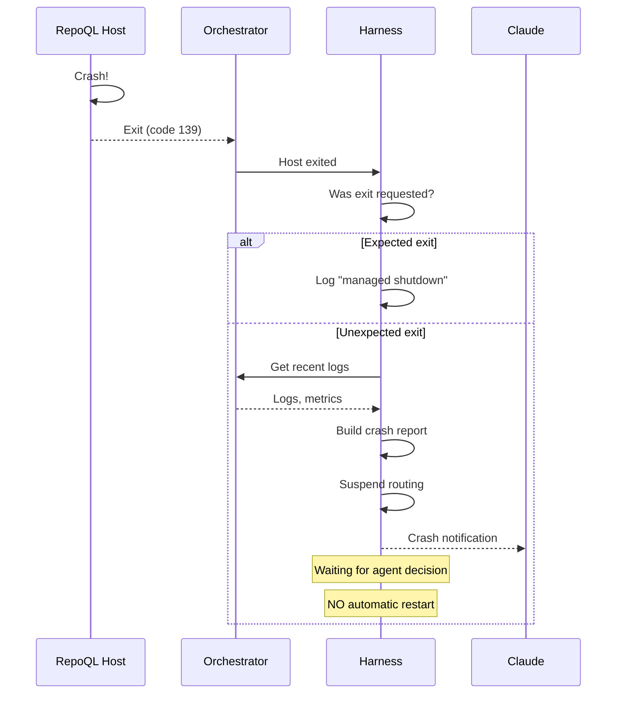

# Unexpected Exit Flow

What happens when RepoQL exits without the harness asking it to—this is always a bug.

## Why This Matters

The harness controls lifecycle. If it didn't request a stop, something is wrong. Silent recovery hides bugs. The whole point of iterating is to find and fix these.

| Silent recovery | Loud reporting |
|-----------------|----------------|
| Bug gets retried, maybe works | Bug gets surfaced, gets fixed |
| Agent wonders "did it restart?" | Agent knows exactly what happened |
| Intermittent failures persist | Intermittent failures become visible |
| Human discovers crash hours later | Human sees it immediately |

## Trigger

Orchestrator detects host process exited AND harness did not request the exit.

The harness tracks "expected exits" - shutdowns it initiated via management tools. Any exit not in this set is unexpected.

## Stages

### 1. Exit Detection
**Actor**: Orchestrator (Aspire)
**Action**: Detects host process terminated
**Output**: Exit event with code, timestamp
**Failure**: None - this is the failure being detected

### 2. Exit Classification
**Actor**: Harness
**Action**: Checks if exit was requested (managed shutdown)
**Output**: Classification: `expected` or `unexpected`
**Failure**: None - state lookup

```
Was this exit requested?
├── YES → Log "managed shutdown complete", done
└── NO  → Continue to crash handling
```

### 3. Context Gathering
**Actor**: Harness
**Action**: Collects crash context from orchestrator and logs
**Output**: Structured crash report
**Failure**: Some context may be unavailable - gather what's possible

Context to gather:
- Exit code
- Signal (if killed)
- Last 50 lines of stdout/stderr
- Stack trace (if available in logs)
- Last tool call in progress (if any)
- Uptime before crash
- Memory/CPU at exit (if available)

### 4. Routing Suspension
**Actor**: Harness
**Action**: Marks host as "crashed", stops routing tool calls
**Output**: Subsequent tool calls fail with crash context
**Failure**: None - internal state change

Tool calls received after crash return:
```json
{
  "error": "host_crashed",
  "message": "RepoQL exited unexpectedly. This is a bug.",
  "exit_code": 139,
  "signal": "SIGSEGV",
  "crash_id": "crash_abc123"
}
```

### 5. Agent Notification
**Actor**: Harness
**Action**: Pushes crash notification to agent (if notification channel available) or returns on next tool call
**Output**: Agent receives full crash report
**Failure**: If no push channel, agent learns on next tool call

### 6. Await Agent Decision
**Actor**: Harness
**Action**: Waits for agent to explicitly request restart or investigation
**Output**: None - harness does not auto-recover
**Failure**: None - waiting is the correct behavior

The agent can:
- Call `harness.restart()` to bring host back up
- Call `harness.logs()` to investigate further
- Call `harness.deploy()` to rebuild with a fix
- Ask the human for help

## Termination

Flow completes when:
- Crash is classified as unexpected
- Context is gathered
- Agent is notified
- Harness is waiting for explicit instruction

**The harness does NOT automatically restart.** The agent must decide what to do.

## Crash Report Structure

```json
{
  "event": "unexpected_exit",
  "crash_id": "crash_abc123",
  "timestamp": "2026-02-02T12:00:00Z",
  "severity": "bug",

  "exit": {
    "code": 139,
    "signal": "SIGSEGV",
    "reason": "Segmentation fault"
  },

  "context": {
    "uptime_seconds": 847,
    "last_tool_call": {
      "tool": "query",
      "parameters": { "sql": "SELECT * FROM nodes" },
      "started_at": "2026-02-02T11:59:58Z"
    },
    "version": "1.2.3+abc1234"
  },

  "diagnostics": {
    "recent_logs": [
      "2026-02-02T11:59:59.123 [ERR] Unhandled exception in query handler",
      "2026-02-02T11:59:59.124 [ERR] System.AccessViolationException: ...",
      "... (last 50 lines)"
    ],
    "stack_trace": "at DuckDB.Native.Execute(...)\n   at RepoQL.Query..."
  },

  "actions": {
    "restart": "harness.restart()",
    "investigate": "harness.logs({ crash_id: 'crash_abc123' })",
    "rebuild": "harness.deploy()"
  }
}
```

## Flow Diagram



## Error Handling

| Situation | Behaviour |
|-----------|-----------|
| Can't get logs | Report crash with partial context |
| Multiple rapid crashes | Each is reported separately |
| Crash during deploy | Deploy fails, crash reported |
| Agent ignores crash | Harness stays suspended, human sees status |

## What NOT to Do

| Anti-pattern | Why it's wrong |
|--------------|----------------|
| Auto-restart on crash | Hides bugs, loses context |
| Retry failed tool call | Bug might corrupt data |
| Log and continue | Agent doesn't learn about the bug |
| Rate-limit crash reports | Every crash is information |
| Summarize multiple crashes | Loses detail needed for debugging |

## Timing

| Phase | Expected Duration |
|-------|-------------------|
| Exit detection | < 100ms |
| Context gathering | 1-2 seconds |
| Agent notification | < 100ms |
| **Total to notification** | **< 3 seconds** |

## Verification

| Environment | How |
|-------------|-----|
| **Local** | Kill host process (`kill -9`), verify crash report |
| **Automated tests** | Mock orchestrator exit event, verify classification and report |
| **Production** | N/A - dev harness is not for production |

## Distinguishing Exit Types

| Scenario | Exit Code | Harness Requested? | Classification |
|----------|-----------|-------------------|----------------|
| `harness.restart()` | 0 | Yes | Expected |
| `harness.deploy()` | 0 | Yes | Expected |
| Host calls `Environment.Exit(0)` | 0 | No | **Unexpected** |
| Unhandled exception | 1 | No | **Unexpected** |
| Segfault | 139 | No | **Unexpected** |
| OOM killed | 137 | No | **Unexpected** |
| Human kills process | varies | No | **Unexpected** |

Even a clean exit (code 0) is unexpected if the harness didn't ask for it.

## Related

- Build-Deploy-Activate flow (managed restarts)
- Tool Call Routing flow (how calls fail during crash)
- North star: `docs/north-star/dev-harness.md` - "Fail Fast, Fail Loud" section
