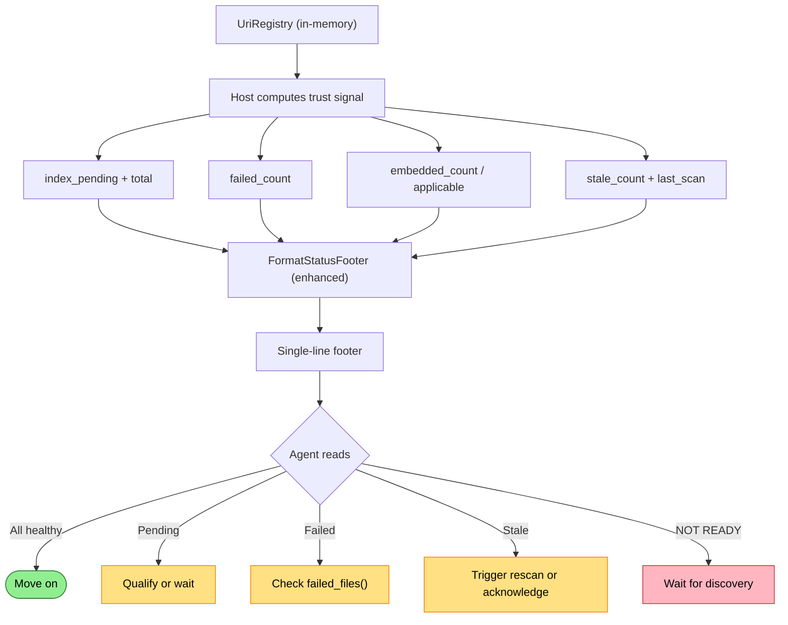

# Enhanced Footer Trust Signals Flow

How the footer evolves from a binary ready/pending indicator to a layered trust signal that reflects coverage, freshness, failures, and parse depth.

## Why This Matters

The current footer tells you two things: is indexing complete, and are embeddings ready. That's enough when everything is working. It's not enough when things are partially broken — files failing silently, index going stale, formats parsed shallowly.

| Current footer | What the agent doesn't know |
|---------------|-----------------------------|
| `index: ready` | 12 files failed parsing and were silently dropped |
| `index: ready` | Working tree changed 2 hours ago; index may not reflect reality |
| `semantic: ready` | Embeddings cover 80% of files; 20% are binary or unsupported |
| `index: 5 pending` | Is that 5 out of 50 (almost done) or 5 out of 5000 (just started)? |

The north-star declares: "Trust has layers: structural readiness, semantic readiness, format coverage, and freshness."

## Trigger

Same as current: every successful tool response appends a footer. The footer format becomes richer.

## Actors

| Actor | Role |
|-------|------|
| **UriRegistry** | Source of truth for per-file status, error counts, timestamps, stale tracking |
| **Host** | Computes trust signal from UriRegistry, attaches to gRPC response |
| **Tool handler** | Passes trust signal through to formatter |
| **RepresentationFormatter** | Formats the enhanced footer string |
| **Agent** | Reads footer, assesses trust, decides whether to investigate or qualify results |

## Trust Layers

The enhanced footer expresses four independent dimensions of trust:

| Layer | Question it answers | Data source |
|-------|-------------------|-------------|
| **Structural readiness** | Are all files indexed? | `UriRegistry`: count of non-`Indexed` URIs |
| **Semantic readiness** | Are embeddings available? | `UriRegistry`: `EmbeddingStatus` across files |
| **Failures** | Did anything go wrong silently? | `UriRegistry`: count of `Failed` URIs + files with errors |
| **Freshness** | Does the index reflect the current working tree? | `UriRegistry`: `Stale` status, last scan timestamp |

Each layer is independent. An index can be structurally ready but stale. It can have embeddings ready but have failed files. The footer should surface all four without requiring a separate query.

## Stages

### 1. Host Computes Trust Signal

**Actor**: Host
**Action**: Aggregate UriRegistry state into a compact trust signal for the response
**Output**: Enhanced status fields on the gRPC response
**Failure**: N/A — UriRegistry is always available in-memory

The data already exists in the UriRegistry. `ScopeReadiness` already computes `TotalFiles`, `IndexedCount`, `EmbeddedCount`, `PendingIndex`, `PendingEmbedding`, `FailedFiles`, and percentage calculations. `FileEntry` tracks `Status` (including `Stale` and `Failed`), `IndexedAt`, `Error`, and `EmbeddingStatus`.

What the host needs to compute per response:

| Field | Source | Cost |
|-------|--------|------|
| `index_pending` | Count of `Discovered \| Indexing \| Stale` URIs | Already computed |
| `index_failed` | Count of `Failed` URIs | Count over UriRegistry |
| `semantic_percent` | `EmbeddedCount / applicable files * 100` | Count over UriRegistry |
| `stale_count` | Count of `Stale` URIs | Count over UriRegistry |
| `parsed_percent` | Files with full parse (types/functions extracted) vs shallow | Requires format metadata |
| `last_scan_age_seconds` | Time since last file system scan completed | Timestamp comparison |

Most of these are cheap counts over the in-memory UriRegistry. `parsed_percent` is the most complex — it requires knowing which files got a deep parse vs. a shallow one, which depends on format loader capabilities.

### 2. Footer Formatting

**Actor**: RepresentationFormatter
**Action**: Format the trust signal into the most compact representation that communicates all layers
**Output**: Footer string under 20 tokens
**Failure**: N/A

The north-star declares "under 20 tokens." That's the budget. Every field must earn its place.

### 3. Agent Reads and Decides

**Actor**: Agent
**Action**: Read the footer, assess trust across all layers, decide action
**Output**: Continue, qualify, wait, or investigate
**Failure**: Agent ignores the footer (this is an agent behavior problem, not a system problem)

## Enhanced Footer Shape

The footer should remain a single bracketed line. Fields appear only when they carry information — healthy signals are compressed, degraded signals are expanded.

**Healthy — move on (same cost as today):**
```
[1.5k tok | 42ms | index: ready | semantic: ready]
```
No failed count (zero), no stale count (zero), no freshness warning. Healthy = compact.

**Partially indexed with progress:**
```
[850 tok | 120ms | index: 94% (47 pending) | semantic: 72%]
```
Percentages give context that raw counts don't. "47 pending" out of 800 files is almost done. "47 pending" out of 50 files is barely started.

**Failures present:**
```
[1.2k tok | 35ms | index: ready | semantic: ready | 3 failed]
```
The agent sees "ready" but also "3 failed." It can investigate with `SELECT * FROM failed_files()` if those files matter, or move on if they don't.

**Stale index:**
```
[1.5k tok | 42ms | index: ready | semantic: ready | stale: 12 files]
```
Index is "ready" in that all discovered files are indexed, but 12 have been modified since indexing. Results may not reflect the current working tree.

**Not ready — discovery in progress:**
```
[NOT READY — 847 pending, discovery in progress]
```
This is the one case where the footer breaks its compact format. The agent should not act on results at all.

**Multiple layers degraded:**
```
[850 tok | 120ms | index: 87% (102 pending) | semantic: 72% | 5 failed | stale: 3]
```
Everything the agent needs to assess trust in one line.

## Token Budget Analysis

The north-star says "under 20 tokens." Let's verify:

| Footer example | Approximate tokens |
|---------------|--------------------|
| `[1.5k tok \| 42ms \| index: ready \| semantic: ready]` | ~14 tokens |
| `[850 tok \| 120ms \| index: 94% (47 pending) \| semantic: 72%]` | ~18 tokens |
| `[850 tok \| 120ms \| index: 87% (102 pending) \| semantic: 72% \| 5 failed \| stale: 3]` | ~24 tokens |
| `[NOT READY — 847 pending, discovery in progress]` | ~10 tokens |

The worst case (all layers degraded) slightly exceeds 20 tokens. This is acceptable — the 20-token budget is for the common case (healthy or single-dimension degradation). When multiple things are wrong, a few extra tokens are a good trade for avoiding a separate diagnostic query.

## Decision Table

What the agent does based on footer state:

| Footer signals | Agent action |
|---------------|-------------|
| `ready` + `ready` | Trust results, move on |
| `N pending` | Wait if early in session; qualify if mid-task ("based on 94% of files indexed...") |
| `N failed` | Investigate if relevant to current query; ignore if working in unrelated area |
| `stale: N` | Re-run indexing if editing files being queried; ignore if reading only |
| `NOT READY` | Wait for discovery to complete; don't act on results |
| Multiple degraded | Assess which layers matter for current task; investigate the relevant ones |

## What Changes from Current

| Current | Enhanced |
|---------|----------|
| `index: ready` or `index: N pending` | Percentage + count: `index: 94% (47 pending)` |
| `semantic: ready/pending/disabled` | Percentage: `semantic: 72%` (when partially ready) |
| No failure signal | `N failed` when > 0 |
| No freshness signal | `stale: N` when files changed since indexing |
| No parse depth signal | Future: `parsed: 94%` when format coverage matters |
| Binary ready/pending | Layered: each dimension independent |

## Freshness: The Hardest Layer

Freshness is the most complex trust dimension. It requires knowing when files on disk changed relative to when they were indexed.

The UriRegistry already tracks `Stale` status — files marked stale when the file system watcher detects changes. The count of `Stale` entries is the freshness signal. But this depends on the file system watcher being active and accurate.

Without an active watcher, freshness degrades to "last scan time" — how long since the system last scanned the working tree. This is a weaker signal (the tree may or may not have changed) but better than nothing.

The footer should show `stale: N files` when specific files are known stale, and `last scan: Xm ago` when no watcher is active and the scan is old enough to be suspicious (threshold TBD — perhaps 30 minutes).

## Termination

Same as current: footer is appended once per tool response.

## Flow Diagram



## Verification

| Environment | How |
|-------------|-----|
| **Healthy** | Index a repo fully, verify footer shows `ready` + `ready` with no extra fields |
| **Partial indexing** | Query mid-indexing, verify percentage and pending count appear |
| **Failed files** | Introduce a malformed file, verify `N failed` appears after indexing |
| **Stale** | Modify an indexed file, verify `stale: N` appears on next query |
| **Token budget** | Verify common cases stay under 20 tokens, worst case under 25 |

## Related

- Current implementation: `docs/flows/current/mcp/footer-trust-signals.md`
- North star: `docs/north-star/diagnostics.md` (Trust section)
- Data model: `src/RepoQL.Contracts/UriRegistry/ScopeReadiness.cs` (percentages already computed)
- Data model: `src/RepoQL.Contracts/UriRegistry/FileEntry.cs` (Status, Stale, Failed, IndexedAt)
- Data model: `src/RepoQL.Contracts/UriRegistry/EmbeddingStatus.cs`
- Formatter: `src/RepoQL.Explore/RepresentationFormatter.cs` (`FormatStatusFooter`)
- Proto: `src/RepoQL.Protocol/Protos/repoql.proto` (fields to add)
