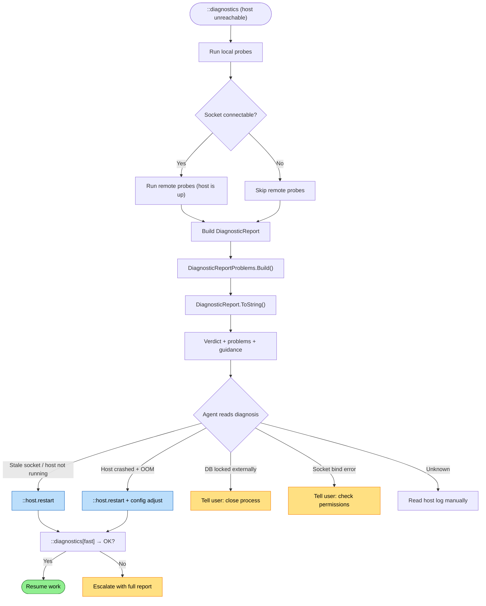

# Offline Diagnostics Flow

How the agent diagnoses problems when the host is unreachable — the diagnostic path that never depends on the thing it's diagnosing.

## Why This Matters

The most critical failures are the ones where the host is down. And the most critical diagnostic information — why the host is down and how to fix it — is the hardest to get, because the normal query path goes through the host.

If diagnostics only work when the host is reachable, the agent can diagnose everything except the failures that matter most.

| Without | With |
|---------|------|
| Host crashed → `::diagnostics` fails → agent is blind | Host crashed → `::diagnostics` runs local probes → agent sees crash reason |
| Database locked → host can't start → agent has no information | Local probe reads PID file, checks DB lock holder → agent knows who holds it |
| Socket stale → connection refused → agent sees only "connection refused" | Local probe checks socket file, PID file, process state → agent sees full picture |

The north-star declares: "An agent should be able to diagnose problems even when the host is unreachable" and "The diagnostic system can't depend on the thing it's diagnosing."

## What Exists Today

The infrastructure for offline diagnostics is already substantially built. The `DiagnosticsCollector` naturally separates into local and remote probes — when the socket isn't connectable, it skips remote probes and still returns a useful report.

### Local Probes (Always Work)

| Probe | What it reads | Source |
|-------|--------------|--------|
| **Environment** | cwd, repo root, platform, runtime, version, REPOQL_* env vars | File system, runtime |
| **Socket file** | Path, exists, connectable, path length vs platform limit, redirect mapping | File system, socket connect |
| **Socket bind report** | Whether bind succeeded, redirect path, error message | `.repoql/diagnostics/socket-bind.json` |
| **Host process** | PID (from `RepoQlClient.GetHostDiagnostics()`), running, exit code, executable, working directory, launch time | Process API, cached host state |
| **Host stderr** | Last ~50 lines of stderr from the host process | Captured in-memory by the MCP client's process wrapper |
| **Host log** | Last lines of `.repoql/host.log` | File system |
| **Database file** | Exists, size, locked, lock holder PID and process name | File system, `DatabaseLockInspector` |
| **Existing host report** | Previous shutdown attempt details | `.repoql/diagnostics/existing-host.json` |
| **DB init report** | Database initialization details | `.repoql/diagnostics/database-init.json` |
| **Services start report** | Service startup details | `.repoql/diagnostics/services-start.json` |

### Remote Probes (Require Host)

| Probe | What it queries | Why it needs the host |
|-------|----------------|---------------------|
| **Health check** | Overall + per-service health status | gRPC Health protocol |
| **RPC activity** | Active requests, hanging requests, oldest request age | Host-side request tracking |
| **Node count** | `SELECT count(*) FROM node` | DuckDB via host |
| **Indexing diagnostics** | Pipeline status, queue depth, epoch, embed mode, last error | `IndexingDiagnostics.GetText()` via host |

### How It Works Today

`DiagnosticsCollector.CollectAsync` runs all probes in sequence:

1. **Always**: environment, socket path resolution, socket file check, DB file check, host log tail, diagnostic artifacts
2. **If socket connectable**: socket connect test → gRPC health checks → per-service health → (Full mode) DB queries + indexing diagnostics
3. **Always**: host process diagnostics from `RepoQlClient.GetHostDiagnostics()` (cached locally)

When the host is unreachable, step 2 is entirely skipped. The report still contains: environment, socket state, host process state (PID, exit code, stderr), database lock state, host log tail, and all diagnostic artifacts written to `.repoql/diagnostics/`.

`DiagnosticReportProblems.Build()` then interprets this data into actionable problems:
- Socket missing → "Host not running"
- Socket exists but not connectable → "Stale socket"
- Channel in TransientFailure → "Channel stuck"
- DB locked by non-RepoQL process → "Database locked by external process"
- Hanging RPCs → "Requests hanging"
- Host not running + error in logs → "Previous host crashed"

## Trigger

`::diagnostics` runs and the host is unreachable. This happens:
- Agent runs `::diagnostics` after a tool call fails with connection error
- Agent runs `::diagnostics[fast]` as a verification step after `::host.restart`
- Tool call fails, `ErrorClassifier.IsInfrastructureError` returns true, `SelfTestRunner.RunAsync(Fast)` is called automatically and attached to the error response

## Actors

| Actor | Role |
|-------|------|
| **Agent** | Runs `::diagnostics`, reads the report, decides next action |
| **MCP Client** | Runs `DiagnosticsCollector` — all probes execute in the MCP client process |
| **File System** | Socket file, PID file, host log, DB file, diagnostic artifacts |
| **Process API** | Cached host process state (PID, exit code, stderr), lock holder detection |
| **Host** | Unreachable — contributes nothing to this flow |

## Stages

### 1. Local Probe Execution

**Actor**: MCP Client (`DiagnosticsCollector`)
**Action**: Run all local probes — file system, process state, cached host diagnostics
**Output**: Partially populated `DiagnosticReport` with all local facts
**Failure**: Individual probe failures are caught and recorded in `ProbeFailures` — they never stop other probes

The collector runs probes best-effort. If reading the host log fails (permissions, file not found), it records the failure and continues. The report is always produced.

### 2. Connectivity Test

**Actor**: MCP Client
**Action**: Attempt socket connection with 5-second timeout
**Output**: `SocketConnectable = false` — confirms the host is unreachable
**Failure**: Connection refused or timeout — this is the expected result in the offline path

This is the branch point. When `SocketConnectable = false`, all remote probes are skipped. The report is built from local data only.

### 3. Problem Identification

**Actor**: `DiagnosticReportProblems.Build()` (deterministic rules)
**Action**: Apply rules to the local facts to identify specific problems
**Output**: List of `DiagnosticProblem` records with title, facts, and guidance
**Failure**: N/A — rules are pattern-matching on data already collected

Current rules that work offline:

| Rule | Local data used | Problem identified |
|------|----------------|-------------------|
| Socket missing | `SocketExists = false` | "Host not running" |
| Socket stale | `SocketExists = true, SocketConnectable = false` | "Stale socket" |
| DB locked externally | `DbLocked = true, DbLockHolderName != "repoql"` | "Database locked by external process" |
| Host crashed | `HostRunning = false, HostLogTail contains ERROR` | "Previous host crashed" |

### 4. Report Rendering

**Actor**: `DiagnosticReport.ToString()`
**Action**: Render verdict, problems with guidance, status line, host line
**Output**: Structured text the agent can read and act on
**Failure**: N/A

Example offline report:

```
RepoQL: DOWN

problems:
- Stale socket
  socket=/repo/.repoql/repoql.sock
  connectable=false
  guidance: Remove the socket file or restart the host.

status: no connection
host: pid 12345 | v1.4.1 | exited (137)
repo: C:\Source\MyProject
```

Example with crash details:

```
RepoQL: DOWN

problems:
- Previous host crashed
  host_running=false
  host_log=error
  guidance: Inspect host log for the crash root cause.

status: no connection
host: pid 12345 | v1.4.1 | exited (139)
repo: C:\Source\MyProject

host log:
- [14:23:47] ERR OutOfMemoryException at BatchProcessor.ProcessBatch()
```

### 5. Agent Acts on Offline Diagnosis

**Actor**: Agent
**Action**: Read the offline report, execute recovery based on the diagnosis
**Output**: Recovery action (typically `::host.restart`)
**Failure**: Recovery fails — escalate with the offline report as evidence

The offline report gives the agent enough to act:
- "Stale socket" → `::host.restart` (which cleans the socket and launches fresh)
- "Previous host crashed" + OOM in logs → `::host.restart` + `::config.set[embed.batch_size, 50]`
- "Database locked by DBeaver (pid 67890)" → tell the user
- "Host not running" → `::host.restart`

## Gaps Between Current and Vision

| Gap | What's missing | Impact |
|-----|---------------|--------|
| **No socket bind error in offline report** | `SocketBindError` is populated from the bind report artifact, but the problem rules don't check it | Agent doesn't get "permission denied on socket" as a diagnosed problem |
| **No version mismatch detection offline** | Client version is known locally, but host version requires the host to be running | Can't diagnose protocol mismatch when the host won't start |
| **Stderr not always captured** | If the host was started by a different MCP client session, `GetHostDiagnostics()` returns empty | Agent loses the most valuable crash information |
| **No host log parsing** | The "previous host crashed" rule checks for ERROR lines but doesn't extract the specific error | Agent sees "inspect host log" instead of the actual crash reason |
| **No disk space check** | Full disk can prevent the host from starting (can't write socket, DB, logs) | Agent can't diagnose "disk full" from local probes |
| **No `.repoql/` directory health** | Missing `.repoql/` directory, wrong permissions, or corrupted state | Agent can't diagnose "no .repoql directory" as a setup issue |

### Proposed Enhancements

| Enhancement | What it adds | Complexity |
|-------------|-------------|------------|
| Socket bind error rule | `DiagnosticReportProblems` checks `SocketBindError` → "Socket bind failed: {error}" with guidance | Low — add one rule |
| Host log error extraction | Parse last ERROR line from host log into the problem facts, not just "host_log=error" | Low — regex on log lines |
| Disk space probe | Check free space on `.repoql/` volume | Low — `DriveInfo` or equivalent |
| `.repoql/` directory probe | Check directory exists, is writable | Low — file system check |
| Cross-session stderr | Write host stderr to a file (`.repoql/host.stderr.log`) so other sessions can read it | Medium — host process wrapper change |
| Offline version check | Write host version to a file on startup (`.repoql/host.version`) so client can read it offline | Low — one-line write on startup |

## The Bootstrapping Problem

The north-star notes: "The most critical troubleshooting knowledge — how to recover a dead host — must be accessible without a running host."

`help://` is served by the host. When the host is down, `help://` is unreachable. The troubleshooting docs that tell the agent how to fix the host can't be queried through the host.

Current mitigation: the `::diagnostics` report includes guidance strings on every problem — "Remove the socket file or restart the host." This is inline help that doesn't require `help://`.

Future mitigation options:
- **Snapshot**: Ship critical troubleshooting docs in the help snapshot (pre-computed, loaded at startup). If the snapshot is loaded before the host crashes, the docs are in DuckDB and can't be queried until restart. This doesn't solve the problem.
- **Client-side docs**: The MCP client ships with a small set of critical recovery docs (not in `help://`, directly in the client binary or as embedded resources). The `::diagnostics` command references them in guidance strings.
- **Error messages are the docs**: The current approach — every problem has inline guidance — may be sufficient. If the guidance is good enough, the agent doesn't need to look up a separate document. This is the north-star's "Signals" principle: "An agent should be able to understand what went wrong from the error message alone."

The third option is the most robust. It doesn't depend on any infrastructure being available. If every offline diagnostic problem includes actionable guidance, the bootstrapping problem is solved at the source.

## Termination

Flow completes when:
- **Diagnosis delivered**: Agent reads the offline report and has enough to act
- **Recovery initiated**: Agent runs `::host.restart` or other recovery command
- **Escalated**: Problem is environmental (permissions, disk, external lock) and requires human intervention — agent provides the offline report as evidence

## Flow Diagram



## Verification

| Environment | How |
|-------------|-----|
| **Host crashed** | Kill host process, run `::diagnostics`, verify report shows crash with stderr/log details |
| **Stale socket** | Stop host, leave socket file, run `::diagnostics`, verify "stale socket" diagnosis |
| **DB locked** | Lock DB with external tool, run `::diagnostics`, verify lock holder identified |
| **Clean (no host)** | No host ever started, run `::diagnostics`, verify "host not running" with clean guidance |
| **Automated** | Kill host, call `DiagnosticsCollector.CollectAsync`, assert `SocketConnectable = false` and problems list contains expected diagnosis |

## Related

- North star: `docs/north-star/diagnostics.md` (Investigation section — offline depth; Knowledge section — bootstrapping)
- Meta-flow: `docs/flows/future/diagnostics/self-service-troubleshooting.md` (stage 3 uses offline diagnostics when severity = Down)
- Current diagnostics flow: `docs/flows/current/mcp/failure-modes/diagnostics.md`
- Implementation — collector: `src/RepoQL.ConsoleApp/Diagnostics/DiagnosticsCollector.cs`
- Implementation — problem rules: `src/RepoQL.Protocol/Diagnostics/DiagnosticReport.cs` (`DiagnosticReportProblems`)
- Implementation — self-test runner: `src/RepoQL.ConsoleApp/Diagnostics/SelfTestRunner.cs`
- Implementation — diagnostics command: `src/RepoQL.ConsoleApp/CommandImplementations/DiagnosticsCommand.cs`
- Implementation — error classification: `src/RepoQL.ConsoleApp/Diagnostics/ErrorClassifier.cs`
