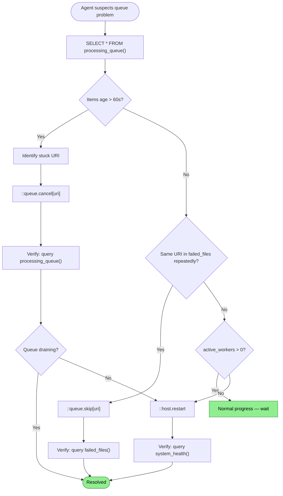

# Queue Observability Flow

How an agent sees what the indexing pipeline is doing right now — what's queued, what's in progress, what's stuck — and how it intervenes when something is blocking.

## Why This Matters

Without queue observability, the agent's only signal that something is stuck is silence. Silence looks identical to "still working." The agent can't tell whether indexing will finish in 5 seconds or has been hung on a single file for 10 minutes.

| Without | With |
|---------|------|
| "Index is pending" — but is it progressing? | `SELECT * FROM processing_queue()` shows 1 file stuck for 120s |
| Restart the entire host to unstick one file | `::queue.cancel[file:///src/generated/huge.g.cs]` — surgical |
| Bad file retried every restart, causing same crash | `::queue.skip[uri]` — permanently exclude it |
| No way to know a file failed silently | `SELECT * FROM failed_files()` — see what and why |

The north-star declares: "An agent should be able to see what the system is doing right now" and "An agent should have surgical control over individual items."

## What Exists Today

The infrastructure for observability is partially built. What's missing is the SQL surface and the queue manipulation commands.

### Built

| Component | What it provides | Limitation |
|-----------|-----------------|------------|
| `WorkQueue<T>` | `Depth` (pending count), `_busy` (active workers), metrics via OpenTelemetry gauges | No per-item visibility. Can't see which specific items are queued or how long each has been in-flight. |
| `IndexingEngineDiagnosticsProvider.GetSnapshot()` | `HotPathDepth`, `HotPathActive`, `IdlePending`, `IdleActive`, `AnalysisDepth`, `AnalysisActive`, `LastError`, `Status` | Aggregate counts only. No per-item URIs or timing. |
| `IndexingEngineDiagnosticsProvider.GetQueuedItems()` | Per-item: URI, name, stage, status, epoch, MIME type, size | No timing (when enqueued, how long in-flight). Status is "queued" or "processing" but not which specific worker has it. |
| `UriRegistryUdf._indexer_status_internal()` | Per-file: URI, status, indexed_at, error, embedding_status | Status reflects final state (`Indexed`, `Failed`), not in-flight processing state. |
| `UriRegistryUdf._indexer_pending_internal()` | Files not yet indexed | No timing, no stage information. |
| `ScopeReadiness` | Aggregated counts: total, indexed, embedded, pending, failed | No per-item detail. |

### Missing

| Capability | What it enables |
|-----------|----------------|
| `processing_queue()` SQL function | Per-item queue visibility with timing: URI, stage, age |
| `failed_files()` SQL function | Files that errored with attempt count and error message |
| `system_health()` SQL function | Single-row summary: host status, queue depth, resource usage |
| `::queue.cancel[uri]` command | Cancel a stuck item without restarting the host |
| `::queue.skip[uri]` command | Permanently exclude a toxic file from processing |
| `::queue.retry[uri]` command | Re-enqueue a failed file for another attempt |

## Trigger

Agent queries the queue when:
- Footer shows `N pending` and the count isn't decreasing
- A tool call is taking unusually long (the host may be blocked on a file)
- After a restart, to verify the pipeline is progressing
- When investigating why results seem incomplete

## Actors

| Actor | Role |
|-------|------|
| **Agent** | Queries queue state via SQL, decides whether to intervene |
| **IndexingEngine** | Owns the work queues (hot path, analysis, idle processing) |
| **WorkQueue** | Bounded channel with de-duplication, tracks depth and active workers |
| **DiagnosticsProvider** | Bridges IndexingEngine internals to queryable snapshots |
| **UDF layer** | Exposes diagnostics as SQL table-valued functions |
| **Command layer** | Exposes queue manipulation as `::` commands |

## Stages

### 1. Observation (SQL Surface)

**Actor**: Agent (via query tool)
**Action**: Query the processing queue to understand what's happening
**Output**: Table of in-flight and pending items with timing
**Failure**: Host unreachable (use `::diagnostics` offline path instead)

#### `processing_queue()`

Returns currently queued and in-flight items across all pipeline stages:

```sql
SELECT uri, stage, status, age_seconds, size_bytes, mime_type
FROM processing_queue()
ORDER BY age_seconds DESC;
```

| Column | Type | Source |
|--------|------|--------|
| `uri` | VARCHAR | `QueuedItemInfo.Uri` |
| `stage` | VARCHAR | `HotPath`, `Analysis`, `IdleProcessing` |
| `status` | VARCHAR | `queued` or `processing` |
| `age_seconds` | INTEGER | Time since enqueue (requires adding timestamp to `QueuedItemInfo`) |
| `size_bytes` | BIGINT | `QueuedItemInfo.Size` |
| `mime_type` | VARCHAR | `QueuedItemInfo.MimeType` |

Key query patterns:

```sql
-- What's stuck? (items in-flight longer than 60 seconds)
SELECT uri, stage, age_seconds
FROM processing_queue()
WHERE status = 'processing' AND age_seconds > 60;

-- What's the queue depth by stage?
SELECT stage, count(*) as items, sum(size_bytes) as total_bytes
FROM processing_queue()
GROUP BY stage;

-- Is the queue draining? (run twice, compare)
SELECT count(*) FROM processing_queue();
```

#### `failed_files()`

Returns files that failed indexing or embedding, with error details:

```sql
SELECT uri, error, status, indexed_at
FROM failed_files()
ORDER BY indexed_at DESC;
```

| Column | Type | Source |
|--------|------|--------|
| `uri` | VARCHAR | UriRegistry — files with `Status = Failed` |
| `error` | VARCHAR | `FileEntry.Error` |
| `status` | VARCHAR | `Failed` |
| `indexed_at` | TIMESTAMP | `FileEntry.IndexedAt` (when failure was recorded) |

This already has a near-equivalent in `_indexer_status_internal()` filtered by status, but a dedicated function is more discoverable and can include richer failure information.

#### `system_health()`

Single-row summary for quick health assessment:

```sql
SELECT * FROM system_health();
```

| Column | Type | Meaning |
|--------|------|---------|
| `status` | VARCHAR | `idle`, `indexing`, `analyzing`, `idle_processing` |
| `queue_depth` | INTEGER | Total items across all queues |
| `active_workers` | INTEGER | Workers currently processing |
| `failed_count` | INTEGER | Files in `Failed` state |
| `stale_count` | INTEGER | Files in `Stale` state |
| `epoch` | BIGINT | Current epoch number |
| `last_error` | VARCHAR | Most recent error message |
| `host_memory_mb` | INTEGER | Host process memory usage |

### 2. Diagnosis

**Actor**: Agent
**Action**: Interpret queue state to identify the specific problem
**Output**: Diagnosis — stuck file, toxic file, resource pressure, or normal progress
**Failure**: Agent misinterprets normal processing as stuck

Decision logic:

| Observation | Diagnosis | Action |
|-------------|-----------|--------|
| Items in `processing` with `age_seconds > 60` | Stuck file — parser hanging | Cancel the stuck item |
| Same URI appears in `failed_files()` repeatedly | Toxic file — crashes or hangs on every attempt | Skip the file |
| Queue depth high but `active_workers = 0` | Workers died or deadlocked | Restart host |
| Queue depth decreasing steadily | Normal progress | Wait |
| `last_error` shows OOM | Resource pressure | Adjust config, restart |

### 3. Intervention (Command Surface)

**Actor**: Agent (via command tool)
**Action**: Manipulate the queue to resolve the diagnosed problem
**Output**: Confirmation of the action taken
**Failure**: Command fails (item not found, host unreachable)

#### `::queue.cancel[uri]`

Remove an item from the processing queue. If currently in-flight, signal the worker to abandon it.

```
::queue.cancel[file:///src/generated/huge.g.cs]
→ Cancelled: file:///src/generated/huge.g.cs (was processing in HotPath for 97s)
```

The URI is marked `Failed` in the UriRegistry with a cancellation error. The item will not be re-enqueued automatically.

#### `::queue.skip[uri]`

Permanently exclude a file from processing across restarts. The file remains in the UriRegistry but is not enqueued.

```
::queue.skip[file:///data/binary.dat]
→ Skipped: file:///data/binary.dat (will not be processed)
```

Skip state persists across host restarts — stored in the UriRegistry or a skip list. Without persistence, the file is re-enqueued on every restart, potentially causing the same crash.

#### `::queue.retry[uri]`

Re-enqueue a failed file for another processing attempt.

```
::queue.retry[file:///vendor/broken.min.js]
→ Re-enqueued: file:///vendor/broken.min.js (previous: Failed, error: timeout)
```

Resets the file's status from `Failed` to `Discovered` in the UriRegistry, triggering re-enqueue on the next processing cycle.

### 4. Verification

**Actor**: Agent
**Action**: Confirm the intervention worked
**Output**: Queue state reflects the change
**Failure**: Item still stuck, or new problem introduced

After cancelling a stuck item:
```sql
-- Verify it's gone from the queue
SELECT * FROM processing_queue() WHERE uri = 'file:///src/generated/huge.g.cs';
-- Should return 0 rows

-- Verify the queue is draining
SELECT count(*) FROM processing_queue();
-- Should be decreasing
```

After skipping a toxic file:
```sql
-- Verify it's not in the queue
SELECT * FROM processing_queue() WHERE uri = 'file:///data/binary.dat';
-- 0 rows

-- Verify it's in failed_files with skip status
SELECT * FROM failed_files() WHERE uri = 'file:///data/binary.dat';
-- Shows skipped status
```

## Termination

The observation flow is on-demand — the agent queries when it suspects a problem. The intervention flow completes when the action is confirmed via a follow-up query.

## Flow Diagram



## What Needs Building

| Component | Work required | Builds on |
|-----------|--------------|-----------|
| `processing_queue()` UDF | New structured UDF wrapping `GetQueuedItems()` + add enqueue timestamps | `IndexingEngineDiagnosticsProvider`, `QueuedItemInfo` |
| `failed_files()` UDF | New structured UDF filtering `_indexer_status_internal` to `Failed` status | `UriRegistryUdf` |
| `system_health()` UDF | New structured UDF combining `GetSnapshot()` + UriRegistry counts + process metrics | `IndexingEngineDiagnosticsProvider`, `UriRegistry`, process info |
| `::queue.cancel` command | New command — find item in work queue, signal cancellation | `WorkQueue`, `CancellationToken` per-item |
| `::queue.skip` command | New command — mark URI as skipped in UriRegistry, persist across restarts | `UriRegistry`, persistence |
| `::queue.retry` command | New command — reset URI status to `Discovered`, trigger re-enqueue | `UriRegistry` |
| Enqueue timestamp on `QueuedItemInfo` | Add `EnqueuedAt` field so `age_seconds` can be computed | `WorkQueue`, `IndexItem` |
| Per-item cancellation in `WorkQueue` | Currently no way to cancel a single in-flight item | `WorkQueue<T>` — add `CancellationTokenSource` per item |

The observation side (SQL functions) is straightforward — the data exists, it just needs a SQL surface. The control side (commands) requires deeper changes to `WorkQueue` for per-item cancellation and to the UriRegistry for skip persistence.

## Verification

| Environment | How |
|-------------|-----|
| **Normal indexing** | Index a repo, query `processing_queue()` during indexing, verify items appear with stages and timing |
| **Stuck detection** | Introduce a file that causes the parser to hang, verify `age_seconds` increases, cancel it |
| **Failed files** | Introduce a malformed file, verify it appears in `failed_files()` after processing |
| **Skip persistence** | Skip a file, restart host, verify it's not re-enqueued |
| **Retry** | Fail a file, retry it, verify it's re-processed |

## Related

- North star: `docs/north-star/diagnostics.md` (Observability + Control sections)
- Meta-flow: `docs/flows/future/diagnostics/self-service-troubleshooting.md` (stages 3-5 use queue observability)
- Implementation — work queue: `src/RepoQL.Core/WorkQueue.cs`
- Implementation — diagnostics provider: `src/Indexing/RepoQL.Indexing/Indexing/IndexingEngineDiagnosticsProvider.cs`
- Implementation — diagnostics contract: `src/RepoQL.Contracts/Diagnostics/IIndexingDiagnosticsProvider.cs`
- Implementation — URI registry UDFs: `src/RepoQL.Data.DuckDB/UdfImplementations/UriRegistryUdf.cs`
- Implementation — indexing engine: `src/Indexing/RepoQL.Indexing/Indexing/IndexingEngine.cs`
