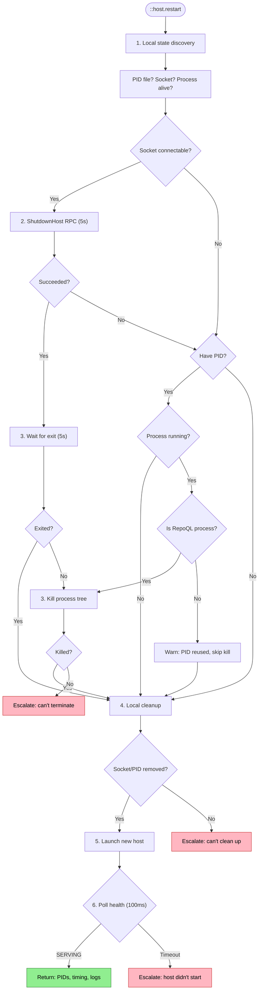

# Reliable Restart Flow

How `::host.restart` works when it's truly reliable — from any starting state, without depending on the host being reachable.

## Why This Matters

Every recovery path that includes "restart the host" depends on restart working. Today, restart has gaps: it needs the host to be reachable to get a PID, doesn't clean up stale state itself, and can't handle a host that's mid-crash or partially started. When restart fails, the agent has no fallback — the troubleshooting flow dead-ends.

| Current gap | Impact |
|------------|--------|
| Command needs host reachable for ShutdownHost RPC | Can't restart a crashed host without relying on new host startup to clean up |
| No local cleanup of socket/PID before reconnecting | Stale state from old host can block new host from binding |
| No PID when ShutdownHost fails | Can't wait-for-exit or kill an unresponsive host |
| Relies on new host's startup cleanup to handle old host | Two-host race window; new host may also fail to clean up |

The north-star declares: "Must work when: host crashed, host hanging, socket stale, host partially started, previous restart in progress. Cannot depend on the host being reachable."

## Trigger

Agent runs `::host.restart`. The command must succeed regardless of the host's current state.

## Actors

| Actor | Role |
|-------|------|
| **Agent** | Initiates restart, verifies result |
| **MCP Client** | Executes restart command — local cleanup, process termination, launch, health check |
| **Host (old)** | May or may not be reachable; may be crashed, hanging, or partially started |
| **Host (new)** | Launches into clean state, binds socket, passes health check |
| **File System** | Socket file, PID file, host lock file, log files — the local state that persists across host lifetimes |

## Stages

### 1. Local State Discovery

**Actor**: MCP Client (locally — no host dependency)
**Action**: Read socket path, PID file, and host lock file to understand the current state without contacting the host
**Output**: A `RestartContext` capturing what's known: socket exists?, PID file present?, process running?
**Failure**: File system errors reading PID/socket (rare, permissions)

This is the key change from today: **start local, not remote**. Before attempting any RPC, the command gathers everything it can from the file system:

- Socket path (from config/environment, resolved locally)
- PID file (`$repo/.repoql/host.pid`) → previous host PID
- Whether the PID process is still running (and if so, is it a RepoQL process)
- Socket file existence

This never depends on the host. Even if the host is crashed, hanging, or gone, these checks work.

### 2. Graceful Shutdown (Best Effort)

**Actor**: MCP Client → Host (old)
**Action**: If the socket is connectable, send `ShutdownHost` RPC with a short deadline (5 seconds)
**Output**: Acknowledgment + PID, or failure (host unreachable, timeout, error)
**Failure**: Expected — this step is optional. Any failure proceeds to stage 3.

```
Socket connectable?
├── Yes → ShutdownHost RPC (5s deadline)
│   ├── Success → PID confirmed, host will exit
│   └── Failure → proceed to stage 3 with PID from stage 1
└── No → skip to stage 3
```

This is a courtesy to the running host — give it a chance to shut down cleanly (flush writes, close connections, release locks). But the flow never depends on it succeeding.

### 3. Process Termination

**Actor**: MCP Client (locally)
**Action**: Ensure the old host process is dead, using the PID from stage 1 or 2
**Output**: Old host process terminated
**Failure**: Process unkillable (elevated privileges, uninterruptible state) → escalation

PID comes from (in priority order):
1. ShutdownHost RPC response (stage 2, most reliable)
2. PID file on disk (stage 1)
3. Not available — skip to stage 4 (stale socket cleanup will handle it)

```
Have PID?
├── Yes → Wait for exit (5s)
│   ├── Exited → clean
│   └── Still running → is it a RepoQL process?
│       ├── Yes → Kill process tree
│       │   ├── Kill succeeded → clean
│       │   └── Kill failed → escalate with PID and process info
│       └── No → don't kill, warn (PID was reused by another process)
└── No → proceed to stage 4 (rely on socket cleanup)
```

The "is it a RepoQL process?" check prevents killing an unrelated process if the PID was reused after the old host exited. This check already exists in `RepoQlProcessInspector`.

### 4. Local Cleanup

**Actor**: MCP Client (locally)
**Action**: Remove stale socket file, PID file, and release host lock — ensure clean slate for new host
**Output**: File system state cleared
**Failure**: Can't delete socket (permissions, file lock) → escalate with path and error

```
Clean up:
├── Socket file → delete if exists
├── PID file → delete if exists
└── Host lock → release/delete if held
```

This is the step current `::host.restart` lacks entirely. Today, the command relies on the new host's startup (`TryShutdownExistingHostAsync`) to clean stale state. But if the new host also fails to clean up (same permissions issue, same stale lock), startup fails and the agent is stuck.

By cleaning up locally before launching, the new host starts into a genuinely clean environment.

### 5. Launch New Host

**Actor**: MCP Client
**Action**: Launch a fresh host process and poll health checks until SERVING
**Output**: New host running, socket bound, health check passing
**Failure**: Binary not found, socket bind fails, database locked by external process, startup timeout

This is the same as today's launch path (`LaunchHost` → health poll every 100ms). The difference is that the preceding stages have ensured a clean slate — no stale socket to trip over, no zombie process holding the database.

If the database is locked by an *external* process (not a RepoQL host), the host should detect this during startup, report the lock holder in its stderr, and the command should surface it in the error message.

### 6. Verification and Reporting

**Actor**: MCP Client
**Action**: Confirm the new host is serving, collect startup logs, report result
**Output**: Success message with old PID, new PID, timing, method, startup logs
**Failure**: N/A — if health check passed, this is assembly

```
Host restarted in 3.2s (previous PID 43876 killed, new PID 51234).

Startup logs:
[host 14:23:01] Host starting (pid=51234 version=1.3.31)
[host 14:23:02] Phase: socket bind
[host 14:23:03] Phase: database init
[host 14:23:04] Phase: ready
```

The "method" field (stopped/killed/not-found) tells the agent what happened to the old host. Useful for pattern detection — if the agent sees "killed" three times, the host isn't shutting down gracefully.

## State Matrix

The key claim is that restart works from *any* starting state. This table maps each state to the path through the stages:

| Starting state | Stage 1 finds | Stage 2 | Stage 3 | Stage 4 | Stage 5 |
|---------------|---------------|---------|---------|---------|---------|
| **Host running, healthy** | PID file present, process running | ShutdownHost succeeds | Wait for exit (graceful) | Clean socket, PID | Launch fresh |
| **Host crashed** | PID file present, process not running | Skip (socket not connectable) | Skip (already dead) | Clean stale socket, PID | Launch fresh |
| **Host hanging** | PID file present, process running | ShutdownHost times out | Kill process tree | Clean socket, PID | Launch fresh |
| **Socket stale, no host** | No PID file, socket file exists | Skip (not connectable) | Skip (no PID) | Delete stale socket | Launch fresh |
| **Host partially started** | PID file present, process running | May or may not connect | Kill process tree | Clean socket, PID, lock | Launch fresh |
| **Previous restart in progress** | PID file present, process starting up | ShutdownHost to half-started host | Wait/kill | Clean socket, PID, lock | Launch fresh |
| **Clean (no host ever ran)** | Nothing found | Skip | Skip | Nothing to clean | Launch fresh |
| **Database locked (external)** | Normal discovery | Normal shutdown | Normal termination | Normal cleanup | Launch fails → report lock holder |

Every row terminates in either "Launch fresh" or a clear escalation with diagnostic information.

## Escalation

When restart can't complete, it provides structured evidence:

```
::host.restart failed: cannot terminate previous host.
  Previous PID: 12345 (repoql)
  Kill attempted: yes
  Still running after: 10s
  Possible cause: process in uninterruptible state or elevated privileges
  Manual intervention: taskkill /F /PID 12345 (Windows) or kill -9 12345 (Unix)
  Socket: .repoql/repoql.sock (not cleaned — process may still hold it)
```

```
::host.restart failed: cannot bind socket.
  Previous host: terminated successfully
  Socket: .repoql/repoql.sock
  Bind error: permission denied
  Possible cause: socket directory permissions, or another process bound the path
  Manual intervention: check permissions on .repoql/ directory
```

```
::host.restart failed: database locked.
  Previous host: terminated successfully
  Database: .repoql/index.duckdb
  Lock holder: PID 67890 (DBeaver.exe)
  Manual intervention: close DBeaver to release the lock
```

## Termination

Flow completes when:
- **Success**: New host SERVING, result returned with PIDs and timing
- **Escalation**: Restart failed at a specific stage, structured error returned with diagnosis and manual steps

## Flow Diagram



## What Changes from Current

| Current behavior | Reliable restart |
|-----------------|-----------------|
| ShutdownHost RPC first, fail if unreachable | Local state discovery first, RPC is optional |
| No local cleanup before launching new host | Socket, PID file, lock cleaned before launch |
| PID only from ShutdownHost response | PID from file, then confirmed/overridden by RPC |
| Relies on new host startup to clean stale state | Client cleans stale state before launching |
| Generic error on failure | Structured escalation with diagnosis per failure point |
| No state matrix — ad-hoc handling | Every starting state has a defined path |

## Verification

| Environment | How |
|-------------|-----|
| **Host running** | `::host.restart` → verify graceful shutdown path, new host serves |
| **Host crashed** | Kill host externally, then `::host.restart` → verify local cleanup path |
| **Host hanging** | Cause host to hang (e.g., deadlock), `::host.restart` → verify kill fallback |
| **Stale socket** | Delete PID file but leave socket, `::host.restart` → verify socket cleanup |
| **Clean slate** | No host ever started, `::host.restart` → verify it just launches |
| **DB locked** | Lock DB with external tool, `::host.restart` → verify escalation with lock holder |
| **Automated** | Test matrix: each starting state × verify termination condition |

## Related

- Current implementation: `docs/flows/current/mcp/host-restart.md`
- North star: `docs/north-star/diagnostics.md` (Control section — reliable restart declaration)
- Host-side startup cleanup: `docs/flows/current/host/failure-modes/existing-host.md`
- Failure mode research: `docs/research/failure-modes/host-startup-failure-modes.md`
- Meta-flow: `docs/flows/future/diagnostics/self-service-troubleshooting.md`
