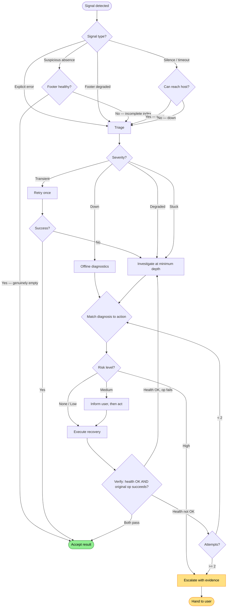

# Self-Service Troubleshooting Flow

How an agent detects, diagnoses, and recovers from RepoQL infrastructure problems — from first signal through verified resolution or escalation.

## Why This Matters

An agent using RepoQL encounters infrastructure failures regularly: hosts crash, channels go stale, databases lock, indexing hangs. Without a coherent troubleshooting path, each failure becomes a dead end that requires human intervention.

| Without | With |
|---------|------|
| Tool error → agent tells user "RepoQL isn't working" | Tool error → agent restarts host, retries, continues |
| Empty results accepted as truth | Footer shows 47% coverage → agent waits or qualifies answer |
| Silence during indexing → agent assumes it's broken | Agent checks queue, finds stuck file, cancels it, indexing continues |
| Repeated crashes → same restart loop every time | Agent recognizes pattern, adjusts config, surfaces to user |

## Trigger

Any of:
1. **Tool response contains infrastructure error** — connection refused, timeout, host exited, database locked
2. **Footer shows degraded or not-ready state** — `semantic: 72%`, `3 pending`, `1 failed`, `NOT READY`
3. **Tool response is suspiciously empty** — query returns zero rows when results were expected
4. **Operation is taking too long** — no response within expected timeframe

## Stages

### 1. Detection

**Actor**: Agent
**Action**: Recognize that something is wrong, from one of four signal types
**Output**: Classification of the signal source
**Failure**: Agent misses the signal (e.g., accepts empty results as correct)

| Signal | Where it appears | Example |
|--------|-----------------|---------|
| **Explicit error** | Tool error response | `Connection lost: host exited (code 137, OOM)` |
| **Footer degradation** | Footer on every tool response | `[ready \| semantic: 72% \| parsed: 87% \| 3 pending \| 1 failed]` |
| **Suspicious absence** | Query/explore results | `SELECT * FROM Types` returns 0 rows in a C# project |
| **Silence** | No response / timeout | Tool call hangs, no result within expected time |

The first two are unambiguous. The last two require judgment — zero rows might be correct, and silence might mean "still working." The system helps by:
- Including the footer on every response (so empty + healthy footer = genuinely empty)
- Including pending/failed counts (so empty + 847 pending = not ready yet)

### 2. Triage

**Actor**: Agent
**Action**: Classify severity to determine response urgency
**Output**: One of four severity levels
**Failure**: Agent misclassifies — treats a down host as transient, or panics over normal startup

| Severity | Signal pattern | Response |
|----------|---------------|----------|
| **Transient** | Single timeout, brief spike in pending count | Retry once, continue if it works |
| **Degraded** | Footer shows partial coverage, some failed files | Investigate — may be acceptable, may need intervention |
| **Down** | Connection refused, host exited, socket stale | Skip to recovery — investigation can happen after restart |
| **Stuck** | Silence, operation running far longer than expected | Investigate the queue — something specific is blocking |

Key distinction: **down** and **stuck** look similar from outside (both present as silence or failure), but require different responses. A down host needs restart. A stuck host needs the blocking item cancelled.

How to distinguish: if the error message says the host exited or the connection is refused, it's down. If the connection is live but operations aren't completing, it's stuck. The `::diagnostics` command (or, when available, `SELECT * FROM processing_queue() WHERE age_seconds > 60`) resolves ambiguity.

### 3. Investigation

**Actor**: Agent
**Action**: Gather diagnostic information at the minimum depth needed
**Output**: Diagnosis — what's wrong and why
**Failure**: Agent over-investigates (500 tokens for a problem the footer already explained) or under-investigates (restarts blindly when the real problem is a locked database)

Investigation follows the progressive depth model from the diagnostics north-star. The agent stops at the first level that provides a clear diagnosis:

| Depth | Cost | When to use | How |
|-------|------|-------------|-----|
| **Glance** | ~10 tok | Footer already says what's wrong | Read the footer — `3 pending`, `1 failed`, `NOT READY` |
| **Check** | ~50 tok | Need host-level picture | `SELECT * FROM system_health()` |
| **Inspect** | ~200 tok | Need to identify specific problematic files | `SELECT * FROM failed_files()` or `SELECT * FROM processing_queue() WHERE age_seconds > 60` |
| **Deep dive** | ~500 tok | Need environment, connections, logs | `::diagnostics` |
| **Offline** | ~200 tok | Host is unreachable | `::diagnostics` (runs local probes — socket, PID file, log tail, process state) |

The offline path is critical. When the host is down, `::diagnostics` runs locally on the MCP client side — checking socket files, PID files, process state, and log tails without depending on the host being reachable. This is what makes agent-driven recovery possible for the most severe failures.

### 4. Decision

**Actor**: Agent
**Action**: Match diagnosis to a recovery action, considering risk
**Output**: Chosen action (or escalation)
**Failure**: Agent chooses an action that makes things worse (e.g., restarts mid-import), or fails to act when it should

The agent uses the risk spectrum to decide how to proceed:

| Risk | Agent behavior | Actions |
|------|---------------|---------|
| **None** | Act silently | Read diagnostics, check health, read logs |
| **Low** | Act, then inform | Restart idle host, clean stale socket, retry failed files |
| **Medium** | Inform, then act | Restart busy host, adjust config, skip files, reindex |
| **High** | Escalate with evidence | Delete database, kill external processes, filesystem permissions |

The decision depends on what the host is doing *right now*. Restarting an idle host is low risk. Restarting a host mid-import that's 90% complete is medium risk — the agent should check `::diagnostics` or `processing_queue()` before deciding.

**Decision table — diagnosis to action:**

| Diagnosis | Action | Risk | Recovery flow |
|-----------|--------|------|---------------|
| Host not running | `::host.restart` | Low | `host-not-running.md` |
| Host crashed (OOM) | `::host.restart` + `::config.set[embed.batch_size, 50]` | Low | `host-crashed.md` |
| Host crashed (repeated) | Escalate — config adjustment needed | Medium | `host-crashed.md` |
| Channel stuck | Reconnect client (dispose channel, fresh connection) | Low | `channel-stuck.md` |
| Database locked (external) | Tell user which process holds the lock | High | `database-locked.md` |
| Database locked (zombie) | Kill zombie process, retry | Low | `database-locked.md` |
| File stuck in queue | `::queue.cancel[uri]` | Low | — |
| File repeatedly failing | `::queue.skip[uri]` | Low | — |
| Index incomplete (normal) | Wait — check footer for progress | None | `index-incomplete.md` |
| Stale socket | Clean socket, `::host.restart` | Low | — |
| Version mismatch | Redeploy client or rebuild host | Medium | — |
| Host unhealthy (partial) | Check degraded services, wait or restart | Medium | `host-unhealthy.md` |

### 5. Action

**Actor**: Agent (via MCP Client → Host, or locally)
**Action**: Execute the chosen recovery
**Output**: Recovery action completed (or failed)
**Failure**: Recovery action itself fails — restart hangs, command not recognized, permission denied

Recovery actions and their execution paths:

| Action | Execution path | Depends on host? |
|--------|---------------|-----------------|
| `::host.restart` | MCP Client kills host process, cleans socket, launches fresh | No — works offline |
| `::queue.cancel[uri]` | MCP Client → Host gRPC | Yes |
| `::queue.skip[uri]` | MCP Client → Host gRPC | Yes |
| `::queue.retry[uri]` | MCP Client → Host gRPC | Yes |
| `::config.set[key, value]` | MCP Client → Host gRPC | Yes |
| `::diagnostics` | MCP Client (local probes + host probes if reachable) | Partial — local probes always work |

If a recovery action fails, the agent should not retry the same action in a loop. Instead: escalate one level (e.g., if `::queue.cancel` fails because the host is unresponsive, restart the host instead).

### 6. Verification

**Actor**: Agent
**Action**: Confirm the fix worked by checking health AND retrying the original operation
**Output**: Confirmed recovery, or back to Investigation (stage 3)
**Failure**: Agent declares success based on health alone without retrying the original operation

Verification has two parts — both are required:

1. **Health check**: `::diagnostics` returns OK (or footer shows healthy state on next tool call)
2. **Original operation succeeds**: the query/explore/read that originally failed now returns results

Health returning to OK is necessary but not sufficient. "I restarted the host" is hope, not evidence. The original operation succeeding is the proof.

If verification fails:
- Health OK but original operation still fails → the problem wasn't what we thought. Back to Investigation.
- Health not OK → recovery didn't work. Try a different action, or escalate.

### 7. Continuation or Escalation

**Actor**: Agent
**Action**: Resume work, or hand off to the human with structured evidence
**Output**: Either continued work or an escalation message
**Failure**: Agent escalates too early (wastes user attention) or too late (burns tokens on unrecoverable problems)

**Continuation**: Agent resumes work, mentioning the fix briefly:
> "The host had crashed (OOM). I restarted it with a reduced batch size and re-ran the query. Here are your results: ..."

**Escalation triggers**:
- Same failure after two recovery attempts
- Recovery action requires high-risk action (killing external processes, deleting database)
- Problem is environmental (filesystem permissions, missing runtime, port conflicts)
- Circuit breaker has opened (3 failures in 5 minutes — the system is fundamentally unhealthy)

**Escalation format** — structured, not a stack trace:
```
RepoQL host won't start after two restart attempts.
  Environment: Windows 11, dotnet 9.0.1, RepoQL v1.4.1
  Diagnostics: SocketBindError='permission denied' on /tmp/repoql-abc123
  Tried: ::host.restart (twice), cleaned stale socket, checked port conflicts (none)
  Recommendation: check filesystem permissions on the socket directory.
  Logs: .repoql/host.log
  Note: structural queries are unavailable, but I can still read files directly.
```

**Pattern detection**: If the agent has restarted the host three times in one session, that's not three independent problems — it's a systemic issue. The agent should surface the pattern to the user even if each individual restart succeeded.

## Termination

Flow completes when any of:
- **Recovery verified**: original operation succeeds after fix
- **Escalated**: problem handed to user with structured evidence
- **Transient resolved**: single retry succeeded, no further action needed
- **Accepted degradation**: agent qualifies results and continues (e.g., "semantic search unavailable, using structural queries only")

## Flow Diagram



## Cross-Cutting Concerns

### Silence vs. Stuck

The hardest diagnostic problem. Silence during indexing is normal (the system is working). Silence during a query is not. The footer resolves this — `847 pending, discovery in progress` means "working." No footer at all means "no response."

When the agent suspects stuck-ness:
1. Check the footer for pending count and trend (is it decreasing?)
2. If available, `SELECT * FROM processing_queue() WHERE age_seconds > 60`
3. Items running longer than 60 seconds are likely stuck — cancel them

### Offline-to-Online Transition

The agent starts diagnosing locally (socket check, PID file, log tail) and then restarts the host. Once the host comes up, the diagnostic path switches from local to remote. The agent should:
1. Run `::diagnostics` locally while the host is down
2. Execute `::host.restart`
3. Wait for the health check (the host announces readiness via gRPC health protocol)
4. Switch to remote diagnostics — `::diagnostics` now includes host-side probes

### Verification is the Original Operation

This bears repeating because it's the most common mistake. After recovery:
- **Wrong**: "I restarted the host. `::diagnostics` says OK. Moving on."
- **Right**: "I restarted the host. `::diagnostics` says OK. I re-ran `SELECT * FROM Types` and got 347 results. Here's what I found: ..."

### Repeated Failures = Systemic Issue

A single OOM crash → restart silently.
Two OOM crashes → restart + adjust config, inform user.
Three OOM crashes → escalate. The repo may be too large for the current resource allocation, or a specific file is toxic.

Track recovery actions within the session. The pattern matters more than any individual failure.

## Relationship to Individual Failure-Mode Flows

This meta-flow is the decision tree. The individual flows in `docs/flows/current/mcp/failure-modes/` are the detailed procedures. When this flow reaches stage 4 (Decision), the "recovery flow" column in the decision table points to the specific procedure.

| Individual flow | This meta-flow's relationship |
|----------------|-------------------------------|
| `host-not-running.md` | What to do when diagnosis = "host not running" |
| `host-crashed.md` | What to do when diagnosis = "host crashed" |
| `channel-stuck.md` | What to do when diagnosis = "channel stuck" |
| `database-locked.md` | What to do when diagnosis = "database locked" |
| `host-unhealthy.md` | What to do when diagnosis = "host unhealthy" |
| `index-incomplete.md` | What to do when diagnosis = "index not ready" |
| `lease-expired.md` | What to do when diagnosis = "lease expired" |
| `wsl-socket-path.md` | What to do when diagnosis = "socket path issue" |
| `wrong-working-directory.md` | What to do when diagnosis = "wrong cwd" |
| `diagnostics.md` | How diagnostic data is collected (used by stages 3-6) |

## Verification

| Environment | How |
|-------------|-----|
| **Agent session** | Encounter a real failure, follow the flow, verify the original operation succeeds |
| **Simulated** | Kill the host process, run a query, observe the flow through detection → recovery → verification |
| **Automated** | Integration test: start host, lock database externally, run query tool, assert diagnostic attachment + recovery suggestion in error |

## Related

- North star: `docs/north-star/diagnostics.md`
- North star: `docs/north-star/reliability.md`
- Failure mode research: `docs/research/repoql/client-server-failure-modes.md`
- Implementation — error classification: `src/RepoQL.ConsoleApp/Diagnostics/ErrorClassifier.cs`
- Implementation — diagnostic collection: `src/RepoQL.ConsoleApp/Diagnostics/DiagnosticsCollector.cs`
- Implementation — diagnostic report: `src/RepoQL.Protocol/Diagnostics/DiagnosticReport.cs`
- Implementation — resilient client: `src/RepoQL.Protocol/RepoQlClient.Resilient.cs`
- Implementation — circuit breaker: `src/RepoQL.Protocol/ConnectionCircuitBreaker.cs`
