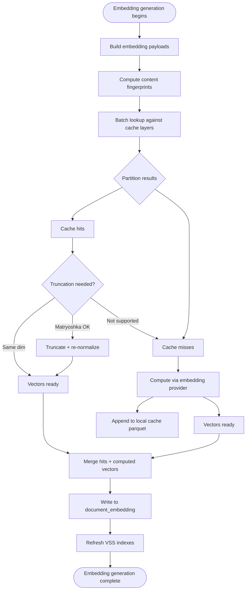

# Embedding Cache Flow

How embedding generation uses a content-addressed parquet cache to avoid recomputing vectors for content that's already been embedded — on this machine, by this team, or across the community.

## Why This Matters

| Without cache | With cache |
|---------------|------------|
| Every repo independently embeds the same imported library | Embed once, hit cache in every repo |
| Re-indexing unchanged files recomputes embeddings | Content unchanged → hash unchanged → cache hit |
| New team member waits for full embedding pass | Points at shared cache → instant semantic search |
| Model upgrade requires full recompute everywhere | Natural cache miss → recompute → populate cache for everyone |

## Trigger

Embedding generation phase begins — after pruning completes in `ReleaseAnalysisAsync(epoch)`. Same trigger as today's embedding generation flow; the cache intercepts before the provider is called.

---

## Stages

### 1. Payload Construction

**Actor**: EmbeddingCoordinator
**Action**: Build embedding text payloads from artifact metadata (unchanged from current flow)
**Output**: List of `(docId, nodeId, uri, text)` tuples ready for embedding
**Failure**: Empty payload → skip item (unchanged)

The embedding text is the same string that would be sent to the provider: `{relativePath}\n\n{headline}\n\n{structure}` for structure embeddings, chunked content with preamble for full-text.

### 2. Content Fingerprinting

**Actor**: CachingEmbeddingProvider
**Action**: Compute `SHA256(model + "\0" + type + "\0" + text)` for each payload
**Output**: Content hash per payload — the cache lookup key
**Failure**: N/A (pure computation)

The hash includes:
- **Model identifier** — same content with different models produces different vectors
- **Embedding type** — `"p"` for passage, `"q"` for query (asymmetric encoding produces different vectors for the same text)
- **Embedding text** — the raw text before any provider-specific prefix

Null bytes between components prevent collisions (e.g., model `"ab"` + text `"cd"` vs model `"a"` + text `"bcd"`).

The hash does NOT include:
- File path or URI (same content at different paths = same embedding)
- Timestamp (content identity, not temporal identity)
- Dimension (stored at full dim, truncated on read)

### 3. Batch Cache Lookup

**Actor**: CachingEmbeddingProvider → EmbeddingCacheReader
**Action**: Query cache layers in priority order for all hashes in the batch
**Output**: Partition into cache hits and cache misses
**Failure**: Cache layer unreachable → treat entire layer as miss, continue to next

```
For each batch of N texts:
  Read local cache:    parquet files in ~/.repoql/embedding-cache/
  Read shared caches:  configured paths, in order

  Hits:  cached vectors (truncate to operational dim if needed)
  Misses: texts that need provider computation
```

DuckDB reads parquet natively. The lookup is a single query joining the batch hashes against the cache files:

The lookup reads each parquet file independently to isolate corruption — a single bad file cannot fail the entire read:

```sql
-- Per-file reads with error isolation; model filter is a safety check
-- (model is already encoded in the hash, but filtering reduces scan volume)
SELECT c.text_hash, c.embedding, c.max_dim
FROM read_parquet('~/.repoql/embedding-cache/file1.parquet') c
WHERE c.text_hash IN (?, ?, ...)
UNION ALL
SELECT ...  -- repeat for each file, skip on error
```

For shared caches, the same pattern runs against each configured path in priority order. First hit wins — a hash found in local cache is never looked up in shared. Hits from shared paths are written through to local cache so subsequent lookups are fast.

### 4. Dimensional Truncation

**Actor**: CachingEmbeddingProvider
**Action**: For cache hits where `max_dim > operational_dim`, truncate and re-normalize
**Output**: Vectors at the operational dimensionality
**Failure**: Non-matryoshka model + truncation requested → skip cache hit, recompute

```
Stored:  768-dim vector (full model output)
Needed:  384-dim

Take first 384 floats → L2-normalize → valid 384-dim embedding
```

The provider knows whether its model supports matryoshka truncation. If not, a cached vector at a different dimension than requested is treated as a miss.

### 5. Provider Computation (Misses Only)

**Actor**: OnnxEmbeddingProvider (or configured provider)
**Action**: Compute embeddings for cache misses only
**Output**: New vectors at full model dimensionality
**Failure**: Provider failure → log, continue (unchanged from current flow)

Batch size remains 100. Only misses are sent to the provider, so a warm cache reduces batches dramatically.

### 6. Cache Write-Back

**Actor**: CachingEmbeddingProvider → EmbeddingCacheWriter
**Action**: Append newly computed embeddings to local cache
**Output**: New parquet file in `~/.repoql/embedding-cache/`
**Failure**: Write failure → log warning, continue (cache is acceleration, not correctness)

Each write creates a new parquet file with a collision-safe name (e.g., `20260301-143022-{pid}-{seq}.parquet`). Writes use atomic temp-file-then-rename to ensure readers never see partial files.

Schema per row:

| Column | Type | Purpose |
|--------|------|---------|
| `text_hash` | `BLOB` (32 bytes) | SHA256(model + "\0" + type + "\0" + text) — lookup key |
| `model` | `VARCHAR` | Model identifier for human inspection |
| `max_dim` | `INT16` | Dimensionality of stored vector |
| `embedding` | `FLOAT[]` | Full-dimensional vector |
| `created_at` | `TIMESTAMP` | For eviction (oldest entries dropped first during compaction) |

Null embeddings (provider returned `null` for a text) are not cached — a null result means "try again later," not "this text has no embedding."

Vectors are stored at the model's maximum dimensionality, regardless of the operational dimension. This is what makes a single cache entry usable by consumers at any dimension.

### 7. Database Commit

**Actor**: DuckDbDataStore
**Action**: Write `DocumentEmbedding` records (unchanged from current flow)
**Output**: `document_embedding` table populated
**Failure**: Write error propagates (unchanged)

Both cache hits and newly computed vectors are written to the repo's DuckDB as before. The cache doesn't replace per-repo storage — it prevents recomputation.

### 8. VSS Index Refresh

**Actor**: EmbeddingCoordinator
**Action**: Refresh content embeddings (unchanged from current flow)
**Output**: In-memory vector indexes ready for search
**Failure**: Warning logged, continues (unchanged)

---

## Termination

Flow completes when:
- All embedding texts have vectors (from cache or provider)
- New vectors written to local cache
- All vectors written to `document_embedding`
- VSS indexes rebuilt

## Flow Diagram



---

## Layered Resolution

Cache sources are checked in priority order. The configuration determines the layers:

```json
{
  "embeddingCache": {
    "paths": [
      "~/.repoql/embedding-cache/",
      "//fileserver/repoql/shared-embeddings/"
    ]
  }
}
```

| Layer | Read | Write | Typical use |
|-------|------|-------|-------------|
| Local (`~/.repoql/embedding-cache/`) | Always, first | Yes | Per-developer, cross-repo |
| Shared (network path, S3) | If configured | No | Team-wide, read-only for clients |
| Cloud (HTTP endpoint) | Future | No | Community, public repos |

First hit wins. A hash found locally is never looked up in shared. Write-back always goes to local only — shared layers are populated externally (admin pushes local cache, CI job, or dedicated tooling).

---

## Error Handling

| Error | Behaviour |
|-------|-----------|
| Local cache directory missing | Create on first write; reads return empty |
| Shared cache path unreachable | Log debug, skip layer, continue to next |
| Parquet file corrupted | DuckDB read fails for that file → skip it, query remaining files individually. Atomic writes (temp-file-then-rename) prevent most corruption. |
| Hash collision (SHA256) | Astronomically unlikely (2^-128). If it happens: wrong vector used, slightly degraded search quality, self-correcting on next reindex |
| Write-back fails (disk full, permissions) | Log warning, continue — cache is acceleration, never correctness |
| Model mismatch in cache | Model is part of the hash key — mismatches are misses, not errors |

---

## Verification

| Environment | How |
|-------------|-----|
| **Local** | Embed a file. Delete from `document_embedding`. Re-embed. Verify cache hit in logs (no provider call). Verify vector matches. |
| **Automated tests** | Seed cache with known vectors. Run embedding pipeline. Assert provider was not called for cached texts. Assert truncation produces correct vectors. Assert cache miss triggers provider + write-back. |
| **Production** | Cache hit rate metric per batch. Total embeddings served from cache vs computed. Cache size on disk. Time saved (compute time for hits at zero). |

---

## Cache Maintenance

Maintenance is a separate concern from the embedding pipeline, triggered independently.

### Compaction

**Trigger**: Host startup, or when file count in cache directory exceeds threshold (e.g., 100 files)
**Actor**: EmbeddingCacheManager
**Action**: Read all parquet files → deduplicate by `text_hash` (keep newest) → write single compacted file → delete originals
**Concurrency**: Lockfile (`~/.repoql/embedding-cache/.compaction.lock`). If locked, skip — another host is compacting.

### Eviction

**Trigger**: During compaction, when total cache size exceeds configured limit
**Actor**: EmbeddingCacheManager
**Action**: Sort by `created_at` ascending → drop oldest entries until under limit
**Default limit**: 500 MB (configurable)

### Model Migration

**Trigger**: None — happens naturally
**Action**: None — old model entries are never looked up (model is in the hash key). They persist until evicted by age.

No explicit purge needed. A model upgrade means all new hashes include the new model ID. Old entries with the old model ID simply never match and are eventually evicted as the oldest entries during compaction.

---

## What This Changes

| Existing component | Change |
|--------------------|--------|
| `IEmbeddingProvider` | No change — cache wraps it as a decorator |
| `EmbeddingCoordinator` | No change — receives embeddings as before |
| `DuckDbDataStore` | No change — writes `DocumentEmbedding` as before |
| `EmbeddingRefresher` | Staleness check unchanged — cache is upstream of DB |
| Configuration | New `embeddingCache` section with `paths` and `maxSizeMb` |

The cache is a `CachingEmbeddingProvider` that implements `IEmbeddingProvider` and wraps the real provider. Everything downstream is unaware of the cache. This is the only integration point.

---

## Related

- `embedding-generation.md` — current embedding flow (this extends it)
- `docs/north-star/embedding-cache.md` — what great looks like
- `docs/designs/future/embedding-cache.md` — component design, contracts, trade-offs
- `docs/plans/future/embedding-cache/` — buildable increments
