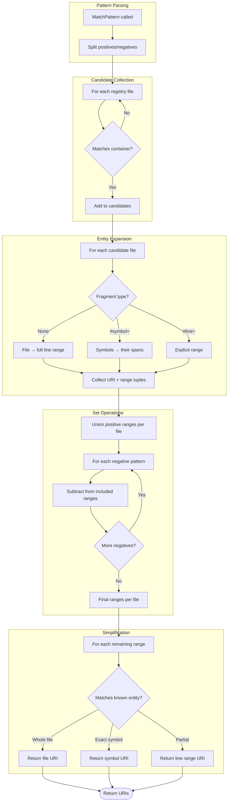

# Pattern Matching Flow

Resolves a glob pattern against the URI registry, returning matching URIs with line-range precision.

## Why This Matters

| Without line-range matching | With line-range matching |
|-----------------------------|--------------------------|
| Can only match whole files or symbols | Match any region: file, symbol, or arbitrary lines |
| Exclusions drop entire symbols | Exclusions can carve out regions, returning partial symbols |
| `#symbol=*;!#line=1,30` impossible | Skip headers, license blocks, generated regions |
| Results are coarse | Results are precise to the line |

## Trigger

`UriRegistry.MatchPattern(pattern, ignoreCase)` called with a pattern specification.

## Stages

### 1. Pattern Parsing

**Actor**: UriPatternMatcher
**Action**: Split pattern into positive and negative patterns
**Output**: `(positives[], negatives[])`
**Failure**: N/A (empty pattern matches all files)

```
Input:  "src/**/*.cs#symbol=*;!#line=1,30"
Output: positives = ["src/**/*.cs#symbol=*"]
        negatives = ["#line=1,30"]
```

### 2. Candidate Collection

**Actor**: UriRegistryExtensions
**Action**: For each file in registry, check if file path matches any positive pattern's container portion
**Output**: Set of candidate files to examine
**Failure**: N/A (no matches → empty result)

```
Pattern: "src/**/*.cs#symbol=*"
Container: "src/**/*.cs"

Registry files:
  file:///src/Auth.cs         ✓ matches
  file:///src/Data/User.cs    ✓ matches
  file:///tests/AuthTests.cs  ✗ no match
```

### 3. Entity Expansion

**Actor**: UriRegistryExtensions
**Action**: For each candidate file, expand to entities based on pattern fragment
**Output**: List of (URI, line range) tuples

| Fragment | Expansion |
|----------|-----------|
| None | File → (file URI, line 1 to EOF) |
| `#symbol=*` | All symbols → (symbol URI, symbol span) |
| `#symbol=Foo*` | Matching symbols → (symbol URI, symbol span) |
| `#line=N,M` | Explicit range → (file URI, line N to M) |

```
File: file:///src/Auth.cs (200 lines)
Symbols:
  AuthService     lines 10-80
  AuthService.Login  lines 25-45
  AuthService.Logout lines 50-70
  IAuthService    lines 85-95

Pattern: #symbol=*
Expanded:
  (file:///src/Auth.cs#symbol=AuthService, 10-80)
  (file:///src/Auth.cs#symbol=AuthService.Login, 25-45)
  (file:///src/Auth.cs#symbol=AuthService.Logout, 50-70)
  (file:///src/Auth.cs#symbol=IAuthService, 85-95)
```

### 4. Positive Union

**Actor**: LineRangeCalculator
**Action**: Union all line ranges from positive pattern matches, grouped by file
**Output**: Per-file list of included line ranges

```
Positives: ["src/**/*.cs#symbol=*"]

Auth.cs included ranges:
  [10-80], [25-45], [50-70], [85-95]

After union (overlapping ranges merged):
  [10-80], [85-95]
```

### 5. Negative Subtraction

**Actor**: LineRangeCalculator
**Action**: Subtract each negative pattern's ranges from the included set
**Output**: Per-file list of remaining line ranges

```
Negative: "!#line=1,30"

Auth.cs before: [10-80], [85-95]
Subtract [1-30]:
  [10-80] - [1-30] = [31-80]
  [85-95] - [1-30] = [85-95] (no overlap)

Auth.cs after: [31-80], [85-95]
```

### 6. Simplification

**Actor**: UriSimplifier
**Action**: Convert line ranges back to canonical URI form
**Output**: Final list of URIs

| Condition | Result |
|-----------|--------|
| Range = entire file | `file:///path` (drop fragment) |
| Range = exact symbol span | `file:///path#symbol=Name` |
| Range = partial | `file:///path#line=N,M` |

```
Auth.cs ranges: [31-80], [85-95]

Check against known entities:
  [31-80]: Partial of AuthService (10-80) → file:///src/Auth.cs#line=31,80
  [85-95]: Exact match IAuthService → file:///src/Auth.cs#symbol=IAuthService

Final output:
  file:///src/Auth.cs#line=31,80
  file:///src/Auth.cs#symbol=IAuthService
```

## Termination

Flow completes when:
- All positive patterns processed
- All negative patterns subtracted
- Results simplified to canonical URIs

Returns `IEnumerable<RepoUri>` of matching URIs.

## Flow Diagram



## Examples

### Skip file headers

```
Pattern: src/**/*.cs#symbol=*;!#line=1,30
Result:  All symbols except those starting in first 30 lines
```

### Partial method extraction

```
Pattern: src/Auth.cs#symbol=AuthService.Login;!#line=35,40

AuthService.Login spans lines 25-45.
Subtract lines 35-40.

Result:
  file:///src/Auth.cs#line=25,34
  file:///src/Auth.cs#line=41,45
```

### All handlers except generated

```
Pattern: src/**/*.cs#symbol=*Handler;!**/Generated/**

Result: Handler symbols in non-generated files
```

## Data Requirements

### SymbolEntry in Registry

```csharp
record SymbolEntry(string Kind, int StartLine, int EndLine);

// FileEntry.Symbols becomes:
IReadOnlyDictionary<RepoUri, SymbolEntry> Symbols
```

### File Line Count

Registry needs to know total lines per file for "whole file" range:

```csharp
record FileEntry(
    // ... existing fields ...
    int LineCount,
    IReadOnlyDictionary<RepoUri, SymbolEntry> Symbols);
```

## Error Handling

| Error | Behaviour |
|-------|-----------|
| Invalid pattern syntax | Throw `ArgumentException` |
| File not in registry | Skip (no candidates) |
| Symbol has no span | Skip symbol, log warning |
| Empty result | Return empty enumerable |

## Key Invariants

| Invariant | Consequence of Violation |
|-----------|--------------------------|
| Spans are [start, end] inclusive | Off-by-one in range math |
| Negatives apply globally | Exclusion might miss some positives |
| Simplification checks exact matches only | Similar-but-not-exact ranges stay as line ranges |
| Registry symbols have spans | Expansion fails without span info |

## Related

- [Globbing North Star](../../../north-star/globbing.md) - Declarations this flow enables
- [UriRegistry](../../../../src/RepoQL.Contracts/UriRegistry/UriRegistry.cs) - Source of truth for files and symbols
- [UriPatternMatcher](../../../../src/RepoQL.Contracts/UriPatternMatcher.cs) - Pattern parsing logic
