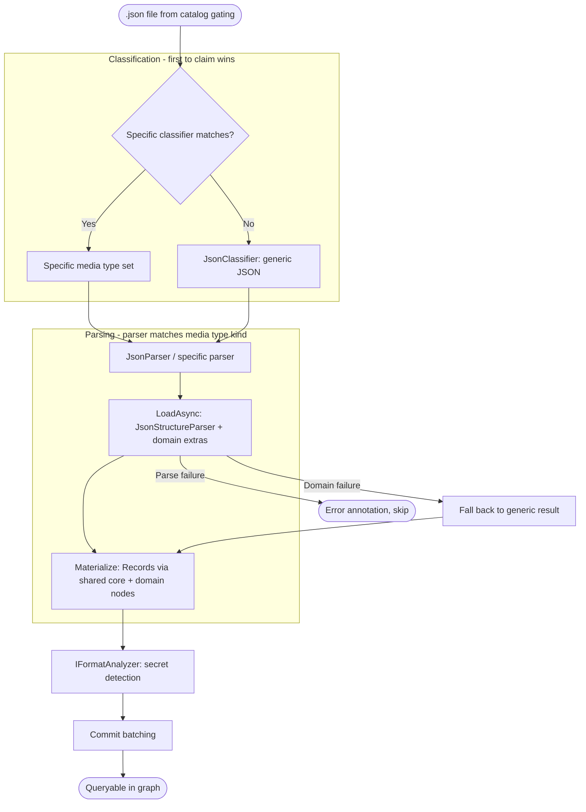

# JSON Indexing Flow

How a `.json` file will enter the pipeline, get classified by kind, parsed into graph structure, analyzed for diagnostics, and become queryable. Describes new components that fit into the existing indexing architecture.

## What Exists Today

`AppSettingsLoader` handles `appsettings*.json` and `launchSettings.json` via a `FormatDescriptor`. All other `.json` files fall through to `PlainTextParser` and get no structural indexing.

The modern pipeline pattern (used by CSV, XLSX, PDF, DOCX) registers separate `Classifier` and `Parser` pipeline processors via `AddIndexingProcessor<T>()`. This flow describes extending JSON support using this modern pattern — `JsonClassifier` + `JsonParser` + `JsonLoader` — following the same architecture as `CsvClassifier` + `CsvParser` + `CsvLoader`.

## Why This Matters

| Without | With |
|---------|------|
| Most JSON files treated as plain text | Key structure, shape, pointer addresses queryable for every JSON file |
| Only `appsettings.json` gets real headlines | Config, schema, API spec, data, manifest all distinguished |
| No cross-file JSON references | `$ref` and `$schema` traversable as graph edges |
| Secrets hidden in config | Annotations flag potential credentials |

## Trigger

A `.json`, `.jsonc`, `.json5`, `.jsonl`, or `.ndjson` file enters the hot path after passing catalog gating.

## Stages

### 1. Classification

**Actor**: Classification pipeline — processors checked in registration order, first to return non-null wins
**Action**: Classifiers check if they recognise the file. First to claim it sets the media type. Others never run.
**Output**: `SemanticMediaType` set on the `IndexItem`
**Failure**: No classifier claims it → `ProvisionalMediaType` fallback (from file extension)

The pipeline is middleware-style: processors run in registration order. Each processor either returns a media type directly (claiming the file) or calls `next()` to let subsequent processors try. First to claim wins.

For JSON, specific classifiers are registered BEFORE the generic `JsonClassifier`. They check for domain markers (filename patterns, content sniffing) and return early on match. If none match, they call `next()` and `JsonClassifier` claims the file by extension.

| Classifier | Registration order | Claims when | Sets kind to |
|------------|-------------------|-------------|-------------|
| Future: OpenAPI classifier | Before generic | Content contains `openapi` or `swagger` top-level key | `api.openapi` |
| Future: JSON Schema classifier | Before generic | Content contains `$schema` pointing to json-schema.org | `schema.json-schema` |
| **JsonClassifier** (generic) | After specific | File extension is `.json`/`.jsonc`/`.json5`/`.jsonl`/`.ndjson` | bare `application/json` |

Content sniffing classifiers (OpenAPI, JSON Schema) read the file's first few KB. They store the sniff result in item metadata so the parser can reuse it without re-reading.

### 2. Parsing

**Actor**: `JsonParser` pipeline processor (or a specific parser, e.g., `OpenApiParser`)
**Action**: Parser checks media type kind, delegates to its loader for `LoadAsync()` + `Materialize()`
**Output**: `Records` (artifacts, nodes, edges, spans)
**Failure**: Parse exception → `PipelineResult.Error`, file skipped with diagnostic

The parsing pipeline also runs in registration order. `JsonParser` checks the media type kind set during classification. If it matches a JSON kind, it delegates to `JsonLoader`:

Loading follows the same `LoadAsync()` pattern as `CsvLoader`:

1. Read file content via `FileContentReader.ReadAllTextWithDigestAsync()`
2. Parse JSON (full parse for small files, sampled parse for data files)
3. Build state (key tree, shape, domain-specific extractions)
4. Store state in `DocumentModel.Metadata` for the materializer

Core JSON parsing — key tree construction, shape detection, value type inference, JSON Pointer address generation — lives in `JsonStructureParser`, a standalone parser that produces a complete, useful result on its own. All JSON handlers use it. Specific handlers call it first, then layer domain-specific extraction on top.

**Generic handler**: Uses the shared base directly. Key tree, shape, pointer addresses — nothing more.

**Specific handlers**: Compose with `JsonStructureParser`. `AppSettingsLoader` calls the parser, then extracts config sections, connection strings, detected services. A future OpenAPI handler calls the parser, then extracts paths, methods, schemas.

This means specific handlers automatically produce everything the generic handler would — there is no "superset contract" to violate because the parsing is shared, not reimplemented.

**JSONC/JSON5 handling**: Comments and relaxed syntax are stripped during parsing. The `DocumentModel.Text` stores the original text (with comments). The parsed state reflects logical JSON content. Spans reference original line numbers.

### 3. Materialization

**Actor**: `IFormatMaterializer.Materialize()` (implemented by the same loader, or a separate materializer)
**Action**: Transform `DocumentModel` into `Records` (artifacts, nodes, edges, spans)
**Output**: `Records` with x-ray metadata, graph nodes, and relationships
**Failure**: Materialization exception → `PipelineResult.Error`

**Artifact x-ray metadata** (produced by Liquid templates, same pattern as CSV):
- **Headline**: filename, kind, size, token count, shape/key summary
- **Structure**: key tree with JSON Pointer addresses, value types, subtree token estimates
- **Summary**: kind, shape, key count, nesting depth

**Graph records** (following the CSV pattern of node-per-significant-element):
- One `document` node with shape properties
- Nodes for significant structural elements — not every key. Top-level keys, named definitions, endpoints, config sections
- Spans mapping nodes to source line ranges
- `HAS_PART` edges from document to child nodes
- `REFERS_TO` edges for `$ref` pointers (specific handlers only)

`JsonStructureParser` produces the key tree that materializers turn into generic nodes (document, keys). Specific handlers add domain-specific nodes and edges on top. Both use the same Liquid template rendering pattern as CSV.

**SQL surface** via `GetSchemaScripts()`:
- Generic loader provides: `json_files()` inventory macro, `json_keys` view over key nodes
- Specific loaders provide: domain views (e.g., `api_endpoints`, `schema_definitions`)

### 4. Analysis

**Actor**: `IFormatAnalyzer` registered in the JSON `FormatDescriptor`
**Action**: Examine `DocumentModel`, produce annotations
**Output**: Annotations added to item
**Failure**: Analyzer exception logged, item continues

| Analyzer | Scope | Produces |
|----------|-------|----------|
| Secret detector | Single-file | Annotations on values matching secret patterns (API keys, connection strings, tokens) |
| `$ref` validator | Multi-file (idle phase) | Annotations on `$ref` values pointing to nonexistent targets |

Secret detection runs in single-file analysis (the `IFormatAnalyzer` on the `FormatDescriptor`). It applies to all JSON files regardless of kind.

`$ref` validation requires cross-file resolution and belongs in the multi-file analysis idle phase, not single-file analysis.

### 5. Commit

**Actor**: Commit batching pipeline
**Action**: Persist artifact, nodes, spans, edges, annotations to DuckDB
**Output**: File is queryable
**Failure**: Standard commit-batching retry behavior

No JSON-specific behavior. Schema scripts from `GetSchemaScripts()` are installed separately during database initialization, not per-commit.

## Termination

Flow completes when:
- Records and annotations persisted to DuckDB
- Artifact x-ray metadata available for explore and read
- JSON Pointer fragment addresses navigable via read tool
- File appears in `json_files()` macro and `json_keys` view

## Flow Diagram

## Cross-Cutting Concerns

### Specific Handler Fallback

If a specific handler's domain extraction fails, it catches the error and falls back to returning only the `JsonStructureParser` result (key tree, shape, generic headline). The specific handler degrades gracefully to generic output rather than failing entirely.

### Generic View Consistency

Because specific handlers use `JsonStructureParser` for core parsing, they automatically produce the same key nodes the generic `json_keys` view queries. The consistency guarantee is structural — shared code, not a contract to remember.

### Large File Handling

JSON data files (arrays of records) may be very large. The loader must handle them without memory pressure:
- Sample the first N records for shape detection, don't parse the entire file
- Produce a document node with shape metadata, not a node per record
- Query-time access via `json_data()` macro (DuckDB's native JSON reader) handles the rest

### JSONC/JSON5 Normalization

Comment bytes are replaced with spaces during `LoadAsync()`, preserving byte length and newline positions. The artifact stores the original text. The parsed structure reflects logical JSON content. This means:
- `read("file:///tsconfig.json")` returns original text with comments
- `read("file:///tsconfig.json#/compilerOptions")` returns logical subtree without comments
- Line numbers in spans refer to the original file (no offset translation needed — newlines haven't moved)

## Error Handling

| Error | Behaviour |
|-------|-----------|
| Malformed JSON | Log diagnostic, produce artifact with error annotation, no structure nodes |
| Specific loader `LoadAsync()` throws | `PipelineResult.Error`, file fails (see Specific Loader Fallback) |
| Invalid `$ref` target | Annotation at multi-file analysis phase, not a parse failure |
| File too large for full parse | Sample first N records, shape metadata only |
| JSONC with unterminated comment | Strip what's valid, parse remainder, annotate the error |
| Encoding issues (BOM, non-UTF-8) | `FileContentReader` handles encoding detection upstream |

## Verification

| Environment | How |
|-------------|-----|
| **Unit tests** | Feed sample JSON through loader, assert Records contain expected nodes, edges, spans, headlines |
| **Integration tests** | Index directory with mixed JSON kinds, query `json_files()`, `json_keys`, verify headlines |
| **Manual** | `explore(intent="Inventory", uriGlob="file:///**/*.json")` — verify headlines show kind and shape |

## Key Files

| File | Role |
|------|------|
| `src/Formats/RepoQL.Formats.Csv/CsvClassifier.cs` | Reference classifier — extension-based classification pattern |
| `src/Formats/RepoQL.Formats.Csv/CsvParser.cs` | Reference parser — wraps loader, delegates load + materialize |
| `src/Formats/RepoQL.Formats.Csv/CsvLoader.cs` | Reference loader — templates, schema scripts, materialization |
| `src/Formats/RepoQL.Formats.Csv/CsvServiceCollectionExtensions.cs` | Reference registration — AddIndexingProcessor pattern |
| `src/Formats/RepoQL.Formats.DotNet/AppSettingsLoader.cs` | Existing JSON-specific loader (legacy FormatDescriptor pattern) |
| `src/RepoQL.Core/PlainText/PlainTextParser.cs` | Catch-all fallback — what JSON files currently reach |
| `src/RepoQL.Contracts/IFormatLoader.cs` | Interface: `CanLoadAsync`, `LoadAsync` |
| `src/RepoQL.Contracts/FormatDescriptor.cs` | Registration bundle: loader + analyzer + materializer + labels |

## Related

- [classification.md](../../current/indexing/classification.md) — How the classification pipeline works
- [parsing.md](../../current/indexing/parsing.md) — How parsers produce Records
- [single-file-analysis.md](../../current/indexing/single-file-analysis.md) — How analyzers produce annotations
- [commit-batching.md](../../current/indexing/commit-batching.md) — How Records reach DuckDB
- [docs/north-star/json.md](../../../north-star/json.md) — What great JSON support looks like
