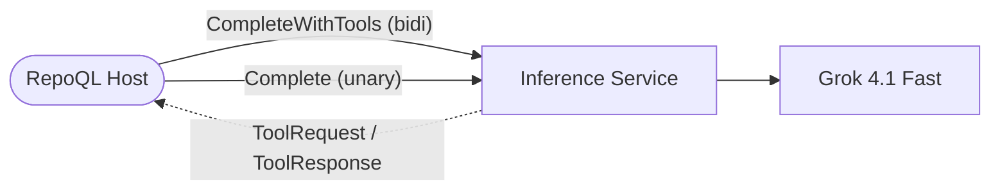

# Inference Service Flows

The inference service handles two flows — one complex, one trivial. Both start with a prompt and end with a response.

```
tool-use-completion.md  → bidirectional streaming: prompt → tool rounds → response
simple-completion.md    → unary RPC: prompt → response (no tools)
```



## Key Properties

- **Read-only tool use** — the LLM can call `read` to drill into files the client's context revealed. No `explore` (client does that locally before calling), no `query` (too complex to learn per-request), no `=> question:` modifier (triggers hidden LLM calls outside budget tracking)
- **Budget is a contract** — the server enforces `tool_token_budget` pre-dispatch. The LLM never overspends
- **Single turn** — no conversation state, no retention. Each request is self-contained
- **Client executes tools** — the server relays tool calls; the client has the data (RepoQL graph, indexed files)
- **Effort, not model** — the client says how hard to think. The server picks the implementation

## Related

- [North Star: Inference Service](../../../north-star/inference-service.md) — what great looks like
- [Design: Inference Service](../../../designs/future/inference-service.md) — architecture, proto, trade-offs
- [Grok 4.1 Fast Research](../../../research/grok-4-1-fast.md) — API details and pricing
