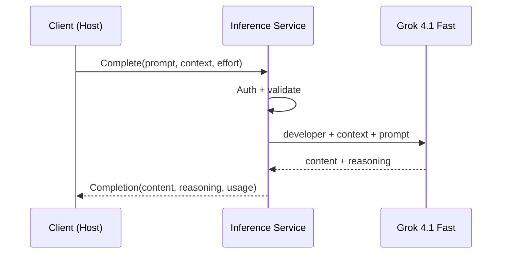

# Simple Completion Flow

Not every question needs tools. Summarize a diff. Rewrite a commit message. Classify a file. The client sends a prompt, the server sends a response. No tool loop, no streaming, no budget tracking.

## Trigger

The client calls the unary `Complete` RPC with a `CompleteRequest`. The request includes:
- `prompt` — the question or instruction
- `context` — optional pre-gathered material (a diff, a file, explore results)
- `system` — optional system prompt
- `effort` — how hard to think
- `max_tokens` — optional guidance for response length

`tools`, `tool_token_budget`, and `max_rounds` are ignored on the unary path.

---

## Stages

### 1. Request Validation

**Actor**: Inference service
**Action**: Authenticate via Bearer token. Validate prompt is non-empty.
**Output**: Authenticated, validated request
**Failure**: Invalid token → gRPC `UNAUTHENTICATED`. Empty prompt → gRPC `INVALID_ARGUMENT`.

### 2. LLM Context Assembly

**Actor**: Inference service
**Action**: Build the LLM prompt. Order: `developer` message (system) → context → user message (prompt). No tool definitions. Map `Effort` to model and parameters.
**Output**: Grok gRPC Chat API request
**Failure**: N/A

### 3. LLM Call

**Actor**: Inference service → Grok API
**Action**: Send request. Wait for complete response.
**Output**: Content text, optional reasoning trace, token usage
**Failure**: Grok timeout → gRPC `UNAVAILABLE`. Grok error → gRPC `INTERNAL`.

### 4. Response

**Actor**: Inference service → Client
**Action**: Return `Completion` with content, reasoning, stop_reason, usage, model.
**Output**: Unary response
**Failure**: N/A

---

## Termination

The flow ends when the `Complete` RPC returns. Always exactly one response or one gRPC error.

## Flow Diagram

## Error Handling

| Error | Behaviour |
|-------|-----------|
| Grok API timeout | gRPC `UNAVAILABLE` with retry hint |
| Grok rate limited | gRPC `RESOURCE_EXHAUSTED` with retry-after |
| Grok error | gRPC `INTERNAL` with details logged |

Simpler failure modes than the bidi path — no tool budget, no round tracking, no client disconnection mid-loop. Standard unary gRPC semantics.

## Verification

| Environment | How |
|-------------|-----|
| **Local** | Mock Grok. Send prompt, verify response structure. Test each Effort level maps to correct model. |
| **Automated** | End-to-end: send a summarization prompt with known context, verify response is coherent. Auth tests: invalid token rejected, valid token accepted. |
| **Production** | OTel traces: client → server → Grok. Track latency, Effort distribution, error rate. |

## Related

- [Tool-Use Completion Flow](tool-use-completion.md) — the bidi streaming path with tools
- [Design: Inference Service](../../../designs/future/inference-service.md) — proto, trade-offs
