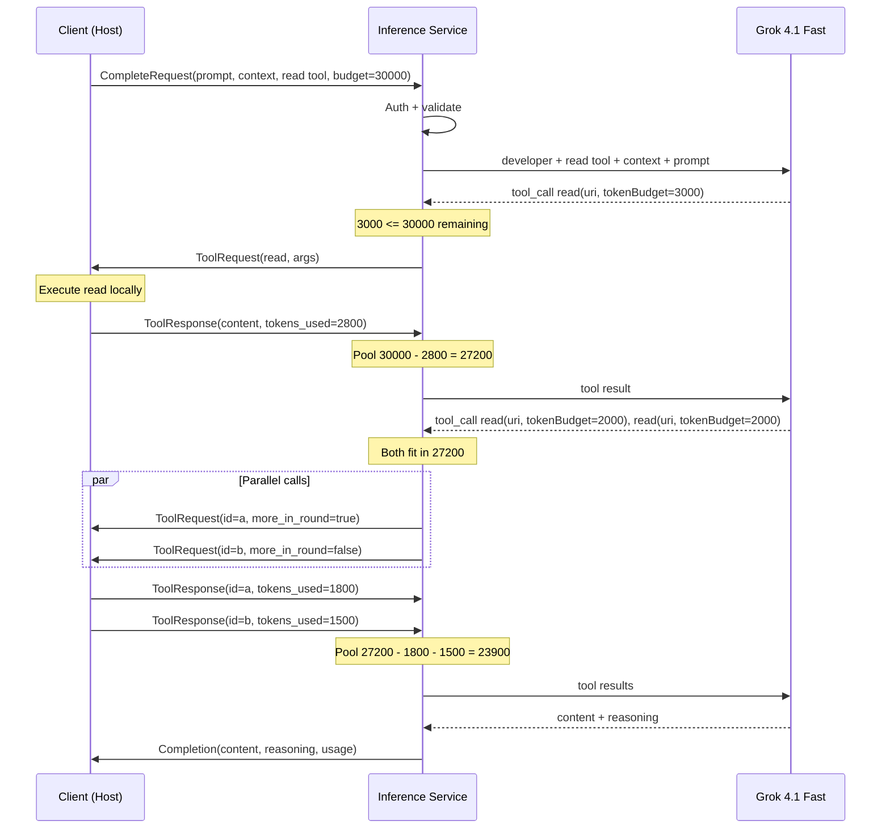

# Tool-Use Completion Flow

An agent has gathered 30k tokens of context with a local explore — structure, summaries, the landscape. It sends that context and its question to the inference service. The LLM reads the context, decides it needs the actual implementation of three functions, and calls `read` three times with precise URIs and token budgets. Each read returns exactly the code it asked for. The LLM synthesizes an answer with citations.

## Trigger

The client opens a `CompleteWithTools` bidirectional stream and sends a `CompleteRequest` as the first message. The request includes:
- `prompt` — the question
- `context` — pre-gathered explore results (broad landscape)
- `system` — system prompt
- `effort` — how hard to think
- `tools` — tool definitions (currently: `read` only)
- `tool_token_budget` — total token pool for tool results
- `max_rounds` — safety limit on tool loop iterations

---

## Stages

### 1. Request Validation

**Actor**: Inference service
**Action**: Authenticate via Bearer token (SHA-256 hash comparison, same as embedding service). Validate required fields.
**Output**: Authenticated, validated request
**Failure**: Invalid token → gRPC `UNAUTHENTICATED`. Missing prompt → gRPC `INVALID_ARGUMENT`.

If `tool_token_budget = 0`, the service proceeds but instructs the LLM to answer without tools — no `ToolRequest` messages are sent, even if tools are defined. This is "no tools" not "invalid request."

### 2. LLM Context Assembly

**Actor**: Inference service
**Action**: Build the LLM prompt from request fields. Order: `developer` message (system prompt) → tool definitions → context → user message (prompt). Map `Effort` to model selection and parameters (see [design](../../../designs/future/inference-service.md#effort--model-mapping) for current mapping).
**Output**: Grok gRPC Chat API request ready to send
**Failure**: N/A (assembly is deterministic)

The ordering matters for prompt caching. System prompt and tool definitions are stable across requests — placing them first maximizes cache hits at the provider level. Context varies per question but is placed before the prompt so the LLM reads the landscape before the question.

### 3. LLM Turn

**Actor**: Inference service → Grok API
**Action**: Send assembled prompt to Grok. Receive response — either tool calls or content.
**Output**: Parsed response: tool call(s) with arguments, or final content with optional reasoning trace
**Failure**: Grok API timeout → gRPC `UNAVAILABLE` with retry hint. Grok returns malformed response → gRPC `INTERNAL` with details logged.

### 4. Budget Check and Tool Relay

**Actor**: Inference service
**Action**: For each tool call the LLM produced, extract `tokenBudget` from `arguments_json`. Compare against remaining pool. If it fits, relay as `ToolRequest` to the client. If it doesn't, reject the call and tell the LLM the budget is exhausted.
**Output**: Zero or more `ToolRequest` messages sent to client. `more_in_round = true` on all but the last in a round (signals parallel calls).
**Failure**: All calls in a round rejected → server tells LLM to answer with what it has. Pool tracks: remaining = `tool_token_budget - sum(tokens_used)`.

For parallel calls in one round: the server evaluates each sequentially against the remaining pool. If the first fits but the second doesn't, only the first is relayed. The rejected call is reported to the LLM as a budget error.

```
Pool: 30000
  LLM requests read(tokenBudget=3000) → 3000 <= 30000 → relay
  LLM requests read(tokenBudget=3000) → 3000 <= 30000 → relay (budget reserved)
  Client returns tokens_used=2800, tokens_used=2400
  Pool: 30000 - 2800 - 2400 = 24800
```

### 5. Client Tool Execution

**Actor**: Client (RepoQL host)
**Action**: Receive `ToolRequest`. Execute the `read` tool against the local RepoQL graph with the provided arguments. Count actual tokens in the result using the host's tokenizer.
**Output**: `ToolResponse` with `content`, `tokens_used`, and optionally `is_error`
**Failure**: Tool execution fails → `ToolResponse` with `is_error = true` and error message as content. The LLM sees the error and can adjust.

The client may receive multiple `ToolRequest` messages in a round (signalled by `more_in_round`). It can execute them in parallel and return `ToolResponse` messages in any order — each is matched by `call_id`.

### 6. Tool Result Relay

**Actor**: Inference service
**Action**: Receive `ToolResponse` from client. Deduct `tokens_used` from remaining pool. Feed result back to LLM as a tool result. Wait for all responses in a round before sending to LLM.
**Output**: Updated tool pool. LLM receives tool results and produces next turn.
**Failure**: Client disconnects → stream context cancellation propagates. Deadline on `ToolResponse` wait (server-configured timeout). Server closes LLM connection and logs.

### 7. Loop or Complete

**Actor**: Inference service
**Action**: After the LLM processes tool results, it produces either more tool calls (→ back to Stage 4) or final content (→ Stage 8). The server checks `max_rounds` — if the round limit is reached, tell the LLM to answer without tools.
**Output**: Decision: continue tool loop or emit completion
**Failure**: LLM enters degenerate loop (same call repeatedly) → `max_rounds` provides the safety net. Server can detect identical consecutive calls and force completion.

### 8. Completion

**Actor**: Inference service → Client
**Action**: Send `Completion` message with `content`, `reasoning` (thinking trace), `stop_reason`, `usage` (input/output/tool/thinking tokens), and `model` (informational). Close the stream.
**Output**: Terminal `Completion` message. Stream ends.
**Failure**: N/A (final message delivery is gRPC transport-level)

---

## Termination

The flow ends when the server sends a `Completion` message. This happens when:
- The LLM produces content without tool calls (natural completion)
- `max_rounds` is reached (server forces answer from gathered context)
- `tool_token_budget` is exhausted (LLM told to answer with what it has)
- An unrecoverable error occurs (gRPC status code, no `Completion`)

The client always receives either a `Completion` or a gRPC error. No ambiguous states.

## Flow Diagram



## Error Handling

| Error | Behaviour | Recovery |
|-------|-----------|----------|
| Grok API timeout | gRPC `UNAVAILABLE` | Client retries or degrades gracefully (LLM features unavailable) |
| Grok rate limited | gRPC `RESOURCE_EXHAUSTED` with retry-after | Client backs off |
| Malformed tool call JSON | Server returns error as tool result to LLM | LLM retries with corrected call. Counts as a round |
| Client disconnects | Stream cancellation propagates | Server closes Grok connection, logs |
| Client `ToolResponse` timeout | Server closes stream with `DEADLINE_EXCEEDED` | Client reconnects and retries |
| All tool calls rejected (budget) | LLM told to answer from gathered context | `stop_reason = TOOL_BUDGET` in Completion |
| Max rounds reached | LLM told to answer from gathered context | `stop_reason = TOOL_LIMIT` in Completion |
| LLM ignores tokenBudget | Tool returns more than requested | `tokens_used` reflects actuals, pool deducts accordingly |

## Verification

| Environment | How |
|-------------|-----|
| **Local** | Mock Grok responses with predetermined tool calls. Verify budget enforcement, round limits, parallel relay. Integration test with real host executing reads against test repo. |
| **Automated** | End-to-end: seed a repo, ask a question, verify the response cites the right files. Budget tests: set tight budget, verify rejection. Round tests: set max_rounds=1, verify forced completion. |
| **Production** | OTel traces span the full flow: client → server → Grok → tool rounds. Track: rounds per request, budget utilization, tool call rejection rate, latency per stage. |

## Related

- [Simple Completion Flow](simple-completion.md) — the no-tools unary path
- [Design: Inference Service](../../../designs/future/inference-service.md) — proto, trade-offs
- [North Star: Inference Service](../../../north-star/inference-service.md) — what great looks like
