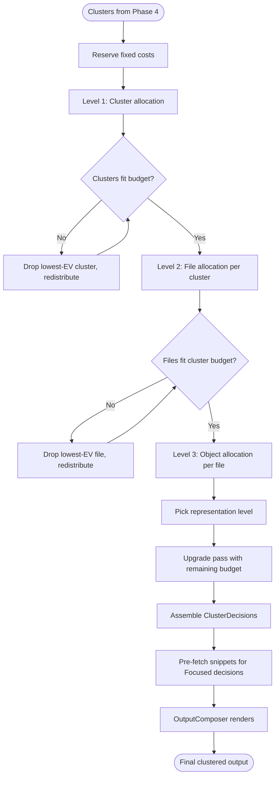

# Phase 5: Three-Level Budget Allocation

Distribute token budget through three levels: cluster → file → object/snippet. Each level allocates proportionally to value, with pressure relief at every stage.

## Why This Matters

| Two-level allocation (today) | Three-level allocation |
|------------------------------|----------------------|
| Budget distributed file-by-file | Budget flows through clusters first |
| No awareness of result grouping | Clusters get proportional share, then distribute internally |
| One dominant file can starve others | Cluster-level allocation ensures breadth across groups |
| Flat: every file competes equally | Hierarchical: structure determines distribution |

**The key change**: Today a single high-scoring file can consume 40% of the budget, leaving 9 other files with headlines. With cluster-level allocation, that file's cluster gets a proportional share, and within that cluster, the file gets the lion's share — but other clusters are protected.

## Current State

Today's `ValueBasedAllocator` uses two levels:

```
Level 1: File-level allocation
  FileEV = max(file.Confidence, max(child.Confidence)) × intent_modifier
  FileBudget = totalBudget × (FileEV / totalEV)

Level 2: Within-file allocation
  Candidates: file + top N children
  ItemBudget = fileBudget × (ItemEV / totalItemEV)
  Representation: richest level that fits
```

This works but treats all files as peers. No concept of groups.

## Trigger

After clustering (Phase 4) produces `ResultCluster[]`, before rendering.

## Stages

### 1. Budget Reservation

**Actor**: ThreeLevelAllocator (enhanced ValueBasedAllocator)
**Action**: Reserve budget for fixed costs before proportional allocation
**Output**: Distributable budget

```
Reserved:
  cluster_header_cost = cluster_count × ~10 tokens
  status_footer_cost  = ~30 tokens
  truncation_notice   = ~20 tokens (if needed)

distributable_budget = total_budget - reserved
```

**Why reserve first**: Cluster headers are fixed cost. If we don't reserve them, the proportional allocation will be slightly over-budget and need clawback. Reserve first, allocate the remainder.

### 2. Cluster-Level Allocation (Level 1)

**Actor**: ThreeLevelAllocator
**Action**: Distribute budget across clusters proportional to cluster value
**Output**: Each cluster gets a budget

**Cluster expected value**:
```
ClusterEV = max(result.Score for result in cluster) × intent_modifier × size_factor

Where:
  intent_modifier:
    Inspect:   1.2  (concentrate on top cluster)
    Locate:    1.0  (balanced)
    Inventory: 0.8  (flatten across clusters)
    Explain:   1.1  (focused but contextual)

  size_factor:
    1.0 + 0.1 × log2(cluster.size)
    // Slight bonus for larger clusters — they cover more ground
    // A 4-file cluster gets 1.2×, an 8-file cluster gets 1.3×
    // Logarithmic: diminishing returns, never dominates
```

**Proportional allocation**:
```
ClusterBudget = distributable_budget × (ClusterEV / sum(all ClusterEV))
```

**Floor**: Every cluster gets at least enough for its highest-scoring result at Compact level (~50 tokens). If a cluster can't afford even that, it's dropped entirely and its budget redistributed.

**Ungrouped results**: Treated as individual clusters of size 1 (no size bonus). They compete proportionally with formed clusters.

### 3. Cluster Pressure Relief

**Actor**: ThreeLevelAllocator
**Action**: If minimum costs exceed cluster budget, drop lowest-EV clusters
**Output**: Surviving clusters with adjusted budgets

```
Algorithm:
  while sum(min_cost(cluster)) > distributable_budget:
      drop cluster with lowest ClusterEV
      redistribute its budget proportionally

  min_cost(cluster) = min(
      result_count × compact_cost,          // everything compact
      1 × compact_cost + (count-1) × 0     // at least 1 result visible
  )
```

**Dropped clusters**: Appear in truncation notice at the end:
```
[More: 2 clusters (src/Tests/, src/Utils/) with 7 files]
```

### 4. File-Level Allocation (Level 2)

**Actor**: ThreeLevelAllocator (per cluster)
**Action**: Within each cluster, distribute the cluster's budget across its files
**Output**: Each file gets a budget

**This is largely today's Level 1 logic**, scoped to a cluster:

```
FileEV = max(file.Confidence, max(child.Confidence)) × intent_modifier
FileBudget = clusterBudget × (FileEV / sum(FileEV in cluster))
```

**Duplicate demotion** (from Phase 3): Files marked as duplicates get their EV halved. This naturally demotes them without special-casing:

```
if file.DuplicateOf != null:
    FileEV *= 0.5    // Still competes, but at disadvantage
```

The effect: duplicates end up at Compact or Minimal. Canonicals get the lion's share. Budget recovered flows to non-duplicate files.

**File pressure relief**: Same as today — drop lowest-EV files if minimum costs exceed cluster budget. Dropped files noted in truncation.

### 5. Object-Level Allocation (Level 3)

**Actor**: ThreeLevelAllocator (per file)
**Action**: Within each file, distribute the file's budget across objects/snippets
**Output**: Each object gets a representation level

**This is today's Level 2 logic**, enhanced with focused snippets (Phase 1):

```
Candidates: file-level result + top N children (by score)
  N varies by intent: Inventory=3, Locate=5, Inspect=8, Explain=6

ItemBudget = fileBudget × (ItemEV / sum(ItemEV for candidates))

Representation = PickBestFit(item, itemBudget, intent):
    Rich     if cost(Rich) <= itemBudget
    Focused  if chunk available AND cost(Focused) <= itemBudget    // Phase 1
    Standard if cost(Standard) <= itemBudget
    Compact  if cost(Compact) <= itemBudget
    Minimal  if intent == Inventory
    else     Compact (floor for non-Inventory)
```

**Upgrade pass**: After initial allocation, remaining budget upgrades items in descending EV order. Same as today.

### 6. Assembly

**Actor**: ThreeLevelAllocator
**Action**: Assemble the hierarchical allocation into rendering decisions
**Output**: `ClusterDecision[]` ready for OutputComposer

```
ClusterDecision {
    Cluster: ResultCluster
    AllocatedBudget: int
    FileDecisions: RenderingDecision[]    // existing type, now nested under cluster
    OmittedFileCount: int
}

RenderingDecision {
    Result: ExploreResult
    Level: Representation
    EstimatedTokens: int
    ChildDecisions: RenderingDecision[]
    OmittedChildrenCount: int
}
```

### 7. Snippet Pre-Fetch

**Actor**: ExploreOrchestrator
**Action**: Scan ClusterDecisions for Focused allocations, batch-fetch snippets asynchronously
**Output**: ClusterDecisions with snippet content populated on Focused results
**Failure**: If snippet fetch fails, downgrade to Standard

### 8. Rendering

**Actor**: OutputComposer (from Phase 4)
**Action**: Render clusters → files → objects with appropriate representation levels
**Output**: Final markdown string

```
── src/Auth/ (4 files) ──────────────────────────────────────

 95% file:///src/Auth/AuthService.cs  AuthService | JWT validation and refresh
  lines 42-68:                                               ← Phase 1: Focused
  ```csharp
  public async Task<ValidationResult> ValidateToken(...) { ... }
  ```
  #symbol=RefreshToken  RefreshToken(refreshToken)           ← Child: Compact
  [+2 more symbols]

 88% file:///src/Auth/AuthConfig.cs  AuthConfig | JWT configuration options
  public class AuthConfig { JwtSecret, TokenExpiry, ... }    ← Standard

 72% file:///vendor/auth/AuthService.cs  (duplicate, hamming=0)  ← Phase 3: demoted

── Documentation ────────────────────────────────────────────

 85% file:///docs/auth-flow.md  Authentication Flow | End-to-end auth sequence
  ## Token Validation                                        ← Focused on matching section
  The validation flow proceeds through AuthMiddleware...

[More: 1 cluster (src/Tests/) with 3 files]
[2.8k tok | 45 ms | index: ready | semantic: ready]
```

## Flow Diagram



## Budget Flow Example

```
Total budget: 3000 tokens
Reserved: 50 tokens (3 cluster headers + footer)
Distributable: 2950 tokens

Level 1 — Cluster allocation:
  src/Auth/ (4 files, max score 95)     → EV: 95 × 1.2 = 114 → 1350 tok
  Documentation (2 files, max score 85) → EV: 85 × 1.1 = 93.5 → 1100 tok
  src/Config/ (2 files, max score 78)   → EV: 78 × 1.0 = 78   →  500 tok

Level 2 — File allocation within src/Auth/ (1350 tok):
  AuthService.cs (score 95, canonical)   → EV: 95  → 700 tok → Rich or Focused
  AuthConfig.cs (score 88)              → EV: 88  → 350 tok → Standard
  JwtValidator.cs (score 82)            → EV: 82  → 250 tok → Compact
  vendor/AuthService.cs (dup, score 72) → EV: 36  →  50 tok → Compact (demoted)

Level 3 — Object allocation within AuthService.cs (700 tok):
  File headline                          → 20 tok
  ValidateToken (best chunk, score 95)  → 300 tok → Focused snippet
  RefreshToken (child, score 60)        → 100 tok → Compact
  3 other methods                        → omitted → [+3 more symbols]
  Remaining budget: 280 tok → upgrade RefreshToken to Standard
```

## Differences from Current Allocation

| Aspect | Current (two-level) | New (three-level) |
|--------|--------------------|--------------------|
| Top level | Files compete globally | Clusters compete globally |
| Protection | None — one file can dominate | Clusters protect breadth |
| Duplicate handling | None | Demoted EV in Phase 3 |
| Focused snippets | N/A | Phase 1 adds Focused level |
| Cluster overhead | N/A | ~10 tokens per cluster header |
| Ungrouped results | All results are ungrouped | Compete as size-1 clusters |

## Graceful Degradation

Each phase is optional. The allocator adapts:

| Missing phase | Effect on allocation |
|---------------|---------------------|
| No Phase 1 (no focused snippets) | Focused level skipped in PickBestFit |
| No Phase 2 (no query expansion) | Fewer results → fewer clusters → simpler allocation |
| No Phase 3 (no simhash dedup) | No duplicate demotion → duplicates get normal allocation |
| No Phase 4 (no clustering) | Every result is a cluster of 1 → degrades to today's two-level |

**Key invariant**: If all other phases are absent, this allocator behaves identically to the current two-level allocator. The three-level structure is strictly additive.

## Edge Cases

| Case | Behaviour |
|------|-----------|
| Single cluster | All budget goes to that cluster → same as today |
| Single result | Single cluster, single file → same as today |
| Budget < 100 tokens | Skip clustering, render top result at Compact |
| Many small clusters (10+ clusters of 1-2 files) | Merge into "Other" if > 6 clusters |
| Explain intent | Allocation for user output uses user budget; internal LLM rendering uses 50k budget (unchanged) |

## Failure Modes

| Failure | Detection | Recovery |
|---------|-----------|----------|
| Cluster budget underflows (< 0 after pressure relief) | Negative budget | Drop cluster, redistribute |
| All clusters dropped | 0 surviving clusters | Show single highest-scoring result at Compact |
| Token estimation significantly wrong | Actual output >> estimated | Truncate at render time with "..." |
| Phase 4 not available (no clusters) | Input is flat list | Wrap each result in a size-1 cluster, proceed normally |

## Key Files to Create/Modify

| File | Change |
|------|--------|
| `ValueBasedAllocator.cs` | Extend to three levels, accept cluster input |
| `ClusterDecision.cs` (new) | Cluster-level allocation result |
| `ExploreOrchestrator.cs` | Pass clusters to allocator instead of flat list |
| `OutputComposer.cs` | Render from ClusterDecision[] |
| `ExploreTokenEstimator.cs` | Add cluster header estimation, Focused estimation |
| `OptionValue.cs` | Add Focused representation value weights |

## Interaction with All Phases

```
Phase 2: Query Expansion
    ↓ More + better search results
Phase 3: SimHash Dedup
    ↓ Duplicates annotated, canonical identified
Phase 4: Clustered Output
    ↓ Results grouped into clusters with labels
Phase 5: Budget Allocation (this phase)
    ↓ Budget flows: cluster → file → object
Phase 1: Focused Snippets
    ↓ Object-level picks Focused representation when chunk available
    ↓
    Final rendered output
```

## Metrics

| Metric | How to Measure | Target |
|--------|----------------|--------|
| Budget utilization | Tokens spent / tokens budgeted | 95-100% (spend the contract) |
| Cluster breadth | Clusters with ≥ 1 non-Minimal result | 100% of surviving clusters |
| Representation distribution | % of results at each level | Fewer Compact, more Focused/Standard |
| Dominance ratio | Max single-file budget / total budget | < 30% (vs current ~40%) |
| Truncation rate | % of queries where results are dropped | < 20% at 2000+ token budgets |
