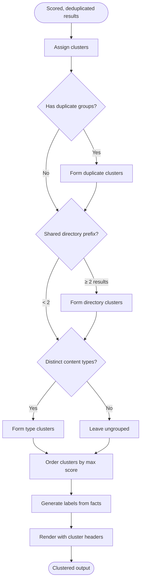

# Phase 4: Clustered Output

Group search results by directory, content type, and duplicate relationship. Label clusters from facts. Present structured output instead of a flat list.

## Why This Matters

| Flat list (today) | Clustered output |
|--------------------|-----------------|
| Agent sees 10 disconnected file paths | Agent sees "3 auth files, 2 config files, 2 docs" |
| No sense of where results concentrate | Clear signal: "results cluster in src/Auth/" |
| Duplicates scattered through results | Duplicates grouped with their canonical |
| Structure of the codebase invisible | Directory structure visible in output |

**The insight**: A flat list forces the agent to reconstruct structure from file paths. Clusters present that structure directly. The agent knows *where in the codebase* the answer lives, not just *which files* matched.

## Current State

Today's OutputComposer renders results as a flat list with optional child objects (symbols within a file):

```
 95% file:///src/Auth/AuthService.cs  AuthService | ...
  #symbol=ValidateToken  ValidateToken(token)
  #symbol=RefreshToken  RefreshToken(refreshToken)
 88% file:///src/Auth/AuthConfig.cs  AuthConfig | ...
 85% file:///vendor/auth/AuthService.cs  AuthService | ...
 82% file:///docs/auth-flow.md  Authentication Flow | ...
 78% file:///src/Auth/JwtValidator.cs  JwtValidator | ...
```

No grouping. No cluster labels. No structural context.

## Trigger

After search results are scored, deduplicated (Phase 3), and before budget allocation.

## Stages

### 1. Result Collection

**Actor**: ExploreSearchEngine output
**Action**: Collect flat list of scored, deduplicated results
**Output**: `ExploreResult[]` with scores, duplicate annotations

This is the input from the existing pipeline (enhanced by Phase 3 if available).

### 2. Cluster Assignment

**Actor**: ResultClusterer (new component)
**Action**: Assign each result to a cluster using a priority-ordered strategy
**Output**: Each result tagged with a `ClusterId`

**Clustering strategy** (priority order):

#### Strategy A: Duplicate Groups
Results marked as duplicates (from Phase 3) form a cluster with their canonical.

```
Cluster: "src/Auth/AuthService.cs (3 copies)"
  - AuthService.cs (canonical)
  - AuthServiceV2.cs (hamming=2)
  - vendor/AuthService.cs (hamming=0)
```

If Phase 3 is not implemented, this strategy is skipped.

#### Strategy B: Shared Directory Prefix
Results sharing a directory prefix (depth ≥ 2) form a cluster.

```
Cluster: "src/Auth/"
  - AuthService.cs
  - AuthConfig.cs
  - JwtValidator.cs
  - AuthMiddleware.cs
```

**Minimum cluster size**: 2. A single file in a directory is not a cluster — it stays ungrouped or joins a broader cluster.

**Prefix depth selection**: Find the longest common prefix that groups ≥ 2 results. Don't group at root level (`src/` is too broad unless everything is there).

```
Algorithm:
  for each result:
      prefix = directory_path(result.uri)  // e.g., "src/Auth/"

  group by prefix
  merge groups where prefix differs only at leaf:
      "src/Auth/Validators/" + "src/Auth/Middleware/"
      → both join "src/Auth/" if it has ≥ 2 members total

  discard groups with 1 member → ungrouped
```

#### Strategy C: Content Type Groups
Results of distinct content types form type-based clusters.

```
Cluster: "Documentation"
  - docs/auth-flow.md
  - docs/getting-started.md

Cluster: "Configuration"
  - config/auth-settings.yaml
  - .env.example
```

**Content type detection**: Use `SemanticType` from the ExploreResult (already available from indexing: `markdown.doc`, `code.csharp`, `data.yaml`, etc.).

**Type groups**:

| SemanticType pattern | Cluster label |
|---------------------|---------------|
| `markdown.*` | Documentation |
| `data.yaml`, `data.json`, `data.toml` | Configuration |
| `code.*` | (use directory prefix instead) |
| `schema.*` | Schemas |

Code files cluster by directory, not by content type (all code files in one cluster is useless).

#### Strategy D: Ungrouped
Results that don't fit any cluster appear individually after all clusters.

### 3. Cluster Ordering

**Actor**: ResultClusterer
**Action**: Order clusters by aggregate relevance
**Output**: Ordered list of clusters

**Ordering score**:
```
ClusterScore = max(result.Score for result in cluster)
```

Use max, not sum or average. The cluster is as relevant as its best member. Sum would bias toward large clusters; average would penalize clusters with one strong and several weak members.

**Within-cluster ordering**: Results ordered by score descending (same as today).

### 4. Cluster Labeling

**Actor**: ClusterLabeler (new component, or part of ResultClusterer)
**Action**: Generate a label for each cluster from facts
**Output**: Human-readable cluster label

**Label sources** (priority order):

| Source | Confidence | Example |
|--------|------------|---------|
| Duplicate relationship | High | "AuthService.cs (3 copies)" |
| Directory path | High | "src/Auth/" |
| Content type | High | "Documentation" |
| Shared parent + count | High | "src/Services/ (4 files)" |

**Rules**:
- Labels come from facts (paths, types, relationships), never inference
- Labels are short: max 40 characters
- Include file count: "src/Auth/ (4 files)"
- Duplicate clusters name the canonical: "AuthService.cs (3 copies)"

**Never infer**: Don't call a cluster "Authentication Module" because its path is `src/Auth/`. The path itself is the label. Inference can be wrong; paths can't.

### 5. Cluster Rendering

**Actor**: OutputComposer (enhanced)
**Action**: Render results grouped by cluster with headers
**Output**: Clustered markdown output

**Format**:

```
── src/Auth/ (4 files) ──────────────────────────────────────

 95% file:///src/Auth/AuthService.cs  AuthService | JWT validation and refresh
  lines 42-68:
  ```csharp
  public async Task<ValidationResult> ValidateToken(string token) { ... }
  ```

 88% file:///src/Auth/AuthConfig.cs  AuthConfig | JWT configuration options
 82% file:///src/Auth/JwtValidator.cs  JwtValidator | Token signature verification
 72% file:///vendor/auth/AuthService.cs  (duplicate of AuthService.cs, hamming=0)

── Documentation ────────────────────────────────────────────

 85% file:///docs/auth-flow.md  Authentication Flow | End-to-end auth sequence
  ## Token Validation
  The validation flow proceeds through...

── src/Config/ (2 files) ────────────────────────────────────

 78% file:///src/Config/AppSettings.cs  AppSettings | Configuration binding
 65% file:///src/Config/AuthOptions.cs  AuthOptions | Auth-specific options
```

**Cluster header format**: `── {label} ──` with fill characters to a fixed width. Visually separates clusters without consuming many tokens (~10 tokens per header).

**Ungrouped results**: Appear at the end under no header, or under "── Other ──" if there are multiple ungrouped items.

## Flow Diagram



## Data Shapes

**Input**: `ExploreResult[]` (flat, scored, with optional DuplicateOf annotations)

**After clustering**:
```
ResultCluster {
    ClusterId: string
    Label: string                    // "src/Auth/ (4 files)"
    ClusterType: Directory | Duplicate | ContentType
    AggregateScore: double           // max of member scores
    Results: ExploreResult[]         // ordered by score
}
```

**Output to allocator**: `ResultCluster[]` ordered by AggregateScore

## Edge Cases

| Case | Behaviour |
|------|-----------|
| All results in same directory | One cluster containing everything; label is that directory |
| All results in different directories | No directory clusters; fall through to content type or ungrouped |
| Single result | No clustering needed; render as today |
| 2 results | Cluster if they share a directory; otherwise ungrouped |
| Very deep paths | Use the shallowest prefix that groups ≥ 2 results |
| Mixed code + docs in same directory | Prefer directory cluster over content type split |
| Phase 3 not implemented (no dedup) | Duplicate cluster strategy skipped; directory + type still work |

## Interaction with Budget

Clusters don't directly determine budget allocation in this phase. Budget allocation (Phase 5) remains at file level. Clusters affect *ordering and presentation* only.

However, clusters set up the structure that Phase 5 needs: once results are grouped, the allocator can reason about cluster-level budget distribution.

**In this phase**: Cluster headers consume ~10 tokens each. This is deducted from the total budget before file-level allocation. For 3-4 clusters: ~30-40 tokens overhead. Minimal.

## Interaction with Other Phases

- **Phase 1 (Focused Snippets)**: Snippets render within clusters, same as in flat list. No interaction.
- **Phase 2 (Query Expansion)**: Expansion may produce results spanning more directories → more clusters → more structural context.
- **Phase 3 (SimHash Dedup)**: Duplicate groups become a cluster type. Without Phase 3, duplicate clustering is skipped gracefully.
- **Phase 5 (Budget Allocation)**: Clusters become the input for three-level allocation (cluster → file → object).

## Failure Modes

| Failure | Detection | Recovery |
|---------|-----------|----------|
| All results ungrouped (no shared directories, no types) | 0 clusters formed | Render as flat list (current behavior), no degradation |
| Too many clusters (every file its own cluster) | Cluster count > result count / 2 | Merge small clusters into "Other" |
| Cluster label too long | Label > 40 chars | Truncate path with `...` |

## Key Files to Create/Modify

| File | Change |
|------|--------|
| `ResultClusterer.cs` (new) | Cluster assignment, ordering |
| `ClusterLabeler.cs` (new, or method in ResultClusterer) | Label generation |
| `ResultCluster.cs` (new) | Cluster data model |
| `OutputComposer.cs` | Render cluster headers, group results |
| `ExploreOrchestrator.cs` | Insert clustering step between search and allocation |

## Metrics

| Metric | How to Measure | Target |
|--------|----------------|--------|
| Clustering rate | % of results assigned to a cluster | > 60% |
| Average cluster size | Results per cluster | 2-5 |
| Cluster header overhead | Tokens consumed by headers | < 3% of budget |
| Agent comprehension | Qualitative: does output convey structure? | Clusters match intuitive groupings |
