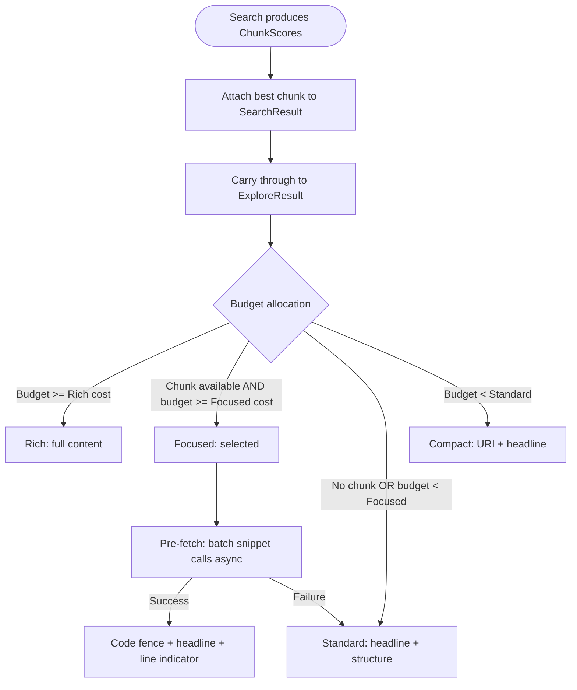

# Phase 1: Focused Snippets

Use chunk scores from semantic search to show the relevant region of a file, not the whole file or just signatures.

## Why This Matters

| Without focused snippets | With focused snippets |
|--------------------------|----------------------|
| File exceeds budget → falls back to structure | File exceeds budget → shows the relevant method |
| Agent sees signatures, not the code that matched | Agent sees the actual code that answered the query |
| Must follow up with read() to see content | Often enough context to act immediately |
| Budget wasted on irrelevant sections | Budget concentrated on what matched |

**Token impact**: A 500-token file at Standard level costs ~150 tokens (structure). A focused snippet of the matching region costs ~100-200 tokens but contains the *actual relevant code*. The agent gets actionable content instead of an outline.

## Current State

Today's pipeline already computes chunk scores during semantic search:

```
Query embedding → cosine_similarity against document_embedding chunks
               → ChunkScore(StartLine, EndLine, Score)
               → Used for ChunkProximityBooster (+30% for nearby objects)
               → Discarded after boosting
```

The chunk location — which region of the file matched semantically — is thrown away before rendering. When a file is too large for Rich representation, it drops to Standard (structure) or Compact (headline), losing the specific match.

## Trigger

ValueBasedAllocator determines a file's budget is:
- Too small for Rich (full content)
- Large enough for more than Standard (structure)

## Stages

### 1. Chunk Score Propagation

**Actor**: ExploreSearchEngine
**Action**: Attach best chunk location to each SearchResult from whichever search path produced the result
**Output**: SearchResult gains `BestChunkStart` and `BestChunkEnd` (line numbers)
**Failure**: No chunk scores (no semantic search, or no embeddings) → null, flow continues without focused snippets

**Two search paths carry chunks differently:**

| Path | Used by intents | Chunk source | Current state |
|------|----------------|--------------|---------------|
| Standard | Inventory | `ChunkProximityBooster` scores from `_search_semantic` | Computed then discarded |
| JIT | Locate, Inspect, Explain | `DocumentExpansionCandidate.HighScoringChunks` | Carried but ignored in `ConvertJitResults()` |

Both paths must propagate chunks to SearchResult. The JIT path is the more important fix — Locate, Inspect, and Explain are the intents where Focused has the highest value (0.6, 0.85, 0.7).

```
SearchResult {
    ...existing fields...
    BestChunkStart: int?     // NEW — line number of best semantic chunk
    BestChunkEnd: int?       // NEW — line number of best semantic chunk
    BestChunkScore: double?  // NEW — cosine similarity of that chunk
}
```

**Selection logic**: Pick the chunk with the highest cosine similarity score. If multiple chunks score within 5% of each other, prefer the one closest to file start (earlier context is usually more foundational).

### 2. Chunk Location Carried to ExploreResult

**Actor**: SearchResult → ExploreResult conversion
**Action**: Map chunk location fields through to ExploreResult
**Output**: ExploreResult has optional chunk location
**Failure**: N/A (nullable fields)

```
ExploreResult {
    ...existing fields...
    BestChunkStart: int?
    BestChunkEnd: int?
}
```

### 3. New Representation Level: Focused

**Actor**: ValueBasedAllocator
**Action**: When selecting representation, consider Focused between Standard and Rich
**Output**: RenderingDecision with `Representation.Focused`
**Failure**: No chunk location available → skip Focused, fall through to Standard

**Representation hierarchy (updated)**:

| Level | Content | Typical Cost | When |
|-------|---------|-------------|------|
| Rich | Full content in code fence | 200-500 tok | Budget allows full file |
| **Focused** | **Chunk region in code fence + headline** | **80-250 tok** | **Budget too small for full, chunk location known** |
| Standard | Headline + structure (signatures) | 70-200 tok | No chunk location, or budget too small for Focused |
| Compact | URI + headline | 20-80 tok | Tight budget |
| Minimal | Headline only | 5-20 tok | Inventory intent |

**Selection logic**:

```
PickBestFit(result, allocation, intent):
    if EstimateRich(result) <= allocation:
        return Rich
    if result.BestChunkStart != null AND EstimateFocused(result) <= allocation:
        return Focused                          // NEW
    if EstimateStandard(result) <= allocation:
        return Standard
    if EstimateCompact(result) <= allocation:
        return Compact
    return intent == Inventory ? Minimal : Compact
```

### 4. Snippet Pre-Fetch

**Actor**: ExploreOrchestrator (between allocation and rendering)
**Action**: Scan allocation decisions for Focused results, batch-fetch all snippets asynchronously
**Output**: Snippet content attached to each Focused ExploreResult before rendering
**Failure**: If any snippet fetch fails, mark that result for Standard fallback

**Why a separate stage**: `RepresentationFormatter` is synchronous. `snippet()` requires a DB call. Pre-fetching resolves this mismatch — all async work completes before the synchronous rendering pass begins.

```
for each ClusterDecision:
    for each FileDecision where Level == Focused:
        snippetUri = file:///path#line={BestChunkStart},{BestChunkEnd}
        result.Snippet = await snippet(snippetUri, context: 3)
        if result.Snippet is null or empty:
            downgrade decision to Standard
```

### 5. Focused Snippet Rendering

**Actor**: RepresentationFormatter
**Action**: Render pre-fetched snippet with headline and line range indicator
**Output**: Code fence with the relevant region, plus headline for context

**Snippet construction**:

```
URI: file:///src/Auth/AuthService.cs#line={BestChunkStart},{BestChunkEnd}

Query: SELECT string_agg(text, chr(10))
       FROM snippet('file:///src/Auth/AuthService.cs#line=42,68', 3)
       -- 3 lines of context above and below the chunk
```

**Context padding**: Add 3 lines above and below the chunk boundaries. This provides enough surrounding code to understand the snippet without excessive cost.

### 6. Focused Rendering

**Actor**: RepresentationFormatter
**Action**: Format the pre-fetched snippet with headline and line range indicator
**Output**: Rendered string

```
 95% file:///src/Auth/AuthService.cs  AuthService | JWT token validation and refresh
  lines 42-68:
  ```csharp
  public async Task<ValidationResult> ValidateToken(string token)
  {
      var principal = _jwtHandler.ValidateToken(token);
      if (principal == null)
          return ValidationResult.Invalid("Token validation failed");

      var claims = principal.Claims.ToDictionary(c => c.Type, c => c.Value);
      if (!claims.ContainsKey("exp"))
          return ValidationResult.Invalid("Missing expiration claim");

      return ValidationResult.Valid(principal);
  }
  ```
```

**Comparison with current levels**:

Standard (today):
```
 95% file:///src/Auth/AuthService.cs  AuthService | JWT token validation and refresh
  public class AuthService : IAuthService
  {
      + ValidateToken(token)
      + RefreshToken(refreshToken)
      + GenerateToken(user)
      + RevokeToken(tokenId)
  }
```

Focused (new):
```
 95% file:///src/Auth/AuthService.cs  AuthService | JWT token validation and refresh
  lines 42-68:
  ```csharp
  public async Task<ValidationResult> ValidateToken(string token)
  {
      ...actual implementation...
  }
  ```
```

The agent learns *how* validation works, not just that it exists.

## Flow Diagram



## Token Estimation

**EstimateFocused(result)**:

```
headline_tokens = estimate(result.Headline)          // ~10-30
uri_tokens = estimate(result.Uri)                    // ~5-15
line_indicator = 5                                   // "lines 42-68:"
chunk_tokens = (BestChunkEnd - BestChunkStart + 6)   // +6 for context padding
               * avg_tokens_per_line                  // ~8-12 for code
code_fence_overhead = 4                              // ```lang ... ```

total = headline_tokens + uri_tokens + line_indicator + chunk_tokens + code_fence_overhead
```

Typical: 80-250 tokens depending on chunk size. Significantly cheaper than Rich (full file) while providing the actual relevant content.

## Edge Cases

| Case | Behaviour |
|------|-----------|
| No semantic search (keywords-only) | No chunk scores → Focused never selected, existing flow unchanged |
| Chunk covers entire file | Focused cost ≈ Rich cost → Rich selected instead |
| Chunk is very small (< 3 lines) | Expand context padding to 5 lines to provide enough surrounding code |
| Multiple high-scoring chunks | Pick highest; if future phases need multiple, extend to array |
| Object (symbol) result, not file | Symbols already have spans → Rich shows the symbol body; Focused not needed |

## Failure Modes

| Failure | Detection | Recovery |
|---------|-----------|----------|
| snippet() returns empty | Result string is null/empty | Fall back to Standard |
| Chunk line numbers out of range | EndLine > file line count | Clamp to file boundaries |
| Chunk scores not populated | BestChunkStart is null | Skip Focused in PickBestFit |

## Key Files to Modify

| File | Change |
|------|--------|
| `ExploreSearchEngine.cs` | Propagate best chunk location to SearchResult |
| `ExploreResult.cs` | Add BestChunkStart/End fields |
| `Representation.cs` | Add `Focused` enum value |
| `ValueBasedAllocator.cs` | Add Focused to PickBestFit logic |
| `RepresentationFormatter.cs` | Add Focused rendering |
| `ExploreTokenEstimator.cs` | Add EstimateFocused |
| `OptionValue.cs` | Add Focused value weights per intent |

## Metrics

| Metric | How to Measure | Target |
|--------|----------------|--------|
| Focused selection rate | % of results rendered as Focused vs Standard | > 30% when keywords present |
| Token efficiency | Tokens of actionable content / total tokens spent | +25% vs current |
| Follow-up read rate | % of explore results that need read() for detail | -30% vs current |
