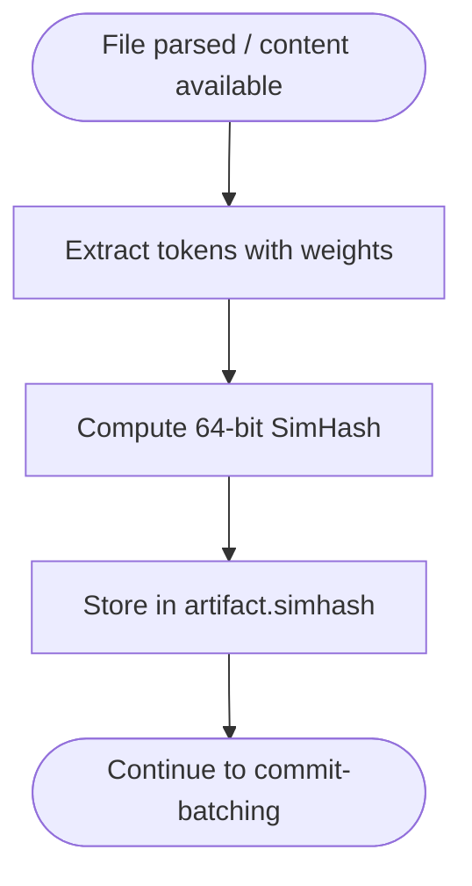
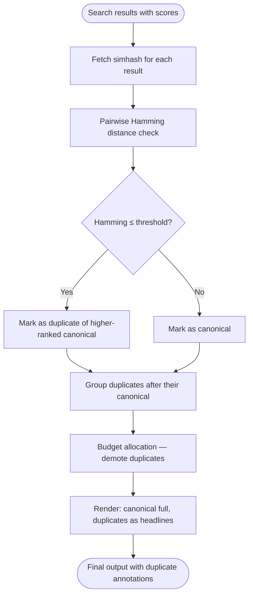

# Phase 3: SimHash Deduplication

Fingerprint files at index time. Detect near-duplicates at query time. Show duplicates as headlines, not full content.

## Why This Matters

| Without dedup | With dedup |
|---------------|------------|
| 5 search results, 3 are copies → 60% waste | 5 unique results, duplicates noted as headlines |
| Budget spent on redundant content | Budget concentrated on distinct information |
| Agent doesn't know copies exist | Agent knows copies exist (can investigate if relevant) |
| PPR expansion finds clones as "related" | PPR expansion (future) skips known clones |

**The principle**: Deduplication affects *token spend*, not *awareness*. There may be a reason for AuthServiceV2.cs or a vendored copy. The agent needs to know it exists. It doesn't need to read it twice.

## Two Flows

This phase has two separate flows:
1. **Index-time**: Compute fingerprints when files are processed
2. **Query-time**: Detect duplicates among search results

## Current State

No deduplication exists today. The explore pipeline returns results in flat ranked order. If a file has copies (backups, vendored, generated, refactored), each copy competes independently for budget.

---

## Flow A: Index-Time Fingerprinting

### Trigger

A file completes parsing (Records available) or content is available for non-parsed files.

### Stages

#### A1. Token Extraction

**Actor**: SimHashCalculator (new component, called during single-file analysis or commit-batching)
**Action**: Extract tokens from file content
**Output**: Ordered list of weighted tokens

**Token types and weights**:

| Token Type | Weight | Example | Rationale |
|------------|--------|---------|-----------|
| Identifiers | 1.0 | `validateToken`, `userId` | Core semantic content |
| Keywords | 0.5 | `class`, `function`, `if` | Structural signal |
| Operators/structure | 0.3 | `{`, `=>`, `:` | Syntax pattern |
| String literals | 0.0 | `"error message"` | Ignored — too variable |
| Comments | 0.0 | `// TODO` | Ignored — cosmetic |
| Whitespace/formatting | 0.0 | Indentation | Ignored — cosmetic |

**Normalization** (to catch renamed clones):
- Split camelCase/PascalCase: `validateToken` → `validate`, `token`
- Lowercase all tokens
- Do NOT normalize identifiers to placeholders (too aggressive — loses real similarity signal)

**Why not normalize identifiers?** The ideas docs suggest normalizing `userId` → `VAR1` to catch renamed clones. In practice this makes everything look similar. A 3-bit Hamming threshold already catches minor renames. Aggressive normalization produces false positives that are worse than missed clones.

#### A2. SimHash Computation

**Actor**: SimHashCalculator
**Action**: Compute 64-bit SimHash fingerprint from weighted tokens
**Output**: `ulong` (64-bit unsigned integer)

```
Algorithm:
  votes[64] = {0, 0, ..., 0}

  for each (token, weight) in tokens:
      hash = hash64(token)        // 64-bit hash of the token string
      for bit in 0..63:
          if hash has bit set:
              votes[bit] += weight
          else:
              votes[bit] -= weight

  fingerprint = 0
  for bit in 0..63:
      if votes[bit] > 0:
          fingerprint |= (1 << bit)

  return fingerprint
```

**Hash function**: Use a fast, well-distributed 64-bit hash (xxHash, FNV-1a 64, or similar). The hash function doesn't need to be cryptographic — it needs uniform bit distribution.

**Weighted voting**: Identifier tokens vote with weight 1.0, keywords with 0.5, etc. This means identifier similarity dominates the fingerprint, which is the right signal.

#### A3. Storage

**Actor**: Commit-batching pipeline
**Action**: Persist SimHash alongside other artifact data
**Output**: `artifact.simhash` column populated

**Schema change**:
```sql
ALTER TABLE artifact ADD COLUMN simhash UBIGINT;
```

**Cost**: 8 bytes per file. For 100K files: 800KB. Negligible.

#### A4. Recomputation

**Actor**: Indexing pipeline (on file change)
**Action**: Recompute SimHash when file content changes
**Output**: Updated fingerprint

**When to recompute**: Same trigger as re-parsing. If the content digest changes, SimHash changes. No separate tracking needed — it piggybacks on existing incremental indexing.

### Flow A Diagram



---

## Flow B: Query-Time Deduplication

### Trigger

Search returns ranked results (after scoring, before budget allocation).

### Stages

#### B1. SimHash Retrieval

**Actor**: ExploreSearchEngine
**Action**: Fetch simhash values for all result URIs
**Output**: Results enriched with simhash

```sql
SELECT r.uri, r.score, a.simhash
FROM search_results r
JOIN artifact a ON r.uri = a.uri
```

**Note**: If simhash is already included in the search result projection (by joining artifact in the search macro), this is zero-cost.

#### B2. Pairwise Duplicate Detection

**Actor**: DuplicateDetector (new component)
**Action**: For each result, check Hamming distance against all higher-ranked results
**Output**: Each result annotated with duplicate status

```
Algorithm (greedy, rank-order):
  canonical_set = {}

  for result in results (ordered by score, descending):
      is_duplicate = false
      canonical_ref = null

      for canonical in canonical_set:
          hamming = popcount(result.simhash XOR canonical.simhash)
          if hamming <= threshold:
              is_duplicate = true
              canonical_ref = canonical.uri
              break

      if is_duplicate:
          result.DuplicateOf = canonical_ref
          result.HammingDistance = hamming
      else:
          canonical_set.add(result)
```

**Threshold**: 3 bits (default). At 64 bits, Hamming distance ≤ 3 means ≥95% similar token distribution.

| Hamming | Similarity | Interpretation |
|---------|------------|----------------|
| 0 | ~100% | Exact duplicate (or hash collision — vanishingly rare) |
| 1-2 | ~97-99% | Whitespace/comment changes, trivial edits |
| 3 | ~95% | Minor variable renames, small edits |
| 4-6 | ~90-95% | Moderate changes — flag but don't auto-demote |

**Performance**: For N results, worst case O(N²) comparisons, each O(1) (XOR + popcount). At N=50 (typical explore), this is 1225 comparisons × ~10ns = ~12μs. Negligible.

#### B3. Duplicate Annotation

**Actor**: DuplicateDetector
**Action**: Annotate results with duplicate metadata
**Output**: Enhanced result list

```
ExploreResult {
    ...existing fields...
    DuplicateOf: string?       // URI of canonical version (null if canonical)
    HammingDistance: int?       // Distance from canonical (null if canonical)
}
```

#### B4. Budget Demotion

**Actor**: ValueBasedAllocator (modified)
**Action**: Demote duplicate results to Compact or Minimal representation
**Output**: RenderingDecision with reduced allocation for duplicates

**Rules**:
- Canonical: Normal allocation (unchanged)
- Duplicate (hamming ≤ 2): Force Compact (URI + headline + "near-duplicate of X")
- Duplicate (hamming 3): Force Compact with similarity note

**Budget recovery**: Tokens saved from demoted duplicates flow back to the allocation pool for non-duplicate results. This is the main efficiency gain.

#### B5. Duplicate Rendering

**Actor**: OutputComposer (modified)
**Action**: Render duplicates with annotation showing relationship to canonical
**Output**: Annotated output

```
 95% file:///src/Auth/AuthService.cs  AuthService | JWT token validation and refresh
  ```csharp
  public async Task<ValidationResult> ValidateToken(string token) { ... }
  ```

  88% file:///src/Auth/AuthServiceV2.cs  (near-duplicate of AuthService.cs, hamming=2)
  72% file:///vendor/auth/AuthService.cs  (duplicate of AuthService.cs, hamming=0)

 90% file:///src/Config/ConfigService.cs  ConfigService | Application configuration
  ...
```

**Note**: Duplicates appear in-line near their canonical, not scattered through the list. This requires minor reordering: after ranking but before rendering, group each duplicate immediately after its canonical.

### Flow B Diagram



---

## Combined Flow

```
Index time:
  File content → Token extraction → SimHash computation → artifact.simhash

Query time:
  Search results → Fetch simhash → Pairwise detection → Annotate duplicates
                → Group near canonical → Demote in allocation → Render with annotations
```

## Edge Cases

| Case | Behaviour |
|------|-----------|
| No simhash computed (old files, pre-migration) | Treat as canonical (never detected as duplicate) |
| All results are duplicates of each other | First (highest-scored) is canonical, rest demoted |
| Duplicate scores higher than canonical | Higher-scored result becomes canonical (it's processed first) |
| SimHash collision (unrelated files, same hash) | Extremely rare at 64 bits. If it happens, the headline annotation will look wrong but be harmless |
| File has no parseable content (binary, empty) | Skip SimHash computation, store NULL |
| Threshold too aggressive (false positives) | Start conservative at 3. If users report false dedup, lower to 2 |
| Threshold too loose (misses clones) | Acceptable — missed clones are wasteful but not wrong |

## Failure Modes

| Failure | Detection | Recovery |
|---------|-----------|----------|
| simhash column not yet populated (migration) | NULL check | Skip dedup for those results |
| Hash function produces poor distribution | High false-positive rate in testing | Switch to better hash function |
| Dedup incorrectly demotes important variant | User feedback / agent confusion | Agent can still read() the demoted file — it's awareness, not hiding |

## Key Files to Create/Modify

| File | Change |
|------|--------|
| `SimHashCalculator.cs` (new) | Token extraction, hash computation |
| `DuplicateDetector.cs` (new) | Pairwise detection, canonical selection |
| Schema migration | Add `simhash UBIGINT` to artifact |
| `SingleFileAnalysis` or commit-batching | Call SimHashCalculator during indexing |
| `ExploreSearchEngine.cs` | Fetch simhash, call DuplicateDetector |
| `ExploreResult.cs` | Add DuplicateOf, HammingDistance fields |
| `ValueBasedAllocator.cs` | Demote duplicate allocations |
| `OutputComposer.cs` | Render duplicate annotations, group near canonical |

## Interaction with Other Phases

- **Phase 1 (Focused Snippets)**: Canonical files get focused snippets. Duplicates get headlines. Budget saved from duplicates allows richer snippets for canonicals.
- **Phase 2 (Query Expansion)**: Expansion may surface more copies (different search paths to same content). Dedup prevents expansion from amplifying redundancy.
- **Phase 4 (Clustered Output)**: Duplicate groups become a natural cluster type ("3 copies of AuthService").
- **Phase 5 (Budget Allocation)**: Dedup feeds budget recovery — tokens saved from demoted duplicates redistribute to non-duplicates.

## Metrics

| Metric | How to Measure | Target |
|--------|----------------|--------|
| Duplicate detection rate | % of results marked as duplicate | 15-30% for typical repos |
| False positive rate | Manual review of flagged duplicates | < 5% |
| Token savings | Tokens recovered from demoted duplicates | 15-25% of total budget |
| Index overhead | Additional indexing time per file | < 2ms per file |
| Storage overhead | Additional bytes in artifact table | 8 bytes per file |
