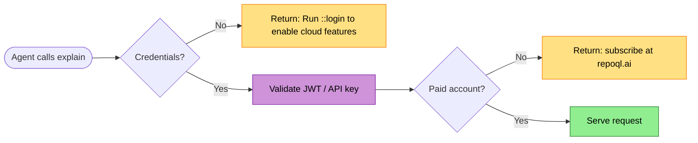
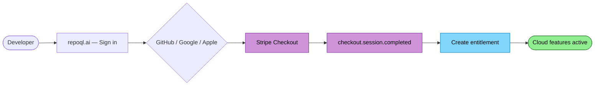
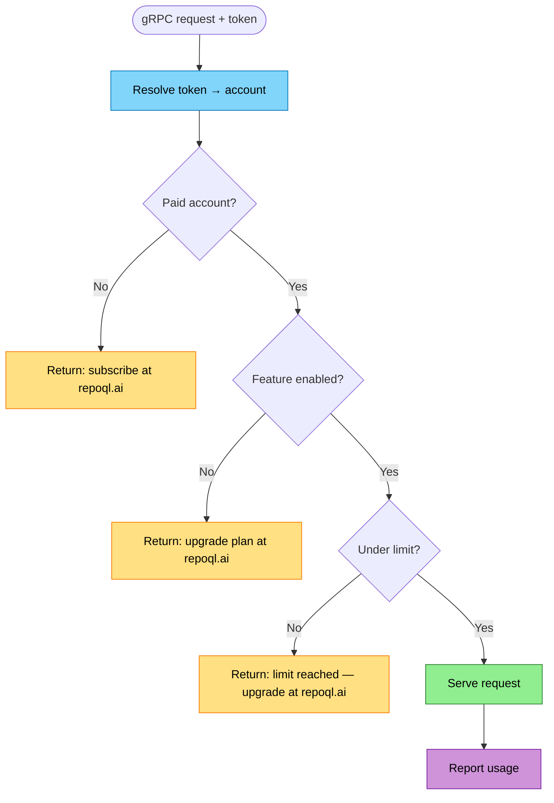

# Authentication and Billing Flow

RepoQL core is free — structural queries, local semantic search, JIT embedding all work without an account. Cloud features (explain, reranking, cloud embedding) require a paid account.

No BYO keys. No self-hosted LLM service. One hosted service, one identity, two payment rails (GitHub Marketplace or Stripe).

## The Model

```
No account    ──► RepoQL core: structural queries, local ONNX search, JIT embedding
                  (everything that doesn't touch the cloud — works forever, free)

Paid account  ──► Core + cloud: explain, reranking, cloud embedding
                  (GitHub Marketplace or Stripe — sign in with GitHub, Google, or Apple)
```

The line is simple: if it runs locally, it's free. If it hits the cloud, it requires a paid account.

## Identity

GitHub is the primary identity — most RepoQL users have it. Google and Apple are also supported for the Stripe path and web sign-up.

| Tier | Identity | Payment |
|------|----------|---------|
| No account | None | None — everything is local |
| Paid (Marketplace) | GitHub | GitHub billing (automatic with app install) |
| Paid (Stripe) | GitHub, Google, or Apple | Stripe (linked at checkout) |

## Credentials

Two credential types for gRPC calls:

| Type | Source | Lifetime | Use case |
|------|--------|----------|----------|
| Refresh token → JWT | `::login` or `repoql login` (device flow OAuth) | Access token ~1h, refresh token long-lived | Interactive developers |
| API key | Operator-issued | Long-lived, manually revocable | Early access, CI, non-interactive environments |

Both are sent as `authorization: Bearer <token>` on gRPC calls. JWTs are validated statelessly (signature check). API keys are validated via cached DB lookup.

Credentials stored in `~/.repoql/credentials` (file permissions restricted to owner). See [llm-service-integration.md](../../designs/future/llm-service-integration.md#authentication) for the client perspective and [llm-service.md](../../designs/future/llm-service.md#authentication) for the server perspective.

**TODO:** Account merging across identity providers needs a secure design. Auto-merge on email match is an identity hijacking vector — merging must require confirmation from the existing account holder.

## Bootstrap: Allowlist Access

Before billing is wired up, access is controlled by a simple GitHub username allowlist. This is the only access mechanism until Marketplace/Stripe integration ships.

```json
// llm-service config (or env var REPOQL_ALLOWED_USERS)
{
  "allowed_users": ["stueeey", "collaborator1", "beta-tester-2"],
  "default_plan": "pro"
}
```

**How it works:**

1. gRPC request arrives with bearer token (JWT or API key)
2. Service resolves token → account → GitHub identity
3. GitHub username in allowlist → full access at `default_plan` level, no limits enforced
4. Not in allowlist → "Access not yet available — request an invite"

**Properties:**
- Add/remove users by editing config — no restart required (file watch or `::reload` command)
- All allowlisted users get the same plan (default: pro) — no per-user tiers yet
- Usage is tracked (metering always runs) but limits are not enforced — cost is yours during bootstrap
- Delete this entire mechanism when real billing ships

This is scaffolding. It earns its place by letting you onboard testers today without building billing today.

---

## Activation: No Account → Paid

### Via CLI (primary path)

First time an agent calls explain without credentials:



The agent sees: "Run ::login to enable cloud features." After login and subscription, requests flow through.

### Via web

1. Visit `repoql.ai`, sign in with GitHub, Google, or Apple
2. Subscribe via GitHub Marketplace or Stripe Checkout
3. Run `::login` or `repoql login` to authenticate the CLI (device flow — same OAuth identity)

The web path creates the account and subscription. The CLI authenticates via device flow OAuth, receiving a refresh token that maps to the same account.

## Payment: GitHub Marketplace


1. **Install App** — User clicks "Install" on GitHub Marketplace listing
2. **Pick Plan** — Pro or Team (GitHub presents the options)
3. **Webhook** — GitHub sends `marketplace_purchase` to service
4. **Create Entitlement** — Account created with plan limits and features

**One click.** User has GitHub billing set up already. No forms, no second account.

### Webhook Events

| Event | Action |
|-------|--------|
| `marketplace_purchase` (purchased) | Create entitlement |
| `marketplace_purchase` (changed) | Update plan/limits |
| `marketplace_purchase` (cancelled) | Revoke cloud access at period end |
| `marketplace_purchase` (pending_change) | Queue change for end of billing cycle |

### Usage Reporting

Service reports usage to GitHub's metering API for usage-based components:
```
POST /orgs/{org}/settings/billing/usage
{ "quantity": 47, "unit_type": "explain_call" }
```

## Payment: Stripe



1. **Sign in** — User visits `repoql.ai`, signs in with GitHub, Google, or Apple
2. **Checkout** — Stripe Checkout with plan selection. Account ID as `client_reference_id`
3. **Webhook** — Stripe sends `checkout.session.completed`
4. **Create Entitlement** — Account created: identity → Stripe customer → plan → limits

### Webhook Events

| Event | Action |
|-------|--------|
| `checkout.session.completed` | Create entitlement, link identity ↔ Stripe customer |
| `customer.subscription.updated` | Update plan/limits |
| `customer.subscription.deleted` | Revoke cloud access at period end |
| `invoice.payment_failed` | Grace period → then revoke |

### Usage Reporting

```
POST /v1/billing/meter_events
{ "event_name": "explain_call", "payload": { "stripe_customer_id": "cus_..." } }
```

## Unified Entitlement

Both payment rails and all identity providers converge on one account:

```
Account {
    id:                "acc_abc123"
    identities: [                          // one or more linked
        { provider: "github", id: "stueeey", email: "stu@..." },
        { provider: "google", id: "1234",    email: "stu@..." },
    ]
    org_id:            "some-org"          // if org-level plan
    plan:              "pro" | "team"
    billing_provider:  "github" | "stripe"
    billing_id:        "marketplace_abc" | "cus_xyz"
    features: {
        explain:         true
        reranking:       true
        cloud_embedding: true              // team only, or pro with repo limit
    }
    limits: {
        explain_calls:   2000 | unlimited
        embedding_tokens: 5_000_000 | unlimited
    }
    usage: {
        explain_calls:   147
        embedding_tokens: 820_000
    }
}
```

### Per-Request Check

Every gRPC request carries a bearer token — a JWT access token (from refresh token flow) or an operator-issued API key. Both resolve to an account.


*Blue = local check. Purple = usage reporting. Green = served. Yellow = rejected with guidance.*

Token resolution:
| Token type | Resolution |
|-----------|------------|
| JWT (from refresh token) | Validate signature → extract `account_id` from claims (no DB lookup) |
| API key (operator-issued) | Cached DB lookup → resolve to account |

Every rejection is actionable:
```
No credentials          → "Run ::login to enable cloud features"
Expired/revoked         → "Session expired — run ::login to re-authenticate"
No paid account         → "Subscribe at repoql.ai to enable explain, reranking, and more"
Limit reached           → "2000/2000 explain calls used — upgrade at repoql.ai/upgrade"
Feature not in plan     → "Cloud embedding requires Team plan — repoql.ai/upgrade"
Payment failed          → "Billing issue — check repoql.ai/billing"
```

## Plan Structure

| Plan | Price (Marketplace) | Price (Stripe) | Explain | Reranking | Cloud Embedding |
|------|--------------------|--------------:|--------:|----------:|----------------:|
| **Pro** | $12/month | $10/month | 2,000/month | Included | 5 repos |
| **Team** | $30/seat/month | $25/seat/month | Unlimited | Included | Unlimited |

Price differential reflects GitHub's 25% cut — both land at roughly the same net revenue. Users self-select on convenience (Marketplace) vs price (Stripe).

No free cloud tier. Cloud features cost real money per-call — giving them away creates a sustainability problem. The free experience is RepoQL core, which is genuinely useful on its own.

## Why Both Payment Providers

| Concern | GitHub Marketplace | Stripe |
|---------|-------------------|--------|
| User friction | Lowest (one click) | Low (one extra page) |
| Your margin | ~75% | ~97% |
| Pricing flexibility | Limited (per-unit, flat) | Unlimited |
| Enterprise billing | GitHub orgs | Stripe invoicing |
| International taxes | GitHub handles | Stripe Tax handles |
| User trust | "I already pay GitHub" | "Another subscription" |

**Marketplace** is the default recommendation. **Stripe** is for price-conscious users and enterprise billing needs.

Users can switch between providers — cancel one, activate the other. Entitlement transfers because identity is the constant.

## Data Privacy

The LLM service sends user code to third-party providers. This must be transparent.

### xAI (Grok 4.1 Fast) — Synthesis

| Concern | Status |
|---------|--------|
| Trains on API data? | **No** — enterprise API terms prohibit it |
| Data retention | 30 days, then deleted |
| DPA available | Yes, public at x.ai/legal/data-processing-addendum |
| SOC 2 | Type 2 claimed |
| GDPR | Covered via DPA with SCCs |
| De-identified data | xAI may create and use de-identified usage data |

### Voyage AI — Reranking and Embedding

| Concern | Status |
|---------|--------|
| Trains on API data? | **Yes by default** — perpetual license in ToS |
| Opt-out available | Yes — dashboard toggle, paid accounts only, admin only |
| Opt-out retroactive? | **No** — data submitted before opt-out may remain in training sets |
| Data retention (after opt-out) | Zero-day — deleted immediately after processing |
| DPA available | Not public for direct API; available via MongoDB Atlas path |
| SOC 2 | Claimed (type unspecified) |
| VPC deployment | Available via AWS/Azure Marketplace (data never leaves your account) |

**Required action before launch:** Opt out of Voyage AI training data usage in the dashboard. This must happen before any user code is sent to their API.

**What users should know:**
- Embedding sends chunk text (headlines, structure, and body content) to Voyage
- Explain sends assembled code context to xAI (Grok) for synthesis
- Tool calls during explain can send file content to xAI
- Reranking sends headline + structure text to Voyage
- xAI does not train on this data; Voyage does not after opt-out
- xAI retains data for 30 days; Voyage deletes immediately after opt-out

This information must be visible at `repoql.ai/privacy` and referenced in the subscription flow.

## Failure Modes

| Failure | Impact | Recovery |
|---------|--------|----------|
| OAuth provider down | Login fails for new sessions | Existing JWTs and API keys still validate (stateless); new logins blocked until recovery |
| Marketplace webhook missed | Entitlement not created | Reconciliation job polls Marketplace API hourly |
| Stripe webhook missed | Entitlement not created | Reconciliation job polls Stripe Subscriptions API hourly |
| Payment failed (Stripe) | 7-day grace period | Stripe retries; after grace, revoke cloud access |
| Payment failed (Marketplace) | GitHub handles retry | Cancellation webhook on final failure |
| User cancels | Revoke cloud access at period end | Webhook triggers; cloud features disabled next period |
| No credentials configured | Cloud features unavailable | "Run ::login to enable cloud features" |

## Key Design Decisions

| Decision | Rationale |
|----------|-----------|
| Core free, cloud paid (no free cloud tier) | Cloud features cost real money per-call; free tier creates unsustainable economics |
| GitHub primary, Google/Apple for Stripe path | GitHub covers most devs; Google/Apple widens the web funnel |
| JWT refresh tokens + operator-issued API keys | Refresh tokens for interactive use (stateless validation); API keys for early access and CI |
| Entitlement abstraction | Service logic never branches on identity provider or payment source |
| No BYO keys | One hosted service, one set of provider credentials, simpler to operate |
| Every rejection includes a URL | Agent can surface it; user can act on it immediately |
| Reconciliation over webhooks alone | Webhooks are unreliable; polling catches missed events |
| Voyage opt-out mandatory before launch | Default training license is unacceptable for user code |
