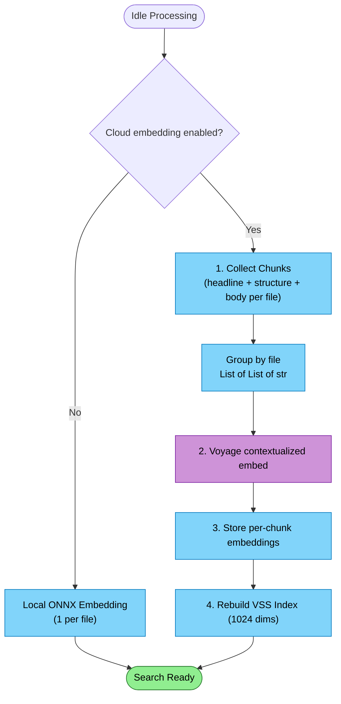

# Contextualized Chunk Embedding Flow

Paid accounts get symbol-level semantic search via Voyage's contextualized chunk embeddings. Instead of one embedding per file, each symbol (method, class, section) gets its own embedding — encoded with awareness of its sibling symbols in the same file. This is an upgrade path, not the default — local ONNX handles volume.

## Why Contextualized Chunks

| Approach | Granularity | Quality | Example |
|----------|------------|---------|---------|
| Local ONNX (1 per file) | File-level | "This file is about auth" | Finds the right file |
| Standard cloud (1 per file) | File-level | Better file matching | Finds the right file, more accurately |
| **Contextualized chunks** | **Symbol-level** | **"This method validates JWTs by checking expiry"** | **Finds the right method** |

The difference: an agent searching "JWT token expiry validation" gets pointed at the exact 20-line method, not a 500-line file it then has to read and search through.

### How Contextualization Works

Each chunk is embedded with awareness of its siblings in the same document. Voyage's `voyage-context-3` model sees all chunks from a file together and encodes each one with cross-chunk context signals.

```
Without context:  "if (token.ValidTo < DateTime.UtcNow)"  → generic expiry check
With context:     same chunk, but model also sees "JwtAuthMiddleware",
                  "ValidateToken", "RefreshToken", "AuthOptions"
                  → unambiguously JWT auth expiry validation
```

Their benchmarks show rank 8 → rank 1 for the same chunk when contextualized. For code search, where symbol names are often generic (`Process`, `Handle`, `Execute`), the surrounding context is what disambiguates.

## Why This Is Optional

| Local ONNX (default) | Cloud Contextualized (paid) |
|----------------------|---------------------------|
| E5-small-v2, 384 dims, 1 vector per file | voyage-context-3, 1024 dims, N vectors per file |
| Free, instant, offline | ~$0.06/1M tokens |
| File-level search | Symbol-level search |
| Sufficient for most use | Significant quality jump on complex codebases |

The local model is not a fallback. Cloud embedding is for paid accounts who want symbol-level precision.

## Trigger

Paid account has cloud embedding enabled. The flow runs during idle processing, after pruning, replacing or supplementing the local embedding generation stage.

## Stages

### 1. Chunk Collection

**Actor**: RepoQL Host (VectorIndexCoordinator)
**Action**: For each file pending embedding, collect headline + structure + body chunks grouped by symbol spans
**Output**: `List<List<string>>` — outer list is files, inner list is ordered chunks per file
**Failure**: N/A — local collection

RepoQL already has everything needed:
- **Headline**: from x-ray summary (what this file/class is)
- **Structure**: from x-ray structure (the shape — methods, types, signatures)
- **Body chunks**: file content split on symbol boundaries from the `span` table

```
inputs = [
  [                                           // File 1
    "JwtMiddleware.cs | JwtAuthMiddleware : IMiddleware",   // headline
    "- ValidateToken(string) → ClaimsPrincipal\n- Refresh...", // structure
    "public async Task<ClaimsPrincipal> ValidateToken...",  // body: method 1
    "public async Task<TokenPair> RefreshToken...",         // body: method 2
  ],
  [                                           // File 2
    "AuthOptions.cs | AuthOptions",
    "- Issuer: string\n- Audience: string\n- SigningKey...",
    "public class AuthOptions\n{\n    public string Issuer...",
  ],
]
```

**Chunking rules:**
- Chunk on symbol boundaries (spans already in the graph) — zero overlap
- Headline is always chunk 0, structure is always chunk 1
- Body chunks follow in document order
- Files exceeding 32k tokens: drop body chunks from the end until it fits (headline + structure always included)

### 2. Contextualized Embed Request

**Actor**: LLM Service (Voyage AI)
**Action**: Call `POST /v1/contextualizedembeddings` with grouped chunks
**Output**: Per-chunk embeddings (one vector per chunk, contextualized within its file)
**Failure**: Partial batch success — return what succeeded, report failures

The host sends a gRPC `EmbedContextualized` request with:
- Grouped chunks (files × chunks)
- `input_type: "document"` for indexing
- `output_dimension: 1024`
- Model: `voyage-context-3`

The service calls Voyage's contextualized embedding API:
- Max 1,000 inputs (files), 16k total chunks, 120k total tokens per request
- Parallelizes across multiple API calls for large repos

```
Cost estimate (1000-file repo, ~5 chunks/file avg):
  ~5000 chunks × ~300 tokens each = 1.5M tokens
  1.5M × $0.06/1M = $0.09
  One-time cost; incremental after that
```

**Query embedding** uses `input_type: "query"` and passes the query as a single-element list — this produces a standard (non-contextualized) embedding compatible with the chunk space.

### 3. Embedding Storage

**Actor**: RepoQL Host (DuckDbDataStore)
**Action**: Write per-chunk embeddings to `document_embedding` table with model tag and chunk metadata
**Output**: Embeddings stored with model version, chunk index, and symbol URI
**Failure**: Write error propagates

Each chunk gets its own row:
```
DocumentEmbedding {
    DocId:       file document GUID
    NodeId:      symbol node GUID (or doc GUID for headline/structure)
    ChunkIndex:  0 (headline), 1 (structure), 2..N (body chunks)
    Type:        Structure | FullText
    Uri:         file:///src/Auth/JwtMiddleware.cs#symbol=ValidateToken
    Scope:       "object" for symbol chunks, "document" for headline/structure
    Vector:      float[1024]
    Model:       "voyage-context-3"
    Dimension:   1024
}
```

### 4. VSS Index Refresh

**Actor**: RepoQL Host (VectorIndexCoordinator)
**Action**: Rebuild HNSW index for the cloud embedding space (1024 dims)
**Output**: Vector search ready for symbol-level cloud embeddings
**Failure**: Warning logged, local search unaffected

## Termination

Flow completes when all chunks are embedded and VSS index rebuilt. Subsequent searches can use cloud embeddings for symbol-level retrieval.

## Flow Diagram


*Purple = cloud cost. Blue = local/free. Green = result.*

## Embedding Space Management

Cloud embeddings use a single fixed dimension (1024) in a separate space from local ONNX (384 dims). These are incompatible spaces — no mixing, no cross-space queries.

| Scenario | Behavior |
|----------|----------|
| Local only (default) | E5-small, 384 dims, 1 vector per file, single HNSW index |
| Cloud enabled | voyage-context-3, 1024 dims, N vectors per file, separate HNSW index |
| Query routing | If cloud embeddings exist for a scope, query the cloud space. Otherwise local |
| Query embedding | `input_type: "query"` — single-element list, compatible with chunk space |
| Model upgrade | New embeddings replace old in cloud space. Re-embed incrementally |
| Partial coverage | Files not yet cloud-embedded fall back to local. No mixed-space queries |

## Cost Projections

Costs are higher than flat per-file embedding because of multiple chunks per file, but the quality delta is substantial.

| Repo size | Files | Chunks (est.) | Tokens (est.) | One-time cost | Incremental/day |
|-----------|-------|---------------|---------------|---------------|-----------------|
| Small | 100 | ~500 | ~150k | $0.009 | < $0.001 |
| Medium | 1,000 | ~5,000 | ~1.5M | $0.09 | ~$0.005 |
| Large | 10,000 | ~50,000 | ~15M | $0.90 | ~$0.05 |
| Very large | 100,000 | ~500,000 | ~150M | $9.00 | ~$0.50 |

Assumes ~5 chunks per file averaging ~300 tokens each. Actual costs depend on codebase structure — files with many methods produce more chunks.

## API Constraints

| Constraint | Value | Implication |
|------------|-------|-------------|
| Context window per document | 32k tokens | Large files: drop trailing body chunks |
| Total tokens per request | 120k | Batch ~30-40 typical files per API call |
| Max chunks per request | 16k | Not a practical limit |
| Max inputs per request | 1,000 | Files per API call |
| Supported dimensions | 256, 512, 1024, 2048 | Fixed at 1024 |
| Output dtypes | float, int8, uint8, binary, ubinary | float for quality |

## Why Headline + Structure + Body (not just body)

| Layer | Searchable? | Role as context |
|-------|------------|-----------------|
| Headline | Yes — "what files handle auth?" | Anchors every sibling chunk to a specific component |
| Structure | Yes — "what methods does UserService have?" | Maps the full API surface; body chunks know their neighbors |
| Body chunks | Yes — "JWT expiry validation logic" | Disambiguated by headline + structure + adjacent bodies |

All chunks are searchable. But headline and structure serve double duty: they're findable themselves AND they provide the contextual frame that makes body chunks precise.
