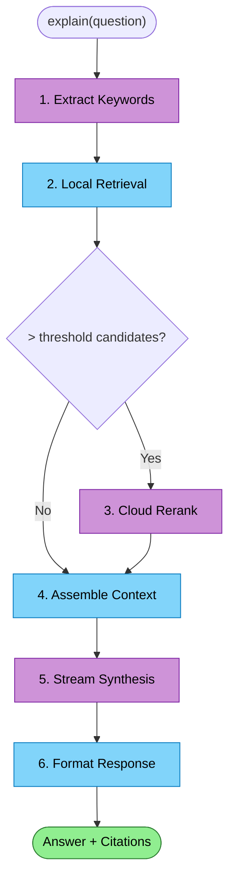

# Explain Synthesis Flow

Agent asks a natural-language question about the codebase. The RepoQL host gathers context locally, then sends it to the LLM service for synthesis via Grok 4.1 Fast.

## Why This Costs Money

| Without cloud LLM | With cloud LLM |
|-------------------|----------------|
| Agent reads files one by one | Agent gets synthesized understanding |
| 10-50 read tool calls, 5-20k tokens each | One explain call, 1-2k tokens back |
| Agent synthesizes in its own context window | Synthesis happens outside context window |
| Minutes of agent time at ~$0.01-0.10/min | One API call at ~$0.001-0.01 |

The ROI is clear: explain saves the agent (and user) far more than it costs.

## Trigger

Agent calls `explain(question="...", uriGlob="...", tokenBudget=2000)`.

## Stages

### 1. Keyword Extraction

**Actor**: LLM Service (Grok 4.1 Fast non-reasoning)
**Action**: Extract search keywords from natural-language question
**Output**: Optimized keyword list for search
**Failure**: Use question text directly as keywords

The host sends the raw question to the service. The service calls Grok 4.1 Fast non-reasoning variant ($0.20/1M input) — this is a lightweight call, typically <100 tokens in and out.

```
Question: "How does the authentication middleware validate JWT tokens?"
Keywords: ["authentication", "middleware", "JWT", "token", "validate"]
```

### 2. Local Retrieval

**Actor**: RepoQL Host (ExploreOrchestrator)
**Action**: Search with extracted keywords using local ONNX embeddings + BM25 + fuzzy
**Output**: ~40 candidate results with relevance scores
**Failure**: Return search error to agent

This stage is entirely local — no cloud cost. The hybrid search (BM25 + local semantic + fuzzy) produces candidates ranked by the local model.

### 3. Cloud Reranking (optional)

**Actor**: LLM Service (Voyage rerank-2.5)
**Action**: Rerank candidates using cross-encoder model
**Output**: Re-scored candidates, top N selected
**Failure**: Fall back to local ranking

See [reranking.md](reranking.md). Only fires when candidate count exceeds a threshold (e.g., >20 candidates). The reranker sees query + passage text and produces a relevance score that's more accurate than vector distance.

### 4. Context Assembly

**Actor**: RepoQL Host (ExploreOrchestrator)
**Action**: Re-render top results at Inspect depth (up to 50k tokens)
**Output**: Rich context payload for LLM synthesis
**Failure**: Use whatever context was already rendered

The host reads the top results at full depth — file content, structure, surrounding context. This is local I/O against the DuckDB graph, no cloud cost. The 50k token context window targets the sweet spot: enough for thorough synthesis, well within Grok 4.1 Fast's 2M window.

### 5. Synthesis

**Actor**: LLM Service (Grok 4.1 Fast reasoning)
**Action**: Synthesize answer from assembled context
**Output**: Streamed answer with citations
**Failure**: Return error with context summary as fallback

The host sends a gRPC `Synthesize` request with:
- The original question
- Assembled context (50k tokens)
- Token budget for the answer
- Optional repo tree for orientation

The service calls Grok 4.1 Fast reasoning variant. The response streams back via server-side streaming RPC. The host renders partial results as they arrive.

```
Cost estimate:
  Input:  ~50k tokens × $0.20/1M = $0.01
  Output: ~1k tokens  × $0.50/1M = $0.0005
  Total:  ~$0.01 per explain call
```

### 6. Response Formatting

**Actor**: RepoQL Host (ExploreOrchestrator)
**Action**: Format synthesis with evidence citations and footer
**Output**: Rendered response with token count and readiness status
**Failure**: N/A — formatting is local

## Termination

Flow completes when the full synthesis is streamed back and formatted. The agent sees:
- Synthesized answer with citations
- Evidence from specific files/symbols
- Token budget consumed
- Scope readiness status

## Flow Diagram


*Purple = cloud cost. Blue = local/free. Green = result.*

## Cost Breakdown

| Stage | Provider | Typical cost | Avoidable? |
|-------|----------|-------------|------------|
| Keyword extraction | Grok 4.1 Fast (non-reasoning) | ~$0.0001 | Could use local heuristics, but quality drops |
| Local retrieval | Local ONNX + BM25 | $0 | No — this is the foundation |
| Reranking | Voyage rerank-2.5 | ~$0.0001 | Yes — skip if <20 candidates |
| Context assembly | Local I/O | $0 | No |
| Synthesis | Grok 4.1 Fast (reasoning) | ~$0.01 | No — this is the value |
| **Total** | | **~$0.01** | |

## Key Design Decisions

| Decision | Rationale |
|----------|-----------|
| Stream synthesis back | Agent sees progress; host can render incrementally |
| 50k context, not 2M | ROI: 50k is enough for most questions; 2M available for complex ones |
| Non-reasoning for keywords | Cheaper, faster, sufficient for keyword extraction |
| Reasoning for synthesis | Better quality justifies the cost for the high-value operation |
