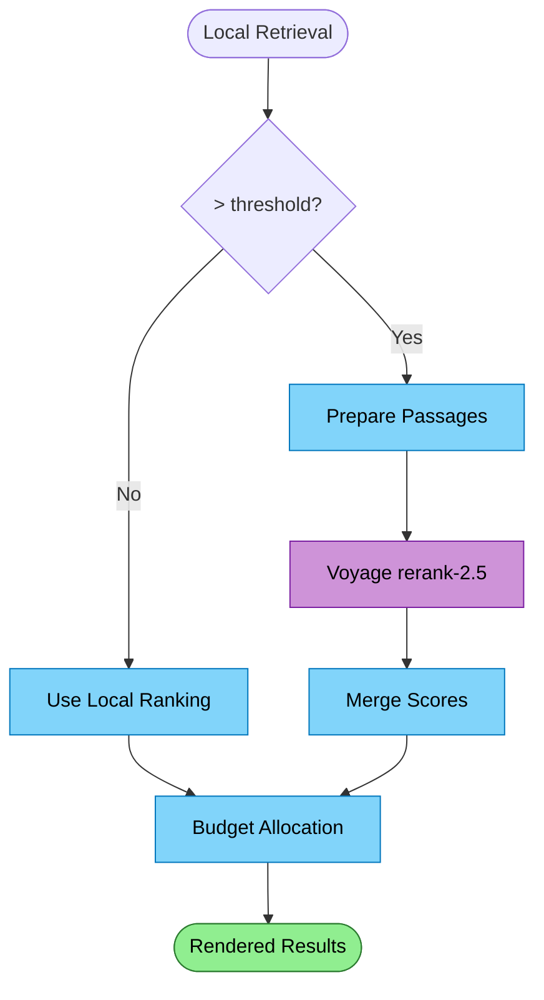

# Search Reranking Flow

After local retrieval produces candidates, Voyage's cross-encoder reranker re-scores them so the top results are genuinely the most relevant — not just the nearest vectors from a small local model.

## Why This Matters

| Without reranking | With reranking |
|-------------------|----------------|
| Top 10 = 10 nearest local vectors | Top 10 = 10 most relevant by cross-encoder |
| Small model misses conceptual matches | Cross-encoder sees query + passage together |
| Agent reads some irrelevant results | Agent reads the best results |
| Wasted tokens on low-value content | Budget spent on high-value content |

Reranking is the highest ROI cloud call. It costs almost nothing (~$0.0001 per call) and directly improves every search result the agent sees.

## Trigger

ExploreOrchestrator retrieval produces more candidates than the reranking threshold (e.g., >20). Below threshold, local ranking is good enough.

## Stages

### 1. Candidate Collection

**Actor**: RepoQL Host (ExploreOrchestrator)
**Action**: Hybrid search (BM25 + local semantic + fuzzy) produces ranked candidates
**Output**: N candidates with local scores, headlines, and structure text
**Failure**: N/A — local search

### 2. Rerank Request

**Actor**: LLM Service (Voyage rerank-2.5)
**Action**: Cross-encoder scores each (query, passage) pair
**Output**: Re-scored candidates with relevance scores
**Failure**: Return original local ranking

The host sends a gRPC `Rerank` request with:
- The query text
- Candidate passages (headline + structure, not full content)
- Desired top-K count

The service calls Voyage `rerank-2.5`:
- Query limit: 4,000 tokens
- Per pair: up to 32k tokens (query + document)
- Total budget: 600k tokens per request
- Max documents: 1,000 per request

```
Cost: $0.05 per 1M tokens searched
Typical: 40 candidates × ~200 tokens each = 8k tokens = $0.0004
```

### 3. Score Merge

**Actor**: RepoQL Host (ExploreOrchestrator)
**Action**: Merge rerank scores with local scores
**Output**: Final ranking combining cross-encoder relevance with local signals
**Failure**: N/A — merge is local

The reranker provides a relevance score per candidate. The host merges this with local signals (recency, file type affinity, scope match) to produce the final ranking. Cross-encoder score dominates but local signals break ties.

### 4. Budget Allocation

**Actor**: RepoQL Host (ValueBasedAllocator)
**Action**: Allocate token budget across top results based on merged scores
**Output**: Per-result token budget for rendering
**Failure**: N/A — allocation is local

## Termination

Flow completes when re-ranked results are rendered within the agent's token budget.

## Flow Diagram


*Purple = cloud cost. Blue = local/free. Green = result.*

## When NOT to Rerank

| Scenario | Why skip |
|----------|----------|
| < 20 candidates | Local ranking is adequate for small result sets |
| Inventory intent | Breadth over depth; ranking precision less critical |
| Known URI reads | Agent already knows what it wants; no ranking needed |
| Service unreachable | Local ranking is the foundation, not a fallback |

## Reranker Constraints

| Constraint | Value | Implication |
|------------|-------|-------------|
| Query token limit | 4,000 | Long questions need truncation |
| Pair token limit | 32k | Structure text fits; full content may not |
| Request token budget | 600k | ~3,000 passages of ~200 tokens each |
| Max documents | 1,000 | Well beyond typical candidate count |
| Latency | ~100-200ms | Negligible relative to search + rendering |
