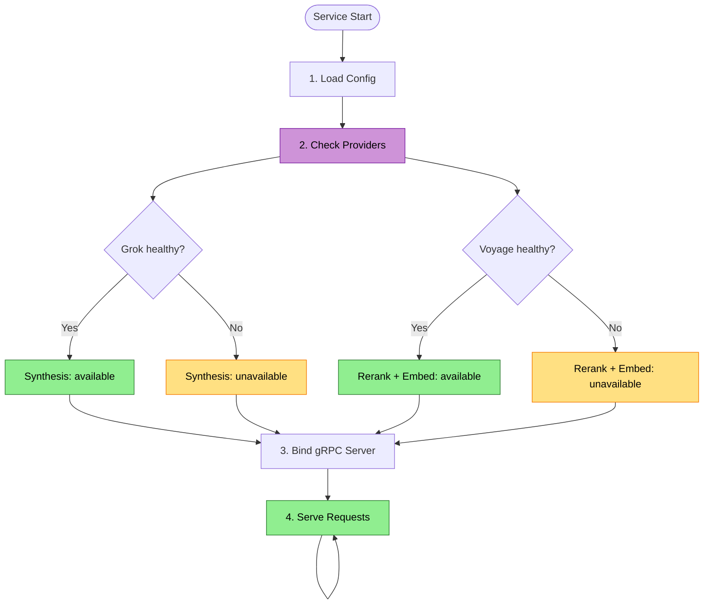

# Service Lifecycle Flow

The LLM service starts, validates provider connectivity, advertises health, and handles graceful degradation when providers fail.

## Trigger

The hosted LLM service starts and validates provider connectivity.

## Stages

### 1. Configuration Load

**Actor**: LLM Service
**Action**: Load provider credentials and configuration
**Output**: Provider configs for Grok and Voyage
**Failure**: Missing credentials → service starts degraded, reports which providers are unavailable

Configuration sources (in priority order):
- Environment variables (`XAI_API_KEY`, `VOYAGE_API_KEY`)
- Config file (`llm-service.json` or similar)
- Secret store (Azure KeyVault, AWS Secrets Manager — for shared deployments)

### 2. Provider Health Check

**Actor**: LLM Service
**Action**: Validate connectivity to each provider
**Output**: Per-provider health status
**Failure**: Mark provider as unavailable, continue startup

| Provider | Health check | Timeout |
|----------|-------------|---------|
| Grok 4.1 Fast | Lightweight chat completion (e.g., "ping") | 5s |
| Voyage Embeddings | Embed a single test passage | 5s |
| Voyage Reranker | Rerank a single test pair | 5s |

Each provider is checked independently. A service with only Grok available can still serve explain (without reranking). A service with only Voyage available can serve reranking and embedding (without explain).

### 3. gRPC Server Start

**Actor**: LLM Service
**Action**: Bind gRPC server on configured address
**Output**: Listening on port/socket
**Failure**: Port in use → fail fast with clear error

The service exposes:
- `LlmService.Ask` — unary RPC for synthesis (no tools)
- `LlmService.AskWithTools` — bidirectional streaming RPC for synthesis with function calling
- `LlmService.ExtractKeywords` — unary RPC for keyword extraction
- `LlmService.Rerank` — unary RPC for search reranking
- `LlmService.EmbedContextualized` — unary RPC for contextualized chunk embedding
- `grpc.reflection.v1alpha.ServerReflection` — service discovery

### 4. Steady State

**Actor**: LLM Service
**Action**: Serve requests, monitor provider health via circuit breakers
**Output**: Continuous operation
**Failure**: Provider failures trigger per-capability circuit breakers

No dedicated health endpoint or polling. Provider health is inferred from real calls: consecutive failures trip a circuit breaker for that capability. RepoQL hosts have their own client-side circuit breakers — they learn capabilities through use, not health queries.

Service-side circuit breakers per provider (Grok, Voyage) auto-recover after backoff. If a previously failed provider recovers, capabilities restore automatically on the next successful call.

### 6. Shutdown

**Actor**: LLM Service
**Action**: Graceful shutdown on SIGTERM/SIGINT
**Output**: In-flight requests complete, new requests rejected
**Failure**: Force kill after timeout

## Flow Diagram


*Purple = external provider check. Green = healthy/serving. Yellow = degraded.*

## Host Connection Behavior

| Service state | RepoQL host behavior |
|---------------|---------------------|
| Unreachable | Core features work (structural queries, local search); cloud calls fail, client circuit breaker disables cloud interfaces |
| Starting | Connection retry with backoff; local search works meanwhile |
| Serving (all) | Full capabilities: explain, reranking, optional cloud embedding |
| Serving (partial) | Available capabilities used; unavailable ones gracefully skipped |
| Shutting down | In-flight requests complete; reconnect triggers on next attempt |

## Cost and Usage Tracking

The service tracks per-request costs and per-user usage:
- gRPC response metadata (cost of this request, usage against plan limits)
- Metrics endpoint (aggregate cost by provider, query type, time period)
- Usage reported to billing provider (GitHub Marketplace metering or Stripe Billing Meters)

Plan limits enforced per-request. When a user's limit is reached, the service returns a clear error: "2000/2000 explain calls used this month — upgrade at repoql.ai."

## Open Question: Content-Addressable Caching

**Context:** A team of 100 developers on the same codebase. Without caching, each developer's RepoQL host independently embeds the same files and asks similar explain questions — paying full provider cost each time. With caching, the first request pays; subsequent identical requests are served from cache.

**Why it works for teams on the same codebase:**

Contextualized embeddings are deterministic — same chunk texts produce the same vectors. On a shared codebase, 100 users on the same commit have identical file content. The cache key is `hash(model + all_chunk_texts_in_document)`, not user-specific. Content-addressable entries are never stale — same content always produces the same embedding. Evicted for space, never invalidated for correctness.

| Request type | Cache key | Hit rate (100-user team) | Savings |
|-------------|-----------|------------------------|---------|
| Contextualized embedding | `hash(model + chunk_texts[])` | ~99% (same files across users) | 100× embed cost |
| Explain synthesis | `hash(question + context_hash)` | High (common questions, same codebase) | 10-50× per popular question |
| Reranking | `hash(query + candidate_hashes)` | Moderate | Lower — candidate sets vary |

**What invalidates cache entries:**

| Event | Embedding cache | Explain cache |
|-------|----------------|---------------|
| File edited | Only that file's chunks (new content = new hash) | Questions touching that file |
| Branch divergence | Only divergent files | Questions touching divergent files |
| Model upgrade | Everything (new model = new hash) | N/A |
| Nothing changed | Nothing invalidated | Nothing invalidated |

**The product implication:** The cache makes the Team tier nearly free to serve at marginal cost. The first few users embed the repo and ask the initial questions. Everyone else benefits. The team isn't just sharing a subscription — they're sharing understanding. This changes the value proposition from "unlimited calls per seat" to "collective intelligence that gets cheaper per person as the team grows."

**Cost estimate (100-person team, medium codebase):**

```
Without cache:  100 users × $0.20 embed + 100 × 20 explain/day × $0.01 = $40/day
With cache:     $0.20 embed + ~$2/day explain (most are hits)     = ~$2.20/day
Team revenue:   100 × $25/seat = $2,500/month
```

Near-pure margin after the first few users.

**Infrastructure:** Redis/Valkey alongside the service. Embeddings are ~4KB each (1024 floats). 100k cached entries = ~400MB. Cheap to run, simple to operate.

**Unresolved:** Does this change how we think about per-seat pricing vs per-org pricing? If marginal cost per seat approaches zero, per-seat pricing is pure margin capture — which is fine commercially but may feel unfair to large teams. Per-org tiered pricing might align incentives better.
