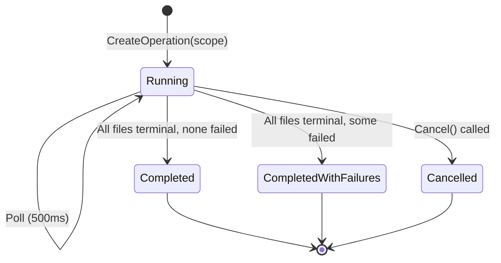
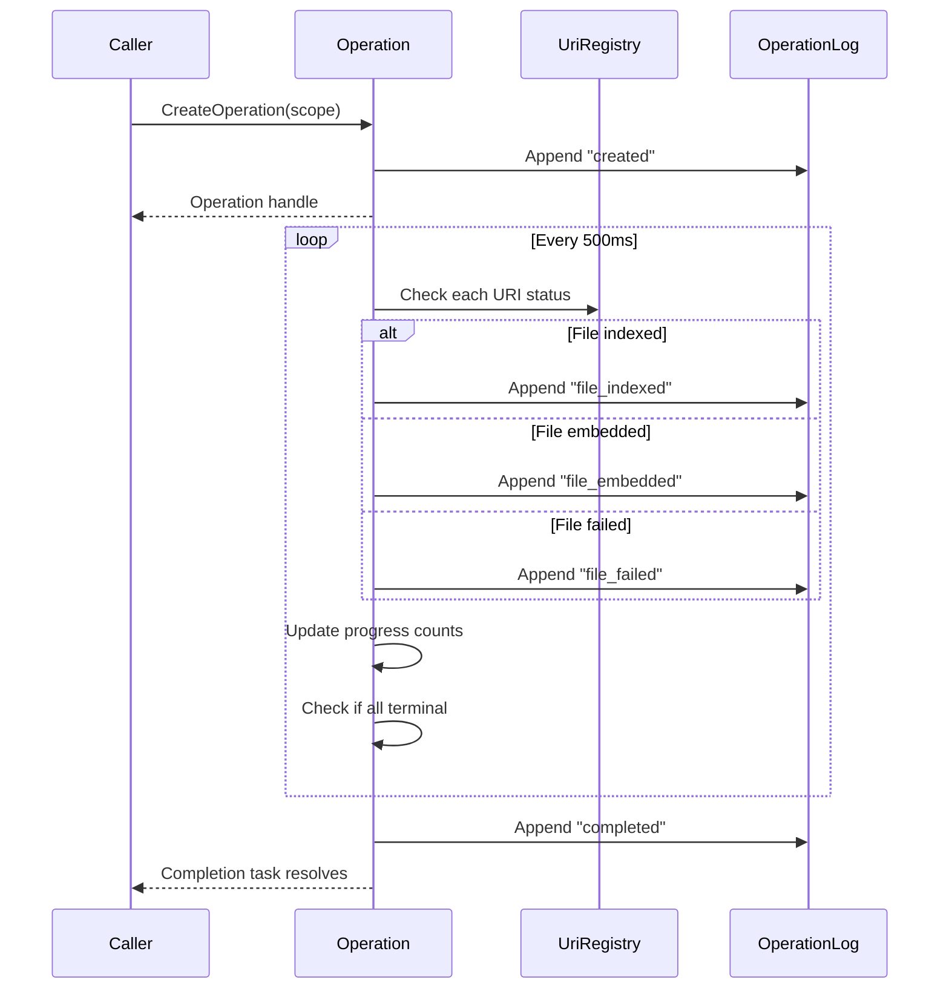

# Operation Lifecycle Flow

Track a batch of files from discovery to query-readiness, with progress visibility and performance telemetry.

## Why This Matters

When you import a repository or reindex files, you need to know when they're ready to query. Without operations, you're guessing.

| Without | With |
|---------|------|
| "Is my import done?" - check manually, hope | Await completion, get notified |
| "Why is it slow?" - no visibility | Milestones show where time is spent |
| "What failed?" - grep logs | Query `_operation_log` for failures |
| "How long until ready?" - unknown | Progress shows completion percentage |

## Trigger

Any component that wants to track a batch of work calls `OperationManager.CreateOperation` with:
- **Description**: Human-readable identifier (convention: `"kind: detail"`, e.g., `"import: github://foo/bar"`)
- **Scope**: Set of URIs to track

Operations are agnostic — they don't know or care what triggered them. The description is purely for human readability and logging.

The operation starts immediately and begins polling.

## Stages

### 1. Creation
**Actor**: Caller (ImportService, RepoqlHost, etc.)
**Action**: Creates operation with scope, appends `created` entry
**Output**: Operation handle with ID, Completion task
**Failure**: None - creation is synchronous and infallible

```
| Timestamp | Type | Message | Uri |
|-----------|------|---------|-----|
| 10:00:00.000 | created | "import: github://foo/bar (1,847 files)" | null |
```

### 2. Polling Loop
**Actor**: Operation (internal timer, every 500ms)
**Action**: Checks each URI in scope against UriRegistry
**Output**: Log entries appended, Progress updated
**Failure**: Registry unavailable - skip cycle, retry next tick

For each URI in scope:

| Registry State | Entry Appended | Counts Toward |
|----------------|----------------|---------------|
| Not found | (none) | (still discovering) |
| Status = Indexing | (none) | (in progress) |
| Status = Indexed | `file_indexed` | IndexedCount |
| Status = Indexed, Embedding = Embedded | `file_embedded` | EmbeddedCount |
| Status = Indexed, Embedding = NotApplicable | `file_ready` | EmbeddedCount |
| Status = Failed | `file_failed` | FailedCount |
| Embedding = Failed | `embedding_failed` | FailedCount |

Entries are appended only once per URI (track what's been logged).

### 3. Completion Check
**Actor**: Operation (after each poll)
**Action**: Check if all URIs are in terminal state
**Output**: State transition if complete
**Failure**: None

Terminal states for a file:
- Indexed + Embedded (structure)
- Indexed + NotApplicable
- Failed (indexing or embedding)

```
IsComplete = (EmbeddedCount + FailedCount) == TotalFiles
```

### 4a. Termination: Completed
**Actor**: Operation
**Action**: Stop polling, append `completed` entry, resolve TaskCompletionSource
**Output**: Completion task returns final progress

```
| Timestamp | Type | Message | Uri |
|-----------|------|---------|-----|
| 10:00:05.230 | completed | "1,844 ready, 3 failed (5.2s)" | null |
```

### 4b. Termination: Cancelled
**Actor**: Caller (via `operation.Cancel()`)
**Action**: Stop polling, append `cancelled` entry, cancel TaskCompletionSource
**Output**: Completion task throws OperationCanceledException

```
| Timestamp | Type | Message | Uri |
|-----------|------|---------|-----|
| 10:00:02.100 | cancelled | "Cancelled at 892/1,847 (48%)" | null |
```

Already-indexed files remain indexed. Caller can:
- Restart later (new operation, catalog skips already-done files)
- Unimport to remove everything

## Flow Diagram





## Entry Types

| Type | Meaning | Message Contains |
|------|---------|------------------|
| `created` | Operation started | Description, file count |
| `file_indexed` | File finished indexing | (none) |
| `file_embedded` | File has structure embedding | (none) |
| `file_ready` | File ready (not applicable for embedding) | (none) |
| `file_failed` | Indexing failed | Error message |
| `embedding_failed` | Embedding failed | Error message |
| `completed` | All files terminal | Summary stats, duration |
| `cancelled` | Operation cancelled | Progress at cancellation |

## Progress Derivation

Progress can be computed from the log or cached for efficiency:

```sql
-- From log
SELECT
    (SELECT count(*) FROM log WHERE type = 'file_indexed') as indexed,
    (SELECT count(*) FROM log WHERE type IN ('file_embedded', 'file_ready')) as embedded,
    (SELECT count(*) FROM log WHERE type IN ('file_failed', 'embedding_failed')) as failed
```

Cached version updated each poll cycle for O(1) access.

## Error Handling

| Error | Behaviour |
|-------|-----------|
| UriRegistry unavailable | Skip poll cycle, retry next tick |
| File disappears from registry | Treat as failed, log warning |
| Poll takes longer than interval | Skip next tick, don't queue polls |
| Operation disposed while running | Cancel gracefully |

## Timing

| Phase | Duration |
|-------|----------|
| Creation | < 1ms |
| Poll cycle | 10-50ms depending on scope size |
| Poll interval | 500ms |
| Completion detection | Within 500ms of last file ready |

## Verification

| Environment | How |
|-------------|-----|
| **Local** | Create operation with test URIs, manually update registry, verify log entries and completion |
| **Automated tests** | Fake UriRegistry, advance through states, assert entries appended in order, completion fires |
| **Production** | `_operation_log(id)` UDF shows full timeline. `_operations()` lists active. Alert on operations exceeding expected duration |

**Test scenarios:**
1. Happy path - all files complete successfully
2. Partial failure - some files fail, operation completes with failures
3. Cancellation - cancel mid-way, verify state preserved
4. Empty scope - completes immediately
5. Large scope - performance test with 10k+ URIs

## SQL Surface

```sql
-- List active operations
SELECT * FROM _operations();

-- Get operation details
SELECT * FROM _operation('abc123');

-- Full event log
SELECT * FROM _operation_log('abc123');

-- Failed files with errors
SELECT uri, message, timestamp
FROM _operation_log('abc123')
WHERE type IN ('file_failed', 'embedding_failed');

-- Time to query readiness
SELECT
    datediff('millisecond',
        (SELECT timestamp FROM _operation_log('abc123') WHERE type = 'created'),
        (SELECT timestamp FROM _operation_log('abc123') WHERE type = 'completed')
    ) as ms;

-- Indexing vs embedding time
WITH phases AS (
    SELECT
        min(CASE WHEN type = 'file_indexed' THEN timestamp END) as first_indexed,
        max(CASE WHEN type = 'file_indexed' THEN timestamp END) as last_indexed,
        min(CASE WHEN type = 'file_embedded' THEN timestamp END) as first_embedded,
        max(CASE WHEN type IN ('file_embedded', 'file_ready') THEN timestamp END) as last_embedded
    FROM _operation_log('abc123')
)
SELECT
    datediff('ms', first_indexed, last_indexed) as indexing_ms,
    datediff('ms', first_embedded, last_embedded) as embedding_ms
FROM phases;
```

## Related

- [UriRegistry](../Schema.md#uri-registry) - Source of truth for file status
- [Indexing Flow](./indexing.md) - How files move through the indexing pipeline
- Import Flow (TODO) - Creates operations for imported repositories
- Unimport Flow (TODO) - Removes imported data (separate from operations)
