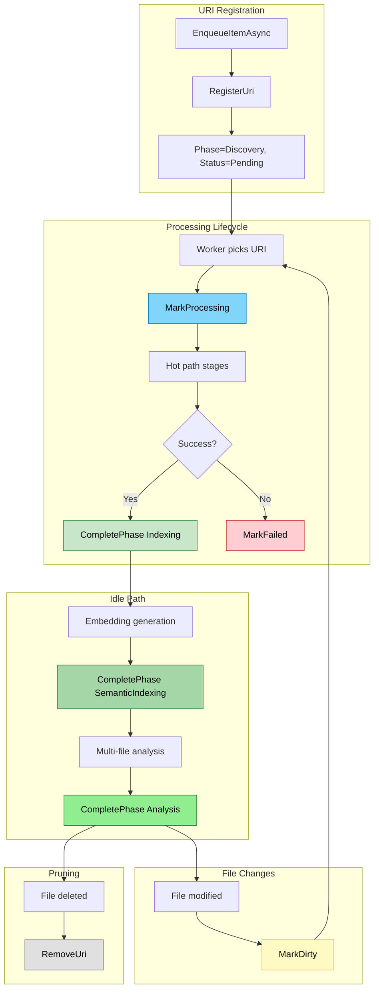

# Indexing State Flow

Central in-memory registry tracking all known URIs and their pipeline state.

## Why This Matters

| Without IndexingState | With IndexingState |
|----------------------|-------------------|
| No visibility into per-URI progress | Query any URI's current phase |
| Can't wait for specific files | Scoped waiting: "wait for src/auth/** to reach Indexing" |
| Operations must track items themselves | Operations built on URI state |
| No "dirty" concept | Mark changed files for reprocessing |

## Trigger

- URI added: `EnqueueItemAsync()` called
- Phase transition: Pipeline stage completes
- Dirty marking: File watcher detects change
- URI removed: Pruning runs

## Core Data Structure

```csharp
public sealed class IndexingState
{
    // All known URIs and their state
    private readonly ConcurrentDictionary<Uri, UriEntry> _uris = new();

    // Active operations (startup, reindex, import)
    private readonly ConcurrentDictionary<string, Operation> _operations = new();

    // Phase completion events for waiting
    public event EventHandler<UriPhaseCompletedEventArgs>? UriPhaseCompleted;
}
```

## UriEntry Schema

```csharp
public sealed class UriEntry
{
    public Uri Uri { get; }
    public OperationPhase CurrentPhase { get; private set; }
    public bool IsDirty { get; private set; }
    public UriStatus Status { get; private set; }

    // Timestamps
    public DateTimeOffset QueuedAt { get; }
    public DateTimeOffset? IndexedAt { get; private set; }
    public DateTimeOffset? EmbeddedAt { get; private set; }
    public DateTimeOffset? AnalyzedAt { get; private set; }

    // Error state
    public string? Error { get; private set; }
    public OperationPhase? FailedAtPhase { get; private set; }
}

public enum UriStatus { Pending, Processing, Ready, Failed }

public enum OperationPhase { Discovery, Indexing, SemanticIndexing, Analysis, Complete }
```

## Stages

### 1. URI Registration (Queue)

**Actor**: IndexingEngine.EnqueueItemAsync
**Action**: Add URI to `_uris` with `Phase = Discovery`, `Status = Pending`
**Output**: URI tracked, ready for processing
**Failure**: N/A (idempotent - existing entry unchanged)

```csharp
public void RegisterUri(Uri uri)
{
    _uris.TryAdd(uri, new UriEntry(uri)
    {
        CurrentPhase = OperationPhase.Discovery,
        Status = UriStatus.Pending,
        QueuedAt = DateTimeOffset.UtcNow
    });
}
```

### 2. Processing Start

**Actor**: IndexingEngine worker
**Action**: Set `Status = Processing`
**Output**: URI marked as actively processing
**Failure**: N/A

```csharp
public void MarkProcessing(Uri uri)
{
    if (_uris.TryGetValue(uri, out var entry))
    {
        entry.Status = UriStatus.Processing;
    }
}
```

### 3. Phase Completion

**Actor**: Pipeline stages (classify, parse, embed, analyze)
**Action**: Advance `CurrentPhase`, set timestamp, raise event
**Output**: URI at new phase, waiters notified
**Failure**: N/A

```csharp
public void CompletePhase(Uri uri, OperationPhase phase)
{
    if (!_uris.TryGetValue(uri, out var entry))
        return;

    entry.CurrentPhase = phase;
    entry.Status = UriStatus.Ready;

    switch (phase)
    {
        case OperationPhase.Indexing:
            entry.IndexedAt = DateTimeOffset.UtcNow;
            entry.IsDirty = false;  // No longer dirty after indexing
            break;
        case OperationPhase.SemanticIndexing:
            entry.EmbeddedAt = DateTimeOffset.UtcNow;
            break;
        case OperationPhase.Analysis:
            entry.AnalyzedAt = DateTimeOffset.UtcNow;
            break;
    }

    UriPhaseCompleted?.Invoke(this, new UriPhaseCompletedEventArgs(uri, phase));
}
```

### 4. Dirty Marking

**Actor**: FileWatcher (on file change)
**Action**: Set `IsDirty = true`, `Status = Pending`
**Output**: URI queued for reprocessing
**Failure**: N/A

```csharp
public void MarkDirty(Uri uri)
{
    if (_uris.TryGetValue(uri, out var entry))
    {
        entry.IsDirty = true;
        entry.Status = UriStatus.Pending;
    }
    else
    {
        // New file - register it
        RegisterUri(uri);
    }
}
```

### 5. Failure Recording

**Actor**: Pipeline stage (on error)
**Action**: Set `Status = Failed`, record error
**Output**: URI marked failed, error queryable
**Failure**: N/A

```csharp
public void MarkFailed(Uri uri, OperationPhase phase, string error)
{
    if (_uris.TryGetValue(uri, out var entry))
    {
        entry.Status = UriStatus.Failed;
        entry.FailedAtPhase = phase;
        entry.Error = error;
    }
}
```

### 6. URI Removal (Pruning)

**Actor**: StorageBackedArtifactPruner
**Action**: Remove URI from `_uris`
**Output**: URI no longer tracked
**Failure**: N/A

```csharp
public void RemoveUri(Uri uri)
{
    _uris.TryRemove(uri, out _);
}
```

## Termination

IndexingState persists for session lifetime. Cleared on host restart.

## Flow Diagram


*Colors: Blue=processing, Greens=phase complete (darker=later), Red=failed, Yellow=dirty, Gray=removed*

## SQL Surface

```sql
-- All tracked URIs
SELECT uri, current_phase, is_dirty, status, indexed_at, error
FROM UriStates;

-- URIs in specific phase
SELECT uri FROM UriStates
WHERE current_phase = 'Indexing' AND status = 'Ready';

-- Dirty files needing reprocessing
SELECT uri FROM UriStates WHERE is_dirty = true;

-- Failed files with errors
SELECT uri, failed_at_phase, error FROM UriStates WHERE status = 'Failed';

-- URIs matching scope at or past target phase
SELECT uri FROM UriStates
WHERE matches_glob(uri, 'src/auth/**')
  AND phase_ordinal(current_phase) >= phase_ordinal('Indexing');
```

## Waiting for Phase

```csharp
public async Task WaitForPhaseAsync(
    string scope,
    OperationPhase targetPhase,
    CancellationToken ct)
{
    // Snapshot URIs matching scope
    var targets = _uris.Keys
        .Where(uri => MatchesGlob(uri, scope))
        .ToHashSet();

    if (targets.Count == 0)
        return;  // Nothing to wait for

    // Check if already ready
    if (AllAtPhase(targets, targetPhase))
        return;

    // Wait for phase completion events
    var tcs = new TaskCompletionSource();

    void OnPhaseCompleted(object? s, UriPhaseCompletedEventArgs e)
    {
        if (targets.Contains(e.Uri) && AllAtPhase(targets, targetPhase))
            tcs.TrySetResult();
    }

    UriPhaseCompleted += OnPhaseCompleted;
    try
    {
        using var cts = CancellationTokenSource.CreateLinkedTokenSource(ct);
        cts.CancelAfter(TimeSpan.FromSeconds(60));

        // Re-check in case we missed events
        if (AllAtPhase(targets, targetPhase))
            return;

        await tcs.Task.WaitAsync(cts.Token);
    }
    catch (OperationCanceledException) when (!ct.IsCancellationRequested)
    {
        // Timeout - proceed with partial
        _logger.LogWarning("Wait for {Scope} to reach {Phase} timed out", scope, targetPhase);
    }
    finally
    {
        UriPhaseCompleted -= OnPhaseCompleted;
    }
}

private bool AllAtPhase(HashSet<Uri> uris, OperationPhase target)
{
    return uris.All(uri =>
        _uris.TryGetValue(uri, out var entry) &&
        (entry.CurrentPhase >= target || entry.Status == UriStatus.Failed));
}
```

## Key Invariants

| Invariant | Consequence of Violation |
|-----------|--------------------------|
| URIs added on queue, removed on prune | Memory leak or missing state |
| Phase transitions are forward-only | Progress would appear to regress |
| IsDirty cleared only on Indexing complete | Dirty files could be skipped |
| Failed URIs count as "complete" for waiting | Waits would hang on failed files |

## Concurrency

All operations use `ConcurrentDictionary` for thread safety. Individual `UriEntry` mutations use interlocked operations or are idempotent.

## Memory Budget

| Metric | Budget |
|--------|--------|
| Per-URI overhead | ~200 bytes |
| 10k files | ~2 MB |
| 100k files | ~20 MB |
| Cleanup | Immediate on prune |

## Error Handling

| Error | Behaviour |
|-------|-----------|
| URI not found | Operations are no-ops (idempotent) |
| Phase transition on failed URI | Ignored |
| Wait timeout | Proceed with partial, log warning |
| Duplicate registration | Existing entry preserved |

## Key Files

| File | Role |
|------|------|
| `src/Indexing/RepoQL.Indexing/State/IndexingState.cs` | Core registry |
| `src/Indexing/RepoQL.Indexing/State/UriEntry.cs` | URI state record |
| `src/Indexing/RepoQL.Indexing/Indexing/IndexingEngine.cs` | Calls Register/Complete/Fail |
| `src/Indexing/RepoQL.Indexing/Pruning/StorageBackedArtifactPruner.cs` | Calls RemoveUri |
| `src/Data/RepoQL.Data.DuckDB/UdfImplementations/UriStatesUdf.cs` | SQL surface |

## Related

- [Operations](operations.md) - Higher-level grouping built on IndexingState
- [Ready Gating](ready-gating.md) - Uses WaitForPhaseAsync
- [Progress Streaming](progress-streaming.md) - Derives progress from URI states
- [File Watcher](../../current/indexing/file-watcher.md) - Triggers MarkDirty
- [Pruning](../../current/indexing/pruning.md) - Triggers RemoveUri
