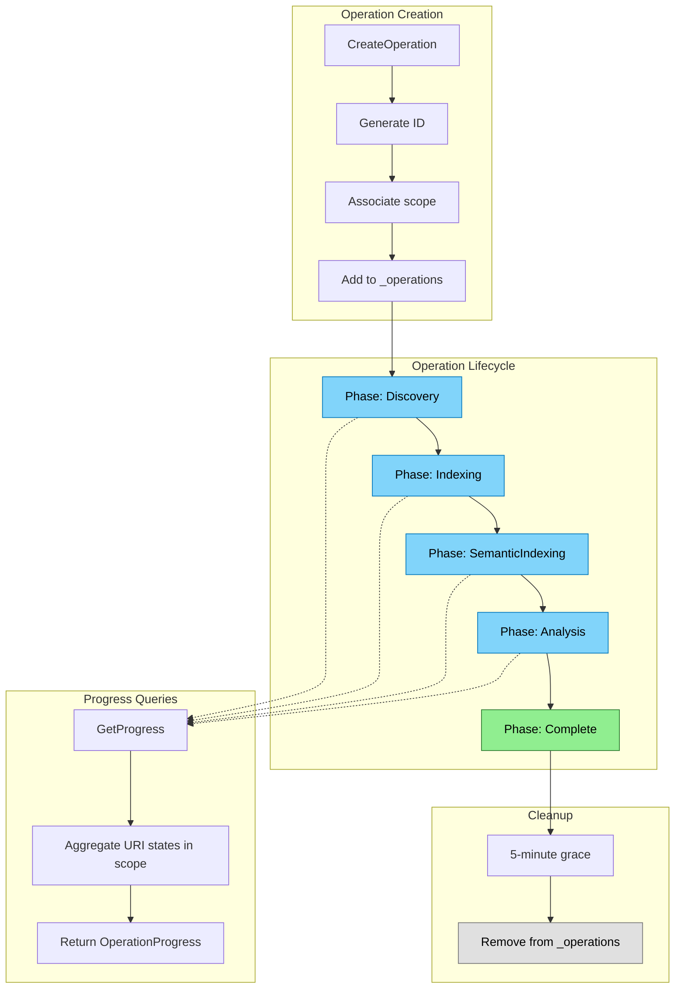

# Operations Flow

Higher-level grouping for tracking related indexing work (startup, reindex, import).

## Why This Matters

| Without operations | With operations |
|-------------------|-----------------|
| No concept of "reindex in progress" | Query active operations |
| Can't correlate progress to trigger | "Import of github://foo is 75% complete" |
| No operation-level timeout/cancellation | Cancel an entire import |
| Individual URI tracking only | Aggregate progress per operation |

## Relationship to IndexingState

Operations are a **convenience layer** on top of `IndexingState`:

```
┌─────────────────────────────────────────┐
│              Operations                  │
│  • Named grouping of work               │
│  • Aggregate progress                    │
│  • Operation-level cancellation          │
└─────────────────────────────────────────┘
                    │ uses
                    ▼
┌─────────────────────────────────────────┐
│            IndexingState                 │
│  • Per-URI phase tracking               │
│  • WaitForPhaseAsync(scope, phase)      │
│  • Source of truth for all URI state    │
└─────────────────────────────────────────┘
```

You can wait for URIs without operations. Operations add:
- Named handle for the work
- Scope association (which URIs belong to this operation)
- Progress aggregation
- Cancellation token propagation

## Trigger

Operation created by:
- `RepoqlHost` at startup (type: `startup`)
- `IndexingCoordinator.ReindexAsync()` (type: `reindex`)
- `ImportTool` (type: `import`)

## Stages

### 1. Operation Creation

**Actor**: Operation initiator
**Action**: Create operation in `IndexingState._operations`
**Output**: Operation with auto-generated ID, associated scope
**Failure**: N/A

```csharp
public Operation CreateOperation(string type, string? scope = null, Uri? sourceUri = null)
{
    var operation = new Operation(
        id: $"op_{Guid.NewGuid():N}",
        type: type,
        scope: scope,
        sourceUri: sourceUri
    );

    _operations.TryAdd(operation.Id, operation);
    return operation;
}
```

### 2. Progress Computation

**Actor**: Caller querying progress
**Action**: Aggregate URI states matching operation scope
**Output**: `OperationProgress` with counts and percentages
**Failure**: N/A

```csharp
public OperationProgress GetProgress(string operationId)
{
    if (!_operations.TryGetValue(operationId, out var operation))
        return OperationProgress.Empty;

    var uris = _uris.Values
        .Where(u => MatchesScope(u.Uri, operation.Scope))
        .ToList();

    return new OperationProgress
    {
        Total = uris.Count,
        Pending = uris.Count(u => u.Status == UriStatus.Pending),
        Processing = uris.Count(u => u.Status == UriStatus.Processing),
        Ready = uris.Count(u => u.Status == UriStatus.Ready),
        Failed = uris.Count(u => u.Status == UriStatus.Failed),
        CurrentPhase = operation.CurrentPhase
    };
}
```

### 3. Phase Transition

**Actor**: IndexingCoordinator
**Action**: Update `operation.CurrentPhase`
**Output**: Operation reflects current pipeline phase
**Failure**: N/A

```csharp
operation.TransitionTo(OperationPhase.Indexing);
// ... later
operation.TransitionTo(OperationPhase.SemanticIndexing);
```

### 4. Completion

**Actor**: IndexingCoordinator (finally block)
**Action**: Mark operation complete, start grace timer
**Output**: Operation queryable for 5 minutes after completion
**Failure**: N/A (always runs)

```csharp
finally
{
    operation.TransitionTo(OperationPhase.Complete);
    ScheduleCleanup(operation.Id, TimeSpan.FromMinutes(5));
}
```

### 5. Cleanup

**Actor**: Background timer
**Action**: Remove operation from `_operations`
**Output**: Memory freed
**Failure**: N/A

## Termination

Operation lifecycle ends when:
- All phases complete + 5-minute grace period
- Session terminates

## Flow Diagram


*Colors: Blue = phase, Green = complete, Gray = cleanup*

## Operation Schema

```csharp
public sealed class Operation
{
    public string Id { get; }                    // "op_<guid>"
    public string Type { get; }                  // "startup", "reindex", "import", etc.
    public string? Scope { get; }                // Glob pattern for URIs
    public Uri? SourceUri { get; }               // For imports
    public OperationPhase CurrentPhase { get; private set; }
    public DateTimeOffset CreatedAt { get; }
    public DateTimeOffset? StartedAt { get; private set; }   // First URI started processing
    public DateTimeOffset? CompletedAt { get; private set; } // All URIs finished
    public CancellationTokenSource Cts { get; }  // For cancellation
}
```

## SQL Surface

```sql
-- List all operations
SELECT id, type, scope, source_uri, current_phase,
       created_at, started_at, completed_at
FROM Operations;

-- Operation progress (computed from URI states)
SELECT o.id, o.type, o.current_phase,
       COUNT(*) as total,
       SUM(CASE WHEN u.status = 'Ready' THEN 1 ELSE 0 END) as ready,
       SUM(CASE WHEN u.status = 'Failed' THEN 1 ELSE 0 END) as failed
FROM Operations o
LEFT JOIN UriStates u ON matches_glob(u.uri, o.scope)
GROUP BY o.id, o.type, o.current_phase;
```

## Cancellation

Operations support cancellation via their `CancellationTokenSource`:

```csharp
// Cancel an import
var operation = _indexingState.GetOperation("op_abc123");
operation?.Cts.Cancel();
```

Cancellation propagates to:
- File enumeration
- Pipeline processing
- Embedding generation
- Progress streaming

## Key Invariants

| Invariant | Consequence of Violation |
|-----------|--------------------------|
| Progress derived from URI states | Stale progress if computed/stored separately |
| Scope immutable after creation | Progress would count wrong URIs |
| Grace period before cleanup | Final state not queryable |
| Cancellation propagates to all work | Orphaned processing continues |

## Error Handling

| Error | Behaviour |
|-------|-----------|
| Operation not found | Returns empty progress |
| All URIs fail | Operation still completes |
| Cancellation | Operation marked complete, partial URIs remain |

## Key Files

| File | Role |
|------|------|
| `src/Indexing/RepoQL.Indexing/State/IndexingState.cs` | Holds `_operations` |
| `src/Indexing/RepoQL.Indexing/State/Operation.cs` | Operation record |
| `src/Indexing/RepoQL.Indexing/Hosting/IndexingCoordinator.cs` | Creates/manages operations |

## Related

- [Indexing State](indexing-state.md) - Foundation that operations build on
- [Progress Streaming](progress-streaming.md) - Streams operation progress
- [Reindex](../../current/indexing/reindex.md) - Creates reindex operations
- [Import](../../current/indexing/import.md) - Creates import operations
