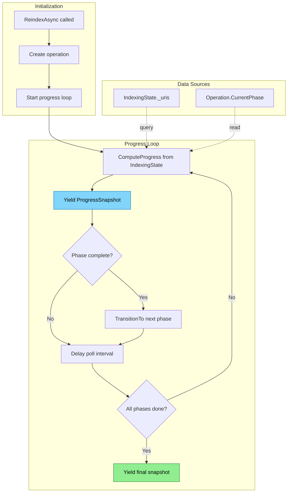

# Progress Streaming Flow

Real-time progress updates derived from IndexingState.

## Why This Matters

| Without progress streaming | With progress streaming |
|---------------------------|------------------------|
| Operations block with no feedback | Real-time progress updates |
| "Is it stuck or just slow?" | Clear phase and count visibility |
| Poll IndexingState manually | Push-based updates via IAsyncEnumerable |
| Binary wait (blocking or not) | Continuous progress snapshots |

## Relationship to IndexingState

Progress is **computed from** IndexingState, not stored separately:

```csharp
public ProgressSnapshot ComputeProgress(string? scope = null)
{
    var uris = scope == null
        ? _uris.Values
        : _uris.Values.Where(u => MatchesGlob(u.Uri, scope));

    return new ProgressSnapshot
    {
        Total = uris.Count(),
        Pending = uris.Count(u => u.Status == UriStatus.Pending),
        Processing = uris.Count(u => u.Status == UriStatus.Processing),
        Ready = uris.Count(u => u.Status == UriStatus.Ready),
        Failed = uris.Count(u => u.Status == UriStatus.Failed),
        AtPhase = uris.GroupBy(u => u.CurrentPhase)
                      .ToDictionary(g => g.Key, g => g.Count())
    };
}
```

## Trigger

Caller requests progress stream:
- `ReindexAsync()` returns `IAsyncEnumerable<ProgressSnapshot>`
- `ImportAsync()` returns `IAsyncEnumerable<ProgressSnapshot>`
- Polling `IndexingState.ComputeProgress(scope)`

## Stages

### 1. Stream Initiation

**Actor**: Caller (MCP tool, coordinator)
**Action**: Start async enumerable
**Output**: Stream ready for consumption
**Failure**: N/A

```csharp
public async IAsyncEnumerable<ProgressSnapshot> ReindexAsync(
    ReindexOptions options,
    [EnumeratorCancellation] CancellationToken ct)
{
    var operation = _indexingState.CreateOperation("reindex", options.Scope);
    // ...
}
```

### 2. Snapshot Polling

**Actor**: Progress tracker loop
**Action**: Compute progress from IndexingState at intervals
**Output**: Yield snapshots
**Failure**: N/A

```csharp
while (!IsComplete(operation))
{
    var snapshot = _indexingState.ComputeProgress(operation.Scope);
    snapshot.OperationId = operation.Id;
    snapshot.Phase = operation.CurrentPhase;

    yield return snapshot;

    await Task.Delay(PollInterval, ct);
}
```

### 3. Phase Transition Detection

**Actor**: Progress tracker
**Action**: Detect when current phase completes
**Output**: Update operation phase, continue streaming
**Failure**: N/A

```csharp
// Check if all URIs in scope have passed current phase
var progress = _indexingState.ComputeProgress(operation.Scope);
if (progress.AllAtOrPast(operation.CurrentPhase))
{
    operation.TransitionTo(NextPhase(operation.CurrentPhase));
}
```

### 4. Stream Completion

**Actor**: Progress tracker
**Action**: Final snapshot, end stream
**Output**: Stream ends cleanly
**Failure**: N/A

```csharp
yield return new ProgressSnapshot
{
    OperationId = operation.Id,
    Phase = OperationPhase.Complete,
    Total = total,
    Ready = total,
    ProgressPercent = 100
};
```

## Termination

Stream ends when:
- All phases complete
- Caller cancellation
- Unrecoverable error

## Flow Diagram


*Colors: Blue = snapshot yielded, Green = complete*

## ProgressSnapshot Schema

```csharp
public record ProgressSnapshot
{
    public string? OperationId { get; init; }
    public OperationPhase Phase { get; init; }

    // Counts
    public int Total { get; init; }
    public int Pending { get; init; }
    public int Processing { get; init; }
    public int Ready { get; init; }
    public int Failed { get; init; }

    // Computed
    public double ProgressPercent => Total > 0 ? (Ready + Failed) * 100.0 / Total : 100;
    public int Remaining => Pending + Processing;

    // Per-phase breakdown
    public Dictionary<OperationPhase, int>? AtPhase { get; init; }

    // Optional: current file being processed
    public string? CurrentFile { get; init; }
}
```

## Poll Intervals

| Phase | Interval | Rationale |
|-------|----------|-----------|
| Discovery | 50ms | Fast enumeration |
| Indexing | 100ms | Balance responsiveness/overhead |
| SemanticIndexing | 500ms | Slower, batch-oriented |
| Analysis | 500ms | Slower, batch-oriented |

## Usage Patterns

### Stream and Display

```csharp
await foreach (var snapshot in coordinator.ReindexAsync(options, ct))
{
    Console.WriteLine($"[{snapshot.Phase}] {snapshot.Ready}/{snapshot.Total} ({snapshot.ProgressPercent:F1}%)");
}
```

### Await Completion Only

```csharp
// Consume stream but ignore snapshots
await foreach (var _ in coordinator.ImportAsync(request, ct)) { }
```

### With Cancellation

```csharp
using var cts = new CancellationTokenSource(TimeSpan.FromMinutes(5));
try
{
    await foreach (var snapshot in coordinator.ReindexAsync(options, cts.Token))
    {
        // ... display progress
    }
}
catch (OperationCanceledException)
{
    Console.WriteLine("Reindex cancelled");
}
```

## Key Invariants

| Invariant | Consequence of Violation |
|-----------|--------------------------|
| Progress computed, not stored | Stale data if cached |
| Snapshots never regress | Confusing UX if counts go backward |
| Stream ends with Complete phase | Caller doesn't know operation finished |
| Failed URIs included in Ready+Failed | Progress percent would never reach 100% |

## Error Handling

| Error | Behaviour |
|-------|-----------|
| Individual URI failure | Continue streaming, failure counted |
| Enumeration error | Exception propagates, stream ends |
| Caller cancellation | `OperationCanceledException`, stream ends |
| IndexingState unavailable | Exception propagates |

## Key Files

| File | Role |
|------|------|
| `src/Indexing/RepoQL.Indexing/State/IndexingState.cs` | `ComputeProgress()` |
| `src/Indexing/RepoQL.Indexing/State/ProgressSnapshot.cs` | Snapshot record |
| `src/Indexing/RepoQL.Indexing/Hosting/IndexingCoordinator.cs` | Progress loops |

## Related

- [Indexing State](indexing-state.md) - Source of truth for progress
- [Operations](operations.md) - Operation-scoped progress
- [Reindex](../../current/indexing/reindex.md) - Returns progress stream
