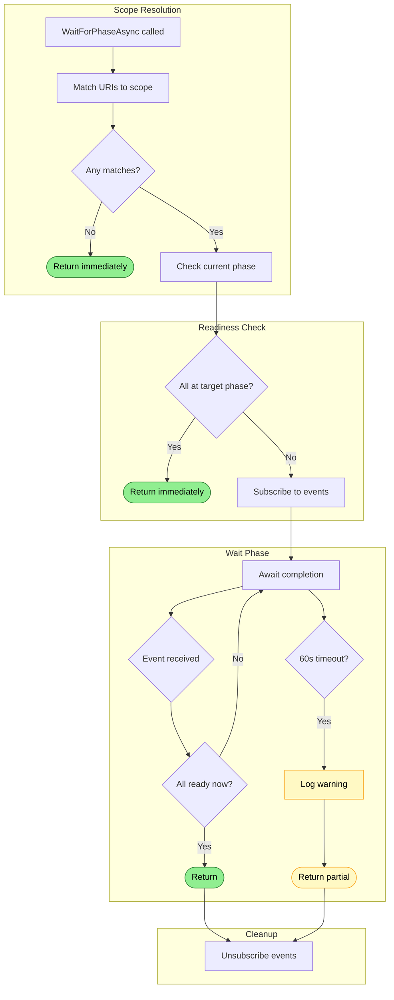

# Ready Gating Flow

Scoped waiting for URIs to reach a target phase before query execution.

## Why This Matters

| Without ready gating | With ready gating |
|---------------------|------------------|
| Queries on incomplete index return nothing | Wait for relevant files only |
| Must wait for entire index | Scoped: wait for `src/auth/**` only |
| Binary: all or nothing | Phase-aware: wait for Indexing vs SemanticIndexing |
| No feedback while waiting | Progress visibility during wait |

## Trigger

Tool invocation with wait requirement:
- Explicit: `query(..., waitFor: { scope: "src/**", phase: "Indexing" })`
- Implicit: First query waits for hot path on `**` (session gate)

## Core Mechanism

Ready gating uses `IndexingState.WaitForPhaseAsync()`:

```csharp
await _indexingState.WaitForPhaseAsync(
    scope: "src/auth/**",
    targetPhase: OperationPhase.Indexing,
    ct);
```

**Behavior:**
1. Snapshot URIs matching scope at call time
2. Check if all at or past target phase
3. If yes → return immediately
4. If no → wait for phase completion events (60s timeout)

## Stages

### 1. Scope Resolution

**Actor**: WaitForPhaseAsync
**Action**: Find all URIs matching the scope glob
**Output**: Set of URIs to wait for
**Failure**: N/A (empty set → immediate return)

```csharp
var targets = _uris.Keys
    .Where(uri => MatchesGlob(uri, scope))
    .ToHashSet();

if (targets.Count == 0)
    return;  // Nothing to wait for
```

### 2. Immediate Check

**Actor**: WaitForPhaseAsync
**Action**: Check if all targets already at phase
**Output**: Return immediately if ready
**Failure**: N/A

```csharp
if (AllAtPhase(targets, targetPhase))
    return;  // Already ready
```

### 3. Event Subscription

**Actor**: WaitForPhaseAsync
**Action**: Subscribe to `UriPhaseCompleted` events
**Output**: Will be notified as URIs complete
**Failure**: N/A

```csharp
void OnPhaseCompleted(object? s, UriPhaseCompletedEventArgs e)
{
    if (targets.Contains(e.Uri) && AllAtPhase(targets, targetPhase))
        tcs.TrySetResult();
}

UriPhaseCompleted += OnPhaseCompleted;
```

### 4. Wait with Timeout

**Actor**: WaitForPhaseAsync
**Action**: Await completion or 60s timeout
**Output**: Ready to proceed (possibly partial)
**Failure**: Timeout → proceed with warning

```csharp
using var cts = CancellationTokenSource.CreateLinkedTokenSource(ct);
cts.CancelAfter(TimeSpan.FromSeconds(60));

try
{
    await tcs.Task.WaitAsync(cts.Token);
}
catch (OperationCanceledException) when (!ct.IsCancellationRequested)
{
    _logger.LogWarning("Wait for {Scope} to reach {Phase} timed out", scope, targetPhase);
}
```

### 5. Cleanup

**Actor**: WaitForPhaseAsync (finally)
**Action**: Unsubscribe from events
**Output**: No resource leak
**Failure**: N/A

```csharp
finally
{
    UriPhaseCompleted -= OnPhaseCompleted;
}
```

## Termination

Wait completes when:
- All target URIs at or past target phase
- 60-second timeout (proceeds with partial)
- Caller cancellation (propagates exception)

## Flow Diagram


*Colors: Green = ready, Yellow = timeout*

## Usage Patterns

### Explicit Scoped Wait

```sql
-- Wait for auth files to be indexed before querying
SELECT * FROM search('authentication',
    scope := 'src/auth/**',
    waitFor := 'Indexing'
);
```

### Session Gate (Implicit)

First query in a session auto-waits for hot path:

```csharp
public override async Task<QueryResponse> Query(QueryRequest request, ServerCallContext context)
{
    // Session gate: wait for ** to reach Indexing (once per session)
    if (!_sessionGateFired)
    {
        await _indexingState.WaitForPhaseAsync("**", OperationPhase.Indexing, ct);
        _sessionGateFired = true;
    }

    // Execute query
    ...
}
```

### Wait for Semantic Search

```sql
-- Need embeddings for semantic search
SELECT * FROM search('authentication concepts',
    scope := 'docs/**',
    waitFor := 'SemanticIndexing'
);
```

### Immediate (No Wait)

```sql
-- Skip waiting, accept potentially incomplete results
SELECT * FROM search('auth', immediate := true);
```

## Phase Selection Guide

| Use Case | Target Phase | Why |
|----------|--------------|-----|
| SQL queries on structure | `Indexing` | Structure available after parsing |
| Full-text search | `Indexing` | Text indexed during parsing |
| Semantic/vector search | `SemanticIndexing` | Needs embeddings |
| Cross-file analysis | `Analysis` | Needs multi-file analysis |
| Just check what exists | `Discovery` | Files enumerated |

## Key Invariants

| Invariant | Consequence of Violation |
|-----------|--------------------------|
| Snapshot at call time | New files during wait are ignored (intentional) |
| Failed URIs count as "complete" | Waits don't hang on failures |
| Timeout proceeds, doesn't fail | Partial results better than no results |
| Event subscription is temporary | Memory leak if not cleaned up |

## Edge Cases

### New Files During Wait

Files discovered after wait starts are **not** included:

```
t=0: WaitForPhaseAsync("src/**", Indexing) called
     Snapshots: [src/a.cs, src/b.cs]
t=1: src/c.cs discovered (not in snapshot)
t=2: src/a.cs indexed
t=3: src/b.cs indexed
t=4: Wait returns (src/c.cs not waited for)
```

This is intentional - waiting for a moving target could wait forever.

### Dirty Files

If a file is marked dirty during wait, it's still counted as "at phase" until reprocessing starts:

```csharp
private bool AllAtPhase(HashSet<Uri> uris, OperationPhase target)
{
    return uris.All(uri =>
        _uris.TryGetValue(uri, out var entry) &&
        (entry.CurrentPhase >= target || entry.Status == UriStatus.Failed));
}
```

Dirty marking sets `Status = Pending`, which would cause continued waiting until reprocessed.

## Error Handling

| Error | Behaviour |
|-------|-----------|
| Empty scope match | Return immediately |
| All URIs fail | Return (failures count as complete) |
| 60s timeout | Proceed with warning |
| Caller cancellation | Propagate exception |
| Scope parse error | Propagate exception |

## Key Files

| File | Role |
|------|------|
| `src/Indexing/RepoQL.Indexing/State/IndexingState.cs` | `WaitForPhaseAsync()` |
| `src/ConsoleApp/RepoQL.ConsoleApp/Grpc/RepoQlServiceImpl.cs` | Session gate integration |
| `src/Data/RepoQL.Data.DuckDB/UdfImplementations/SearchUdf.cs` | `waitFor` parameter |

## Related

- [Indexing State](indexing-state.md) - Provides `WaitForPhaseAsync()`
- [Operations](operations.md) - Operation-level waiting
- [Progress Streaming](progress-streaming.md) - Progress during wait
