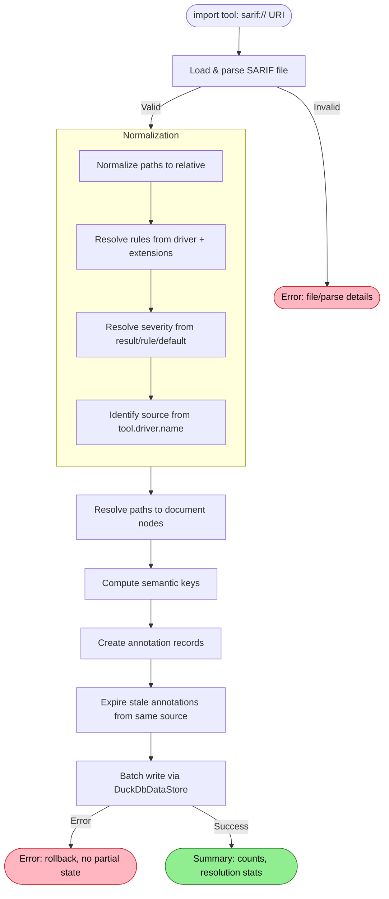

# SARIF Import Flow

Transforms scanner output into queryable annotations — from a file on disk to `SELECT * FROM annotations WHERE kind = 'lint'`.

## Why This Matters

| Without SARIF import | With SARIF import |
|----------------------|-------------------|
| Scanner findings in JSON files nobody queries | Findings queryable alongside code structure |
| Copy-paste rule IDs into searches | `WHERE rule_id = 'CA2000'` across all scanners |
| Manual path matching to find affected code | Findings anchored to graph nodes with resolved URIs |
| Each scanner is its own world | One query surface for all scanners |

## Trigger

`import` tool called with a SARIF file path.

```
import("sarif:///build/snyk-results.sarif")
import("sarif:///ci/qodana.sarif.json")
```

The URI scheme `sarif://` distinguishes this from VFS-based imports (`github://`, `local://`). The path after the scheme is the file location, absolute or relative to the repo root.

## Stages

### 1. File Loading

**Actor**: SarifImporter
**Action**: Read and parse the SARIF file as JSON
**Output**: Parsed SARIF object model (runs, results, rules)
**Failure**: File not found → actionable error with path checked. Invalid JSON → error with parse position. Wrong SARIF version → error naming the version found.

The file is read once into memory. SARIF files from real scanners range from kilobytes (ESLint, small projects) to tens of megabytes (Qodana on large codebases, SonarQube exports). GitHub enforces 10 MB compressed as an upper bound; that's a reasonable ceiling.

### 2. Normalization

**Actor**: SarifNormalizer
**Action**: Transform producer-specific SARIF into uniform, spec-compliant SARIF
**Output**: Normalized run data with uniform relative paths, resolved rules, and consistent severity
**Failure**: Envelope validation failures (wrong version, missing runs, missing tool name) → fatal error. Per-result normalization failures → skip result, count skipped, continue.

Normalization handles the "every producer is different" problem. The importer never sees producer quirks — it receives clean, uniform data.

#### 2a. Path Normalization

All artifact location URIs become relative paths from the repo root, forward-slash separated, no scheme.

| Input (producer-specific) | Output (normalized) |
|---------------------------|---------------------|
| `routes/index.js` with `uriBaseId: "%SRCROOT%"` | `routes/index.js` |
| `src/Foo.kt` with `uriBaseId: "SRCROOT"` | `src/Foo.kt` |
| `src/main/Foo.java` with `uriBaseId: "ROOTPATH"` | `src/main/Foo.java` |
| `file:///src/main/Foo.java` (sonar-tools, malformed) | `src/main/Foo.java` |
| `file:///C:/source/repos/src/Class1.cs` (Roslyn, absolute) | `src/Class1.cs` (relative to repo root `C:/source/repos`) |
| `package.json` (no uriBaseId) | `package.json` |

Absolute paths require the repo root as context to relativize. The normalizer receives the repo root as a parameter. Paths that can't be relativized (outside the repo, unresolvable scheme) are preserved as-is and flagged for the resolution stage.

#### 2b. Rule Resolution

Rules are collected from wherever the producer put them:

| Producer pattern | Normalization |
|------------------|---------------|
| Rules on `tool.driver.rules[]` (most tools) | Use directly |
| Rules on `tool.extensions[].rules[]` (Qodana) | Merge into a unified rule lookup keyed by `ruleId` |
| No rules array (sonar-tools) | Rules are absent; results carry inline data only |

Each result is linked to its rule definition (if one exists) for metadata enrichment.

#### 2c. Severity Resolution

SARIF `level` is resolved from whichever location the producer populated:

1. `result.level` (explicit on the result — most producers)
2. `rule.defaultConfiguration.level` (on the matched rule definition)
3. Default `"warning"` (SARIF spec default)

Tool-specific severity from properties (`ideaSeverity`, Snyk's `shortDescription` severity word, SonarQube's `severity` property) is preserved in the data payload but not used for the annotation's `severity` field. SARIF `level` maps to RepoQL severity:

| SARIF `level` | RepoQL `severity` |
|---------------|-------------------|
| `error` | `error` |
| `warning` | `warning` |
| `note` | `info` |
| `none` | `hint` |

#### 2d. Source Identification

The `source` field for annotations is derived from `tool.driver.name`:

| `tool.driver.name` | Annotation `source` |
|---------------------|---------------------|
| `SnykCode` | `snyk-code` |
| `Snyk Open Source` | `snyk-oss` |
| `QDJVM` | `qodana-jvm` |
| `CodeQL command-line toolchain` | `codeql` |
| `Semgrep` | `semgrep` |
| `ESLint` | `eslint` |
| `Microsoft (R) Visual C# Compiler` | `roslyn` |
| `Trivy Vulnerability Scanner` | `trivy` |
| `SonarQube` | `sonarqube` |

A lookup table for known producers; unknown names are slugified (lowercase, non-alphanumeric → hyphen).

### 3. Location Resolution

**Actor**: SarifImporter
**Action**: Map normalized file paths to existing document nodes in the graph
**Output**: Each result paired with a `scope_document_id` (and optionally a `target_span_id`)
**Failure**: Path not found in graph → result is still imported with `target_uri` set to the unresolved path. Zero paths resolved → warning in response.

```sql
-- For each normalized path, find the document node
SELECT id FROM node
WHERE kind = 'document'
  AND lower(uri) = lower('file:///' || @normalizedPath)
```

When a document node is found:
- `scope_document_id` is set to the document's node ID
- If the SARIF result has a `region` with `startLine`, a span is created or matched for `target_span_id`
- Symbol anchoring (`target_node_id` pointing to a symbol whose span overlaps the finding) is deferred to a future plan

When a document node is NOT found:
- The result is still imported — unresolved findings are valuable
- `scope_document_id` is set to a synthetic "unresolved imports" document node
- `target_uri` carries the normalized path for later resolution
- This handles files that haven't been indexed yet, were excluded, or are external

### 4. Semantic Key Computation

**Actor**: SarifImporter
**Action**: Compute a stable `semantic_key` for each annotation to enable idempotent upsert
**Output**: Deterministic key per finding

The semantic key must be stable across re-imports of the same scan results. It's computed from:

```
{source}:{ruleId}:{normalizedPath}:{startLine}:{fingerprint_or_hash}
```

Fingerprint source, in priority order:
1. `partialFingerprints` values (Qodana's `equalIndicator/v1`, CodeQL's `primaryLocationLineHash`)
2. `fingerprints` values (Snyk's `"0"`, Semgrep's `matchBasedId/v1`)
3. Content hash fallback: SHA-256 of `{ruleId}:{path}:{startLine}:{message}`

The fingerprint disambiguates multiple findings of the same rule on the same line.

### 5. Annotation Creation

**Actor**: SarifImporter
**Action**: Map each normalized SARIF result to an annotation record
**Output**: Batch of annotation records ready for write

| SARIF field | Annotation field | Notes |
|-------------|------------------|-------|
| (computed) | `semantic_key` | From stage 4 |
| `"lint"` | `kind` | Always `lint` for SARIF import |
| (resolved level) | `severity` | From stage 2c |
| (resolved source) | `source` | From stage 2d |
| `result.ruleId` | `rule_id` | Verbatim from SARIF |
| `result.message.text` | `message` | Plain text preferred over markdown |
| (resolved document) | `scope_document_id` | From stage 3 |
| (deferred) | `target_node_id` | Symbol anchoring deferred to future plan |
| (created span) | `target_span_id` | Optional, from stage 3 |
| (normalized path) | `target_uri` | Fallback when document not resolved |
| (structured payload) | `data` | See below |

The `data` JSON payload preserves everything the annotation fields don't capture:

```json
{
  "sarif_source": "snyk-code",
  "sarif_run_index": 0,
  "original_level": "error",
  "rule": {
    "name": "XSS",
    "shortDescription": "Cross-Site Scripting",
    "helpUri": "https://...",
    "help_markdown": "...",
    "tags": ["security", "CWE-79"],
    "properties": { }
  },
  "partialFingerprints": { "equalIndicator/v1": "a1b2c3..." },
  "fingerprints": { "0": "f5323d...", "1": "f0155d..." },
  "codeFlows": [ ],
  "relatedLocations": [ ],
  "fixes": [ ],
  "properties": { "priorityScore": 908 }
}
```

What goes in `data` vs standard fields:
- Standard fields: what you query with `WHERE` and `ORDER BY`
- `data` payload: what you inspect after finding a result

### 6. Stale Finding Expiration

**Actor**: SarifImporter
**Action**: Expire annotations from the same source that aren't in the new import
**Output**: Old annotations from this scanner removed or expired

When importing results from source `snyk-code`:
1. Collect all `semantic_key` values from the new import
2. Find existing annotations where `source = 'snyk-code'` and `kind = 'lint'`
3. Delete annotations whose `semantic_key` is not in the new set

This ensures re-importing fresh scan results replaces stale findings. A scanner that previously reported 50 findings but now reports 30 means 20 were fixed — those 20 annotations disappear.

The scope of expiration is per-source. Importing Snyk results never touches Qodana annotations.

### 7. Batch Write

**Actor**: DuckDbDataStore (single writer)
**Action**: Upsert annotations via `semantic_key`, delete expired ones
**Output**: Annotations committed to the graph
**Failure**: Write error → transaction rolled back, no partial state

All annotations from a single SARIF import are written in one transaction:
1. Delete expired annotations (same source, missing semantic keys)
2. Upsert new/updated annotations (INSERT OR REPLACE on semantic_key)

This is atomic — either all findings from this import land, or none do.

### 8. Response

**Actor**: SarifImporter
**Action**: Return import summary to the caller
**Output**: Structured response with counts

```
Imported 47 findings from snyk-code
  - 12 error, 28 warning, 7 info
  - 45 resolved to indexed files, 2 unresolved
  - 15 new, 8 updated, 12 unchanged, 12 expired
```

## Termination

Flow completes when:
- All SARIF results mapped to annotations
- Stale annotations expired
- Transaction committed
- Summary returned to caller

## Flow Diagram



## Re-Import Flow

Re-importing the same scanner's results is the primary lifecycle mechanism. No separate "update" or "sync" command — just import again.

| Scenario | Behaviour |
|----------|-----------|
| Same file, same results | All semantic keys match → no changes |
| Same file, fewer results | Missing keys → expired (findings were fixed) |
| Same file, more results | New keys → inserted (new findings) |
| Same file, changed results | Same keys, different data → upserted |
| Different scanner | Different source → independent, no interaction |

## Multi-Run SARIF

A single SARIF file can contain multiple runs (multiple tools or configurations). Each run is normalized independently (own `tool.driver.name`, own rules, own path conventions). After normalization, results are **aggregated by source** across all runs before the write stage:

- Each run has its own `tool.driver.name` → its own `source`
- Results with the same source (e.g., two runs from the same tool with different configurations) are aggregated into one batch before calling `ReplaceAnnotationsBySource` — this prevents a later run's replacement from expiring an earlier run's annotations
- Results with different sources are written independently
- A file with 3 runs from 3 different tools produces 3 independent sets of annotations
- A file with 2 runs from the same tool produces 1 aggregated set

## Error Handling

| Error | Behaviour |
|-------|-----------|
| File not found | Actionable error: "File not found at {path}. Check the path." |
| Invalid JSON | Error with parse position: "Invalid JSON at line 42, column 8" |
| Wrong SARIF version | "Expected SARIF 2.1.0, found {version}" |
| No results in file | Warning (not error): "SARIF file contains no results." The import completes — a zero-result scan from a source that previously had findings expires all those findings |
| Path outside repo | Preserved in `target_uri`, flagged as unresolved |
| Path not indexed | Imported with unresolved target, queryable but not anchored |
| Zero paths resolved | Warning: "None of the {N} file paths matched indexed files" |
| Write failure | Transaction rollback, no partial state, error returned |

## Verification

| Environment | How |
|-------------|-----|
| **Unit tests** | Feed sample SARIF from each producer → assert annotation field mapping, path normalization, semantic key stability |
| **Integration tests** | Index a repo, import a SARIF file, query annotations → verify `resolved_target_uri` points to real code |
| **Manual** | `import("sarif:///path")` then `SELECT * FROM annotations WHERE source = 'snyk-code'` |

## Key Boundary: Normalize vs Import

| Concern | Handled by | Examples |
|---------|-----------|----------|
| Producer-specific path formats | Normalizer | `file:///` stripping, `uriBaseId` resolution, absolute→relative |
| Producer-specific rule locations | Normalizer | driver vs extensions, missing rules array |
| Producer-specific severity | Normalizer | `ideaSeverity`, `shortDescription` severity words |
| Path → document node | Importer | Graph lookup, span creation |
| SARIF result → annotation | Importer | Field mapping, semantic key, data payload |
| Stale finding lifecycle | Importer | Expiration by source |
| Database write | Importer | Transaction, single writer |

New producer quirks only touch normalization. The importer stays stable.

## Related

- `docs/north-star/sarif-import.md` — what great looks like
- `docs/research/sarif-producer-landscape.md` — what real SARIF files contain
- `docs/flows/current/indexing/import.md` — VFS-based import flow (GitHub repos)
- `docs/Schema.md` — annotation table schema
- `docs/Vocabulary.md` — `lint` annotation kind, severity mapping
