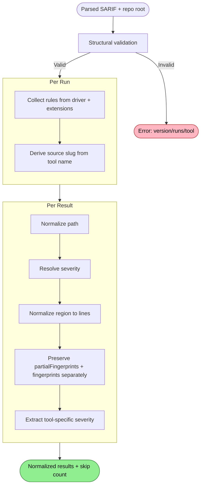

# SARIF Normalization Flow

Transforms producer-specific SARIF into uniform, spec-compliant data — handling the "every tool is different" problem so the importer never has to.

## Why This Matters

| Without normalization | With normalization |
|-----------------------|--------------------|
| Importer handles 8+ producer formats | Importer handles one clean format |
| Path bugs in Trivy break import | Path bugs fixed before import sees them |
| Qodana rules invisible (on extensions) | Rules unified into one lookup |
| New producer quirks require importer changes | New quirks isolated to normalizer |

## Trigger

SarifImporter calls SarifNormalizer with a parsed SARIF log and the repo root path.

## Stages

### 1. Structural Validation

**Actor**: SarifNormalizer
**Action**: Verify the SARIF envelope is minimally valid
**Output**: Validated SARIF log with at least one run
**Failure**: Missing/wrong `version` → error. Null/empty `runs` → error. No `tool.driver.name` on any run → error.

Validation is minimal — just enough to proceed. The normalizer is tolerant of spec violations in optional fields (many producers have them). Required checks:

| Check | Required by |
|-------|-------------|
| `version` = `"2.1.0"` | SARIF spec |
| `runs` is non-null, non-empty | Need at least one run to import |
| `tool.driver.name` present per run | Need a source identity |

### 2. Path Normalization

**Actor**: SarifNormalizer
**Action**: Convert all `artifactLocation.uri` values to uniform relative paths from repo root
**Output**: Every result location has a clean relative path (forward slashes, no scheme, no uriBaseId)
**Failure**: Per-result. Unresolvable paths are flagged, not fatal.

Path normalization runs a cascade of transforms:

```
Raw URI
  → Strip scheme (file:///, file://)
  → Resolve uriBaseId (%SRCROOT%, SRCROOT, ROOTPATH → repo root)
  → Resolve absolute paths (relativize against repo root)
  → Normalize separators (backslash → forward slash)
  → Strip leading slash
  → URL-decode (%20 → space)
  → Result: clean relative path
```

#### The Gauntlet (by producer)

| Producer | Input | Transform needed | Output |
|----------|-------|------------------|--------|
| Snyk Code | `routes/index.js` + `%SRCROOT%` | Strip uriBaseId | `routes/index.js` |
| Snyk OSS | `package.json` (no base) | None | `package.json` |
| Qodana | `src/main/Foo.kt` + `SRCROOT` | Strip uriBaseId | `src/main/Foo.kt` |
| CodeQL | `src/auth.py` + uriBaseId | Strip uriBaseId | `src/auth.py` |
| Semgrep | `src/app.js` + uriBaseId | Strip uriBaseId | `src/app.js` |
| Trivy | `go.sum` + `ROOTPATH` | Strip uriBaseId | `go.sum` |
| sonar-tools | `file:///src/main/Foo.java` | Strip `file:///` scheme | `src/main/Foo.java` |
| Roslyn | `file:///C:/source/repos/src/Foo.cs` | Strip scheme, relativize to repo root | `src/Foo.cs` (if repo root is `C:/source/repos`) |
| ESLint | `/home/user/project/src/app.js` | Relativize to repo root | `src/app.js` |

Absolute path relativization requires the repo root. If an absolute path is not under the repo root, it's preserved as-is and marked unresolvable.

#### uriBaseId Resolution

The normalizer maintains a lookup of known base ID conventions:

| uriBaseId value | Meaning | Resolution |
|-----------------|---------|------------|
| `%SRCROOT%` | SARIF standard convention | Repo root |
| `SRCROOT` | Qodana convention | Repo root |
| `ROOTPATH` | Trivy convention | Repo root |
| (defined in `originalUriBaseIds`) | Producer-specific | Resolve from the map |
| (absent) | Relative to working directory | Treat as repo-root-relative |

If `run.originalUriBaseIds` is defined, it takes precedence. Most producers don't define it — the conventions above are implicit.

### 3. Rule Collection

**Actor**: SarifNormalizer
**Action**: Build a unified rule lookup from wherever the producer put rules
**Output**: Dictionary of `ruleId → rule metadata`
**Failure**: Missing rules are normal (sonar-tools has none). Not an error.

```
For each run:
  Collect rules from tool.driver.rules[]
  Collect rules from tool.extensions[].rules[]
  Merge into lookup by rule ID
  Driver rules take precedence over extension rules on collision
```

This handles the Qodana case (all rules on extensions) and the sonar-tools case (no rules at all) uniformly.

Rule metadata extracted per rule:

| Field | Source | Used for |
|-------|--------|----------|
| `id` | `reportingDescriptor.id` | Match to result `ruleId` |
| `name` | `.name` or `.shortDescription.text` | Human-readable name |
| `description` | `.fullDescription.text` | Detailed description |
| `helpUri` | `.helpUri` | Link to documentation |
| `helpMarkdown` | `.help.markdown` | Inline help content |
| `defaultLevel` | `.defaultConfiguration.level` | Fallback severity |
| `tags` | `.properties.tags` | Classification |
| `cwe` | `.properties.cwe` or `.defaultConfiguration.parameters.cweIds` | CWE identifiers |
| `properties` | `.properties` (entire bag) | Everything else |

### 4. Severity Resolution

**Actor**: SarifNormalizer
**Action**: Resolve each result's effective severity from the cascade of possible locations
**Output**: Each result has a single, resolved severity value
**Failure**: N/A — always falls through to default `warning`

Resolution cascade (first non-null wins):

```
1. result.level           (explicit on result — most producers)
2. rule.defaultConfiguration.level  (matched rule, if found)
3. "warning"              (SARIF spec default)
```

Tool-specific severity is extracted and preserved separately:

| Producer | Property | Example values |
|----------|----------|----------------|
| Qodana | `properties.ideaSeverity` | `ERROR`, `WARNING`, `WEAK WARNING` |
| Qodana | `properties.qodanaSeverity` | `Critical`, `High`, `Moderate` |
| Snyk OSS | `rule.shortDescription.text` prefix | `"High severity - ..."` |
| sonar-tools | `properties.severity` | `BLOCKER`, `CRITICAL`, `MAJOR` |
| sonar-tools | `properties.type` | `BUG`, `VULNERABILITY`, `CODE_SMELL` |
| Trivy | `rule.properties.security-severity` | `"9.5"` (numeric CVSS) |

These go into the `data` payload on the annotation, not the `severity` field. The annotation `severity` is always derived from the resolved SARIF `level`.

### 5. Source Identification

**Actor**: SarifNormalizer
**Action**: Derive a stable source identifier from the tool name
**Output**: Slug-format source string (lowercase, hyphenated)
**Failure**: N/A — unknown names are slugified

Known producer mapping:

| `tool.driver.name` | Source slug |
|---------------------|------------|
| `SnykCode` | `snyk-code` |
| `Snyk Open Source` | `snyk-oss` |
| `QDJVM` | `qodana-jvm` |
| `QDJS` | `qodana-js` |
| `QDNET` | `qodana-dotnet` |
| `QDPY` | `qodana-python` |
| `QDGO` | `qodana-go` |
| `QDPHP` | `qodana-php` |
| `CodeQL command-line toolchain` | `codeql` |
| `Semgrep` | `semgrep` |
| `ESLint` | `eslint` |
| `Microsoft (R) Visual C# Compiler` | `roslyn` |
| `Trivy Vulnerability Scanner` | `trivy` |
| `SonarQube` | `sonarqube` |

Unknown names: strip non-alphanumeric, lowercase, collapse whitespace to hyphens. `"My Custom Linter v3.2"` → `my-custom-linter-v3-2`.

### 6. Result Normalization

**Actor**: SarifNormalizer
**Action**: Normalize each result into a uniform structure
**Output**: List of normalized results ready for the importer
**Failure**: Per-result. Results without a message are skipped (spec requires message). All other fields have fallbacks.

Per result:
- `ruleId`: verbatim (required by our import, skip result if absent)
- `location`: at least one `physicalLocation` with `artifactLocation.uri` required (skip result if absent — locationless findings cannot produce stable semantic keys)
- `message`: `result.message.text` preferred; fall back to `result.message.markdown`; fall back to `result.message.id` resolved against rule `messageStrings`
- `level`: from stage 4
- `path`: from stage 2
- `region`: normalized to `{ startLine, startColumn?, endLine?, endColumn? }` — `charOffset`/`charLength` are dropped (RepoQL uses line-based spans). Column values are stored as-is from SARIF (1-based per spec). `endColumn` exclusivity is inherited from SARIF convention
- `partialFingerprints`: from SARIF `partialFingerprints` (kept separate for priority during semantic key computation)
- `fingerprints`: from SARIF `fingerprints` (kept separate from partialFingerprints)
- `ruleMetadata`: from stage 3 lookup (may be null)
- `source`: from stage 5
- `codeFlows`, `relatedLocations`, `fixes`, `properties`, tool-specific severity: preserved verbatim in the `Data` payload (not as separate fields on `NormalizedResult`)

## Termination

Flow completes when all results from all runs in the SARIF file are normalized. The normalizer returns:

- List of normalized runs (each with source slug and results)
- Count of skipped results (with reasons)
- List of warnings (including unresolvable paths — individual paths are flagged per-result, not counted as a separate aggregate)

## Flow Diagram



## Normalization Is Testable in Isolation

Feed real SARIF → assert uniform output. One test per producer:

| Test | Input | Assert |
|------|-------|--------|
| Snyk Code paths | `routes/index.js` + `%SRCROOT%` | Path = `routes/index.js` |
| Qodana rules | Empty driver rules, 46 extensions | All rules in lookup |
| sonar-tools paths | `file:///src/Foo.java` | Path = `src/Foo.java` |
| Roslyn absolute | `file:///C:/src/Foo.cs` | Path relative to repo root |
| Severity cascade | No result level, rule has `warning` | Resolved = `warning` |
| Unknown producer | `"My Linter"` | Source = `my-linter` |

## Related

- `docs/flows/future/sarif/sarif-import.md` — the pipeline that consumes normalized output
- `docs/research/sarif-producer-landscape.md` — the research that catalogued producer differences
