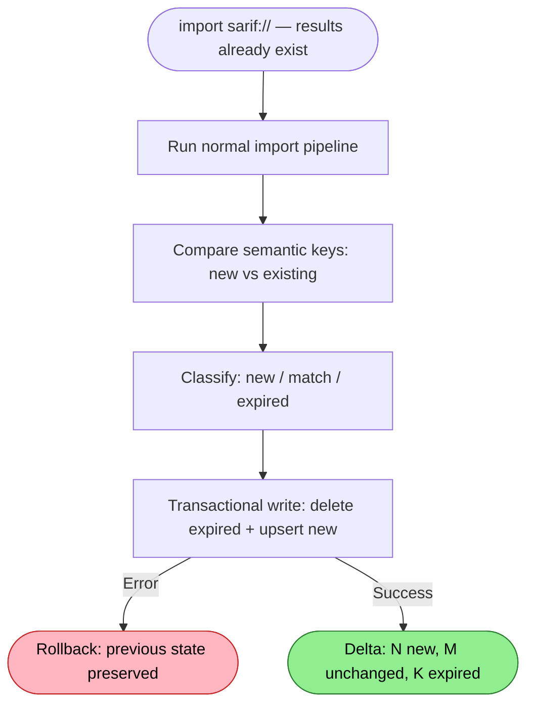

# SARIF Re-Import Flow

How fresh scan results replace stale findings — the mechanism that keeps the graph reflecting current reality.

## Why This Matters

| Without re-import lifecycle | With re-import lifecycle |
|-----------------------------|--------------------------|
| Fixed bugs still show as findings | Fixed findings disappear automatically |
| "Import again" creates duplicates | Same import twice = no change |
| Stale data accumulates forever | Graph always reflects latest scan |
| No way to tell new from old | `baselineState` equivalent via semantic keys |

## Trigger

`import("sarif:///build/snyk-results.sarif")` called when scan results already exist from the same source.

This is the same trigger as a first-time import. There is no separate "update" command. The lifecycle is implicit in how semantic keys and source-scoped expiration work together.

## Precondition

Existing annotations in the graph from a previous import of the same source:

```sql
SELECT count(*) FROM annotations
WHERE source = 'snyk-code' AND kind = 'lint'
-- → 47 (from last import)
```

## Stages

### 1. Normal Import Pipeline

**Actor**: SarifImporter
**Action**: Run the full import pipeline (load → normalize → resolve → create annotations)
**Output**: Set of annotation records with computed semantic keys
**Failure**: Same as first-time import — see `sarif-import.md`

Stages 1–5 of the import pipeline execute identically whether this is first import or re-import. The lifecycle difference only appears at the write stage.

### 2. Semantic Key Comparison

**Actor**: SarifImporter
**Action**: Compare new semantic keys against existing annotations from the same source
**Output**: Three sets — new, unchanged/updated, and expired

```
New import keys:      { A, B, C, D, E }
Existing DB keys:     { A, B, C, F, G }

New (to insert):      { D, E }        — findings that didn't exist before
Match (to upsert):    { A, B, C }     — findings that persist (may have updated data)
Expired (to delete):  { F, G }        — findings that disappeared (bugs were fixed)
```

The comparison scope is `WHERE source = @source AND kind = 'lint'`. One scanner's import never touches another scanner's annotations.

### 3. Source-Wide Expiration

**Actor**: SarifImporter
**Action**: Expire all existing annotations from this source, then replace with the new set
**Output**: Previous findings from this source removed; new findings take their place

Every annotation from this source that isn't in the new import is expired. No file-scoping, no `run.artifacts[]` inspection, no heuristics.

**Why source-wide**: CI scanners run full scans. Snyk, CodeQL, Qodana, Semgrep, ESLint, Roslyn, Trivy — all scan the entire codebase every time in their standard CI configuration. A re-import represents a complete picture from that scanner. If a finding disappeared, the bug was fixed.

**What about partial scans?** They're rare. Only Semgrep's `--diff-depth` and Qodana's `--diff-start`/`--diff-end` produce partial results, and both are opt-in modes. The standard CI invocation is a full scan. Partial scan support can be added later as an explicit opt-in flag on the import command (e.g., `import("sarif:///path", partial: true)`) — but it should not complicate the default path.

**What about zero results?** A scanner that scans everything and finds nothing produces a SARIF file with zero results. That legitimately expires all existing findings from that source — the codebase is clean according to that scanner.

### 4. Transactional Write

**Actor**: DuckDbDataStore
**Action**: In one transaction: delete expired, upsert matched/new
**Output**: Graph reflects the new scan state
**Failure**: Rollback → previous state preserved

```
BEGIN TRANSACTION

  -- Expire: delete all annotations from this source
  DELETE FROM annotation
  WHERE source = @source
    AND kind = 'lint'
    AND semantic_key NOT IN (@newKeys)

  -- Upsert: insert or update all new results (preserves created_at)
  INSERT INTO annotation (semantic_key, kind, severity, source, ...)
  VALUES (...)
  ON CONFLICT(semantic_key) DO UPDATE SET severity=excluded.severity, ...

COMMIT
```

### 5. Delta Summary

**Actor**: SarifImporter
**Action**: Report what changed
**Output**: Counts of new, unchanged, updated, and expired findings

```
Re-imported 35 findings from snyk-code
  - 5 new findings
  - 25 unchanged
  - 5 updated (same key, different data)
  - 12 expired (fixed since last scan)
```

## Termination

Flow completes when the transaction commits and the delta summary is returned.

## Scenarios

### Scanner finds fewer issues (bugs were fixed)

```
Before: 50 findings from snyk-code
Import: 35 findings
After:  35 findings (15 expired)
```

The 15 disappeared findings were fixed. Their annotations are deleted. An agent querying `SELECT count(*) FROM annotations WHERE source = 'snyk-code'` immediately sees 35.

### Scanner finds more issues (new code, new rules)

```
Before: 50 findings from snyk-code
Import: 65 findings
After:  65 findings (15 new, 50 unchanged)
```

### Same scan re-imported (idempotent)

```
Before: 50 findings from snyk-code
Import: 50 findings (identical semantic keys)
After:  50 findings (0 new, 50 unchanged, 0 expired)
```

No-op. Semantic keys match, data matches. Nothing written.

### Different scanner imported (independent)

```
Before: 50 from snyk-code, 30 from qodana-jvm
Import: 45 from snyk-code
After:  45 from snyk-code (5 expired), 30 from qodana-jvm (untouched)
```

Source-scoped expiration means scanners are independent.

### Partial scan (future opt-in)

Without the `partial` flag, source-wide expiration applies and unscanned files lose their findings. This is correct for full scans — the dominant case.

If partial scan support is added later:

```
import("sarif:///path/incremental.sarif", partial: true)

Before: 50 from snyk-code across 20 files
Import: 10 findings across 5 files (incremental scan of src/auth/)
After:  50 findings — 10 upserted in scanned files, 40 preserved in unscanned files
```

The `partial` flag would scope expiration to files present in the import results. This is explicitly opt-in because it requires the caller to know the scan was partial — something the SARIF file itself cannot reliably communicate.

## Flow Diagram



## Error Handling

| Error | Behaviour |
|-------|-----------|
| Transaction failure | Rollback, previous annotations preserved |
| Semantic key collision across sources | Can't happen — keys include source |
| Very large delta (10K+ expirations) | Batched deletes within transaction |

## Related

- `docs/flows/future/sarif/sarif-import.md` — the pipeline that produces the annotation records
- `docs/flows/future/sarif/sarif-normalization.md` — how paths/rules/severity are cleaned
- `docs/Schema.md` — `semantic_key` uniqueness constraint on annotation table
