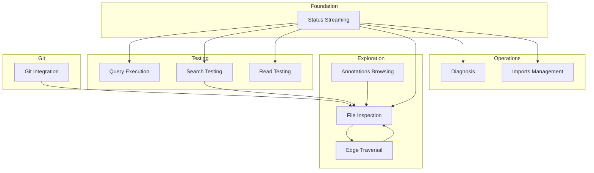

# RepoQL Web UI Flows

How the UI should work — stages, actors, and handoffs.

These flows describe *what should happen*, not *how to build it*. They're concrete enough to critique, abstract enough to leave room for design decisions.

## Foundation

| Flow | Purpose | Trigger |
|------|---------|---------|
| [Status Streaming](status-streaming.md) | Real-time status from host to browser | User opens dashboard |

Everything else depends on status streaming being established.

## Testing Capabilities

| Flow | Purpose | Trigger |
|------|---------|---------|
| [Query Execution](query-execution.md) | Run SQL, see results | User clicks Run |
| [Search Testing](search-testing.md) | Test explore with score visibility | User submits search |
| [Read Testing](read-testing.md) | Test read with URIs, fragments, modifiers | User enters read command |

## Exploration

| Flow | Purpose | Trigger |
|------|---------|---------|
| [File Inspection](file-inspection.md) | See everything about a file | User selects file |
| [Edge Traversal](edge-traversal.md) | Navigate graph by clicking | User clicks edge |
| [Annotations Browsing](annotations-browsing.md) | See all errors across repo | User opens Annotations |

## Operations

| Flow | Purpose | Trigger |
|------|---------|---------|
| [Diagnosis](diagnosis.md) | Surface problems without log diving | User notices symptom |
| [Imports Management](imports-management.md) | Manage external repositories | User opens Imports |

## Git

| Flow | Purpose | Trigger |
|------|---------|---------|
| [Git Integration](git-integration.md) | Blame, history, hotspots, related changes | Various |

## Flow Relationships

## What Flows Establish

| Flow | Key Decisions |
|------|---------------|
| Status Streaming | Push-based updates via SignalR, auto-reconnect |
| Query Execution | Synchronous request/response, cancellable |
| Search Testing | Score breakdown visible, readiness checked first |
| Read Testing | Progressive disclosure explorable, modifiers testable |
| File Inspection | Parallel queries, edges clickable |
| Edge Traversal | Back navigation, broken links handled |
| Diagnosis | Problems surface automatically, actions available |
| Annotations Browsing | Filterable, groupable, click-through |
| Imports Management | Progress streaming, scope selection |
| Git Integration | Blame per line, hotspots ranked, semantic+git combined |

## What Flows Do NOT Decide

- Visual design / styling
- Component library choice
- State management approach
- Keyboard shortcuts
- Mobile responsiveness

These belong in design documents, not flows.

---

*Flows make the process discussable. Design makes it buildable.*
