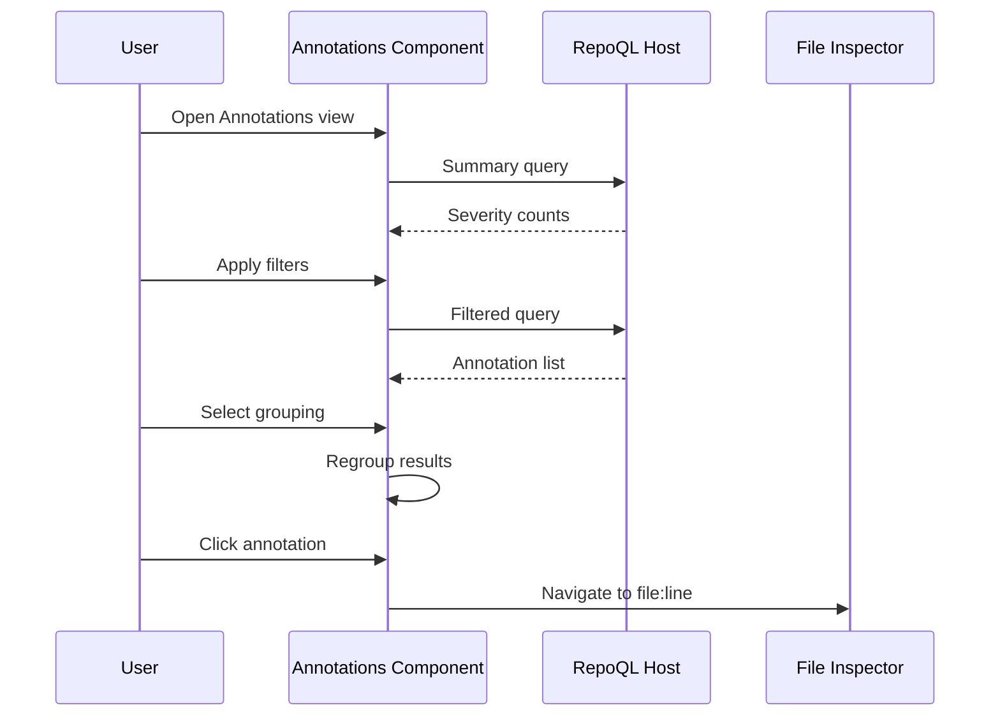

# Annotations Browsing Flow

How a developer sees all errors, warnings, and lint issues across the repository.

## Why This Matters

File inspection shows annotations for one file. But developers ask:
- "How many errors do we have total?"
- "Which files have the most problems?"
- "Are we getting better or worse?"
- "What's the most common issue?"

Annotations browsing answers these at repo scale.

## Trigger

User navigates to Annotations view or clicks annotation count in status bar.

## Stages

### 1. Initial Load
**Actor**: Annotations component
**Action**: Queries annotation summary statistics
**Output**: Overview counts displayed

```sql
SELECT
  severity,
  COUNT(*) as count
FROM Annotations
WHERE kind = 'lint'
GROUP BY severity
ORDER BY severity_rank DESC;
```

Shows:
```
Errors: 12 | Warnings: 847 | Info: 2,341 | Hints: 156
```

### 2. Filter Selection
**Actor**: User
**Action**: Selects filters (severity, rule, file pattern)
**Output**: Filter criteria captured

Available filters:
| Filter | Options |
|--------|---------|
| Severity | Error, Warning, Info, Hint |
| Rule | Dropdown of rule IDs found in repo |
| File pattern | Glob input (e.g., `src/**/*.cs`) |
| Source | Parser that produced annotation |

### 3. Filtered Query
**Actor**: Annotations component
**Action**: Queries annotations matching filters
**Output**: Filtered annotation list

```sql
SELECT
  a.severity, a.rule_id, a.message,
  a.resolved_target_uri as file_uri,
  s.start_line, s.end_line,
  f.headline as file_headline
FROM Annotations a
LEFT JOIN span s ON a.target_span_id = s.id
LEFT JOIN Files f ON a.resolved_target_uri = f.uri
WHERE a.severity = '{severity}'
  AND ('{rule}' = '' OR a.rule_id = '{rule}')
  AND ('{pattern}' = '' OR glob_match(a.resolved_target_uri, '{pattern}'))
ORDER BY a.severity_rank DESC, a.resolved_target_uri, s.start_line
LIMIT 500;
```

### 4. Grouping Options
**Actor**: User
**Action**: Selects grouping (by file, by rule, flat list)
**Output**: Results regrouped

**By file:**
```
src/Auth/AuthService.cs (5 issues)
  ├─ ⚠ CA1822: Consider static [line 112]
  ├─ ⚠ IDE0060: Unused parameter [line 47]
  └─ ...

src/Data/UserRepository.cs (3 issues)
  └─ ...
```

**By rule:**
```
CA1822: Consider making static (23 occurrences)
  ├─ src/Auth/AuthService.cs:112
  ├─ src/Data/UserRepository.cs:89
  └─ ...

IDE0060: Remove unused parameter (18 occurrences)
  └─ ...
```

### 5. Annotation Click
**Actor**: User
**Action**: Clicks an annotation
**Output**: Navigates to file inspector at that line

Flow connects to File Inspection Flow and Edge Traversal Flow.

### 6. Statistics View
**Actor**: Annotations component
**Action**: Shows aggregate statistics
**Output**: Charts and summaries

```
┌─ BY SEVERITY ──────────┐  ┌─ BY FILE ──────────────┐
│ ████████████░ Errors   │  │ Legacy/Old.cs     47   │
│ ██████████████ Warning │  │ Data/Mapper.cs    23   │
│ ████ Info              │  │ Auth/Service.cs   12   │
└────────────────────────┘  └────────────────────────┘

┌─ TOP RULES ────────────────────────────────────────┐
│ CA1822  Consider static                        23  │
│ IDE0060 Unused parameter                       18  │
│ CS0168  Variable declared but never used       12  │
└────────────────────────────────────────────────────┘
```

## Termination

Flow completes when:
- Annotation list rendered with filters applied, or
- "No annotations match filters" displayed

## Flow Diagram



## Display Structure

```
┌─────────────────────────────────────────────────────────┐
│ ANNOTATIONS                                             │
│ Errors: 12 | Warnings: 847 | Info: 2,341               │
├─────────────────────────────────────────────────────────┤
│ Severity: [All ▼]  Rule: [All ▼]  Pattern: [        ]  │
│ Group by: ○ File  ● Rule  ○ None                        │
├─────────────────────────────────────────────────────────┤
│                                                         │
│ CA1822: Consider making method static (23)              │
│ ├─ src/Auth/AuthService.cs:112 — ValidateToken()        │
│ ├─ src/Auth/AuthService.cs:156 — RefreshToken()         │
│ ├─ src/Data/UserRepository.cs:89 — GetById()            │
│ └─ [+20 more]                                           │
│                                                         │
│ IDE0060: Remove unused parameter (18)                   │
│ ├─ src/Auth/AuthService.cs:47 — parameter 'options'     │
│ └─ [+17 more]                                           │
│                                                         │
│ CS0168: Variable declared but never used (12)           │
│ └─ ...                                                  │
│                                                         │
└─────────────────────────────────────────────────────────┘
```

## Pagination

Large annotation sets paginated:
- Default page size: 100
- "Load more" button or infinite scroll
- Total count always shown

## Export

Optional: Export filtered annotations as CSV
```csv
severity,rule_id,message,file,line
Warning,CA1822,Consider making method static,src/Auth/AuthService.cs,112
Warning,CA1822,Consider making method static,src/Auth/AuthService.cs,156
...
```

## Error Handling

| Error | User Sees |
|-------|-----------|
| No annotations | "No annotations in repository" |
| No matches for filter | "No annotations match filters" |
| Query timeout | "Loading timed out. Try narrower filters." |

## Timing

| Query | Expected Duration |
|-------|-------------------|
| Summary counts | < 50ms |
| Filtered query (no pattern) | < 100ms |
| Filtered query (with glob) | < 200ms |
| Grouping (client-side) | < 50ms |

## Verification

| Environment | How |
|-------------|-----|
| **Summary** | Open view, verify counts match `SELECT COUNT(*) FROM Annotations GROUP BY severity` |
| **Filter by rule** | Filter to CA1822, verify only that rule shown |
| **Group by file** | Group by file, verify files sorted by issue count |
| **Click through** | Click annotation, verify file inspector opens at correct line |

## What This Flow Establishes

- Repo-wide annotation visibility
- Filtering by severity, rule, file pattern
- Grouping options (file, rule, flat)
- Statistics and summaries
- Click-through to file inspector

## What This Flow Does NOT Decide

- Trend over time (requires historical data)
- Suppression/ignore functionality
- Bulk fix actions
- Integration with IDEs

---

*Annotations browsing answers: what's wrong across the whole codebase?*
