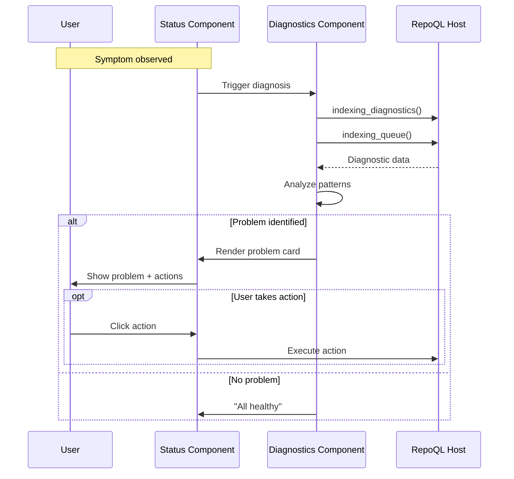

# Diagnosis Flow

How a developer identifies what's wrong when RepoQL isn't behaving.

## Why This Matters

Symptoms are easy to see: "indexing is slow", "search didn't find X", "UI says offline". Causes are hard to find:
- Which file is stuck?
- Which parser is slow?
- Why aren't embeddings generating?
- What's the actual error?

Without diagnosis flow, developers resort to logs. That's failure.

## Trigger

User observes a symptom:
- Status indicator shows "busy" for too long
- Search returns nothing when it shouldn't
- Queue depth keeps growing
- Health panel shows warning/error

## Symptom Categories

### Symptom: Pipeline Stuck

**Observation**: Status shows "Processing" for extended time, queue depth not decreasing.

**Diagnostic questions**:
1. What's in the queue?
2. Which stage is blocked?
3. Which specific file is stuck?
4. How long has it been stuck?

### Symptom: Search Returns Nothing

**Observation**: Search query returns no results, but files should match.

**Diagnostic questions**:
1. Is the file indexed?
2. Does it have embeddings?
3. Does it match the scope?
4. Was it penalized out?

### Symptom: Embeddings Not Ready

**Observation**: Status shows "Embeddings pending" indefinitely.

**Diagnostic questions**:
1. Is the embedding provider configured?
2. Is there an API error?
3. What's the embedding queue depth?
4. What's the latency per batch?

### Symptom: Host Offline

**Observation**: Status shows "Offline", connection failed.

**Diagnostic questions**:
1. Is the host process running?
2. Does the socket exist?
3. What was the last error?
4. Can we reconnect?

## Stages

### 1. Symptom Detection
**Actor**: Status streaming / User observation
**Action**: Problem state detected or noticed
**Output**: Symptom identified

Automatic detection via:
- Queue depth > threshold for > N seconds
- Health event with severity warning/error
- Embedding progress stalled

### 2. Diagnostic Data Collection
**Actor**: Diagnostics component
**Action**: Queries diagnostic endpoints
**Output**: Raw diagnostic data

```sql
-- Queue contents
SELECT * FROM indexing_queue();
-- Returns: uri, stage, status, media_type, queued_at, started_at

-- Pipeline state
SELECT * FROM indexing_diagnostics();
-- Returns: key-value pairs of current state
```

Plus from gRPC:
```protobuf
message IndexingDiagnosticsSnapshot {
  string status = 1;
  int64 epoch = 2;
  int32 hot_path_depth = 3;
  bool hot_path_active = 4;
  int32 idle_pending = 5;
  bool idle_active = 6;
  int32 analysis_depth = 7;
  int32 writer_pending = 8;
  string embed_mode = 9;
  int64 embed_last_epoch = 10;
  string last_error = 11;
}
```

### 3. Problem Identification
**Actor**: Diagnostics component
**Action**: Analyzes data to identify specific problem
**Output**: Identified problem with details

| Data Pattern | Identified Problem |
|--------------|-------------------|
| One item in queue for > 30s | "Stuck file: {uri}" |
| Parsing stage busy, others idle | "Parser bottleneck" |
| last_error not empty | "Error: {message}" |
| embed_last_epoch < current - 3 | "Embeddings stalled" |
| hot_path_depth growing | "Backpressure: files arriving faster than processing" |

### 4. Problem Display
**Actor**: Diagnostics component
**Action**: Renders problem with actionable context
**Output**: User sees specific problem and what to do

```
⚠ STUCK FILE
━━━━━━━━━━━━━━━━━━━━━━━━━━━━━━━━━━━━━━━━━━━
File: src/Legacy/HugeFile.cs
Stage: Parsing
Duration: 47 seconds
Parser: CSharpProcessor

Last progress: "Extracting symbols from method 847 of 2,341"

[View file] [Skip file] [View logs]
```

### 5. Action Options
**Actor**: User
**Action**: Takes corrective action based on diagnosis
**Output**: Problem addressed or escalated

| Problem | Actions Available |
|---------|-------------------|
| Stuck file | Skip, requeue, view in inspector |
| Parser slow | View parser metrics, file details |
| Embeddings stalled | Check API key, view error, retry |
| Host offline | Restart host, view last error |

## Termination

Flow completes when:
- Problem displayed with actionable details, or
- No problem found ("All systems healthy")

## Flow Diagram



## Problem Cards

### Stuck File
```
┌─────────────────────────────────────────────┐
│ ⚠ STUCK FILE                                │
├─────────────────────────────────────────────┤
│ File: src/Legacy/Massive.cs                 │
│ Stage: Parsing                              │
│ Duration: 2m 15s                            │
│ Parser: CSharpProcessor                     │
│                                             │
│ This file may be too large or have          │
│ pathological structure for the parser.      │
│                                             │
│ [Skip] [Retry] [Inspect File]               │
└─────────────────────────────────────────────┘
```

### Embeddings Stalled
```
┌─────────────────────────────────────────────┐
│ ⚠ EMBEDDINGS STALLED                        │
├─────────────────────────────────────────────┤
│ Last successful batch: 5 minutes ago        │
│ Pending files: 127                          │
│ Error: "API rate limit exceeded"            │
│                                             │
│ Embeddings will retry automatically.        │
│ Search results may be incomplete.           │
│                                             │
│ [Retry Now] [View Queue] [Check API Status] │
└─────────────────────────────────────────────┘
```

### Pipeline Backpressure
```
┌─────────────────────────────────────────────┐
│ ⚡ PIPELINE BACKPRESSURE                     │
├─────────────────────────────────────────────┤
│ Queue depth: 847 files                      │
│ Processing rate: ~12 files/sec              │
│ Estimated drain: ~70 seconds                │
│                                             │
│ Files are arriving faster than processing.  │
│ This is normal during large file changes.   │
│                                             │
│ [View Queue] [Pause Watcher]                │
└─────────────────────────────────────────────┘
```

### Connection Lost
```
┌─────────────────────────────────────────────┐
│ ✕ CONNECTION LOST                           │
├─────────────────────────────────────────────┤
│ Last connected: 30 seconds ago              │
│ Error: "Socket connection refused"          │
│                                             │
│ The RepoQL host may have stopped.           │
│                                             │
│ [Reconnect] [Start Host] [View Logs]        │
└─────────────────────────────────────────────┘
```

## Proactive Alerts

Some problems should alert without user action:

| Condition | Alert |
|-----------|-------|
| Item stuck > 60s | Warning badge + problem card |
| Error count > 0 | Error badge + problem card |
| Embeddings stalled > 5min | Warning badge |
| Connection lost | Immediate offline banner |

## Timing

| Query | Expected Duration |
|-------|-------------------|
| indexing_diagnostics() | < 10ms |
| indexing_queue() | < 50ms |
| Analysis | < 10ms |
| **Total diagnosis** | < 100ms |

## Verification

| Environment | How |
|-------------|-----|
| **Stuck file** | Add huge file, verify stuck card appears after 30s |
| **Error** | Introduce parse error, verify error card shows message |
| **Offline** | Stop host, verify offline card appears |
| **Recovery** | Restart host, verify online restoration |

**Test scenarios:**
```bash
# Simulate stuck file
# Add a 50MB generated C# file
# Watch for stuck file card

# Simulate error
# Add file with invalid encoding
# Watch for error card with message

# Simulate offline
# Kill RepoQL host process
# Watch for offline card
```

## What This Flow Establishes

- Problems surface automatically (no log diving)
- Specific files and stages identified
- Actionable context provided
- Recovery actions available in UI

## What This Flow Does NOT Decide

- Exact thresholds for "stuck" detection
- Alert notification mechanism (sound, toast, etc.)
- Log viewing UI implementation
- Detailed parser metrics breakdown

---

*Diagnosis answers: what's wrong, where, and what can I do about it?*
