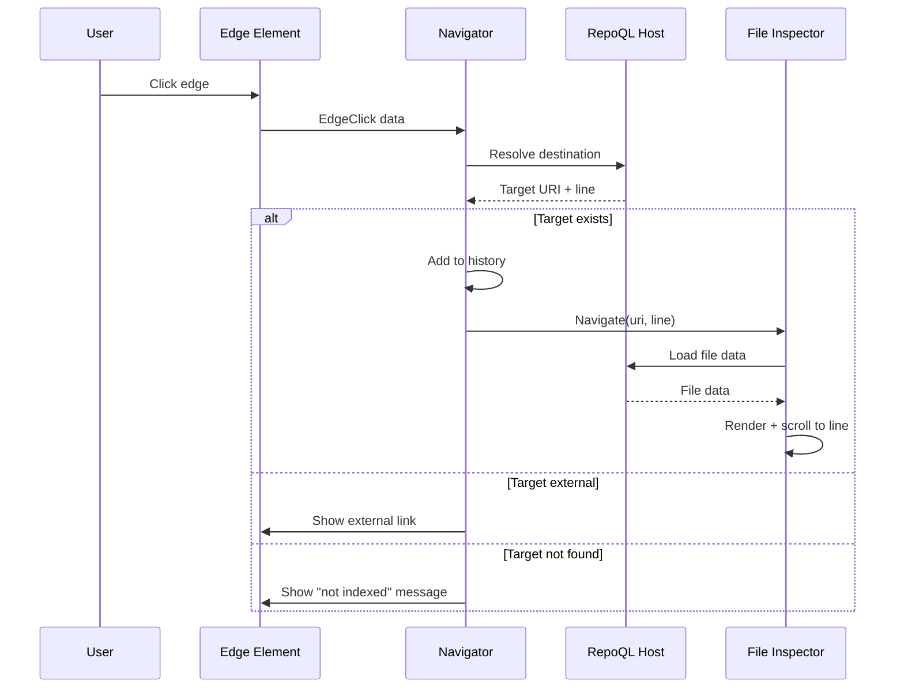

# Edge Traversal Flow

How a developer navigates the graph by clicking on relationships.

## Why This Matters

Code understanding is relational. Questions like:
- "What calls this function?"
- "Where is this import defined?"
- "What does this file depend on?"

These require following edges. If traversal is clunky, graph value is locked up.

## Trigger

User clicks an edge anywhere in the UI:
- Outgoing edge in file inspector ("→ CALLS UserRepository.GetById")
- Incoming edge in file inspector ("← LoginController")
- Edge in search results
- Edge in graph visualization (if implemented)

## Stages

### 1. Edge Click
**Actor**: User
**Action**: Clicks an edge element
**Output**: Edge data captured (type, destination)
**Failure**: N/A — edges are always clickable

Edge data available:
```typescript
interface EdgeClick {
  type: string;              // "CALLS", "IMPORTS", "REFERS_TO"
  destinationUri: string;    // May include fragment
  destinationNodeId?: string; // If resolved
  sourceUri: string;         // Where we came from
  sourceLine?: number;       // Line in source file
}
```

### 2. Destination Resolution
**Actor**: Navigator
**Action**: Determines where to navigate
**Output**: Resolved target or error state

| Destination State | Resolution |
|-------------------|------------|
| `destination_node_id` set | Query node for URI and span |
| `destination_uri` only | Use URI directly |
| Neither | Broken edge — show error |

```sql
-- If we have node ID
SELECT n.uri, s.start_line, s.end_line, n.headline
FROM node n
LEFT JOIN span s ON n.span_id = s.id
WHERE n.id = '{destination_node_id}';

-- If we only have URI, check if it exists
SELECT COUNT(*) FROM node WHERE uri = '{destination_uri}';
```

### 3. Target Validation
**Actor**: Navigator
**Action**: Checks if destination exists in index
**Output**: Valid target or explanation of why not

| Condition | Result |
|-----------|--------|
| Target exists in index | Proceed to navigation |
| Target is external (github://, http://) | Show "External reference" with link |
| Target URI not indexed | Show "Target not indexed" |
| Target was indexed but deleted | Show "Target no longer exists" |

### 4. Navigation
**Actor**: Navigator
**Action**: Updates UI to show destination
**Output**: File inspector loads target file

Navigation includes:
- File URI (container)
- Line number (if symbol target)
- Highlight span (if available)

### 5. Scroll to Target
**Actor**: File Inspector
**Action**: If target is a symbol, scrolls to that line
**Output**: Target symbol visible and highlighted

```
Navigation: file:///src/Data/UserRepository.cs#symbol=GetById
Result:
  - File inspector opens UserRepository.cs
  - Scrolls to GetById method
  - Highlights lines 47-62
```

### 6. Breadcrumb Update
**Actor**: Navigator
**Action**: Adds current location to navigation history
**Output**: User can go back to previous file

History enables:
- Back button to return to source file
- Breadcrumb trail showing navigation path

## Termination

Flow completes when:
- Target file inspector rendered and scrolled, or
- Error state displayed (broken link, external, not indexed)

## Flow Diagram



## Edge Types and Navigation

| Edge Type | Typical Destination | Example |
|-----------|--------------------| --------|
| CALLS | Method in another file | `UserRepository.GetById` |
| IMPORTS | File or package | `using System.Linq` |
| REFERS_TO | Symbol, heading, anchor | `[see Auth docs](#authentication)` |
| EXTENDS | Base class | `class Foo : BaseService` |
| IMPLEMENTS | Interface | `class Foo : IRepository` |
| HAS_PART | Child element | Section within document |

## Handling Edge Cases

### Broken Link
Edge exists but destination doesn't resolve:
```
⚠ Broken link
  Type: REFERS_TO
  Target: file:///docs/missing.md#section
  This file is not in the index.
```

### External Reference
Edge points outside indexed scope:
```
↗ External reference
  Type: IMPORTS
  Target: https://www.nuget.org/packages/Newtonsoft.Json
  [Open in browser]
```

### Ambiguous Target
Multiple nodes match the destination pattern:
```
? Multiple matches for "IRepository"
  ├─ file:///src/Core/IRepository.cs#symbol=IRepository
  ├─ file:///src/Legacy/IRepository.cs#symbol=IRepository
  └─ file:///tests/Mocks/IRepository.cs#symbol=IRepository
  [Click to select]
```

## Back Navigation

After traversing edges:
1. Back button returns to previous file
2. Restores scroll position
3. History depth: 10 entries (circular buffer)

```
History: AuthService.cs → UserRepository.cs → DatabaseContext.cs
                                                      ↑ current
[Back] returns to UserRepository.cs
```

## Timing

| Phase | Expected Duration |
|-------|-------------------|
| Click to resolution | < 50ms |
| File load (if not cached) | < 150ms |
| Scroll to line | < 20ms |
| **Total** | < 220ms |

## Verification

| Environment | How |
|-------------|-----|
| **Local** | Click IMPORTS edge, verify target file opens |
| **Symbol** | Click CALLS edge to method, verify scrolls to method line |
| **Back** | Navigate 3 files deep, click back twice, verify correct file |
| **Broken** | Create edge to nonexistent file, verify error shown |

**Test scenario:**
```
1. Open AuthService.cs
2. Click "→ CALLS UserRepository.GetById [line 52]"
3. Verify: UserRepository.cs opens, scrolled to GetById
4. Click Back
5. Verify: AuthService.cs shown, scrolled to line 52
```

## What This Flow Establishes

- Edge clicks navigate to destination
- Symbol targets scroll to line
- Broken/external links handled gracefully
- Back navigation maintains context
- Navigation history is bounded

## What This Flow Does NOT Decide

- Visual style of edge elements
- Keyboard shortcuts for navigation
- Whether to open in new tab vs same view
- Graph visualization layout

---

*Edges are the questions. Traversal is the answer.*
