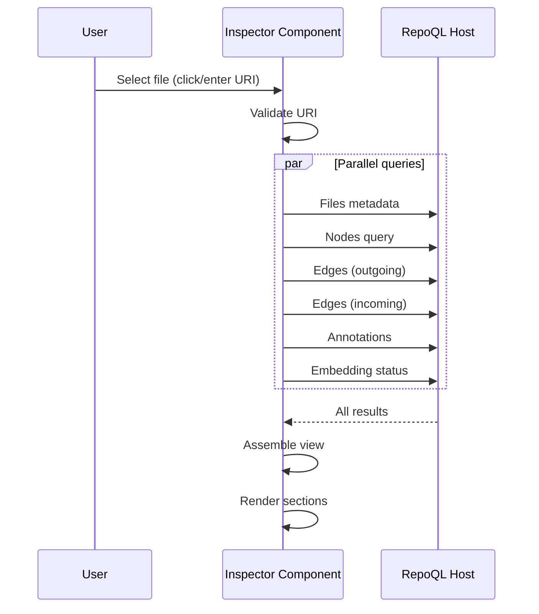

# File Inspection Flow

How a developer sees everything RepoQL knows about a specific file.

## Why This Matters

"Did RepoQL parse this correctly?" is the core verification question. Developers need to see:
- What nodes were extracted (classes, functions, sections)
- What relationships were found (imports, calls, references)
- What problems were detected (lint, errors)
- Whether the file has embeddings

Without this, parser bugs go unnoticed.

## Trigger

User selects a file via:
- Tree browser click
- Search result click
- Manual URI entry
- Edge traversal (clicking a link)

## Stages

### 1. File Selection
**Actor**: User
**Action**: Identifies file by any method above
**Output**: File URI captured
**Failure**: Invalid URI format → validation error

### 2. Metadata Query
**Actor**: Inspector component
**Action**: Queries Files view for document metadata
**Output**: Basic file info displayed

```sql
SELECT uri, name, extension, lang, lines, tokens,
       headline, summary, structure,
       error_count, warning_count
FROM Files
WHERE uri = '{uri}';
```

Returns:
- File identity (path, name, extension)
- Language classification
- Size metrics (lines, tokens)
- X-ray summaries (headline, summary, structure)
- Annotation counts

### 3. Nodes Query
**Actor**: Inspector component
**Action**: Queries all nodes belonging to this document
**Output**: Node list with hierarchy

```sql
SELECT n.id, n.kind, n.uri, n.headline,
       s.start_line, s.end_line
FROM node n
LEFT JOIN span s ON n.span_id = s.id
WHERE n.uri = '{uri}'
   OR EXISTS (
     SELECT 1 FROM node doc
     WHERE doc.uri = '{uri}'
       AND n.artifact_id = doc.artifact_id
   )
ORDER BY s.start_line NULLS LAST, n.kind;
```

Groups nodes by kind (classes, methods, sections) with line locations.

### 4. Edges Query
**Actor**: Inspector component
**Action**: Queries relationships to/from this file's nodes
**Output**: Outgoing and incoming edges

```sql
-- Outgoing: what this file references
SELECT e.type, e.destination_uri,
       dest.headline as dest_headline,
       src_span.start_line as from_line
FROM edge e
JOIN node src ON e.source_node_id = src.id
LEFT JOIN node dest ON e.destination_node_id = dest.id
LEFT JOIN span src_span ON e.source_span_id = src_span.id
WHERE src.uri = '{uri}' OR src.container_uri_lowercase = lower('{container}')
ORDER BY src_span.start_line;

-- Incoming: what references this file
SELECT e.type, src.uri as source_uri,
       src.headline as source_headline,
       dest_span.start_line as to_line
FROM edge e
JOIN node src ON e.source_node_id = src.id
LEFT JOIN span dest_span ON e.destination_span_id = dest_span.id
WHERE e.destination_uri = '{uri}'
   OR e.destination_node_id IN (
     SELECT id FROM node WHERE uri = '{uri}'
   )
ORDER BY e.type, src.uri;
```

### 5. Annotations Query
**Actor**: Inspector component
**Action**: Queries diagnostics for this file
**Output**: Errors, warnings, hints with locations

```sql
SELECT severity, rule_id, message,
       target_span.start_line, target_span.end_line
FROM Annotations a
LEFT JOIN span target_span ON a.target_span_id = target_span.id
WHERE a.resolved_target_uri LIKE '{uri}%'
ORDER BY a.severity_rank DESC, target_span.start_line;
```

### 6. Embedding Status Query
**Actor**: Inspector component
**Action**: Checks if file has embeddings
**Output**: Embedding presence and type

```sql
SELECT type, created_at
FROM document_embedding
WHERE document_uri = '{uri}';
```

Returns whether structure embeddings, full-text embeddings, or both exist.

### 7. Result Assembly
**Actor**: Inspector component
**Action**: Assembles all query results into unified view
**Output**: Complete file inspection rendered

## Termination

Flow completes when all queries return and view renders, showing:
- File metadata header
- X-ray summaries (collapsible)
- Nodes list (grouped by kind)
- Edges (outgoing and incoming, clickable)
- Annotations (by severity)
- Embedding status badge

## Flow Diagram



## Display Structure

```
┌─────────────────────────────────────────────────────────┐
│ file:///src/Auth/AuthService.cs                         │
│ C# · 342 lines · ~2.1k tokens · Embeddings: ✓           │
├─────────────────────────────────────────────────────────┤
│ HEADLINE                                                │
│ AuthService — JWT authentication and token refresh      │
├─────────────────────────────────────────────────────────┤
│ ▶ STRUCTURE (click to expand)                           │
├─────────────────────────────────────────────────────────┤
│ NODES (12)                                              │
│ Classes                                                 │
│   └─ AuthService [15-342]                               │
│ Methods                                                 │
│   ├─ ValidateToken [47-89]                              │
│   ├─ RefreshToken [91-156]                              │
│   └─ ...                                                │
├─────────────────────────────────────────────────────────┤
│ EDGES                                                   │
│ Outgoing (→)                           Incoming (←)     │
│ CALLS UserRepo.GetById [52]            LoginController  │
│ IMPORTS JwtLibrary [3]                 ApiGateway       │
│ ...                                    ...              │
├─────────────────────────────────────────────────────────┤
│ ANNOTATIONS (2)                                         │
│ ⚠ CA1822: Consider static [112]                         │
│ ⚠ IDE0060: Unused parameter [47]                        │
└─────────────────────────────────────────────────────────┘
```

## Error Handling

| Error | User Sees |
|-------|-----------|
| File not found | "File not indexed. Is it in .gitignore?" |
| File indexed, no nodes | "File indexed but no structure extracted (binary or unsupported format)" |
| No embeddings | Badge: "No embeddings" (informational, not error) |
| Query timeout | "Loading timed out. Try again." |

## Timing

| Query | Expected Duration |
|-------|-------------------|
| Metadata | < 20ms |
| Nodes | < 50ms |
| Edges (outgoing) | < 100ms |
| Edges (incoming) | < 100ms (can be slow for heavily-referenced files) |
| Annotations | < 50ms |
| Embeddings | < 20ms |
| **Total (parallel)** | < 150ms typical |

## Edge Click Behavior

When user clicks an edge:
1. Target URI extracted from edge
2. Inspector navigates to that file
3. If target is a symbol, scroll to that line

This enables graph traversal without leaving the inspector.

## Verification

| Environment | How |
|-------------|-----|
| **Local** | Open a C# file, verify classes and methods appear as nodes |
| **Edges** | Open file with imports, verify IMPORTS edges show target files |
| **Annotations** | Open file with lint warnings, verify they appear with line numbers |
| **Not indexed** | Enter path to .gitignored file, verify "not indexed" message |

**Test file:**
```csharp
// src/Test/Example.cs
using System;

public class Example  // Should appear as cs_class node
{
    public void DoThing() { }  // Should appear as cs_method node

    // ReSharper disable once UnusedParameter
    public void Unused(int x) { }  // Should have annotation
}
```

## What This Flow Establishes

- All queries run in parallel (fast load)
- File metadata, nodes, edges, annotations, embeddings all visible
- Nodes grouped by kind with line numbers
- Edges are clickable for traversal
- Missing data explained (not just empty)

## What This Flow Does NOT Decide

- Whether to show raw text content
- Diff view against previous index state
- Syntax highlighting for structure
- Node/edge filtering UI

---

*Inspection answers: what does RepoQL see when it looks at this file?*
