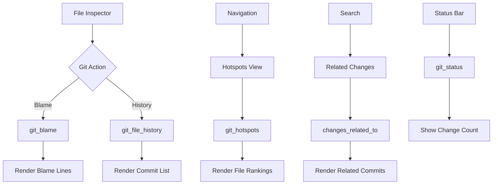

# Git Integration Flow

How a developer uses git history, blame, and change analysis through the UI.

## Why This Matters

Code understanding requires history context:
- "Who changed this line and why?"
- "What files change together?"
- "Which files are most volatile?"
- "What commits relate to this feature?"

RepoQL indexes git data. The UI should expose it.

## Git Capabilities

| Capability | Function/View | Purpose |
|------------|--------------|---------|
| Blame | `git_blame(scope)` | Who changed each line |
| History | `git_file_history(uri)` | Commits affecting a file |
| Recent | `git_recent` view | Commits from last 7 days |
| Hotspots | `git_hotspots` view | Files ranked by change frequency |
| Related | `changes_related_to(keywords)` | Commits touching semantically related files |
| Diff | `git_diff(from, to)` | Changes between refs |
| Status | `git_status()` | Working copy state |

## Flow 1: Blame View

### Trigger
User clicks "Blame" on a file in inspector, or uses `=> blame` modifier in read tester.

### Stages

**1. Request Blame**
```sql
SELECT * FROM git_blame('file:///src/Auth/AuthService.cs');
-- Returns: line_number, content, author, email, commit_sha, commit_date, commit_message
```

**2. Render Blame**
```
┌─ BLAME: src/Auth/AuthService.cs ─────────────────────────────────┐
│                                                                   │
│  47 │ alice   │ 3d ago │ public bool ValidateToken(string token) │
│  48 │ alice   │ 3d ago │ {                                       │
│  49 │ bob     │ 2w ago │     if (string.IsNullOrEmpty(token))    │
│  50 │ bob     │ 2w ago │         return false;                   │
│  51 │ alice   │ 3d ago │                                         │
│  52 │ alice   │ 3d ago │     var claims = ParseClaims(token);    │
│                                                                   │
│  Color: alice (blue), bob (green), carol (orange)                │
└───────────────────────────────────────────────────────────────────┘
```

**3. Commit Detail**
Click author/date to see commit:
```
Commit: abc1234
Author: alice <alice@example.com>
Date: 3 days ago

feat(auth): Add token validation with claims parsing

- Added ValidateToken method
- Integrated with claims parser
- Added unit tests
```

---

## Flow 2: File History

### Trigger
User clicks "History" on a file, or uses `=> history` modifier.

### Stages

**1. Request History**
```sql
SELECT * FROM git_file_history('file:///src/Auth/AuthService.cs');
-- Returns: commit_sha, author, date, message, lines_added, lines_removed
```

**2. Render History**
```
┌─ HISTORY: src/Auth/AuthService.cs ───────────────────────────────┐
│                                                                   │
│  abc1234 │ alice │ 3d ago  │ feat(auth): Add token validation    │
│          │       │         │ +47 -12                              │
│                                                                   │
│  def5678 │ bob   │ 2w ago  │ fix: Handle null tokens              │
│          │       │         │ +3 -1                                │
│                                                                   │
│  ghi9012 │ carol │ 1mo ago │ refactor: Extract auth to service   │
│          │       │         │ +156 -0 (file created)               │
│                                                                   │
│  [Load older...]                                                  │
└───────────────────────────────────────────────────────────────────┘
```

**3. Filter by keyword**
```
Filter: [token          ]

Showing commits matching "token":
  abc1234 │ feat(auth): Add token validation
  def5678 │ fix: Handle null tokens
```

---

## Flow 3: Hotspots

### Trigger
User opens Hotspots view from navigation.

### Stages

**1. Query Hotspots**
```sql
SELECT * FROM git_hotspots LIMIT 50;
-- Returns: uri, commit_count, authors, last_modified, churn_score
```

**2. Render Hotspots**
```
┌─ HOTSPOTS ───────────────────────────────────────────────────────┐
│ Files ranked by change frequency (potential complexity/risk)     │
├──────────────────────────────────────────────────────────────────┤
│                                                                   │
│  1. src/Auth/AuthService.cs                                      │
│     47 commits │ 5 authors │ Last: 3 days ago                    │
│     ████████████████████░░░░ Churn: High                         │
│                                                                   │
│  2. src/Data/UserRepository.cs                                   │
│     34 commits │ 3 authors │ Last: 1 week ago                    │
│     ██████████████░░░░░░░░░ Churn: Medium                        │
│                                                                   │
│  3. src/Api/Controllers/AuthController.cs                        │
│     28 commits │ 4 authors │ Last: 2 days ago                    │
│     ███████████░░░░░░░░░░░░ Churn: Medium                        │
│                                                                   │
└───────────────────────────────────────────────────────────────────┘
```

**3. Click to Inspect**
Click file opens file inspector with history tab expanded.

---

## Flow 4: Related Changes

### Trigger
User enters a search term and asks "what commits relate to this?"

### Stages

**1. Semantic Search for Related Files**
```sql
SELECT * FROM changes_related_to('authentication token refresh');
-- Returns: commit_sha, message, date, files_changed, relevance_score
```

**2. Render Related Commits**
```
┌─ COMMITS RELATED TO: "authentication token refresh" ─────────────┐
│                                                                   │
│  abc1234 │ feat(auth): Add token validation           │ Score: 92│
│          │ Files: AuthService.cs, TokenValidator.cs              │
│                                                                   │
│  xyz7890 │ fix: Refresh token expiry handling         │ Score: 87│
│          │ Files: AuthService.cs, Claims.cs                      │
│                                                                   │
│  pqr3456 │ docs: Update auth flow documentation       │ Score: 71│
│          │ Files: docs/auth.md                                   │
│                                                                   │
└───────────────────────────────────────────────────────────────────┘
```

This uses semantic search to find files related to the query, then finds commits that touched those files.

---

## Flow 5: Working Copy Status

### Trigger
Displayed in status bar when uncommitted changes exist.

### Stages

**1. Query Status**
```sql
SELECT * FROM git_status();
-- Returns: path, status (modified, added, deleted, untracked)
```

**2. Display in Status Bar**
```
[●] Ready │ 4,231 files │ Embeddings ✓ │ Git: 3 modified, 1 untracked
```

**3. Expand to See Files**
```
Working Copy Changes:
  M src/Auth/AuthService.cs
  M src/Data/UserRepository.cs
  M tests/AuthTests.cs
  ? docs/notes.md (untracked)
```

---

## Termination

Each sub-flow completes when data is rendered. Git queries are read-only with no side effects.

## Flow Diagram



## Error Handling

| Error | User Sees |
|-------|-----------|
| Not a git repo | "Git integration unavailable (not a repository)" |
| File not tracked | "File is not tracked by git" |
| No history | "No git history for this file" |
| Git not available | "Git command not found" |

## Timing

| Query | Expected Duration |
|-------|-------------------|
| git_blame (single file) | 50-200ms |
| git_file_history | 20-100ms |
| git_hotspots | 100-500ms (scans history) |
| changes_related_to | 200-500ms (semantic + git) |
| git_status | < 50ms |

## Verification

| Environment | How |
|-------------|-----|
| **Blame** | Open file, click Blame, verify author shown per line |
| **History** | Open file, click History, verify commits match `git log` |
| **Hotspots** | Open Hotspots, verify most-changed files at top |
| **Related** | Search "auth", click Related Changes, verify relevant commits |

## What This Flow Establishes

- Blame is accessible per file
- History is filterable by keyword
- Hotspots surface high-churn files
- Semantic search connects to git history
- Working copy status visible in status bar

## What This Flow Does NOT Decide

- Inline blame in code view (vs separate panel)
- Diff rendering style
- Branch comparison UI
- Commit graph visualization

---

*Git integration answers: who changed this, when, and why?*
