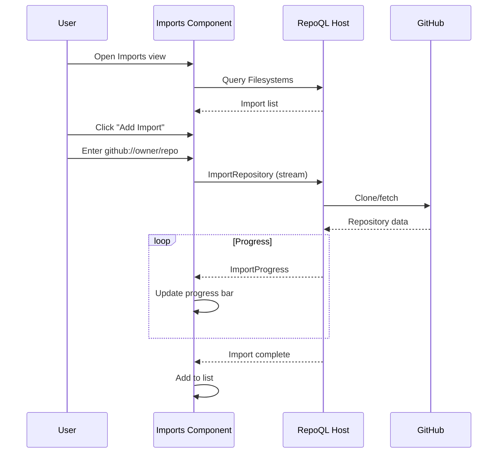

# Imports Management Flow

How a developer manages external repositories imported into RepoQL.

## Why This Matters

RepoQL can index external repos (`github://owner/repo`). Developers need to:
- See what's imported and its status
- Add new imports
- Remove stale imports
- Search across specific imports

Without management UI, imports are invisible after creation.

## Trigger

User navigates to Imports view or clicks "Manage imports" from status panel.

## Stages

### 1. List Imports
**Actor**: Imports component
**Action**: Queries Filesystems view for imported sources
**Output**: Import list with status

```sql
SELECT
  uri,
  source_type,
  status,
  file_count,
  last_indexed,
  error_message
FROM Filesystems
WHERE source_type != 'local'
ORDER BY uri;
```

Returns:
```
┌─────────────────────────────────────────────────────────┐
│ IMPORTED REPOSITORIES                                   │
├─────────────────────────────────────────────────────────┤
│ ✓ github://anthropics/claude-code                       │
│   Files: 1,247 | Last indexed: 2 hours ago              │
│                                                         │
│ ✓ github://microsoft/typescript                         │
│   Files: 8,932 | Last indexed: 1 day ago                │
│                                                         │
│ ⚠ github://example/broken-repo                          │
│   Error: Repository not found or access denied          │
│                                                         │
│ ⟳ github://new/importing                                │
│   Status: Indexing... (342 / 1,500 files)               │
└─────────────────────────────────────────────────────────┘
```

### 2. Import Status Detail
**Actor**: User
**Action**: Clicks an import to see details
**Output**: Expanded status view

```
github://anthropics/claude-code
━━━━━━━━━━━━━━━━━━━━━━━━━━━━━━━━━━━━━━━━
Status: Ready
Branch: main
Files: 1,247
Nodes: 12,847
Edges: 8,234
Embeddings: ✓ Ready

Index Coverage:
  ████████████████████░  95%
  Pending: 62 files (semantic indexing)

[Reindex] [Remove] [Browse Files]
```

### 3. Add Import
**Actor**: User
**Action**: Enters repository URI and clicks Add
**Output**: Import queued

Input:
```
┌─────────────────────────────────────────────────────────┐
│ ADD IMPORT                                              │
├─────────────────────────────────────────────────────────┤
│ Repository: [github://owner/repo           ]            │
│ Branch/Ref: [main                          ] (optional) │
│                                                         │
│ Wait for:   ○ Discovery (fast, can query file list)     │
│             ● Indexing (can query structure)            │
│             ○ Semantic (can search, slower)             │
│                                                         │
│ [Add Import]                                            │
└─────────────────────────────────────────────────────────┘
```

### 4. Import Progress
**Actor**: Imports component
**Action**: Streams import progress via gRPC
**Output**: Real-time progress display

```protobuf
rpc ImportRepository(ImportRequest) returns (stream ImportProgress);

message ImportProgress {
  ImportStage stage = 1;      // Discovery, Indexing, SemanticIndexing, Analysis
  int32 files_total = 2;
  int32 files_complete = 3;
  string current_file = 4;
  string error = 5;
}
```

Progress display:
```
Importing github://microsoft/typescript...

Discovery:     ████████████████████ Complete (8,932 files)
Indexing:      ████████████░░░░░░░░ 62% (5,538 / 8,932)
               Current: src/compiler/checker.ts

[Cancel]
```

### 5. Remove Import
**Actor**: User
**Action**: Clicks Remove on an import
**Output**: Confirmation dialog, then removal

```
Remove github://anthropics/claude-code?

This will:
- Delete 1,247 indexed files
- Delete 12,847 nodes
- Delete 8,234 edges
- Free ~45 MB in database

This cannot be undone.

[Cancel] [Remove]
```

Removal executes:
```
import -github://anthropics/claude-code
```
(Prefix `-` removes the import)

### 6. Search Scope Selection
**Actor**: User
**Action**: Selects which imports to include in search scope
**Output**: Scope filter for search

```
Search scope:
  ☑ Local files (file:///)
  ☑ github://anthropics/claude-code
  ☐ github://microsoft/typescript
  ☑ Embedded docs (repoql-docs:///)
```

Generates scope pattern:
```
file:///%;github://anthropics/claude-code/%;repoql-docs:///%
```

## Termination

Flow completes when:
- Import list displayed, or
- Import added and progress shown, or
- Import removed

## Flow Diagram



## Import States

| State | Icon | Meaning |
|-------|------|---------|
| Ready | ✓ | Fully indexed, searchable |
| Indexing | ⟳ | Import in progress |
| Pending | ◔ | Queued, not started |
| Error | ⚠ | Failed, see error message |
| Stale | ◷ | Not updated recently |

## Error Handling

| Error | User Sees |
|-------|-----------|
| Repo not found | "Repository not found. Check the URL and your access." |
| Auth required | "Authentication required. Configure GitHub token." |
| Rate limited | "GitHub rate limit exceeded. Try again in X minutes." |
| Clone failed | "Failed to clone: {git error}" |
| Already imported | "Repository already imported. Use Reindex to update." |

## Timing

| Operation | Expected Duration |
|-----------|-------------------|
| List imports | < 50ms |
| Add small repo (< 100 files) | 10-30s |
| Add medium repo (1k files) | 1-5min |
| Add large repo (10k files) | 5-30min |
| Remove import | < 5s |

## Authentication

For private repos, GitHub token needed:
```
GITHUB_TOKEN environment variable
or
gh auth login (GitHub CLI)
```

UI shows auth status:
```
GitHub: ✓ Authenticated as @username
        Private repos accessible
```

## Verification

| Environment | How |
|-------------|-----|
| **List** | Import a repo, verify it appears in list |
| **Progress** | Import repo, verify progress updates in real-time |
| **Search** | Import repo, search for term in it, verify results |
| **Remove** | Remove import, verify files no longer searchable |

**Test scenario:**
```
1. Add github://anthropics/anthropic-quickstarts
2. Watch progress (should complete in ~30s)
3. Search for "claude" with scope including import
4. Verify results include files from import
5. Remove import
6. Search again, verify no results from that repo
```

## What This Flow Establishes

- Import visibility with status and stats
- Add imports with progress streaming
- Remove imports with confirmation
- Search scope selection per import
- Error states clearly explained

## What This Flow Does NOT Decide

- Scheduled/automatic refresh of imports
- Webhook integration for live updates
- Multi-branch import
- Partial import (subdirectory only)

---

*Imports management answers: what external code is in my index?*
