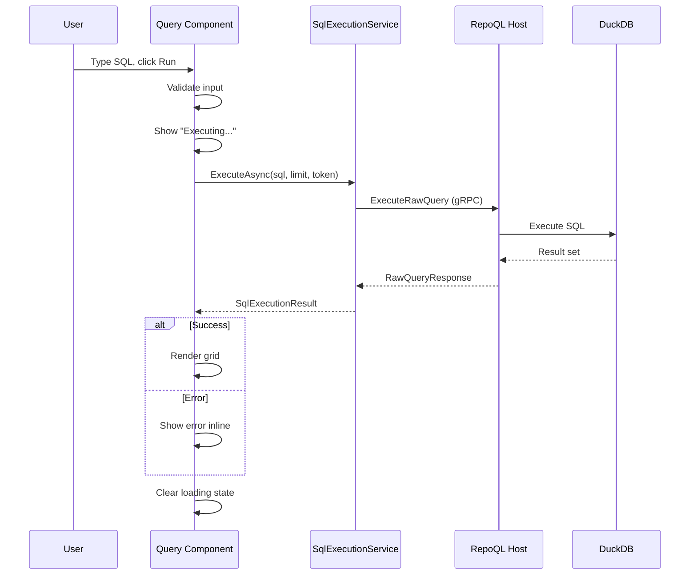

# Query Execution Flow

How a SQL query travels from user input to rendered results.

## Why This Matters

Query execution is the most direct way to test RepoQL. If this flow is slow, broken, or confusing:
- Developers can't verify macros work
- Developers can't debug search issues
- Developers can't explore the graph

## Trigger

User types SQL and presses Run (or Ctrl+Enter).

## Stages

### 1. Input Capture
**Actor**: Query component
**Action**: Captures SQL text and row limit from form
**Output**: Validated query parameters
**Failure**: Empty SQL → button disabled, no submission

### 2. Request Preparation
**Actor**: SqlExecutionService
**Action**: Creates cancellation token, prepares gRPC request
**Output**: Request ready to send

```protobuf
message RawQueryRequest {
  string sql = 1;
  int32 row_limit = 2;  // 0 = no limit
}
```

### 3. Query Execution
**Actor**: RepoQL Host
**Action**: Executes SQL against DuckDB
**Output**: Column metadata and row data
**Failure**: Syntax error, runtime error, timeout

```protobuf
message RawQueryResponse {
  repeated ColumnInfo columns = 1;
  repeated RowData rows = 2;
  string error = 3;  // Set if execution failed
  int64 duration_ms = 4;
  int64 total_rows = 5;  // Before limit applied
  bool truncated = 6;    // True if limit applied
}
```

### 4. Result Rendering
**Actor**: Query component
**Action**: Renders columns and rows in grid
**Output**: User sees results or error message
**Failure**: Rendering error (unlikely) → show raw JSON fallback

### 5. State Cleanup
**Actor**: Query component
**Action**: Disposes cancellation token, clears loading state
**Output**: UI ready for next query

## Termination

Flow completes when:
- Results rendered successfully, or
- Error message displayed, or
- User cancels (cancellation token triggered)

## Flow Diagram



## Error Handling

| Error | User Sees |
|-------|-----------|
| SQL syntax error | Error message with position hint |
| Runtime error (e.g., column not found) | Error message from DuckDB |
| Query timeout | "Query timed out after X seconds" |
| Connection lost | "Connection lost. Reconnecting..." |
| Cancelled by user | Results cleared, ready for new query |

**Error display**: Inline, above results area. Red background. Full error text visible.

## Timing

| Phase | Expected Duration |
|-------|-------------------|
| Input → Request | < 10ms |
| gRPC round-trip | < 10ms (local socket) |
| Simple query (SELECT * FROM Files LIMIT 100) | < 50ms |
| Complex query (search with embeddings) | 100-500ms |
| Rendering 100 rows | < 50ms |

## Cancellation

User can cancel a running query:
1. Click Cancel button (appears during execution)
2. Cancellation token fires
3. gRPC call aborted
4. UI returns to ready state

Host-side: DuckDB queries are not interruptible mid-execution, but the response is discarded if cancelled.

## Large Results

| Rows Returned | Behaviour |
|---------------|-----------|
| ≤ limit | Render all |
| > limit | Render up to limit, show "X more rows not shown" |
| Very wide rows | Horizontal scroll, columns not truncated |

Default limit: 200 rows (configurable in UI).

## Verification

| Environment | How |
|-------------|-----|
| **Local** | Run `SELECT 1`, verify "1" appears in grid |
| **Automated** | Mock gRPC response, verify grid renders correct columns/rows |
| **Error case** | Run `SELECT * FROM nonexistent`, verify error message appears |

**Test queries:**
```sql
-- Simplest
SELECT 1 as test;

-- Uses macro
SELECT * FROM Files LIMIT 10;

-- Uses search (exercises embeddings)
SELECT * FROM search('authentication', k := 5);

-- Error case
SELECT * FROM this_table_does_not_exist;
```

## What This Flow Establishes

- Query execution is synchronous request/response (not streaming)
- Cancellation is supported via token
- Errors appear inline, not in separate panel
- Row limits prevent memory issues
- Duration is tracked and displayed

## What This Flow Does NOT Decide

- Editor implementation (textarea vs Monaco)
- Saved queries functionality
- Autocomplete or intellisense
- Result export formats
- Keyboard shortcut bindings

---

*The query is the question. The grid is the answer.*
