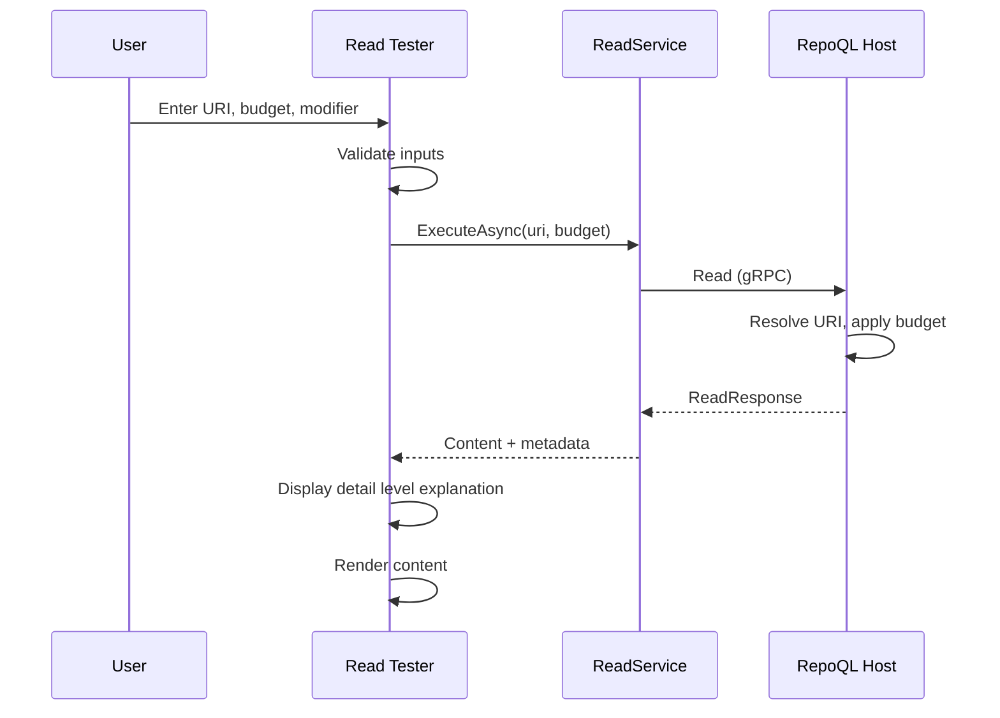

# Read Tool Testing Flow

How a developer tests the `read` MCP tool to understand progressive disclosure.

## Why This Matters

The `read` tool is how agents retrieve content. It's complex:
- URI fragments (`#line=`, `#symbol=`, `#char=`)
- Modifiers (`=> tree`, `=> history`, `=> blame`, `=> lint`)
- Token budgets controlling detail level
- Glob patterns for multiple files
- Question syntax for LLM synthesis

Developers need to test: "If an agent runs this read command, what do they get?"

## Trigger

User enters a read command (URI + budget + optional modifier) and clicks Read.

## Stages

### 1. Command Input
**Actor**: Read tester component
**Action**: Captures URI, token budget, and modifier
**Output**: Validated read parameters

Input fields:
```
┌─────────────────────────────────────────────┐
│ URI                                         │
│ [file:///src/Auth/**/*.cs#symbol=*Repo    ] │
│                                             │
│ Token Budget         Modifier               │
│ [2000        ]       [tree: headlines  ▼]   │
│                                             │
│ Question (optional, triggers LLM synthesis) │
│ [How does authentication work?            ] │
│                                             │
│ [Read]                                      │
└─────────────────────────────────────────────┘
```

### 2. URI Validation
**Actor**: Read tester component
**Action**: Validates URI syntax and fragment/modifier compatibility
**Output**: Validation result

| Check | Invalid Example | Error |
|-------|-----------------|-------|
| URI format | `src/foo` (missing scheme) | "URI must start with scheme (file:///, repoql-docs://)" |
| Fragment syntax | `#line=abc` | "Line fragment must be numeric" |
| Modifier conflict | `#symbol=Foo => blame` | "Blame modifier requires file, not symbol" |

### 3. Read Execution
**Actor**: ReadService
**Action**: Calls Read gRPC method
**Output**: Read response with content

```protobuf
message ReadRequest {
  string uri = 1;           // With fragments, globs, modifiers
  int32 token_budget = 2;
  string question = 3;      // Optional, triggers LLM synthesis
}

message ReadResponse {
  string content = 1;       // The actual output
  ReadStatus status = 2;    // Readiness, timing
  int32 tokens_used = 3;    // Actual tokens in response
  string detail_level = 4;  // "headline", "structure", or "full"
}
```

### 4. Detail Level Display
**Actor**: Read tester component
**Action**: Shows what detail level was used and why
**Output**: User understands progressive disclosure

```
Detail Level: structure
Reason: Full content (4,231 tokens) exceeds budget (2,000)
        Returned structure (892 tokens) instead

Budget allocation:
  ├─ file:///src/Auth/AuthService.cs (412 tokens)
  ├─ file:///src/Auth/TokenValidator.cs (289 tokens)
  └─ file:///src/Auth/Claims.cs (191 tokens)
```

### 5. Content Rendering
**Actor**: Read tester component
**Action**: Displays the read output as agents would see it
**Output**: Raw output visible with metadata

```
┌─ READ OUTPUT ─────────────────────────────────┐
│ Tokens: 892 / 2000 budget                     │
│ Detail: structure                             │
│ Files: 3 matched                              │
├───────────────────────────────────────────────┤
│ src/Auth/AuthService.cs                       │
│   AuthService — JWT authentication            │
│   ├─ ValidateToken(string token)              │
│   ├─ RefreshToken(string refresh)             │
│   └─ RevokeToken(string token)                │
│                                               │
│ src/Auth/TokenValidator.cs                    │
│   TokenValidator — Token validation logic     │
│   ├─ IsExpired(JwtToken token)                │
│   └─ HasClaim(JwtToken token, string claim)   │
│ ...                                           │
└───────────────────────────────────────────────┘
```

### 6. Modifier Comparison (Optional)
**Actor**: Read tester component
**Action**: Shows output with different modifiers for same URI
**Output**: Side-by-side comparison

User can quickly compare:
- Default (content)
- `=> tree`
- `=> tree: headlines`
- `=> history`
- `=> blame`
- `=> lint`

## Termination

Flow completes when:
- Content rendered with metadata, or
- Error displayed (invalid URI, file not found)

## Flow Diagram



## Fragment Types

| Fragment | Example | What It Selects |
|----------|---------|-----------------|
| `#line=N` | `#line=42` | Single line |
| `#line=N,M` | `#line=10,50` | Line range (inclusive) |
| `#symbol=Name` | `#symbol=AuthService` | Named symbol |
| `#symbol=A.B` | `#symbol=Auth.Validate` | Nested symbol |
| `#symbol=*` | `#symbol=*` | All symbols in file |
| `#char=N,M` | `#char=100,200` | Byte range |

## Modifier Types

| Modifier | Example | Output |
|----------|---------|--------|
| (default) | `file:///src/foo.cs` | Content at budget level |
| `=> tree` | `file:///src/** => tree` | Directory structure |
| `=> tree: folders` | `=> tree: folders` | Folders only with file counts |
| `=> tree: headlines` | `=> tree: headlines` | Folders + files + summaries |
| `=> history` | `=> history` | Git commits affecting file |
| `=> history: keyword` | `=> history: auth` | Commits matching keyword |
| `=> blame` | `=> blame` | Git blame for file |
| `=> lint` | `=> lint` | Diagnostics only |
| `=> lint: errors` | `=> lint: errors` | Errors only |

## Budget Effects

Show how budget affects output:

| Budget | Typical Result |
|--------|----------------|
| 50 | Headline only |
| 500 | Structure (outline) |
| 2000 | Structure with some content |
| 5000 | Full content for most files |

User can drag a slider to see how output changes:
```
Budget: [====|==========] 2000
        50              10000

At 2000 tokens, you get:
  structure for large files
  full content for small files
```

## Question Syntax

When question is provided (`uri // question`), triggers LLM synthesis:

```
URI: file:///src/Auth/**/*.cs
Question: How does token refresh work?

[LLM synthesizes answer from matched files]

Answer:
  Token refresh is handled by AuthService.RefreshToken()...

Sources:
  - file:///src/Auth/AuthService.cs#line=91,156
  - file:///src/Auth/TokenValidator.cs#line=23,45
```

Requires `OPENROUTER_API_KEY` to be set.

## Error Handling

| Error | User Sees |
|-------|-----------|
| No files match glob | "No files match pattern" |
| File not indexed | "File not in index" |
| Invalid fragment | "Invalid fragment syntax: {details}" |
| Question without API key | "LLM synthesis requires OPENROUTER_API_KEY" |
| Budget too low | "Budget too low for any content (minimum: 50)" |

## Timing

| Operation | Expected Duration |
|-----------|-------------------|
| URI validation | < 10ms |
| Read (single file) | 50-100ms |
| Read (glob, 10 files) | 100-300ms |
| Read with question (LLM) | 2-10s |

## Verification

| Environment | How |
|-------------|-----|
| **Line fragment** | Read `#line=10,20`, verify only those lines returned |
| **Symbol fragment** | Read `#symbol=ClassName`, verify class content returned |
| **Budget effect** | Read same file at 100 vs 5000 budget, verify different detail |
| **Tree modifier** | Read with `=> tree`, verify directory structure returned |
| **History** | Read with `=> history`, verify git commits shown |

**Test commands:**
```
# Headline only
file:///src/Auth/AuthService.cs
Budget: 50

# Structure
file:///src/Auth/AuthService.cs
Budget: 500

# Full content
file:///src/Auth/AuthService.cs
Budget: 5000

# Line range
file:///src/Auth/AuthService.cs#line=47,89
Budget: 2000

# Symbol
file:///src/Auth/AuthService.cs#symbol=ValidateToken
Budget: 2000

# Tree view
file:///src/** => tree: headlines
Budget: 3000

# Git history
file:///src/Auth/AuthService.cs => history: token
Budget: 1500
```

## What This Flow Establishes

- Read tool is testable with all parameters
- Progressive disclosure is visible (what level, why)
- Budget effects are explorable (slider)
- Modifiers are discoverable and testable
- Fragment syntax is validated with helpful errors

## What This Flow Does NOT Decide

- Syntax highlighting for output
- Caching of read results
- Side-by-side diff between reads
- Export of read output

---

*The read tester shows what agents see when they ask for content.*
