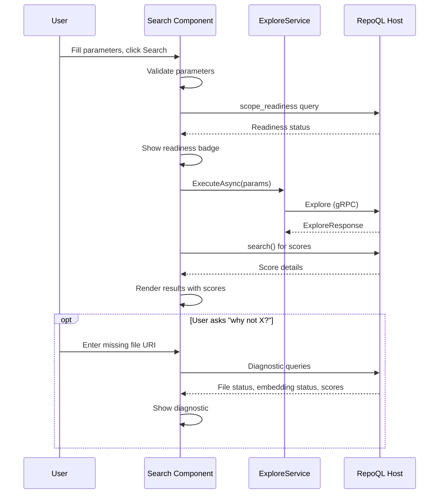

# Search Testing Flow

How a developer tests the explore tool and understands result ranking.

## Why This Matters

"Search doesn't find X" is a common complaint. Without understanding *why*, debugging is guesswork:
- Is the file indexed?
- Does it have embeddings?
- Did boost/penalize patterns affect it?
- Was it found but ranked low?

The search tester must answer these questions.

## Trigger

User fills in search parameters and clicks Search.

## Stages

### 1. Parameter Capture
**Actor**: Search component
**Action**: Captures explore parameters from form
**Output**: Validated parameter set
**Failure**: Keywords required for Locate/Inspect/Explain → validation error shown

| Parameter | Required | Default |
|-----------|----------|---------|
| Token budget | Yes | 2000 |
| Intent | Yes | Locate |
| Keywords | Depends on intent | - |
| Scope | No | (all files) |
| Boost patterns | No | - |
| Penalize patterns | No | - |
| Limit | No | auto |

### 2. Readiness Check
**Actor**: Search component
**Action**: Queries index readiness for the scope
**Output**: Readiness status displayed before search runs
**Failure**: N/A — informational only

```sql
SELECT * FROM scope_readiness('{scope}');
-- Returns: is_ready, total, indexed, embedded, pending, failed
```

This answers "can I trust the results?" before the search runs.

### 3. Search Execution
**Actor**: ExploreService
**Action**: Calls Explore gRPC method with parameters
**Output**: Explore response with results and metadata

```protobuf
message ExploreRequest {
  int32 token_budget = 1;
  ExploreIntent intent = 2;
  string keywords = 3;
  string scope = 4;
  string boost = 5;
  string penalize = 6;
  int32 limit = 7;
}

message ExploreResponse {
  string content = 1;           // Rendered output (what agents see)
  ExploreStatus status = 2;     // Readiness, timing, warnings
}
```

### 4. Score Retrieval (Debug Mode)
**Actor**: Search component
**Action**: Runs underlying `search()` macro for score details
**Output**: Per-result score breakdown
**Failure**: Optional — degrades gracefully if unavailable

```sql
SELECT uri, headline,
       sem_score, bm25_score, fuzzy_score,
       struct_mentions, body_mentions,
       deranked, score
FROM search('{keywords}', scope := '{scope}',
            boost_pattern := '{boost}',
            negative_pattern := '{penalize}',
            k := {limit});
```

### 5. Result Rendering
**Actor**: Search component
**Action**: Renders results with scores visible
**Output**: User sees ranked results with explanations

For each result:
```
src/Auth/TokenValidator.cs
  Headline: JWT token validation and refresh logic
  ─────────────────────────────────────────────
  Score: 0.847
  ├─ Semantic: 0.91 (embedding match)
  ├─ BM25: 0.32 (keywords: "token", "validate")
  ├─ Fuzzy: 0.15
  └─ Adjustments: Boosted by "Auth.*" pattern
```

### 6. "Why Not Found?" Diagnostic
**Actor**: Search component
**Action**: If user asks about a specific file, check why it wasn't found
**Output**: Diagnostic explaining absence

Checks:
1. Is the file indexed? (exists in Files view)
2. Does it have embeddings? (check document_embedding table)
3. Did it match but rank below cutoff?
4. Was it penalized by pattern?

## Termination

Flow completes when:
- Results rendered with scores, or
- "No results" shown with readiness status, or
- Error displayed (invalid scope, connection lost)

## Flow Diagram



## Error Handling

| Error | User Sees |
|-------|-----------|
| Keywords required | "Keywords required for this intent" |
| Invalid scope pattern | "Invalid scope pattern: {details}" |
| No results | "No results. Index ready: {status}" |
| Explain without API key | "Explain intent requires OPENROUTER_API_KEY" |
| Embeddings not ready | Warning badge: "Semantic search degraded — embeddings pending" |

## Timing

| Phase | Expected Duration |
|-------|-------------------|
| Readiness check | < 50ms |
| Explore (Inventory) | 100-300ms |
| Explore (Locate/Inspect) | 200-500ms |
| Explore (Explain with LLM) | 2-10s |
| Score query | 50-200ms |

## Intent Differences

| Intent | What user is testing |
|--------|---------------------|
| Inventory | "What's in this scope?" — discovery |
| Locate | "Where is X?" — finding specific things |
| Inspect | "Show me the code" — detailed view |
| Explain | "Synthesize an answer" — LLM integration |

Each intent produces different output. The search tester should show what agents would see.

## Verification

| Environment | How |
|-------------|-----|
| **Local** | Search for known term, verify expected file appears first |
| **Score check** | Search for term, verify semantic score > 0.5 for relevant files |
| **Not found** | Search in narrow scope, verify file outside scope is not found |
| **Penalize** | Add penalize pattern, verify matching files rank lower |

**Test searches:**
```
Keywords: "authentication"
Expected: AuthService.cs ranks high

Keywords: "authentication"
Penalize: "(?i)test"
Expected: Test files rank lower than before

Scope: file:///src/Auth/**
Keywords: "database"
Expected: Files outside Auth/ not returned
```

## What This Flow Establishes

- Readiness is checked before search (user knows if results are trustworthy)
- Scores are visible per result (not just final ranking)
- Score components are broken down (semantic, BM25, fuzzy)
- Adjustments are explained (boost/penalize effects)
- "Why not found?" is answerable

## What This Flow Does NOT Decide

- Layout of results (list vs grid vs tree)
- How scores are visualized (numbers vs bars vs colors)
- Whether to show raw explore output alongside parsed results
- A/B comparison UI for different parameter sets

---

*Search testing isn't about finding things. It's about understanding why.*
