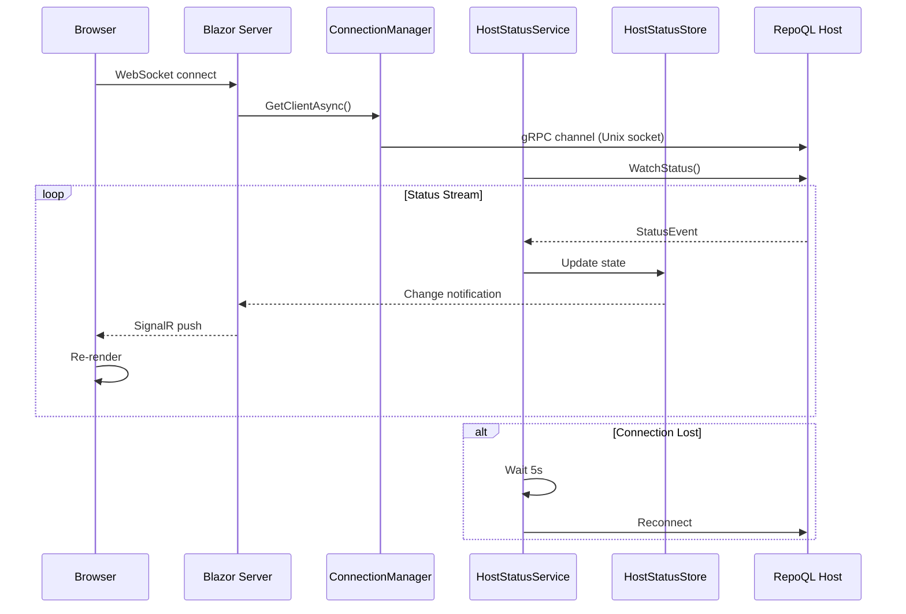

# Status Streaming Flow

How RepoQL's status reaches the browser — from host process to rendered indicator.

## Why This Matters

Every UI capability depends on knowing the host's state. Without reliable status streaming:
- User doesn't know if RepoQL is running
- User doesn't know if indexing is complete
- User can't trust that queries will work
- Errors go unnoticed

## Trigger

User opens the dashboard in a browser.

## Stages

### 1. Browser Connection
**Actor**: Browser
**Action**: Establishes SignalR WebSocket to Blazor Server
**Output**: Blazor circuit created, components rendered
**Failure**: Network unreachable → browser shows connection error

### 2. gRPC Client Warmup
**Actor**: RepoQlConnectionManager (singleton)
**Action**: Connects to RepoQL host via Unix socket (or named pipe on Windows)
**Output**: gRPC channel established, client ready
**Failure**: Socket doesn't exist or host not running → UI shows "Offline"

Socket path resolution:
```
Unix/macOS: {repo}/.repoql/repoql.sock
Windows:    Read {repo}/.repoql/socket.path → named pipe path
```

### 3. Status Stream Subscription
**Actor**: HostStatusService (BackgroundService)
**Action**: Calls `WatchStatus` gRPC streaming RPC
**Output**: Async enumerable of StatusEvent messages
**Failure**: Stream fails → service waits 5 seconds, reconnects

```protobuf
rpc WatchStatus(WatchStatusRequest) returns (stream StatusEvent);

message StatusEvent {
  oneof event {
    PipelineStatusEvent pipeline = 1;
    IndexingActivityEvent activity = 2;
    HealthEvent health = 3;
    StatsSnapshotEvent stats = 4;
  }
}
```

### 4. Event Processing
**Actor**: HostStatusService
**Action**: Dispatches each event type to HostStatusStore
**Output**: Store state updated, change notifications fired

| Event Type | Store Update |
|------------|--------------|
| `PipelineStatusEvent` | Snapshot status, pipeline stages |
| `HealthEvent` | Health check results, degradation warnings |
| `StatsSnapshotEvent` | File counts, node counts, coverage |

### 5. UI Update
**Actor**: Blazor components (subscribed to HostStatusStore)
**Action**: Re-render on store change notification
**Output**: User sees current status

## Termination

Flow is continuous — terminates only when:
- User closes browser (circuit disposed)
- Application shutdown
- Unrecoverable connection failure (after retries exhausted)

## Flow Diagram



## Error Handling

| Error | Behaviour |
|-------|-----------|
| Host not running | UI shows "Offline: Connection refused" |
| Socket doesn't exist | UI shows "Offline: Socket not found" |
| Stream disconnects | Auto-reconnect after 5s delay |
| Host in degraded state | UI shows warnings from HealthEvent |

## Timing

| Phase | Duration |
|-------|----------|
| Browser → Blazor | ~50ms (local) |
| Blazor → gRPC connect | ~10ms (Unix socket) |
| First StatusEvent | ~100ms after subscribe |
| Subsequent events | Push on change, ~10ms latency |

## Verification

| Environment | How |
|-------------|-----|
| **Local** | Start host, open browser, verify green indicator appears |
| **Automated** | Mock gRPC stream, verify Store receives events, verify component re-renders |
| **Production** | N/A — local development tool |

**Local simulation of disconnection:**
```bash
# Stop host, verify UI shows "Offline"
# Restart host, verify UI recovers to "Online"
```

## State Transitions

```
[Initial] → Connecting → Online → (stream events)
                ↓
           Offline ←→ Reconnecting
```

| State | Indicator | Meaning |
|-------|-----------|---------|
| Connecting | Gray, pulsing | Establishing connection |
| Online | Green | Connected, receiving events |
| Offline | Red | Connection lost |
| Reconnecting | Yellow, pulsing | Attempting to restore |

## What This Flow Establishes

- Real-time status is streamed, not polled
- Connection management is centralized (singleton)
- Reconnection is automatic with backoff
- UI updates are push-based via SignalR

## What This Flow Does NOT Decide

- Component hierarchy or layout
- Specific status indicator design
- How to display pipeline details
- State management library choice

---

*Status streaming is the heartbeat. Without it, the UI is blind.*
